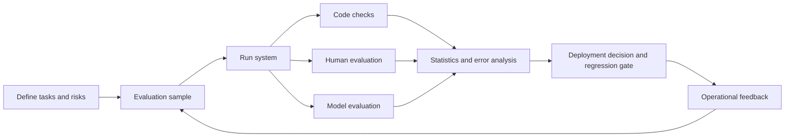



The purpose of LLM evaluation is not to announce the highest aggregate score, but to decide which system to deploy for a specific task and risk level.
Do not compare model names alone; compare system versions that include prompts, tools, retrieval, decoding, and guardrails.

## 1. The problem: Public benchmarks and real-world quality are not the same variable

Public benchmarks provide a common standard, but real-world work differs in the following ways.

- Actual inputs are longer and more ambiguous.
- Organizations have their own formats and terminology.
- Many tasks do not have a single correct answer.
- Tool use and external evidence determine quality.
- Cost and latency are constrained.
- Some errors are far more dangerous than others.
- The benchmark may have appeared in the training data.

Therefore, use public scores as a signal for narrowing candidates, and make the final choice through task-specific evaluation.

## 2. Mental model: Evaluation is itself a measurement system



Evaluation results are a function of the following elements.

$$
y = f(\text{task sample},\text{system version},\text{judge},\text{protocol},\text{randomness})
$$

Judges and protocols also have error.
Determine whether the difference between models is smaller than judge variability.

## 3. Write the evaluation contract first

Write a decision card before running code.

```yaml
decision: "후보 시스템 중 제한 배포할 버전 선택"
population: "예상 운영 요청 분포"
unit: "사용자 요청 하나와 전체 응답 trace"
primary_metrics: [task_success, critical_error_rate]
constraints: [latency, cost, privacy]
subgroups: [language, input_length, task_type, risk_level]
acceptance:
  quality: "baseline보다 비열등 또는 개선"
  safety: "중대 오류 상한 충족"
  operations: "지연·비용 예산 충족"
```

Fixing acceptance rules before evaluation reduces the temptation to change the criteria after seeing the results.

## 4. Design the sample

Collecting production logs as-is is not enough.

Sample strata:

- Normally frequent tasks
- Rare but critical failure tasks
- Boundary cases for length, language, and format
- Ambiguous cases in which the system should ask a question
- Cases that should be refused
- Tool-error and timeout cases
- Malicious or anomalous inputs

The evaluation set can be divided into three parts.

- Development: Used to improve prompts and the pipeline
- Validation: Used for limited model selection
- Holdout: Used only for the final decision or release gate

Leakage occurs when cases derived from the same document or template are mixed across different splits.
Use a group split based on the source unit.

For each evaluation item, record its source, creation method, reviewer, version, and expiration conditions.

## 5. Design answers and rubrics

Prioritize code-based evaluation for tasks with exact string answers.

- JSON schema validity
- Presence of required fields
- Numeric tolerance
- Unit test success
- Citation IDs included in the allowed list
- Bounds on tool-call arguments

For open-ended responses, use a rubric with behavioral criteria.

A poor rubric:

```text
1점: 나쁨
5점: 매우 좋음
```

A better rubric:

```text
0: 핵심 요구를 수행하지 못했거나 중대한 허위 주장이 있음
1: 일부 요구를 수행했으나 수정 없이는 사용할 수 없음
2: 핵심 요구를 충족하고 사소한 수정 후 사용 가능
3: 모든 요구를 충족하며 근거·제약·형식이 명확함
```

Separate the dimensions.

- Task correctness
- Completeness
- Groundedness
- Instruction adherence
- Risk handling
- Style and clarity

With a single aggregate score, a dangerous error can be offset by a style score.

## 6. Combining evaluators

### Code evaluators

They offer the highest reproducibility and speed.
Always check machine-verifiable items with code first.

### Human evaluators

They are best at judging business context and actual usability.
However, they introduce cost, fatigue, and inconsistent standards.

Responses:

- Run a calibration round.
- Provide a rubric with examples and boundary cases.
- Blind the model names and order.
- Have multiple evaluators assess some items and measure agreement.
- Do not simply average disagreements; investigate their causes.

### Model evaluators

They are useful for large-scale comparisons and generating explanations, but they are not the final source of truth.

Known risks:

- Position bias
- Verbosity bias
- Preference for related model families
- Sensitivity to prompt wording
- Amplification of reference-answer errors

For pairwise evaluation, compare two judgments with the A/B order reversed.
Store the judge prompt and judge model revision with the results.

## 7. Practical example: Blind pairwise comparison

```python
def make_pair(example, output_a, output_b, swap):
    left, right = (output_b, output_a) if swap else (output_a, output_b)
    return {
        "task": example.prompt,
        "rubric": example.rubric,
        "left": left,
        "right": right,
        "required_result": ["left", "right", "tie", "invalid"],
    }
```

Workflow:

1. Run both systems on the same input and tool snapshot.
2. Blind the system names and metadata in the outputs.
3. Randomize the order.
4. Run code checks first.
5. Have a model judge perform the first-pass evaluation of the entire set.
6. Have humans reevaluate high-risk cases and a random sample.
7. Analyze the judge-human disagreement group by error type.

A tie is not a failure.
It may indicate that the difference is smaller than the measurement resolution.

## 8. Statistics and uncertainty

Report confidence intervals instead of a single sample mean.

A simple estimate of the success rate is as follows.

$$
\hat{p}=\frac{1}{n}\sum_{i=1}^{n} y_i
$$

For small samples or rare errors, consider bootstrap methods or an appropriate binomial interval instead of a normal approximation.

If both models were evaluated on the same cases, use a paired comparison.
This can offset differences in case difficulty.

Exploring multiple metrics and subgroups at once makes it easy to find an improvement by chance.
Distinguish prespecified primary metrics from exploratory analysis.

Do not dilute critical errors into an average score.
Use a separate upper bound and absolute gate.

## 9. The cost-latency-quality frontier

Model selection is not a single-axis ranking.

Record all of the following for each candidate.

- Task success
- Critical error rate
- Input/output token distribution
- Wall-clock latency
- Timeout rate
- Tool calls
- Cost per request
- Retry and fallback costs

A candidate outside the Pareto frontier has both lower quality and higher cost than another candidate.
Within the frontier, choose according to business value and SLOs.

Also evaluate the actual routing policy, including fallbacks.
Combining individual model scores does not produce the score of the overall system.

## 10. Regression evaluation and operational feedback

Run the same suite for every release, while guarding against test memorization.

Suite levels:

- Smoke: Detect API failures and severe regressions within minutes
- Core: Representative tasks and key subgroups
- Extended: The long tail, red-team cases, and expensive evaluations
- Shadow: De-identified replays of real traffic

Signals to collect in production:

- Amount of user editing
- Follow-up questions and abandonment
- Human escalation
- Tool rollback
- Citation-validation failures
- Error changes by time, language, and length

Implicit feedback is not the same as quality.
Because you cannot know why a user did not click, combine it with human review of sampled cases.

## 11. Evaluation checklist

- [ ] Is the deployment decision supported by the evaluation clearly stated?
- [ ] Is the entire system version fixed, rather than just the model?
- [ ] Are both the real task distribution and high-risk tail included?
- [ ] Is leakage prevented with a group split by source unit?
- [ ] Are machine-verifiable items evaluated with code?
- [ ] Does the rubric contain observable behavioral criteria?
- [ ] Are system names hidden from evaluators?
- [ ] Has the pairwise order effect been tested?
- [ ] Have human evaluator calibration and agreement been checked?
- [ ] Are confidence intervals presented with averages?
- [ ] Are critical errors handled by a separate gate?
- [ ] Are cost, latency, and quality measured on the same workload?
- [ ] Are judge and prompt revisions retained?
- [ ] Is the holdout protected from contamination by repeated tuning?

## 12. Common failures and limitations

### Looking only at the win rate, not the causes

Even with the same overall win rate, one candidate may be stronger on short tasks and the other on high-risk tasks.
Examine subgroups and the error taxonomy together.

### Mistaking judge explanations for evidence

A model judge can produce a confident post hoc explanation.
Validate it through judgment consistency and agreement with human standards.

### Adjusting prompts while repeatedly examining the evaluation set

This is overfitting to the test set.
Separate the development set from the final holdout.

### Announcing small differences as a definitive ranking

If uncertainty ranges overlap, the candidates may effectively be tied.
Operational cost or simplicity can be used as the decision criterion.

No finite evaluation set can cover every future request.
Evaluation is predeployment evidence and must be combined with observation, incident reviews, and continuous updates.

## 13. Official references

- [NIST AI RMF](https://www.nist.gov/itl/ai-risk-management-framework)
- [NIST Generative AI Profile](https://doi.org/10.6028/NIST.AI.600-1)
- [Original Stanford HELM paper](https://arxiv.org/abs/2211.09110)
- [Official HELM website](https://crfm.stanford.edu/helm/)
- [Official OpenAI Evals repository](https://github.com/openai/evals)

## 14. Conclusion

Good LLM evaluation is a measurement system, not a leaderboard.
Only by specifying the task distribution, risks, evaluator error, and cost—and reporting uncertainty as well—can results inform an actual deployment decision.
