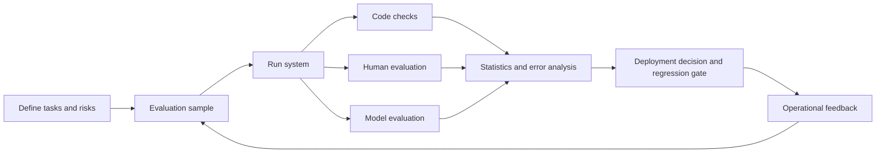



El propósito de la evaluación LLM no es anunciar la puntuación agregada más alta, sino decidir qué sistema implementar para una tarea y un nivel de riesgo específicos.
No compare los nombres de los modelos solo; compare versiones del sistema que incluyen indicaciones, herramientas, recuperación, decodificación y barreras de seguridad.

## 1. El problema: los puntos de referencia públicos y la calidad del mundo real no son la misma variable

Los puntos de referencia públicos proporcionan un estándar común, pero el trabajo en el mundo real difiere en los siguientes aspectos.

- Las entradas reales son más largas y ambiguas.
- Las organizaciones tienen sus propios formatos y terminología.
- Muchas tareas no tienen una única respuesta correcta.
- El uso de herramientas y la evidencia externa determinan la calidad.
- El costo y la latencia están limitados.
- Algunos errores son mucho más peligrosos que otros.
- Es posible que el punto de referencia haya aparecido en los datos de entrenamiento.

Por lo tanto, utilice las puntuaciones públicas como señal para seleccionar candidatos y tome la decisión final mediante una evaluación de tareas específicas.

## 2. Modelo mental: La evaluación es en sí misma un sistema de medición



Los resultados de la evaluación son función de los siguientes elementos.

$$
y = f(\text{task sample},\text{system version},\text{judge},\text{protocol},\text{randomness})
$$

Los jueces y los protocolos también tienen error.
Determine si la diferencia entre modelos es menor que juzgar la variabilidad.

## 3. Escriba primero el contrato de evaluación.

Escriba una tarjeta de decisión antes de ejecutar el código.

```yaml
decision: "후보 시스템 중 제한 배포할 버전 선택"
population: "예상 운영 요청 분포"
unit: "사용자 요청 하나와 전체 응답 trace"
primary_metrics: [task_success, critical_error_rate]
constraints: [latency, cost, privacy]
subgroups: [language, input_length, task_type, risk_level]
acceptance:
  quality: "baseline보다 비열등 또는 개선"
  safety: "중대 오류 상한 충족"
  operations: "지연·비용 예산 충족"
```

Fijar reglas de aceptación antes de la evaluación reduce la tentación de cambiar los criterios después de ver los resultados.

## 4. Diseñar la muestra

Recopilar los registros de producción tal como están no es suficiente.

Estratos de muestra:

- Tareas normalmente frecuentes
- Tareas de falla raras pero críticas
- Casos límite de longitud, idioma y formato.
- Casos ambiguos en los que el sistema debería hacer una pregunta.
- Casos que deben ser rechazados
- Casos de error de herramienta y tiempo de espera
- Entradas maliciosas o anómalas

El conjunto de evaluación se puede dividir en tres partes.

- Desarrollo: Se utiliza para mejorar las indicaciones y el proceso.
- Validación: Se utiliza para una selección limitada de modelos.
- Holdout: Se utiliza sólo para la decisión final o la puerta de liberación.

La filtración ocurre cuando casos derivados del mismo documento o plantilla se mezclan en diferentes divisiones.
Utilice una división de grupo basada en la unidad de origen.

Para cada elemento de evaluación, registre su fuente, método de creación, revisor, versión y condiciones de vencimiento.

## 5. Diseñar respuestas y rúbricas

Priorice la evaluación basada en código para tareas con respuestas de cadenas exactas.

- Validez del esquema JSON
- Presencia de campos obligatorios
- Tolerancia numérica
- Éxito de la prueba unitaria
- ID de citas incluidas en la lista permitida
- Límites en argumentos de llamada de herramientas

Para respuestas abiertas, utilice una rúbrica con criterios de comportamiento.

Una rúbrica pobre:

```text
1점: 나쁨
5점: 매우 좋음
```

Una mejor rúbrica:

```text
0: 핵심 요구를 수행하지 못했거나 중대한 허위 주장이 있음
1: 일부 요구를 수행했으나 수정 없이는 사용할 수 없음
2: 핵심 요구를 충족하고 사소한 수정 후 사용 가능
3: 모든 요구를 충족하며 근거·제약·형식이 명확함
```

Separe las dimensiones.

- Corrección de la tarea
- integridad
- Conexión a tierra
- Cumplimiento de las instrucciones
- Manejo de riesgos
- Estilo y claridad

Con una única puntuación agregada, un error peligroso puede compensarse con una puntuación de estilo.

## 6. Combinando evaluadores

### Evaluadores de código

Ofrecen la mayor reproducibilidad y velocidad.
Siempre verifique primero los artículos verificables por máquina con código.

### Evaluadores humanos

Son mejores para juzgar el contexto empresarial y la usabilidad real.
Sin embargo, introducen costos, fatiga y estándares inconsistentes.

Respuestas:

- Realizar una ronda de calibración.
- Proporcionar una rúbrica con ejemplos y casos límite.
- Ciega los nombres de los modelos y el orden.
- Haga que varios evaluadores evalúen algunos elementos y midan el acuerdo.
- No promediar simplemente los desacuerdos; investigar sus causas.

### Evaluadores de modelos

Son útiles para realizar comparaciones a gran escala y generar explicaciones, pero no son la fuente final de la verdad.

Riesgos conocidos:

- Sesgo de posición
- Sesgo de verbosidad
- Preferencia por familias de modelos relacionados.
- Sensibilidad a la redacción prompt
- Amplificación de errores de referencia-respuesta.

Para la evaluación por pares, compare dos juicios con el orden A/B invertido.
Almacene el juez prompt y la revisión del modelo de juez con los resultados.

## 7. Ejemplo práctico: comparación ciega por pares

```python
def make_pair(example, output_a, output_b, swap):
    left, right = (output_b, output_a) if swap else (output_a, output_b)
    return {
        "task": example.prompt,
        "rubric": example.rubric,
        "left": left,
        "right": right,
        "required_result": ["left", "right", "tie", "invalid"],
    }
```

Flujo de trabajo:

1. Ejecute ambos sistemas en la misma instantánea de entrada y herramienta.
2. Oculte los nombres del sistema y los metadatos en las salidas.
3. Aleatoriza el orden.
4. Primero ejecute comprobaciones de código.
5. Haga que un juez modelo realice la evaluación de primer paso de todo el set.
6. Hacer que los humanos reevalúen los casos de alto riesgo y una muestra aleatoria.
7. Analice el grupo de desacuerdo juez-humano por tipo de error.

Un empate no es un fracaso.
Puede indicar que la diferencia es menor que la resolución de medición.

## 8. Estadísticas e incertidumbre

Informe los intervalos de confianza en lugar de una media muestral única.

Una estimación simple de la tasa de éxito es la siguiente.

$$
\hat{p}=\frac{1}{n}\sum_{i=1}^{n} y_i
$$

Para muestras pequeñas o errores raros, considere métodos de arranque o un intervalo binomial apropiado en lugar de una aproximación normal.

Si ambos modelos fueron evaluados en los mismos casos, utilice una comparación pareada.
Esto puede compensar las diferencias en la dificultad del caso.

Explorar múltiples métricas y subgrupos a la vez facilita encontrar una mejora por casualidad.
Distinguir las métricas primarias preespecificadas del análisis exploratorio.

No diluya los errores críticos en una puntuación promedio.
Utilice un límite superior y una puerta absoluta independientes.

## 9. La frontera coste-latencia-calidad

La selección del modelo no es una clasificación de un solo eje.

Registre todo lo siguiente para cada candidato.

- Éxito de la tarea
- Tasa de error crítico
- Distribución de tokens de entrada/salida.
- Latencia del reloj de pared
- Tasa de tiempo de espera
- Llamadas a herramientas
- Costo por solicitud
- Costos de reintento y respaldo

Un candidato fuera de la frontera de Pareto tiene menor calidad y mayor costo que otro candidato.
Dentro de la frontera, elija según el valor del negocio y los SLO.

Evalúe también la política de enrutamiento real, incluidas las alternativas.
La combinación de puntuaciones de modelos individuales no produce la puntuación del sistema general.

## 10. Evaluación de regresión y retroalimentación operativa

Ejecute el mismo paquete para cada versión, evitando al mismo tiempo la memorización de pruebas.

Niveles de suite:

- Humo: detecta API fallos y regresiones graves en cuestión de minutos
- Núcleo: Tareas representativas y subgrupos clave.
- Extendido: La cola larga, los casos del equipo rojo y las evaluaciones costosas
- Sombra: repeticiones no identificadas de tráfico real

Señales a recoger en producción:

- Cantidad de edición del usuario
- Preguntas de seguimiento y abandono.
- Escalada humana
- Retroceso de herramientas
- Fallos de validación de citas.
- El error cambia por hora, idioma y duración.

La retroalimentación implícita no es lo mismo que la calidad.
Como no puede saber por qué un usuario no hizo clic, combínelo con una revisión humana de los casos de muestra.

## 11. Lista de verificación de evaluación

- [ ] ¿La decisión de implementación está respaldada por la evaluación claramente establecida?
- [] ¿Se ha solucionado toda la versión del sistema, en lugar de solo el modelo?
- [ ] ¿Se incluyen tanto la distribución real de tareas como la cola de alto riesgo?
- [ ] ¿Se evitan las fugas con un grupo dividido por unidad fuente?
- [] ¿Los elementos verificables por máquina se evalúan con código?
- [ ] ¿La rúbrica contiene criterios de comportamiento observables?
- [] ¿Los nombres de los sistemas están ocultos para los evaluadores?
- [ ] ¿Se ha probado el efecto del orden por pares?
- [ ] ¿Se ha verificado la calibración y la concordancia del evaluador humano?
- [ ] ¿Los intervalos de confianza se presentan con promedios?
- [] ¿Los errores críticos se manejan mediante una puerta separada?
- [ ] ¿Se miden el costo, la latencia y la calidad en la misma carga de trabajo?
- [] ¿Se conservan las revisiones de Judge y prompt?
- [ ] ¿Está la reserva protegida de la contaminación mediante ajustes repetidos?

## 12. Fallos y limitaciones comunes

### Mirando solo la tasa de ganancias, no las causas

Incluso con la misma tasa de éxito general, un candidato puede ser más fuerte en tareas cortas y el otro en tareas de alto riesgo.
Examinen juntos los subgrupos y la taxonomía de errores.

### Confundir las explicaciones del juez con pruebas

Un juez modelo puede producir una explicación post hoc segura.
Validarlo mediante la coherencia del juicio y el acuerdo con los estándares humanos.

### Ajustar indicaciones mientras se examina repetidamente el conjunto de evaluación

Esto es un sobreajuste del conjunto de prueba.
Separe el conjunto de desarrollo de la reserva final.

### Anunciando pequeñas diferencias a modo de ranking definitivo

Si los rangos de incertidumbre se superponen, los candidatos pueden estar efectivamente empatados.
El costo operativo o la simplicidad se pueden utilizar como criterio de decisión.

Ningún conjunto de evaluación finito puede cubrir todas las solicitudes futuras.
La evaluación es evidencia previa al despliegue y debe combinarse con observación, revisiones de incidentes y actualizaciones continuas.

## 13. Referencias oficiales

- [NIST AI RMF](https://www.nist.gov/itl/ai-risk-management-framework)
- [NIST Perfil generativo AI](https://doi.org/10.6028/NIST.AI.600-1)
- [Documento original de Stanford HELM](https://arxiv.org/abs/2211.09110)
- [Sitio web oficial HELM](https://crfm.stanford.edu/helm/)
- [Repositorio oficial de evaluaciones de OpenAI](https://github.com/openai/evals)

## 14. Conclusión

Una buena LLM evaluación es un sistema de medición, no una tabla de clasificación.
Sólo especificando la distribución de tareas, los riesgos, el error del evaluador y el costo, y también informando la incertidumbre, los resultados pueden informar una decisión de implementación real.
