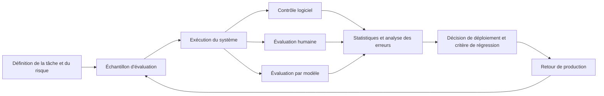



L’objectif d’une évaluation de LLM n’est pas de publier le meilleur score global, mais de décider quel système déployer pour une tâche et un niveau de risque donnés.
Ne comparez pas uniquement les noms des modèles : comparez des versions complètes du système, comprenant le prompt, les outils, la recherche documentaire, le décodage et les garde-fous.

## 1. Problème : un benchmark public et la qualité réelle ne mesurent pas la même variable

Les benchmarks publics offrent une référence commune, mais diffèrent de la réalité sur plusieurs points.

- Les entrées réelles sont plus longues et plus ambiguës.
- L’organisation emploie ses propres formats et sa propre terminologie.
- De nombreuses tâches n’ont pas une réponse unique.
- L’utilisation d’outils et les sources externes déterminent la qualité.
- Le coût et la latence sont limités.
- Certaines erreurs sont beaucoup plus dangereuses que d’autres.
- Le benchmark a pu apparaître dans les données d’entraînement.

Utilisez donc les scores publics comme un signal pour réduire la liste des candidats, puis fondez le choix final sur une évaluation propre à la tâche.

## 2. Modèle mental : l’évaluation est elle-même un système de mesure



Le résultat d’évaluation est fonction des éléments suivants :

$$
y = f(\text{task sample},\text{system version},\text{judge},\text{protocol},\text{randomness})
$$

L’évaluateur et le protocole comportent eux aussi des erreurs.
Il faut vérifier si l’écart entre modèles dépasse la variabilité de l’évaluateur.

## 3. Commencer par le contrat d’évaluation

Avant d’exécuter le code, rédigez une fiche de décision.

```yaml
decision: "후보 시스템 중 제한 배포할 버전 선택"
population: "예상 운영 요청 분포"
unit: "사용자 요청 하나와 전체 응답 trace"
primary_metrics: [task_success, critical_error_rate]
constraints: [latency, cost, privacy]
subgroups: [language, input_length, task_type, risk_level]
acceptance:
  quality: "baseline보다 비열등 또는 개선"
  safety: "중대 오류 상한 충족"
  operations: "지연·비용 예산 충족"
```

Fixer la règle d’acceptation avant l’évaluation réduit la tentation de changer le critère après avoir vu les résultats.

## 4. Concevoir l’échantillon

Il ne suffit pas de reprendre tels quels les journaux de production.

Strates de l’échantillon :

- tâches courantes et normales ;
- tâches rares mais dont l’échec est grave ;
- cas limites de longueur, de langue et de format ;
- cas ambigus où le système doit poser une question ;
- cas qu’il doit refuser ;
- erreurs d’outils et délais d’attente ;
- entrées malveillantes ou anormales.

Le jeu d’évaluation peut être divisé en trois parties.

- développement : pour améliorer le prompt et le pipeline ;
- validation : pour une sélection limitée des modèles ;
- réserve : uniquement pour la décision finale ou le critère de release.

Lorsque des cas issus d’un même document ou modèle de document se retrouvent dans différentes partitions, il y a fuite de données.
Effectuez une partition par groupe au niveau de la source.

Pour chaque élément d’évaluation, consignez la source, la méthode de création, le réviseur, la version et les conditions d’expiration.

## 5. Concevoir les réponses de référence et la grille

Pour les tâches dont la réponse est une chaîne exacte, privilégiez une évaluation logicielle.

- validité par rapport à un schéma JSON ;
- présence des champs obligatoires ;
- tolérance numérique ;
- réussite des tests unitaires ;
- présence des identifiants de citation dans une liste autorisée ;
- domaine des arguments d’appel d’outil.

Pour les réponses ouvertes, utilisez une grille fondée sur des comportements observables.

Mauvaise grille :

```text
1점: 나쁨
5점: 매우 좋음
```

Meilleure grille :

```text
0: 핵심 요구를 수행하지 못했거나 중대한 허위 주장이 있음
1: 일부 요구를 수행했으나 수정 없이는 사용할 수 없음
2: 핵심 요구를 충족하고 사소한 수정 후 사용 가능
3: 모든 요구를 충족하며 근거·제약·형식이 명확함
```

Séparez les dimensions.

- exactitude de la tâche ;
- exhaustivité ;
- ancrage dans les sources ;
- respect des instructions ;
- gestion du risque ;
- style et clarté.

Avec un seul score global, une erreur dangereuse peut être compensée par une bonne note de style.

## 6. Combiner les évaluateurs

### Évaluateur logiciel

C’est l’option la plus reproductible et la plus rapide.
Tout ce qui peut être vérifié mécaniquement doit d’abord l’être par du code.

### Évaluateur humain

Il juge le mieux le contexte métier et l’utilisabilité réelle.
Il implique toutefois des coûts, de la fatigue et des divergences de critères.

Mesures à prendre :

- effectuer une phase d’étalonnage ;
- fournir une grille accompagnée d’exemples et de cas limites ;
- masquer le nom et l’ordre des modèles ;
- faire évaluer certains éléments plusieurs fois pour mesurer l’accord ;
- rechercher la cause des désaccords au lieu de simplement en calculer la moyenne.

### Modèle évaluateur

Il est utile pour les comparaisons à grande échelle et la génération d’explications, mais ne constitue pas la source ultime de vérité.

Risques connus :

- biais de position ;
- biais en faveur des réponses longues ;
- préférence pour sa propre famille de modèles ;
- sensibilité à la formulation du prompt ;
- amplification des erreurs de la réponse de référence.

Pour une évaluation par paires, comparez deux jugements obtenus en inversant l’ordre A/B.
Conservez le prompt et la révision du modèle évaluateur avec le résultat.

## 7. Exemple pratique : comparaison aveugle par paires

```python
def make_pair(example, output_a, output_b, swap):
    left, right = (output_b, output_a) if swap else (output_a, output_b)
    return {
        "task": example.prompt,
        "rubric": example.rubric,
        "left": left,
        "right": right,
        "required_result": ["left", "right", "tie", "invalid"],
    }
```

Workflow :

1. Exécuter les deux systèmes avec la même entrée et le même instantané des outils.
2. Masquer dans les sorties le nom du système et les métadonnées.
3. Randomiser l’ordre.
4. Exécuter d’abord les contrôles logiciels.
5. Faire une première évaluation de l’ensemble par le modèle évaluateur.
6. Faire réévaluer par des humains les cas risqués et un échantillon aléatoire.
7. Analyser par type d’erreur les groupes de désaccord entre le modèle et les humains.

Une égalité n’est pas un échec.
Elle peut indiquer que l’écart est inférieur à la résolution de la mesure.

## 8. Statistiques et incertitude

Présentez un intervalle de confiance plutôt qu’une seule moyenne d’échantillon.

Une estimation simple du taux de réussite est :

$$
\hat{p}=\frac{1}{n}\sum_{i=1}^{n} y_i
$$

Pour un petit échantillon ou des erreurs rares, envisagez le bootstrap ou un intervalle binomial adapté plutôt qu’une approximation normale.

Lorsque les deux modèles sont évalués sur les mêmes cas, utilisez une comparaison appariée.
Elle permet de compenser les différences de difficulté entre les cas.

Explorer simultanément plusieurs indicateurs et sous-groupes facilite la découverte d’améliorations dues au hasard.
Distinguez l’indicateur principal défini à l’avance de l’analyse exploratoire.

Ne diluez pas une erreur grave dans un score moyen.
Appliquez-lui une borne supérieure et un critère absolu distincts.

## 9. Frontière entre coût, latence et qualité

Le choix d’un modèle ne se réduit pas à un classement sur un seul axe.

Consignez pour chaque candidat :

- la réussite de la tâche ;
- le taux d’erreurs critiques ;
- la distribution des jetons en entrée et en sortie ;
- la latence murale ;
- le taux de dépassement de délai ;
- les appels d’outils ;
- le coût par requête ;
- le coût des nouvelles tentatives et du repli.

Un candidat hors de la frontière de Pareto est à la fois moins bon et plus cher qu’un autre.
À l’intérieur de la frontière, choisissez selon la valeur métier et le SLO.

Évaluez aussi la politique de routage réelle, mécanisme de repli compris.
La combinaison des scores de chaque modèle ne donne pas automatiquement le score du système complet.

## 10. Évaluation des régressions et retour de production

Exécutez la même suite à chaque release, tout en surveillant la mémorisation des tests.

Niveaux de la suite :

- rapide : détecte en quelques minutes les problèmes d’API et les régressions graves ;
- principal : couvre les tâches représentatives et les grands sous-groupes ;
- étendu : couvre la longue traîne, les tests contradictoires et les évaluations coûteuses ;
- fantôme : rejoue de façon désidentifiée le trafic réel.

Signaux à recueillir en production :

- ampleur des corrections apportées par les utilisateurs ;
- reformulations de questions et abandons ;
- transmission à un humain ;
- annulation d’un outil ;
- échec de vérification des citations ;
- variation des erreurs selon l’heure, la langue et la longueur.

Le retour implicite n’équivaut pas à la qualité.
Comme on ignore pourquoi un utilisateur n’a pas cliqué, combinez-le à une revue humaine par échantillonnage.

## 11. Checklist d’évaluation

- [ ] La décision de déploiement que l’évaluation doit éclairer est-elle explicite ?
- [ ] La version du système complet, et non le seul modèle, est-elle figée ?
- [ ] La distribution réelle des tâches et la longue traîne à haut risque sont-elles toutes deux couvertes ?
- [ ] Une partition par groupe au niveau de la source empêche-t-elle les fuites ?
- [ ] Les éléments vérifiables mécaniquement sont-ils évalués par du code ?
- [ ] La grille contient-elle des critères comportementaux observables ?
- [ ] Les noms des systèmes sont-ils masqués aux évaluateurs ?
- [ ] L’effet de l’ordre dans les comparaisons par paires a-t-il été contrôlé ?
- [ ] L’étalonnage et l’accord des évaluateurs humains ont-ils été vérifiés ?
- [ ] Un intervalle de confiance accompagne-t-il la moyenne ?
- [ ] Les erreurs graves disposent-elles d’un critère distinct ?
- [ ] Le coût, la latence et la qualité ont-ils été mesurés sur la même charge ?
- [ ] Les révisions du modèle évaluateur et du prompt sont-elles conservées ?
- [ ] Le jeu de réserve est-il resté à l’abri des ajustements répétés ?

## 12. Échecs fréquents et limites

### Examiner le taux de victoire sans en chercher la cause

À taux global identique, un candidat peut exceller sur les tâches courtes et l’autre sur celles à haut risque.
Examinez aussi les sous-groupes et la taxonomie des erreurs.

### Prendre l’explication de l’évaluateur pour une preuve

Un modèle évaluateur peut produire avec assurance une explication a posteriori.
Validez-le par la cohérence des jugements et leur accord avec les critères humains.

### Ajuster le prompt en consultant continuellement le jeu d’évaluation

C’est un surapprentissage du jeu de test.
Séparez le jeu de développement de la réserve finale.

### Publier un classement définitif à partir d’un faible écart

Si les plages d’incertitude se chevauchent, les systèmes peuvent être pratiquement à égalité.
Le coût d’exploitation ou la simplicité peuvent alors servir de critère de décision.

Aucun jeu d’évaluation fini ne peut couvrir toutes les requêtes futures.
L’évaluation fournit des éléments probants avant le déploiement ; elle doit être combinée à l’observation, à la revue des incidents et à une mise à jour continue.

## 13. Références officielles

- [NIST AI RMF](https://www.nist.gov/itl/ai-risk-management-framework)
- [Profil du NIST sur l’IA générative](https://doi.org/10.6028/NIST.AI.600-1)
- [Article original de Stanford HELM](https://arxiv.org/abs/2211.09110)
- [Site officiel de HELM](https://crfm.stanford.edu/helm/)
- [Dépôt officiel d’OpenAI Evals](https://github.com/openai/evals)

## 14. Conclusion

Une bonne évaluation de LLM n’est pas un classement, mais un système de mesure.
Ce n’est qu’en explicitant la distribution des tâches, les risques, les erreurs des évaluateurs et les coûts, puis en présentant aussi l’incertitude, que ses résultats peuvent guider une véritable décision de déploiement.
