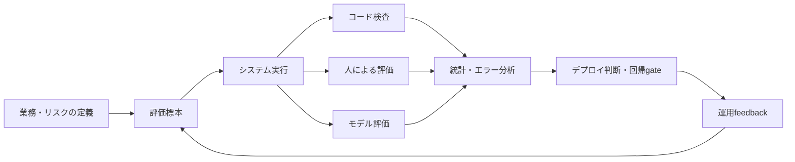



LLM評価の目的は、最も高い総合スコアを発表することではなく、特定の業務とリスク水準でどのシステムをデプロイするか決めることである。
モデル名だけを比較せず、prompt、tool、retrieval、decoding、guardrailまで含めたシステムversionを比較しなければならない。

## 1. 問題：公開benchmarkと実際の品質は同じ変数ではない

公開benchmarkは共通の基準を提供するが、次のような違いがある。

- 実際の入力はより長く曖昧である。
- 組織固有の形式と用語がある。
- 正解が一つではない作業が多い。
- toolの使用と外部根拠が品質を左右する。
- コストと遅延の制限がある。
- 一部のエラーは他のエラーよりはるかに危険である。
- benchmarkが学習データに露出している可能性がある。

したがって公開スコアは候補を絞るシグナルとして使い、最終選択はtask-specific evaluationで行う。

## 2. Mental model：評価も一つの測定システムである



評価結果は次の要素の関数である。

$$
y = f(\text{task sample},\text{system version},\text{judge},\text{protocol},\text{randomness})
$$

評価者とprotocolにも誤差がある。
モデル間の差がjudgeの変動より小さくないか確認しなければならない。

## 3. 評価契約から書く

コードを実行する前にdecision cardを作成する。

```yaml
decision: "후보 시스템 중 제한 배포할 버전 선택"
population: "예상 운영 요청 분포"
unit: "사용자 요청 하나와 전체 응답 trace"
primary_metrics: [task_success, critical_error_rate]
constraints: [latency, cost, privacy]
subgroups: [language, input_length, task_type, risk_level]
acceptance:
  quality: "baseline보다 비열등 또는 개선"
  safety: "중대 오류 상한 충족"
  operations: "지연·비용 예산 충족"
```

評価前にacceptance ruleを固定すれば、結果を見て基準を変えたくなる誘惑を減らせる。

## 4. 標本を設計する

運用logをそのまま集めるだけでは十分ではない。

標本の層：

- 通常頻度のtask
- まれだが重大なfailure task
- 長さ・言語・形式の境界事例
- 曖昧なため質問すべき事例
- 拒否すべき事例
- ツールエラーとtimeoutの事例
- 悪意のある、または異常な入力

評価setは三つに分けられる。

- development：promptとpipelineの改善時に使用
- validation：限定的なモデル選択に使用
- holdout：最終判断またはrelease gateだけに使用

同じ文書やtemplateから派生した事例が異なるsplitに混ざるとleakageが生じる。
原本単位でgroup splitする。

評価項目には出典、作成方法、reviewer、version、有効期限条件を記録する。

## 5. 正解とrubricの設計

正確な文字列の正解がある作業では、コード評価を優先する。

- JSON schemaの妥当性
- 必須fieldの存在
- 数値tolerance
- unit testの通過
- 引用IDが許可listに含まれること
- tool call引数の範囲

自由記述のresponseには行動基準のあるrubricを使う。

悪いrubric：

```text
1점: 나쁨
5점: 매우 좋음
```

より良いrubric：

```text
0: 핵심 요구를 수행하지 못했거나 중대한 허위 주장이 있음
1: 일부 요구를 수행했으나 수정 없이는 사용할 수 없음
2: 핵심 요구를 충족하고 사소한 수정 후 사용 가능
3: 모든 요구를 충족하며 근거·제약·형식이 명확함
```

各軸を分離する。

- task correctness
- completeness
- groundedness
- instruction adherence
- risk handling
- style and clarity

一つの総合点だけを使うと、危険なエラーが文体のスコアに相殺されることがある。

## 6. 評価者の組み合わせ

### コード評価者

再現性と速度が最も高い。
機械的に検証可能な項目は、必ず最初にコードで検査する。

### 人による評価者

業務文脈と実際の利用可能性を最もよく判断できる。
ただし、コスト、疲労、基準の不一致がある。

対処法：

- calibration roundを実施する。
- 例と境界事例を含むrubricを提供する。
- モデル名と順序を隠す。
- 一部の項目を重複評価して一致度を確認する。
- disagreementを単純に平均せず、原因を検討する。

### モデル評価者

大規模な比較と説明生成には有用だが、最終的な真実の源ではない。

既知のリスク：

- position bias
- verbosity bias
- 自系列への選好
- prompt表現への感度
- reference answerの誤りの増幅

pairwise評価では、A/Bの順序を入れ替えた二つの判定を比較する。
judge promptとjudge model revisionを結果と共に保存する。

## 7. 実践例：blind pairwise比較

```python
def make_pair(example, output_a, output_b, swap):
    left, right = (output_b, output_a) if swap else (output_a, output_b)
    return {
        "task": example.prompt,
        "rubric": example.rubric,
        "left": left,
        "right": right,
        "required_result": ["left", "right", "tie", "invalid"],
    }
```

workflow：

1. 同じ入力とツールsnapshotで二つのシステムを実行する。
2. 出力のシステム名とmetadataを隠す。
3. 順序をランダム化する。
4. コード検査を先に実行する。
5. モデルjudgeで全体を一次評価する。
6. 高リスク事例とランダム標本を人が再評価する。
7. judgeと人の不一致群をエラー類型別に分析する。

同点は失敗ではない。
差が測定解像度より小さいという情報である場合もある。

## 8. 統計と不確実性

標本平均一つではなく、信頼区間を報告する。

成功率の単純な推定は次のとおりである。

$$
\hat{p}=\frac{1}{n}\sum_{i=1}^{n} y_i
$$

小標本または稀なエラーには、正規近似よりbootstrapや適切な二項区間を検討する。

二つのモデルを同じ事例で評価した場合はpaired comparisonを使用する。
事例の難易度の差を相殺できる。

複数のmetricとsubgroupを同時に探索すると、偶然の改善を見つけやすい。
事前指定したprimary metricとexploratory analysisを区別する。

重大なエラーを平均スコアで薄めない。
別のupper boundと絶対gateを設ける。

## 9. コスト・遅延・品質のfrontier

モデル選択は単一軸の順位ではない。

各候補について次を併せて記録する。

- task success
- critical error rate
- input/output token distribution
- wall-clock latency
- timeout rate
- tool calls
- リクエスト単位のコスト
- retryとfallbackのコスト

Pareto frontierの外にある候補は、他の候補より品質が低くコストも高い。
frontier内では業務価値とSLOに基づいて選ぶ。

fallbackを含む実際のrouting policyも評価する。
個別モデルのスコアを組み合わせても、システム全体のスコアにはならない。

## 10. 回帰評価と運用feedback

releaseごとに同じsuiteを実行するが、test memorizationには注意する。

suiteの階層：

- smoke：数分以内にAPIと重大な回帰を検出
- core：代表的なtaskと主要subgroup
- extended：長いtail、red-team、コストの高い評価
- shadow：実trafficの匿名化replay

運用で収集するシグナル：

- ユーザーによる修正量
- 再質問と離脱
- human escalation
- tool rollback
- 引用検証の失敗
- 時間帯・言語・長さ別のエラー変化

implicit feedbackは品質と同じではない。
ユーザーがclickしなかった理由は分からないため、人による標本レビューと組み合わせる。

## 11. 評価checklist

- [ ] 評価がどのデプロイ判断を支援するか明示したか？
- [ ] モデルではなくシステム全体のversionを固定したか？
- [ ] 実際の業務分布と高リスクtailの両方を含めたか？
- [ ] 原本単位のgroup splitでleakageを防いだか？
- [ ] 機械検証項目をコードで評価するか？
- [ ] rubricに観察可能な行動基準があるか？
- [ ] 評価者からシステム名を隠したか？
- [ ] pairwiseの順序効果を検査したか？
- [ ] 人による評価者のcalibrationと一致度を点検したか？
- [ ] 平均と併せて信頼区間を示すか？
- [ ] 重大なエラーを別のgateとして扱うか？
- [ ] コスト・遅延・品質を同じworkloadで測定したか？
- [ ] judgeとprompt revisionを保存しているか？
- [ ] holdoutが反復的なtuningで汚染されていないか？

## 12. よくある失敗と限界

### 勝率だけを見て原因を見ない

全体の勝率が同じでも、一方の候補は短いtaskに、もう一方は高リスクtaskに強い場合がある。
subgroupとerror taxonomyを併せて見る。

### judgeの説明を根拠だと誤認する

モデルjudgeは自信に満ちた事後説明を作ることがある。
判定の一貫性と人の基準との一致によって検証する。

### 評価setを見続けながらpromptを調整する

これはtest setへの過学習である。
開発setと最終holdoutを分離する。

### 小さな差を確定的な順位として発表する

不確実性の範囲が重なれば、実質的に同率である可能性がある。
運用コストや単純さを判断基準に使うこともできる。

有限の評価setですべての将来のリクエストを網羅することはできない。
評価はデプロイ前の証拠であり、観測・incident review・継続的な更新と組み合わせなければならない。

## 13. 公式参考資料

- [NIST AI RMF](https://www.nist.gov/itl/ai-risk-management-framework)
- [NIST Generative AI Profile](https://doi.org/10.6028/NIST.AI.600-1)
- [Stanford HELMの原論文](https://arxiv.org/abs/2211.09110)
- [HELM公式サイト](https://crfm.stanford.edu/helm/)
- [OpenAI Evals公式リポジトリ](https://github.com/openai/evals)

## 14. まとめ

優れたLLM評価はleaderboardではなく測定システムである。
業務分布、リスク、評価者の誤差、コストを明示し、不確実性まで報告して初めて、結果が実際のデプロイ判断につながる。
