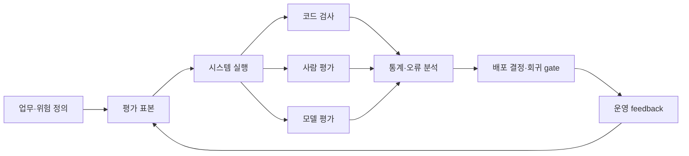



LLM 평가의 목적은 가장 높은 종합 점수를 발표하는 것이 아니라, 특정 업무와 위험 수준에서 어떤 시스템을 배포할지 결정하는 것이다.
모델 이름만 비교하지 말고 prompt, tool, retrieval, decoding, guardrail까지 포함한 시스템 버전을 비교해야 한다.

## 1. 문제: 공개 benchmark와 실제 품질은 같은 변수가 아니다

공개 benchmark는 공통 기준을 제공하지만 다음 차이가 있다.

- 실제 입력은 더 길고 모호하다.
- 조직 고유 형식과 용어가 있다.
- 정답이 하나가 아닌 작업이 많다.
- tool 사용과 외부 근거가 품질을 좌우한다.
- 비용과 지연 제한이 있다.
- 일부 오류는 다른 오류보다 훨씬 위험하다.
- benchmark가 학습 데이터에 노출됐을 수 있다.

따라서 공개 점수는 후보를 좁히는 신호로 쓰고, 최종 선택은 task-specific evaluation으로 한다.

## 2. Mental model: 평가도 하나의 측정 시스템이다



평가 결과는 다음 요소의 함수다.

$$
y = f(\text{task sample},\text{system version},\text{judge},\text{protocol},\text{randomness})
$$

평가자와 protocol도 오차를 가진다.
모델 차이가 judge 변동보다 작은지 확인해야 한다.

## 3. 평가 계약부터 쓴다

코드를 실행하기 전에 decision card를 작성한다.

```yaml
decision: "후보 시스템 중 제한 배포할 버전 선택"
population: "예상 운영 요청 분포"
unit: "사용자 요청 하나와 전체 응답 trace"
primary_metrics: [task_success, critical_error_rate]
constraints: [latency, cost, privacy]
subgroups: [language, input_length, task_type, risk_level]
acceptance:
  quality: "baseline보다 비열등 또는 개선"
  safety: "중대 오류 상한 충족"
  operations: "지연·비용 예산 충족"
```

평가 전에 acceptance rule을 고정하면 결과를 보고 기준을 바꾸는 유혹을 줄인다.

## 4. 표본을 설계한다

운영 로그를 그대로 모으는 것만으로 충분하지 않다.

표본 층:

- 정상 빈도 task
- 드물지만 중대한 failure task
- 길이·언어·형식 경계 사례
- 모호해서 질문해야 하는 사례
- 거절해야 하는 사례
- 도구 오류와 timeout 사례
- 악의적 또는 비정상 입력

평가 세트를 세 부분으로 나눌 수 있다.

- development: prompt와 pipeline을 개선할 때 사용
- validation: 제한된 모델 선택에 사용
- holdout: 최종 결정 또는 release gate에만 사용

같은 문서나 템플릿에서 파생된 사례가 서로 다른 split에 섞이면 leakage가 생긴다.
원본 단위로 group split한다.

평가 항목에는 출처, 작성 방식, 검토자, 버전, 만료 조건을 기록한다.

## 5. 정답과 rubric 설계

정확한 문자열 정답이 있는 작업은 코드 평가를 우선한다.

- JSON schema 유효성
- 필수 field 존재
- 수치 tolerance
- unit test 통과
- 인용 ID가 허용 목록에 포함
- tool call 인수의 범위

개방형 응답은 행동 기준이 있는 rubric을 쓴다.

나쁜 rubric:

```text
1점: 나쁨
5점: 매우 좋음
```

더 나은 rubric:

```text
0: 핵심 요구를 수행하지 못했거나 중대한 허위 주장이 있음
1: 일부 요구를 수행했으나 수정 없이는 사용할 수 없음
2: 핵심 요구를 충족하고 사소한 수정 후 사용 가능
3: 모든 요구를 충족하며 근거·제약·형식이 명확함
```

각 축을 분리한다.

- task correctness
- completeness
- groundedness
- instruction adherence
- risk handling
- style and clarity

한 개의 총점만 쓰면 위험한 오류가 문체 점수에 상쇄될 수 있다.

## 6. 평가자 조합

### 코드 평가자

재현성과 속도가 가장 높다.
기계 검증 가능한 항목은 반드시 코드로 먼저 검사한다.

### 사람 평가자

업무 맥락과 실제 사용 가능성을 가장 잘 판단한다.
하지만 비용, 피로, 기준 불일치가 있다.

대응:

- calibration round를 진행한다.
- 예시와 경계 사례가 있는 rubric을 제공한다.
- 모델 이름과 순서를 가린다.
- 일부 항목을 중복 평가해 일치도를 본다.
- disagreement를 단순 평균 내지 말고 원인을 검토한다.

### 모델 평가자

대규모 비교와 설명 생성에 유용하지만 최종 진실 원천이 아니다.

알려진 위험:

- position bias
- verbosity bias
- 자기 계열 선호
- prompt 표현 민감도
- reference answer 오류 증폭

pairwise 평가에서는 A/B 순서를 바꾼 두 판정을 비교한다.
judge prompt와 judge model revision을 결과와 함께 저장한다.

## 7. 실전 예제: blind pairwise 비교

```python
def make_pair(example, output_a, output_b, swap):
    left, right = (output_b, output_a) if swap else (output_a, output_b)
    return {
        "task": example.prompt,
        "rubric": example.rubric,
        "left": left,
        "right": right,
        "required_result": ["left", "right", "tie", "invalid"],
    }
```

workflow:

1. 같은 입력과 도구 snapshot에서 두 시스템을 실행한다.
2. 출력의 시스템 이름과 metadata를 가린다.
3. 순서를 무작위화한다.
4. 코드 검사를 먼저 실행한다.
5. 모델 judge로 전체를 1차 평가한다.
6. 위험 사례와 무작위 표본을 사람이 재평가한다.
7. judge-사람 불일치 집단을 오류 유형별로 분석한다.

동점은 실패가 아니다.
차이가 측정 해상도보다 작다는 정보일 수 있다.

## 8. 통계와 불확실성

표본 평균 하나 대신 신뢰구간을 보고한다.

성공률의 단순 추정은 다음과 같다.

$$
\hat{p}=\frac{1}{n}\sum_{i=1}^{n} y_i
$$

작은 표본 또는 희귀 오류에는 정규근사보다 bootstrap이나 적절한 이항구간을 고려한다.

두 모델이 같은 사례를 평가했다면 paired comparison을 사용한다.
사례 난이도 차이를 상쇄할 수 있다.

여러 metric과 subgroup을 동시에 탐색하면 우연한 개선을 찾기 쉽다.
사전 지정한 primary metric과 exploratory analysis를 구분한다.

중대 오류는 평균 점수로 희석하지 않는다.
별도 upper bound와 절대 gate를 둔다.

## 9. 비용·지연·품질 frontier

모델 선택은 단일 축 순위가 아니다.

각 후보에 다음을 함께 기록한다.

- task success
- critical error rate
- input/output token distribution
- wall-clock latency
- timeout rate
- tool calls
- 단위 요청당 비용
- retry와 fallback 비용

Pareto frontier 밖의 후보는 다른 후보보다 품질도 낮고 비용도 높다.
frontier 안에서는 업무 가치와 SLO로 선택한다.

fallback을 포함한 실제 routing policy도 평가한다.
개별 모델 점수의 조합이 전체 시스템 점수가 되지는 않는다.

## 10. 회귀 평가와 운영 feedback

release마다 동일 suite를 실행하되 test memorization을 경계한다.

suite 계층:

- smoke: 수분 안에 API와 심각한 회귀 탐지
- core: 대표 task와 주요 subgroup
- extended: 긴 tail, red-team, 비용이 큰 평가
- shadow: 실제 traffic의 비식별 replay

운영에서 수집할 신호:

- 사용자 수정량
- 재질문과 이탈
- human escalation
- tool rollback
- 인용 검증 실패
- 시간대·언어·길이별 오류 변화

implicit feedback은 품질과 동일하지 않다.
사용자가 클릭하지 않은 이유를 알 수 없으므로 사람 표본 검토와 결합한다.

## 11. 평가 checklist

- [ ] 평가가 어떤 배포 결정을 지원하는지 명시했는가?
- [ ] 모델이 아니라 전체 시스템 버전을 고정했는가?
- [ ] 실제 업무 분포와 고위험 tail을 모두 포함했는가?
- [ ] 원본 단위 group split으로 leakage를 막았는가?
- [ ] 기계 검증 항목을 코드로 평가하는가?
- [ ] rubric에 관찰 가능한 행동 기준이 있는가?
- [ ] 평가자에게 시스템 이름을 가렸는가?
- [ ] pairwise 순서 효과를 검사했는가?
- [ ] 사람 평가자 calibration과 일치도를 점검했는가?
- [ ] 평균과 함께 신뢰구간을 제시하는가?
- [ ] 중대 오류를 별도 gate로 다루는가?
- [ ] 비용·지연·품질을 같은 workload에서 측정했는가?
- [ ] judge와 prompt revision을 보존하는가?
- [ ] holdout이 반복 튜닝에 오염되지 않았는가?

## 12. 흔한 실패와 한계

### 승률만 보고 원인을 보지 않는다

전체 승률이 같아도 한 후보는 짧은 task에, 다른 후보는 고위험 task에 강할 수 있다.
subgroup과 error taxonomy를 함께 본다.

### judge 설명을 근거로 착각한다

모델 judge는 자신감 있는 사후 설명을 만들 수 있다.
판정 일관성과 사람 기준 일치로 검증한다.

### 평가 세트를 계속 보며 prompt를 조정한다

이는 test set에 대한 과적합이다.
개발 세트와 최종 holdout을 분리한다.

### 작은 차이를 확정적 순위로 발표한다

불확실성 범위가 겹치면 실질적으로 동률일 수 있다.
운영 비용이나 단순성을 결정 기준으로 사용할 수 있다.

모든 미래 요청을 유한한 평가 세트로 포괄할 수는 없다.
평가는 배포 전 증거이며, 관측·incident review·지속 갱신과 결합해야 한다.

## 13. 공식 참고자료

- [NIST AI RMF](https://www.nist.gov/itl/ai-risk-management-framework)
- [NIST Generative AI Profile](https://doi.org/10.6028/NIST.AI.600-1)
- [Stanford HELM 원 논문](https://arxiv.org/abs/2211.09110)
- [HELM 공식 사이트](https://crfm.stanford.edu/helm/)
- [OpenAI Evals 공식 저장소](https://github.com/openai/evals)

## 14. 마무리

좋은 LLM 평가는 leaderboard가 아니라 측정 시스템이다.
업무 분포, 위험, 평가자 오차, 비용을 명시하고 불확실성까지 보고해야 결과가 실제 배포 결정으로 이어진다.
