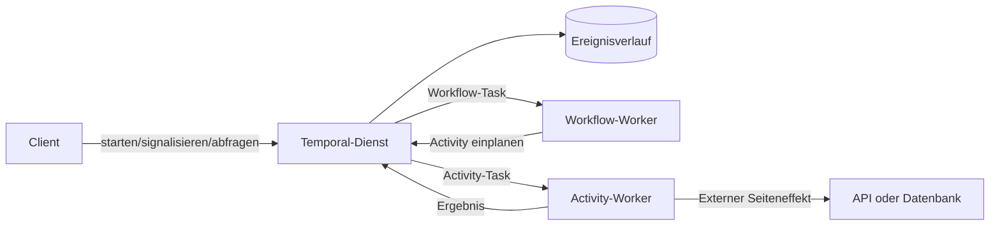



## Das Problem: Langlebige Geschäftsprozesse können sich nicht allein auf den Prozessspeicher verlassen

Wird ein Ablauf mit mehreren API-Aufrufen, Wartezeiten für Genehmigungen, Timern und Kompensationsaktionen in einem einzigen Worker-Prozess implementiert, ist die Wiederherstellung nach einem Fehler schwierig.

- Nach einem Neustart des Prozesses ist unklar, welcher Schritt gerade ausgeführt wurde.
- Bereits erfolgreiche externe Aufrufe werden erneut ausgeführt.
- Zustände für Wiederholungen und Zeitüberschreitungen sind über mehrere Tabellen verteilt.
- Ein Thread bleibt belegt, während er tagelang auf einen Callback wartet.
- Laufende Instanzen werden nach der Bereitstellung neuen Codes inkompatibel.
- Es fehlt eine Aufzeichnung, die einen von einem Operator manuell geänderten Zustand erklärt.

Temporal ist eine Plattform für dauerhafte Ausführung, die Zustandsübergänge eines Workflows beständig in einem Ereignisverlauf speichert und den Zustand durch erneutes Abspielen des Codes wiederherstellt.

Dieses Modell hilft beim Entwurf langlebiger Workflows schon bevor ein bestimmtes Produkt ausgewählt wird.

## Denkmodell: Workflows treffen Entscheidungen, Activities bewirken Seiteneffekte

### Workflow

Der Workflow-Code bestimmt Zustandsübergänge und die nächste Aktion.

Beim erneuten Abspielen des Ereignisverlaufs muss er dieselben Befehle erzeugen.

Gewöhnliche Systemuhren, Zufallswerte, Netzwerk-I/O oder prozesslokaler globaler Zustand dürfen nicht direkt verwendet werden.

Verwenden Sie die deterministischen APIs des SDK.

### Activity

Eine Activity führt fehleranfällige Arbeit mit Seiteneffekten aus, etwa Aufrufe einer externen API, einer Datenbank, einer Datei oder eines Dienstes für Modellinferenz.

Gehen Sie davon aus, dass eine Activity mindestens einmal ausgeführt werden kann, und gestalten Sie sie idempotent.

### Worker und Temporal Service

Worker führen Code aus, doch die maßgebliche Quelle für den dauerhaften Zustand ist der Ereignisverlauf des Dienstes.

Fällt ein Worker aus, bleibt der Verlauf erhalten und ein anderer Worker kann die Verarbeitung fortsetzen.

Die betriebliche Grenze zwischen Dienst- und Worker-Ausfällen hängt vom Bereitstellungsmodell ab.

## Grenzen zwischen Cron, Queues, Workflows und Agenten

### Cron

Cron eignet sich gut, um unabhängige Aufgaben zu festgelegten Zeiten zu starten.

Mehrstufigen dauerhaften Zustand oder Abläufe mit menschlicher Beteiligung stellt es nicht unmittelbar bereit.

### Nachrichtenwarteschlange

Eine Nachrichtenwarteschlange entkoppelt Produzenten und Konsumenten und fängt Lastspitzen ab.

Die Anwendung muss die geschäftliche Zustandsmaschine, Timer, Kompensation und Abfragen selbst implementieren.

### Dauerhafter Workflow

Ein dauerhafter Workflow verwaltet lange Laufzeiten, mehrere Schritte, Wiederholungen, Timer, Signals und den Kompensationszustand als eine Ausführungseinheit.

### LLM-Agent

Ein LLM-Agent kann aus unsicheren Eingaben Pläne oder Werkzeugentscheidungen erzeugen.

Überlassen Sie Dauerhaftigkeit und geschäftliche Invarianten nicht allein dem Gesprächszustand des Agenten.

Aufrufe des Agenten können als Activities isoliert werden, während der Workflow Genehmigungen und Validierung steuert.

## Ablauf: Entwurfsfolge für einen dauerhaften Workflow

### Schritt 1. Workflow-Identität definieren

Verwenden Sie eine stabile Workflow-ID, die mit dem Geschäftsaggregat verknüpft ist.

Legen Sie die Richtlinie für doppelte Starts fest.

Entscheiden Sie, ob eine identische Geschäftsanfrage einen neuen Workflow startet oder einem bestehenden ein Signal sendet.

### Schritt 2. Zuerst die Zustandsmaschine beschreiben

Beispiel: `requested -> validated -> approved -> executing -> completed`.

Definieren Sie Endzustände und zulässige Übergänge.

Kopieren Sie nicht die gesamte Workflow-Eingabe in einen unbegrenzt wachsenden Verlauf.

Legen Sie große Nutzdaten in einem externen Objektspeicher ab und übergeben Sie eine unveränderliche Referenz sowie eine Prüfsumme.

### Schritt 3. Activity-Grenzen klein halten

Führt eine Activity zu viele Seiteneffekte aus, bleibt unklar, an welcher Stelle sie fehlgeschlagen ist.

Zu kleinteilige Activities erhöhen jedoch den Aufwand für Verlauf und Planung.

Fassen Sie Arbeit zusammen, die dieselben Grenzen für Wiederholungen, Zeitüberschreitungen und Idempotenz besitzt.

### Schritt 4. Arten von Zeitüberschreitungen unterscheiden

Entnehmen Sie die versionsspezifischen Bezeichnungen des SDK der Dokumentation.

Konzeptionell sind folgende Zeiträume zu unterscheiden.

- Zulässige Zeit zwischen Einplanung und Start
- Zulässige Zeit für eine einzelne Activity-Ausführung
- Zulässige Zeit bis zum Abschluss einschließlich aller Wiederholungen
- Zulässige Zeit zwischen Heartbeats

Weisen Sie nicht jeder Activity eine unbegrenzte Zeitüberschreitung zu.

Leiten Sie Zeitüberschreitungen von der tatsächlichen geschäftlichen Frist ab.

### Schritt 5. Wiederholungsrichtlinie an der Fehlertaxonomie ausrichten

Wiederholungen mit wachsender Wartezeit eignen sich für vorübergehende Netzwerkfehler.

Eingabevalidierungsfehler werden durch Wiederholungen nicht behoben.

Berücksichtigen Sie bei Ratenbegrenzungen den Wiederholungshinweis des Servers und die Gesamtfrist.

Kennzeichnen Sie nicht wiederholbare Fehlertypen ausdrücklich.

### Schritt 6. Idempotenzschlüssel über externe Grenzen hinweg weitergeben

Auch wenn sich der Activity-Versuch ändert, muss derselbe Geschäftsvorgang denselben Idempotenzschlüssel verwenden.

Unterstützt das externe System dies nicht, verwenden Sie einen lokalen Vorgangsdatensatz und bedingte Zustandsübergänge.

Berücksichtigen Sie, dass die Abschlussantwort der Activity verloren gehen kann.

### Schritt 7. Heartbeats für langlebige Activities senden

Ein Heartbeat meldet dem Dienst den Fortschritt und die Erreichbarkeit des Workers.

Er kann zur Übermittlung einer Abbruchanforderung und von Informationen zur Fortsetzung dienen.

Speichern Sie keine großen oder sensiblen Daten in den Heartbeat-Details.

Implementieren Sie die sichere Fortsetzung der eigentlichen Arbeit von einem Checkpoint getrennt.

### Schritt 8. Signals, Queries und Updates unterscheiden

- Ein Signal übermittelt einem Workflow ein asynchrones externes Ereignis.
- Eine Query liest den Zustand, ohne den Verlauf zu ändern.
- Ein Update wird verwendet, wenn eine validierte synchrone Zustandsänderung erforderlich ist.

Prüfen Sie, welche Unterstützung die betreffenden SDK- und Serverversionen bieten.

Unterdrücken Sie doppelte Signals anhand der externen Ereignis-ID.

### Schritt 9. Wartezeiten mit Timern abbilden

Ein Workflow-Timer belegt nicht über längere Zeit einen Worker-Thread.

Bilden Sie den Ablauf von Genehmigungsfristen, erneute Prüfungen und SLA-Eskalationen mit dauerhaften Timern ab.

Definieren Sie Zeitzonen und Geschäftskalender eindeutig.

### Schritt 10. Kompensation in Geschäftsbegriffen entwerfen

Rollback einer verteilten Transaktion und Saga-Kompensation sind nicht dasselbe.

Eine Kompensation löscht bereits Geschehenes nicht, sondern führt eine geschäftliche Gegenaktion aus.

Auch eine Kompensation kann fehlschlagen und wiederholt werden; sie muss idempotent sein.

Prüfen Sie die Registrierungsreihenfolge und die umgekehrte Ausführungsreihenfolge.

### Schritt 11. Codeversionierung einplanen

Der Verlauf eines laufenden Workflows kann von neuem Worker-Code erneut abgespielt werden.

Bewahren Sie bei Änderungen am Kontrollfluss des Workflows die deterministische Kompatibilität.

Informieren Sie sich in der offiziellen Dokumentation über SDK-Versionierung oder Funktionen zur Worker-Bereitstellung.

Mit Continue-as-new kann ein alter Workflow auf einen neuen Verlauf und Codepfad umgestellt werden.

### Schritt 12. Verlaufsgröße verwalten

Lange Schleifen, viele Signals und häufige Timer vergrößern den Verlauf.

Continue-as-new kann einen neuen Lauf starten und dabei die logische Workflow-Identität bewahren.

Ein separates externes Lesemodell kann die Abfragelast und die Größe der Verlaufsnutzdaten reduzieren.

## Praxisbeispiel: Externe Arbeit nach Genehmigung ausführen

1. Der Client startet mit einer stabilen Workflow-ID.
2. Eine Validierungs-Activity prüft Eingabereferenz und Prüfsumme.
3. Der Workflow wechselt in den Zustand `waiting_approval`.
4. Ein dauerhafter Timer überwacht den Ablauf der Genehmigungsfrist.
5. Das Genehmigungs-Signal enthält die Identität der genehmigenden Person und die Ereignis-ID.
6. Der Workflow ignoriert doppelte Signals und prüft die Berechtigung.
7. Er übergibt der Ausführungs-Activity einen geschäftlichen Idempotenzschlüssel.
8. Die Activity sendet während der langlebigen Arbeit Heartbeats.
9. Sie gibt die Prüfsumme des entstandenen Artefakts zurück.
10. Eine Veröffentlichungs-Activity gibt das Ergebnis unter einer Bedingung frei.
11. Bei einem Fehler wird gemäß Richtlinie wiederholt oder kompensiert.
12. Der Workflow speichert Endzustand und Audit-Referenz.

Die Authentifizierung der Genehmigungsoberfläche liegt in der Verantwortung eines separaten Identitätssystems.

Der Workflow darf nur validierte Genehmigungsereignisse akzeptieren.

## Prüfliste zur Verifikation

### Deterministischer Workflow

- [ ] Der Workflow-Code führt Netzwerk-I/O nicht direkt aus.
- [ ] Zeit und Zufall verwenden deterministische SDK-APIs.
- [ ] Iteration über Sammlungen und Serialisierung wurden auf Determinismus geprüft.
- [ ] Codeänderungen wurden durch erneutes Abspielen alter Verläufe getestet.
- [ ] Kriterien für das Wachstum des Verlaufs und Continue-as-new sind festgelegt.

### Activity

- [ ] Jede Activity mit Seiteneffekten ist idempotent.
- [ ] Zeitüberschreitungen und Wiederholungen sind von geschäftlichen Fristen abgeleitet.
- [ ] Nicht wiederholbare Fehler sind klassifiziert.
- [ ] Langlebige Arbeit verfügt über Heartbeats und Checkpoints.
- [ ] Die Weiterleitung eines Abbruchs an externe Arbeit ist definiert.

### Betrieb

- [ ] Workflow-ID und Richtlinie für doppelte Starts sind eindeutig.
- [ ] Warteschlangenrückstand und Latenz zwischen Einplanung und Start werden überwacht.
- [ ] Feststeckende Workflows und wiederholte Fehler werden erkannt.
- [ ] Die Einführung neuer Worker-Versionen wurde erprobt.
- [ ] Sensible Nutzdaten werden nicht im Verlauf aufbewahrt.
- [ ] Richtlinien für Namespace, Aufbewahrung und Archivierung wurden geprüft.

## Häufige Fehler und Einschränkungen

### Jede Funktion zu einer Activity machen

Einfache deterministische Berechnungen in entfernte Activities umzuwandeln, erhöht die Latenz und die Größe des Verlaufs.

### Den Abschluss einer Activity mit einem Exactly-once-Seiteneffekt verwechseln

Eine Activity kann erneut ausgeführt werden, nachdem ihre Abschlussantwort verloren gegangen ist.

End-to-End-Idempotenz ist erforderlich.

### Den Workflow-Verlauf wie eine Datenbank abfragen

Für komplexe Suchen und Berichte kann ein separates Lesemodell geeigneter sein.

### Agentenurteile unmittelbar als dauerhaften Zustand festschreiben

LLM-Ausgaben sind nicht deterministisch und können falsch sein.

Machen Sie Schutzmaßnahmen wie Schemavalidierung, Richtlinienprüfungen und menschliche Genehmigung zu ausdrücklichen Workflow-Schritten.

### Jeden einfachen Zeitplan in einen dauerhaften Workflow verschieben

Für einen kurzen Batch, der leicht erneut ausgeführt werden kann, sind Cron und ein idempotenter Job möglicherweise einfacher.

## Offizielle Quellen

- [Temporal-Dokumentation](https://docs.temporal.io/)
- [Temporal Workflows](https://docs.temporal.io/workflows)
- [Temporal Activities](https://docs.temporal.io/activities)
- [Temporal-Fehlererkennung](https://docs.temporal.io/encyclopedia/detecting-activity-failures)
- [Temporal-Versionierung](https://docs.temporal.io/workflow-definition#versioning)

## Fazit

Der Nutzen eines dauerhaften Workflows liegt nicht darin, eine lange Funktion zu speichern.

Er besteht darin, die Grenzen zwischen Entscheidungen und Seiteneffekten, Wiederholungen und Geschäftsfehlern sowie Signals und Queries explizit zu machen, damit derselbe Prozess nach einem Fehler fortgesetzt werden kann.

Wenn Cron, Queues, Workflows und Agenten jeweils die passende Verantwortung erhalten, bleibt selbst komplexe Automatisierung auditierbar und wiederherstellbar.
