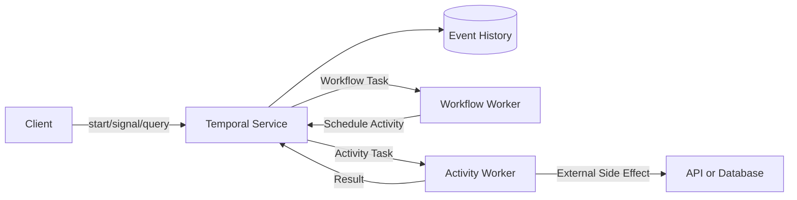



## The Problem: Long-Running Business Processes Cannot Rely on Process Memory Alone

When a procedure involving multiple API calls, approval waits, timers, and compensating actions is implemented in one worker process, recovery from failure is difficult.

- After a process restart, it is unclear which step was in progress.
- External calls that already succeeded are executed again.
- Retry and timeout states are scattered across multiple tables.
- A thread is occupied while waiting days for a callback.
- Running instances become incompatible after a code deployment.
- There is no record explaining state that an operator modified manually.

Temporal is a durable execution platform that durably records workflow state transitions in an event history and restores state by replaying code.

This model is useful for designing long-running workflows even before choosing a specific product.

## Mental Model: Workflows Make Decisions, Activities Cause Side Effects

### Workflow

Workflow code determines state transitions and the next action.

It must produce the same commands when the event history is replayed.

Do not directly use ordinary wall clocks, randomness, network I/O, or process-local global state.

Use the deterministic APIs provided by the SDK.

### Activity

An Activity performs failure-prone, side-effecting work such as calling an external API, database, file, or model inference service.

Assume that an Activity can execute at least once and make it idempotent.

### Worker and Temporal Service

Workers execute code, but the source of truth for durable state is the service's event history.

If a worker goes down, the history remains and another worker can continue processing.

The operational boundary between service failures and worker failures depends on the deployment model.

## Boundaries Among Cron, Queues, Workflows, and Agents

### Cron

Cron is well suited to starting independent tasks at scheduled times.

It does not directly provide multistep durable state or human-in-the-loop processing.

### Message Queue

A message queue decouples producers and consumers and absorbs bursts.

The application must implement the business state machine, timers, compensation, and queries.

### Durable Workflow

A durable workflow tracks long lifetimes, multiple steps, retries, timers, signals, and compensation state as one execution unit.

### LLM Agent

An LLM agent can generate plans or tool choices from uncertain inputs.

Do not entrust durability and business invariants solely to the agent's conversation state.

Agent calls can be isolated as Activities while the workflow controls approvals and validation.

## Workflow: A Durable-Workflow Design Sequence

### Step 1. Define workflow identity

Use a stable workflow ID connected to the business aggregate.

Specify the duplicate-start policy.

Decide whether an identical business request starts a new workflow or sends a signal to an existing one.

### Step 2. Write the state machine first

Example: `requested -> validated -> approved -> executing -> completed`.

Define terminal states and permitted transitions.

Do not copy the entire workflow input into an unbounded history.

Put large payloads in an external object store and pass an immutable reference and checksum.

### Step 3. Make Activity boundaries small

If one Activity performs too many side effects, it becomes unclear where it failed.

But excessively small Activities increase history and scheduling overhead.

Group work that shares retry, timeout, and idempotency boundaries.

### Step 4. Distinguish timeout types

Consult the documentation for version-specific names provided by the SDK.

Conceptually, distinguish the following.

- Time allowed between scheduling and starting
- Time allowed for one Activity execution
- Time allowed for completion including all retries
- Time allowed between heartbeats

Do not give every Activity an infinite timeout.

Derive timeouts from the actual business deadline.

### Step 5. Align retry policy with the error taxonomy

Backoff retries are appropriate for transient network errors.

Retrying does not resolve input-validation errors.

For rate limits, consider the retry hint from the server and the overall deadline.

Explicitly identify non-retryable error types.

### Step 6. Pass idempotency keys across external boundaries

Even if the Activity attempt changes, the same business operation must use the same idempotency key.

If the external system does not support this, use a local operation record and conditional state transitions.

Account for the possibility that the Activity completion response is lost.

### Step 7. Heartbeat long-running Activities

A heartbeat reports progress and worker liveness to the service.

It can be used for cancellation delivery and resume details.

Do not place large or sensitive data in heartbeat details.

Separately implement safe resumption of the work itself from a checkpoint.

### Step 8. Distinguish Signals, Queries, and Updates

- A Signal delivers an asynchronous external event to a workflow.
- A Query reads state without changing history.
- An Update is used when a validated synchronous state change is required.

Check the support provided by the relevant SDK and server versions.

Suppress duplicate Signals by external event ID.

### Step 9. Represent waiting with Timers

A workflow Timer does not occupy a worker thread for a long period.

Represent approval expiration, rechecks, and SLA escalation with durable Timers.

Define wall-clock time zones and business calendars clearly.

### Step 10. Design compensation in business terms

Distributed-transaction rollback and saga compensation are not the same.

Compensation does not erase what already happened; it performs an opposing business action.

Compensation can also fail and be retried, and it must be idempotent.

Review registration order and reverse execution order.

### Step 11. Plan code versioning

The history of a running workflow may be replayed by new worker code.

Maintain deterministic compatibility when changing workflow control flow.

Consult the official documentation for SDK versioning or worker deployment features.

An old workflow can be moved to a new history and code path with continue-as-new.

### Step 12. Manage history size

Long loops, many Signals, and frequent Timers grow history.

Continue-as-new can start a new run while preserving logical workflow identity.

A separate external read model can reduce query load and history payload size.

## Practical Example: Execute External Work After Approval

1. The client starts with a stable workflow ID.
2. A validation Activity checks the input reference and checksum.
3. The workflow enters the `waiting_approval` state.
4. A durable Timer tracks approval expiration.
5. The approval Signal includes the approver identity and event ID.
6. The workflow ignores duplicate Signals and verifies authorization.
7. It passes a business idempotency key to the execution Activity.
8. The Activity heartbeats while performing the long-running work.
9. It returns the resulting artifact checksum.
10. A publication Activity conditionally releases the result.
11. On failure, it retries or compensates according to policy.
12. It records the terminal state and audit reference.

Authentication for the approval interface is the responsibility of a separate identity system.

The workflow must accept only validated approval events.

## Verification Checklist

### Deterministic workflow

- [ ] Workflow code does not perform network I/O directly.
- [ ] Time and randomness use deterministic SDK APIs.
- [ ] Collection iteration and serialization have been checked for determinism.
- [ ] Code changes have been tested by replaying old histories.
- [ ] Criteria exist for history growth and continue-as-new.

### Activity

- [ ] Every side-effecting Activity is idempotent.
- [ ] Timeouts and retries are derived from business deadlines.
- [ ] Non-retryable errors are classified.
- [ ] Long-running work has heartbeats and checkpoints.
- [ ] The propagation of cancellation to external work is defined.

### Operations

- [ ] The workflow ID and duplicate-start policy are clear.
- [ ] Queue backlog and schedule-to-start latency are monitored.
- [ ] Stuck workflows and repeated failures are detected.
- [ ] Worker-version rollout has been rehearsed.
- [ ] Sensitive payloads are not retained in history.
- [ ] Namespace, retention, and archival policies have been reviewed.

## Common Failures and Limitations

### Making every function an Activity

Turning simple deterministic calculations into remote Activities increases latency and history size.

### Mistaking Activity completion for an exactly-once side effect

An Activity can run again after its completion response is lost.

End-to-end idempotency is required.

### Querying workflow history like a database

A separate read model may be more suitable for complex searches and reporting.

### Committing agent judgment directly as durable state

LLM output is nondeterministic and can be wrong.

Make guardrails such as schema validation, policy checks, and human approval explicit workflow steps.

### Moving every simple schedule to a durable workflow

For a short batch that is easy to rerun, cron and an idempotent job may be simpler.

## Official References

- [Temporal Documentation](https://docs.temporal.io/)
- [Temporal Workflows](https://docs.temporal.io/workflows)
- [Temporal Activities](https://docs.temporal.io/activities)
- [Temporal Failure Detection](https://docs.temporal.io/encyclopedia/detecting-activity-failures)
- [Temporal Versioning](https://docs.temporal.io/workflow-definition#versioning)

## Conclusion

The value of a durable workflow is not in storing a long function.

It lies in making the boundaries between decisions and side effects, retries and business errors, and Signals and Queries explicit so that the same process can continue after a failure.

Assigning cron, queues, workflows, and agents their appropriate responsibilities makes even complex automation auditable and recoverable.
