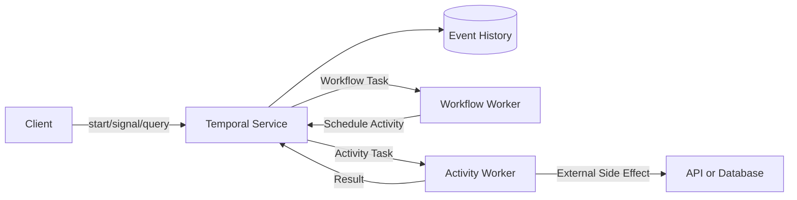



## El problema: los procesos empresariales de larga duración no pueden depender únicamente de la memoria del proceso

Cuando se implementa en un proceso de trabajo un procedimiento que involucra múltiples llamadas API, esperas de aprobación, temporizadores y acciones de compensación, la recuperación de una falla es difícil.

- Después de reiniciar el proceso, no está claro qué paso estaba en progreso.
- Las llamadas externas que ya se realizaron correctamente se ejecutan nuevamente.
- Los estados de reintento y tiempo de espera se encuentran dispersos en varias tablas.
- Un hilo está ocupado mientras espera días para una devolución de llamada.
- Las instancias en ejecución se vuelven incompatibles después de una implementación de código.
- No existe ningún registro que explique el estado que un operador modificó manualmente.

Temporal es una plataforma de ejecución duradera que registra de forma duradera las transiciones de estado del flujo de trabajo en un historial de eventos y restaura el estado mediante la reproducción de código.

Este modelo es útil para diseñar flujos de trabajo de larga duración incluso antes de elegir un producto específico.

## Modelo mental: los flujos de trabajo toman decisiones, las actividades causan efectos secundarios

### Flujo de trabajo

El código de flujo de trabajo determina las transiciones de estado y la siguiente acción.

Debe producir los mismos comandos cuando se reproduce el historial de eventos.

No utilice directamente relojes de pared ordinarios, aleatoriedad, red I/O o estado global de proceso local.

Utilice las API deterministas proporcionadas por SDK.

### Actividad

Una actividad realiza un trabajo propenso a fallas y con efectos secundarios, como llamar a un API externo, una base de datos, un archivo o un servicio de inferencia de modelos.

Supongamos que una Actividad se puede ejecutar al menos una vez y hacerla idempotente.

### Trabajador y Temporal Servicio

Los trabajadores ejecutan código, pero la fuente de verdad para el estado duradero es el historial de eventos del servicio.

Si un trabajador baja, el historial permanece y otro trabajador puede continuar procesando.

El límite operativo entre fallas del servicio y fallas de los trabajadores depende del modelo de implementación.

## Límites entre cron, colas, flujos de trabajo y agentes

### cron

Cron es ideal para iniciar tareas independientes en horarios programados.

No proporciona directamente un estado duradero de varios pasos ni un procesamiento humano en el circuito.

### Cola de mensajes

Una cola de mensajes desacopla a productores y consumidores y absorbe ráfagas.

La aplicación debe implementar la máquina de estado del negocio, temporizadores, compensaciones y consultas.

### Flujo de trabajo duradero

Un flujo de trabajo duradero rastrea largas vidas, múltiples pasos, reintentos, temporizadores, señales y estados de compensación como una sola unidad de ejecución.

### LLM Agente

Un agente LLM puede generar planes u opciones de herramientas a partir de entradas inciertas.

No confíe la durabilidad y las invariantes comerciales únicamente al estado de conversación del agente.

Las llamadas de los agentes se pueden aislar como actividades mientras el flujo de trabajo controla las aprobaciones y validaciones.

## Flujo de trabajo: una secuencia de diseño de flujo de trabajo duradero

### Paso 1. Definir la identidad del flujo de trabajo

Utilice un flujo de trabajo estable ID conectado al agregado empresarial.

Especifique la política de inicio duplicado.

Decida si una solicitud comercial idéntica inicia un nuevo flujo de trabajo o envía una señal a uno existente.

### Paso 2. Escriba primero la máquina de estados

Ejemplo: `requested -> validated -> approved -> executing -> completed`.

Definir estados terminales y transiciones permitidas.

No copie toda la entrada del flujo de trabajo en un historial ilimitado.

Coloque cargas útiles grandes en un almacén de objetos externo y pase una referencia y una suma de verificación inmutables.

### Paso 3. Haga que los límites de la actividad sean pequeños

Si una actividad produce demasiados efectos secundarios, no queda claro dónde falló.

Pero las actividades excesivamente pequeñas aumentan el historial y los gastos generales de programación.

Trabajo en grupo que comparte límites de reintento, tiempo de espera e idempotencia.

### Paso 4. Distinguir los tipos de tiempo de espera

Consulte la documentación para conocer los nombres específicos de la versión proporcionada por SDK.

Conceptualmente, distinga lo siguiente.

- Tiempo permitido entre la programación y el inicio.
- Tiempo permitido para la ejecución de una actividad.
- Tiempo permitido para la finalización, incluidos todos los reintentos.
- Tiempo permitido entre latidos

No le dé a cada actividad un tiempo de espera infinito.

Derive los tiempos de espera a partir de la fecha límite comercial real.

### Paso 5. Alinear la política de reintentos con la taxonomía de errores

Los reintentos de retroceso son apropiados para errores de red transitorios.

Volver a intentarlo no resuelve los errores de validación de entrada.

Para conocer los límites de velocidad, considere la sugerencia de reintento del servidor y la fecha límite general.

Identifique explícitamente los tipos de errores que no se pueden reintentar.

### Paso 6. Pasar claves de idempotencia a través de límites externos

Incluso si el intento de Actividad cambia, la misma operación comercial debe utilizar la misma clave de idempotencia.

Si el sistema externo no lo admite, utilice un registro de operación local y transiciones de estado condicionales.

Tenga en cuenta la posibilidad de que se pierda la respuesta de finalización de la actividad.

### Paso 7. Actividades de larga duración de Heartbeat

Un latido informa del progreso y la vitalidad del trabajador al servicio.

Se puede utilizar para la entrega de cancelaciones y los detalles del currículum.

No coloque datos grandes o confidenciales en los detalles de los latidos.

Implementar por separado la reanudación segura del trabajo desde un punto de control.

### Paso 8. Distinguir señales, consultas y actualizaciones

- Una señal entrega un evento externo asincrónico a un flujo de trabajo.
- Una consulta lee el estado sin cambiar el historial.
- Se utiliza una Actualización cuando se requiere un cambio de estado sincrónico validado.

Verifique el soporte proporcionado por las SDK y las versiones del servidor relevantes.

Suprime señales duplicadas por evento externo ID.

### Paso 9. Representar la espera con Timers

Un temporizador de flujo de trabajo no ocupa un subproceso de trabajo durante un período prolongado.

Representa el vencimiento de la aprobación, las nuevas comprobaciones y el escalamiento SLA con temporizadores duraderos.

Defina claramente las zonas horarias del reloj de pared y los calendarios comerciales.

### Paso 10. Diseñar la compensación en términos comerciales

La reversión de transacciones distribuidas y la compensación saga no son lo mismo.

La compensación no borra lo que ya pasó; realiza una acción empresarial contraria.

La compensación también puede fallar y volver a intentarse, y debe ser idempotente.

Revisar el orden de registro y revertir el orden de ejecución.

### Paso 11. Versionado del código del plan

El historial de un flujo de trabajo en ejecución se puede reproducir mediante un nuevo código de trabajo.

Mantenga la compatibilidad determinista al cambiar el flujo de control del flujo de trabajo.

Consulte la documentación oficial para SDK funciones de control de versiones o implementación de trabajadores.

Un flujo de trabajo antiguo se puede mover a un nuevo historial y ruta de código con Continuar como nuevo.

### Paso 12. Administrar el tamaño del historial

Los bucles largos, muchas señales y temporizadores frecuentes hacen historia.

Continuar como nuevo puede iniciar una nueva ejecución preservando al mismo tiempo la identidad lógica del flujo de trabajo.

Un modelo de lectura externo independiente puede reducir la carga de consultas y el tamaño de la carga útil del historial.

## Ejemplo práctico: ejecutar trabajo externo después de la aprobación

1. El cliente comienza con un flujo de trabajo estable ID.
2. Una actividad de validación verifica la referencia de entrada y la suma de verificación.
3. El flujo de trabajo ingresa al estado `waiting_approval`.
4. Un temporizador duradero rastrea el vencimiento de la aprobación.
5. La señal de aprobación incluye la identidad del aprobador y el evento ID.
6. El flujo de trabajo ignora las señales duplicadas y verifica la autorización.
7. Pasa una clave de idempotencia empresarial a la Actividad de ejecución.
8. El corazón de la Actividad late mientras realiza el trabajo de larga duración.
9. Devuelve la suma de comprobación del artefacto resultante.
10. Una actividad de publicación libera condicionalmente el resultado.
11. En caso de fallo, vuelve a intentarlo o compensa según la política.
12. Registra el estado del terminal y la referencia de auditoría.

La autenticación para la interfaz de aprobación es responsabilidad de un sistema de identidad independiente.

El flujo de trabajo debe aceptar únicamente eventos de aprobación validados.

## Lista de verificación de verificación

### Flujo de trabajo determinista

- [] El código de flujo de trabajo no realiza la red I/O directamente.
- [] El tiempo y la aleatoriedad utilizan API SDK deterministas.
- [] Se ha comprobado el determinismo en la iteración y serialización de la colección.
- [] Los cambios de código se han probado reproduciendo historias antiguas.
- [] Existen criterios para el crecimiento del historial y su continuación como nuevo.

### Actividad

- [ ] Toda actividad con efectos secundarios es idempotente.
- [ ] Los tiempos de espera y los reintentos se derivan de los plazos comerciales.
- [ ] Se clasifican los errores no reintentables.
- [] El trabajo de larga duración tiene latidos y puntos de control.
- [ ] Se define la propagación de la baja a trabajos externos.

### Operaciones

- [] El flujo de trabajo ID y la política de inicio duplicado son claros.
- [] Se monitorean la acumulación de colas y la latencia de inicio programado.
- [] Se detectan flujos de trabajo bloqueados y fallas repetidas.
- [] Se ha ensayado el lanzamiento de la versión para trabajadores.
- [] Las cargas útiles sensibles no se retienen en el historial.
- [] Se han revisado las políticas de espacio de nombres, retención y archivo.

## Fallos y limitaciones comunes

### Hacer de cada función una actividad

Convertir cálculos deterministas simples en actividades remotas aumenta la latencia y el tamaño del historial.

### Confundir la finalización de la actividad con un efecto secundario que se produce exactamente una vez

Una actividad puede volver a ejecutarse después de que se pierda su respuesta de finalización.

Se requiere idempotencia de extremo a extremo.

### Consultar el historial del flujo de trabajo como una base de datos

Un modelo de lectura independiente puede ser más adecuado para búsquedas e informes complejos.

### Comprometiendo el juicio del agente directamente como estado duradero

La salida LLM no es determinista y puede ser incorrecta.

Haga que las barreras de seguridad, como la validación de esquemas, las comprobaciones de políticas y la aprobación humana, sean pasos explícitos del flujo de trabajo.

### Trasladar cada cronograma simple a un flujo de trabajo duradero

Para un lote corto que sea fácil de volver a ejecutar, cron y un trabajo idempotente pueden ser más simples.

## Referencias oficiales

- [Temporal Documentación](https://docs.temporal.io/)
- [Temporal Flujos de trabajo](https://docs.temporal.io/workflows)
- [Temporal Actividades](https://docs.temporal.io/activities)
- [Temporal Detección de fallas](https://docs.temporal.io/encyclopedia/detecting-activity-failures)
- [Temporal Versiones](https://docs.temporal.io/workflow-definition#versioning)

## Conclusión

El valor de un flujo de trabajo duradero no está en almacenar una función larga.

Consiste en hacer explícitos los límites entre decisiones y efectos secundarios, reintentos y errores comerciales, y Señales y Consultas para que el mismo proceso pueda continuar después de una falla.

Asignar a cron, colas, flujos de trabajo y agentes sus responsabilidades adecuadas hace que incluso la automatización compleja sea auditable y recuperable.
