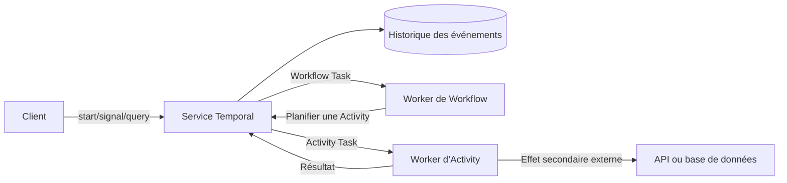



## Problème : les processus métier longs ne peuvent pas reposer uniquement sur la mémoire d’un processus

Lorsqu’une procédure comportant plusieurs appels API, des attentes d’approbation, des timers et des actions compensatoires est implémentée dans un seul processus worker, la reprise après une défaillance devient difficile.

- Après le redémarrage du processus, on ne sait plus quelle étape était en cours.
- Les appels externes déjà réussis sont exécutés de nouveau.
- Les états de retry et de timeout sont dispersés dans plusieurs tables.
- Un thread reste occupé pendant plusieurs jours dans l’attente d’un callback.
- Les instances en cours deviennent incompatibles après le déploiement du code.
- Aucun enregistrement n’explique l’état qu’un opérateur a modifié manuellement.

Temporal est une plateforme d’exécution durable qui enregistre de façon persistante les transitions d’état du workflow dans un historique d’événements et restaure l’état en rejouant le code.

Ce modèle est utile pour concevoir des workflows longs avant même de choisir un produit précis.

## Modèle mental : les Workflows prennent des décisions, les Activities provoquent des effets secondaires

### Workflow

Le code d’un Workflow détermine les transitions d’état et l’action suivante.

Il doit produire les mêmes commandes lorsque l’historique des événements est rejoué.

Il ne faut pas utiliser directement une horloge murale ordinaire, de l’aléatoire, des I/O réseau ou un état global local au processus.

Utilisez les API déterministes fournies par le SDK.

### Activity

Une Activity effectue un travail susceptible d’échouer et produisant des effets secondaires, comme appeler une API externe, une base de données, un fichier ou un service d’inférence de modèle.

Il faut supposer qu’une Activity peut s’exécuter au moins une fois et la rendre idempotente.

### Worker et service Temporal

Les workers exécutent le code, mais la source de vérité de l’état durable est l’historique des événements du service.

Si un worker tombe, l’historique demeure et un autre worker peut poursuivre le traitement.

La frontière opérationnelle entre les défaillances du service et celles des workers dépend du modèle de déploiement.

## Frontières entre cron, files, workflows et agents

### Cron

Cron convient bien au lancement de tâches indépendantes à des horaires planifiés.

Il ne fournit pas directement un état durable en plusieurs étapes ni un traitement avec intervention humaine.

### File de messages

Une file de messages découple producteurs et consommateurs et absorbe les rafales.

L’application doit implémenter la machine à états métier, les timers, la compensation et les queries.

### Workflow durable

Un workflow durable suit comme une seule unité d’exécution les longues durées de vie, les étapes multiples, les retries, les timers, les Signals et l’état de compensation.

### Agent LLM

Un agent LLM peut générer des plans ou des choix d’outils à partir d’entrées incertaines.

Il ne faut pas confier la durabilité et les invariants métier au seul état conversationnel de l’agent.

Les appels de l’agent peuvent être isolés en Activities, tandis que le workflow contrôle les approbations et la validation.

## Workflow : séquence de conception d’un workflow durable

### Étape 1. Définir l’identité du workflow

Utilisez un ID de workflow stable lié à l’agrégat métier.

Précisez la politique en cas de démarrage dupliqué.

Décidez si une requête métier identique lance un nouveau workflow ou envoie un Signal à un workflow existant.

### Étape 2. Écrire d’abord la machine à états

Exemple : `requested -> validated -> approved -> executing -> completed`.

Définissez les états terminaux et les transitions autorisées.

Ne copiez pas toute l’entrée du workflow dans un historique sans limite.

Placez les payloads volumineux dans un object store externe et passez une référence immuable et un checksum.

### Étape 3. Définir des frontières d’Activity réduites

Lorsqu’une seule Activity effectue trop d’effets secondaires, il devient difficile de savoir où elle a échoué.

Mais des Activities trop petites augmentent l’historique et le coût d’ordonnancement.

Regroupez les travaux qui partagent les mêmes frontières de retry, de timeout et d’idempotence.

### Étape 4. Distinguer les types de timeout

Consultez la documentation pour connaître les noms propres à la version fournis par le SDK.

Sur le plan conceptuel, il faut distinguer les éléments suivants.

- Temps autorisé entre la planification et le démarrage
- Temps autorisé pour une exécution d’Activity
- Temps autorisé pour l’achèvement, tous retries compris
- Temps autorisé entre deux heartbeats

N’attribuez pas un timeout infini à chaque Activity.

Déduisez les timeouts de l’échéance métier réelle.

### Étape 5. Aligner la politique de retry sur la taxonomie des erreurs

Les retries avec backoff conviennent aux erreurs réseau transitoires.

Réessayer ne corrige pas une erreur de validation de l’entrée.

Pour les limites de débit, tenez compte de l’indication de retry fournie par le serveur et de l’échéance globale.

Identifiez explicitement les types d’erreurs non réessayables.

### Étape 6. Transmettre les clés d’idempotence au-delà des frontières externes

Même si la tentative d’Activity change, la même opération métier doit utiliser la même clé d’idempotence.

Si le système externe ne prend pas cette fonction en charge, utilisez un enregistrement local de l’opération et des transitions d’état conditionnelles.

Tenez compte du risque de perte de la réponse d’achèvement de l’Activity.

### Étape 7. Envoyer des heartbeats pour les Activities longues

Un heartbeat signale au service la progression et la disponibilité du worker.

Il peut servir à transmettre une annulation et des détails de reprise.

Ne placez pas de données volumineuses ou sensibles dans les détails du heartbeat.

Implémentez séparément la reprise sûre du travail lui-même à partir d’un checkpoint.

### Étape 8. Distinguer Signals, Queries et Updates

- Un Signal transmet un événement externe asynchrone à un workflow.
- Une Query lit l’état sans modifier l’historique.
- Une Update est utilisée lorsqu’un changement d’état synchrone et validé est nécessaire.

Vérifiez les fonctions prises en charge par les versions concernées du SDK et du serveur.

Supprimez les Signals dupliqués à l’aide de l’ID d’événement externe.

### Étape 9. Représenter l’attente avec des Timers

Un Timer de workflow n’occupe pas un thread de worker pendant une longue période.

Représentez l’expiration des approbations, les revérifications et les escalades de SLA par des Timers durables.

Définissez clairement les fuseaux horaires de l’horloge murale et les calendriers métier.

### Étape 10. Concevoir la compensation en termes métier

Le rollback d’une transaction distribuée et la compensation d’une saga ne sont pas identiques.

La compensation n’efface pas ce qui s’est déjà produit ; elle exécute une action métier opposée.

Elle peut elle aussi échouer et être réessayée, et doit être idempotente.

Vérifiez l’ordre d’enregistrement et l’ordre d’exécution inverse.

### Étape 11. Planifier le versionnement du code

L’historique d’un workflow en cours peut être rejoué par un nouveau code de worker.

Préservez la compatibilité déterministe lorsque vous modifiez le flux de contrôle du workflow.

Consultez la documentation officielle sur le versionnement du SDK ou les fonctions de déploiement des workers.

Un ancien workflow peut passer à un nouvel historique et à un nouveau chemin de code avec continue-as-new.

### Étape 12. Gérer la taille de l’historique

Les longues boucles, les nombreux Signals et les Timers fréquents font croître l’historique.

Continue-as-new permet de lancer une nouvelle exécution tout en préservant l’identité logique du workflow.

Un read model externe séparé peut réduire la charge des queries et la taille des payloads de l’historique.

## Exemple pratique : exécuter un travail externe après approbation

1. Le client démarre avec un ID de workflow stable.
2. Une Activity de validation vérifie la référence et le checksum de l’entrée.
3. Le workflow entre dans l’état `waiting_approval`.
4. Un Timer durable suit l’expiration de l’approbation.
5. Le Signal d’approbation contient l’identité de l’approbateur et l’ID d’événement.
6. Le workflow ignore les Signals dupliqués et vérifie l’autorisation.
7. Il transmet une clé d’idempotence métier à l’Activity d’exécution.
8. L’Activity envoie des heartbeats pendant le travail de longue durée.
9. Elle renvoie le checksum de l’artefact obtenu.
10. Une Activity de publication diffuse le résultat de manière conditionnelle.
11. En cas d’échec, elle réessaie ou compense conformément à la politique.
12. Elle enregistre l’état terminal et la référence d’audit.

L’authentification de l’interface d’approbation relève d’un système d’identité séparé.

Le workflow ne doit accepter que des événements d’approbation validés.

## Checklist de vérification

### Workflow déterministe

- [ ] Le code du Workflow n’effectue pas directement d’I/O réseau.
- [ ] Le temps et l’aléatoire utilisent les API déterministes du SDK.
- [ ] L’itération des collections et la sérialisation ont été vérifiées sous l’angle du déterminisme.
- [ ] Les modifications du code ont été testées en rejouant d’anciens historiques.
- [ ] Des critères existent pour la croissance de l’historique et continue-as-new.

### Activity

- [ ] Chaque Activity produisant des effets secondaires est idempotente.
- [ ] Les timeouts et les retries découlent des échéances métier.
- [ ] Les erreurs non réessayables sont classifiées.
- [ ] Les travaux longs disposent de heartbeats et de checkpoints.
- [ ] La propagation de l’annulation aux travaux externes est définie.

### Exploitation

- [ ] L’ID du workflow et la politique de démarrage dupliqué sont clairs.
- [ ] Le backlog de la file et la latence entre planification et démarrage sont surveillés.
- [ ] Les workflows bloqués et les échecs répétés sont détectés.
- [ ] Le déploiement d’une nouvelle version des workers a été répété.
- [ ] Les payloads sensibles ne sont pas conservés dans l’historique.
- [ ] Les politiques de namespace, de rétention et d’archivage ont été examinées.

## Échecs fréquents et limites

### Transformer chaque fonction en Activity

Transformer de simples calculs déterministes en Activities distantes augmente la latence et la taille de l’historique.

### Confondre achèvement d’une Activity et effet secondaire exactement une fois

Une Activity peut s’exécuter de nouveau après la perte de sa réponse d’achèvement.

Une idempotence de bout en bout est nécessaire.

### Interroger l’historique du workflow comme une base de données

Un read model séparé peut être plus adapté aux recherches et aux rapports complexes.

### Inscrire directement le jugement d’un agent dans l’état durable

La sortie d’un LLM est non déterministe et peut être erronée.

Faites des garde-fous tels que la validation de schéma, les contrôles de politique et l’approbation humaine des étapes explicites du workflow.

### Déplacer toute planification simple vers un workflow durable

Pour un traitement batch court et facile à relancer, cron et un job idempotent peuvent être plus simples.

## Références officielles

- [Documentation de Temporal](https://docs.temporal.io/)
- [Workflows Temporal](https://docs.temporal.io/workflows)
- [Activities Temporal](https://docs.temporal.io/activities)
- [Détection des défaillances dans Temporal](https://docs.temporal.io/encyclopedia/detecting-activity-failures)
- [Versionnement dans Temporal](https://docs.temporal.io/workflow-definition#versioning)

## Conclusion

La valeur d’un workflow durable ne réside pas dans le stockage d’une longue fonction.

Elle tient au fait de rendre explicites les frontières entre décisions et effets secondaires, retries et erreurs métier, Signals et Queries, afin que le même processus puisse reprendre après une défaillance.

Attribuer à cron, aux files, aux workflows et aux agents leurs responsabilités appropriées rend même une automatisation complexe auditable et récupérable.
