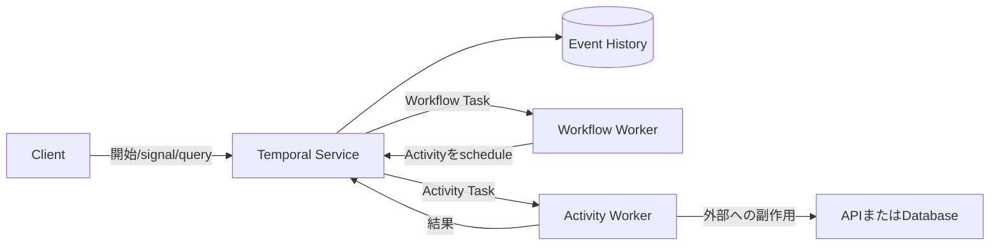



## 問題：長時間にわたる業務手順はprocess memoryだけでは耐えられない

複数のAPI呼び出し、承認待ち、timer、補償処理が連なる手順を一つのworker processで実装すると、障害復旧が難しい。

- process restart後、どの段階にいたのか分からない。
- すでに成功した外部呼び出しを再実行する。
- retryとtimeoutの状態が複数のtableに散在する。
- 数日後のcallbackを待つためにthreadを占有する。
- codeのデプロイ後、実行中のinstanceと互換性がなくなる。
- operatorが手動で修正した状態の根拠が残らない。

Temporalはworkflowの状態遷移をevent historyへ永続的に記録し、codeをreplayして状態を復元するdurable execution platformである。

特定の製品を使う前であっても、このモデルは長時間workflowの設計に役立つ。

## Mental model：Workflowは決定、Activityは副作用

### Workflow

workflow codeは状態遷移と次の行動を決定する。

event historyをreplayしたとき、同じcommandを生成しなければならない。

一般的なwall clock、random、network I/O、process-local global stateを直接使用しない。

SDKが提供するdeterministic APIを使う。

### Activity

外部API、database、file、model inferenceのように、失敗と副作用を伴う処理を行う。

activityはat-least-onceで実行されうると想定し、idempotentにする。

### WorkerとTemporal Service

workerはcodeを実行するが、durable stateのsource of truthはserviceのevent historyである。

workerが停止してもhistoryは残り、別のworkerが続きから処理できる。

service障害とworker障害の運用上の境界は、デプロイ形態によって異なる。

## Cron、Queue、Workflow、Agentの境界

### Cron

決められた時刻に独立したジョブを開始するのに適している。

複数段階のdurable stateとhuman-in-the-loopを直接提供するものではない。

### Message Queue

producerとconsumerを分離し、burstを吸収する。

業務の状態machine、timer、補償、queryはapplication側で実装しなければならない。

### Durable Workflow

長い寿命、複数の段階、retry、timer、signal、補償状態を一つの実行単位として追跡する。

### LLM Agent

不確実な入力から計画やtoolの選択を生成できる。

durabilityと業務invariantをagentの会話状態だけに委ねない。

agent呼び出しをactivityとして分離し、承認と検証をworkflowで統制できる。

## Workflow：durable workflowの設計手順

### Step 1. workflow identityを決める

業務aggregateに結び付く安定したworkflow IDを使用する。

重複start policyを明示する。

同じ業務リクエストが新しいworkflowを作るのか、既存workflowへsignalを送るのかを決める。

### Step 2. まず状態machineを書く

例：`requested -> validated -> approved -> executing -> completed`。

terminal stateと許可されるtransitionを定義する。

workflow input全体を際限なくhistoryへコピーしない。

大きなpayloadは外部object storeへ置き、immutable referenceとchecksumを渡す。

### Step 3. Activityの境界を小さくする

一つのactivityがあまりに多くの副作用を実行すると、どの時点で失敗したのか曖昧になる。

しかし、activityを細かく分けすぎるとhistoryとschedulingのoverheadが増える。

再試行・timeout・idempotencyの境界が同じ処理を一つにまとめる。

### Step 4. timeoutの種類を区別する

SDKが提供する詳しい名称は、versionごとのドキュメントを確認する。

概念上は次を区別する。

- schedule後、開始までに許容する時間
- activityの1回の実行に許容する時間
- すべての再試行を含め、完了までに許容する時間
- heartbeat間に許容する時間

すべてのactivityに無限timeoutを設定しない。

実際の業務deadlineから導出する。

### Step 5. retry policyをエラーtaxonomyに合わせる

transient networkエラーにはbackoff付きの再試行が適している。

入力validationエラーは再試行しても解決しない。

rate limitでは、serverから渡されたretry hintと全体のdeadlineを考慮する。

再試行不可能なエラーtypeを明示する。

### Step 6. idempotency keyを外部境界へ渡す

activity attemptが変わっても、同一の業務operationには同じidempotency keyを使う。

外部systemが対応していなければ、local operation recordと条件付き状態遷移を用意する。

activityの完了応答が失われうることを考慮する。

### Step 7. 長時間Activityはheartbeatする

heartbeatは進行状態とworkerの生存をserviceへ知らせる。

キャンセルの伝達とresume detailにも使用できる。

heartbeat detailには大きなデータや機密データを含めない。

処理自体をcheckpointから安全に再開できるよう、別途実装する。

### Step 8. Signal、Query、Updateの意味を分ける

- signalは非同期の外部eventをworkflowへ伝える。
- queryは状態を読み、historyを変更しない。
- updateは、検証可能な同期状態変更が必要な場合に使用する。

SDKとserver versionに応じた対応範囲を確認する。

外部event IDを使ってsignalの重複を抑制する。

### Step 9. Timerで待機を表現する

workflow timerはworker threadを長時間占有しない。

承認の期限切れ、再確認、SLA escalationをdurable timerで表現する。

wall clockのtimezoneと業務calendarを明確にする。

### Step 10. 補償を業務の観点から設計する

分散transactionのrollbackとsagaの補償は同じではない。

補償はすでに起きた事実を消すのではなく、反対方向の業務actionを実行する。

補償自体も失敗して再試行されうるため、idempotentでなければならない。

登録順序と実行の逆順を確認する。

### Step 11. code versioningを計画する

実行中workflowのhistoryが新しいworker codeでreplayされることがある。

workflowのcontrol flowを変更するときは、deterministic compatibilityを保つ。

SDKのversioning機能またはworker deployment機能を公式ドキュメントで確認する。

古いworkflowをcontinue-as-newにより、新しいhistoryとcode pathへ移せる。

### Step 12. historyの大きさを管理する

長いloop、多数のsignal、頻繁なtimerはhistoryを大きくする。

continue-as-newを使うと、論理的なworkflow identityを維持しながら新しいrunを開始できる。

外部read modelを別に用意すれば、queryの負荷とhistory payloadを減らせる。

## 実践例：承認後に外部処理を実行する

1. clientが安定したworkflow IDで開始する。
2. validation activityがinput referenceとchecksumを確認する。
3. workflowが`waiting_approval`状態になる。
4. durable timerが承認の有効期限を追跡する。
5. 承認signalにはapprover identityとevent IDが含まれる。
6. workflowが重複signalを無視し、authorizationを検証する。
7. execution activityへ業務idempotency keyを渡す。
8. activityはheartbeatを送りながら長時間の処理を行う。
9. 結果artifactのchecksumを返す。
10. publish activityが条件付きで結果を公開する。
11. 失敗したらポリシーに従ってretryまたは補償を行う。
12. terminal状態とaudit referenceを記録する。

承認画面の認証は、別のidentity systemが担う。

workflowは検証済みの承認eventだけを受け取らなければならない。

## 検証Checklist

### deterministic workflow

- [ ] workflow codeが直接network I/Oを行わない。
- [ ] timeとrandomにはSDKのdeterministic APIを使う。
- [ ] collection iterationとserializationの決定性を確認した。
- [ ] code変更をold historyのreplayでテストした。
- [ ] historyの増大とcontinue-as-newの基準がある。

### activity

- [ ] 副作用のあるすべてのactivityがidempotentである。
- [ ] timeoutとretryが業務deadlineから導出されている。
- [ ] non-retryableエラーが分類されている。
- [ ] 長時間処理にはheartbeatとcheckpointがある。
- [ ] キャンセルが外部処理までどのように伝わるか定義されている。

### 運用

- [ ] workflow IDと重複start policyが明確である。
- [ ] queue backlogとschedule-to-start latencyを監視している。
- [ ] stuck workflowと反復する失敗を検出する。
- [ ] worker version rolloutをrehearsalした。
- [ ] 機密payloadがhistoryに残らない。
- [ ] namespaceとretention、archivalのポリシーをレビューした。

## よくある失敗と限界

### すべての関数をActivityにする

単純なdeterministic計算までremote activityにすると、latencyとhistoryが増える。

### Activity完了をexactly-onceの副作用だと誤解する

完了応答が失われた後、activityが再実行されることがある。

end-to-end idempotencyが必要である。

### workflow historyをdatabaseのようにqueryする

複雑な検索とreportingには、別のread modelが適する場合がある。

### agentの判断をそのままdurable stateとして確定する

LLMの出力は非決定的で、誤る可能性がある。

schema validation、policy check、人間による承認などのguardrailをworkflowの段階として設ける。

### 単純なscheduleまですべてdurable workflowへ移す

段階が短く再実行が容易なbatchには、cronとidempotent jobのほうが単純なこともある。

## 公式参考資料

- [Temporal Documentation](https://docs.temporal.io/)
- [Temporal Workflows](https://docs.temporal.io/workflows)
- [Temporal Activities](https://docs.temporal.io/activities)
- [Temporal Failure Detection](https://docs.temporal.io/encyclopedia/detecting-activity-failures)
- [Temporal Versioning](https://docs.temporal.io/workflow-definition#versioning)

## まとめ

durable workflowの価値は、長い関数を保存することにあるのではない。

決定と副作用、retryと業務エラー、signalとqueryの境界を明示し、失敗後も同じ手順を続けられることにある。

cron、queue、workflow、agentをそれぞれ適切な責務へ配置すれば、複雑な自動化も監査と復旧が可能なシステムになる。
