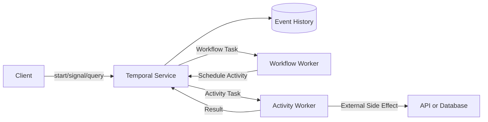



## 문제: 장시간 업무 절차는 process memory만으로 버틸 수 없다

여러 API 호출, 승인 대기, timer, 보상 작업이 이어지는 절차를 하나의 worker process로 구현하면 실패 복구가 어렵다.

- process restart 뒤 어느 단계였는지 모른다.
- 이미 성공한 외부 호출을 다시 실행한다.
- retry와 timeout 상태가 여러 table에 흩어진다.
- 며칠 뒤 callback을 기다리기 위해 thread를 점유한다.
- code 배포 뒤 실행 중 instance와 호환되지 않는다.
- operator가 수동 수정한 상태의 근거가 남지 않는다.

Temporal은 workflow 상태 전이를 event history로 내구성 있게 기록하고 code를 replay해 상태를 복원하는 durable execution platform이다.

특정 제품을 쓰기 전에도 이 모델은 장시간 workflow 설계에 유용하다.

## Mental model: Workflow는 결정, Activity는 부작용

### Workflow

workflow code는 상태 전이와 다음 행동을 결정한다.

event history를 replay했을 때 같은 명령을 만들어야 한다.

일반적인 wall clock, random, network I/O, process-local global state를 직접 사용하지 않는다.

SDK가 제공하는 deterministic API를 사용한다.

### Activity

외부 API, database, file, model inference처럼 실패와 부작용이 있는 작업을 수행한다.

activity는 at-least-once 실행될 수 있다고 가정하고 idempotent하게 만든다.

### Worker와 Temporal Service

worker는 code를 실행하지만 durable state의 source of truth는 service의 event history다.

worker가 내려가도 history는 남고 다른 worker가 이어서 처리할 수 있다.

service 장애와 worker 장애의 운영 경계는 배포 형태에 따라 다르다.

## Cron, Queue, Workflow, Agent의 경계

### Cron

정해진 시각에 독립 작업을 시작하기 좋다.

여러 단계의 durable state와 human-in-the-loop를 직접 제공하지 않는다.

### Message Queue

producer와 consumer를 분리하고 burst를 흡수한다.

업무 상태 machine, timer, 보상, query는 application이 구현해야 한다.

### Durable Workflow

긴 수명, 여러 단계, retry, timer, signal, 보상 상태를 한 실행 단위로 추적한다.

### LLM Agent

불확실한 입력에서 계획이나 tool 선택을 생성할 수 있다.

durability와 업무 invariant를 agent 대화 상태에만 맡기지 않는다.

agent 호출을 activity로 격리하고 승인과 검증을 workflow가 통제할 수 있다.

## Workflow: durable workflow 설계 순서

### Step 1. workflow identity를 정한다

업무 aggregate와 연결되는 안정된 workflow ID를 사용한다.

중복 start policy를 명시한다.

같은 업무 요청이 새 workflow를 만드는지 기존 workflow에 signal을 보내는지 결정한다.

### Step 2. 상태 machine을 먼저 쓴다

예: `requested -> validated -> approved -> executing -> completed`.

terminal state와 허용 transition을 정의한다.

workflow input 전체를 무제한 history에 복사하지 않는다.

대형 payload는 외부 object store에 두고 immutable reference와 checksum을 전달한다.

### Step 3. Activity 경계를 작게 만든다

activity 하나가 너무 많은 부작용을 수행하면 어느 지점에서 실패했는지 모호하다.

그러나 지나치게 작은 activity는 history와 scheduling overhead를 키운다.

재시도·timeout·idempotency 경계가 같은 작업을 하나로 묶는다.

### Step 4. timeout 종류를 구분한다

SDK가 제공하는 세부 이름은 version별 문서를 확인한다.

개념적으로 다음을 구분한다.

- schedule 후 시작까지 허용 시간
- activity 실행 한 번의 허용 시간
- 전체 재시도 포함 완료까지 허용 시간
- heartbeat 사이 허용 시간

모든 activity에 무한 timeout을 두지 않는다.

실제 업무 deadline에서 파생한다.

### Step 5. retry policy를 오류 taxonomy와 맞춘다

transient network 오류는 backoff 재시도가 적절하다.

입력 validation 오류는 재시도해도 해결되지 않는다.

rate limit은 server가 준 retry hint와 전체 deadline을 고려한다.

재시도 불가능한 오류 type을 명시한다.

### Step 6. idempotency key를 외부 경계에 전달한다

activity attempt가 바뀌어도 동일 업무 operation은 같은 idempotency key를 사용한다.

외부 system이 지원하지 않으면 local operation record와 조건부 상태 전이를 둔다.

activity 완료 응답이 유실될 수 있음을 고려한다.

### Step 7. 장시간 Activity는 heartbeat한다

heartbeat는 진행 상태와 worker 생존을 service에 알린다.

취소 전달과 resume detail에 사용할 수 있다.

heartbeat detail에는 대형·민감 데이터를 넣지 않는다.

작업 자체가 checkpoint에서 안전하게 재개되는지 별도 구현한다.

### Step 8. Signal, Query, Update의 의미를 나눈다

- signal은 비동기 외부 event를 workflow에 전달한다.
- query는 상태를 읽고 history를 변경하지 않는다.
- update는 검증 가능한 동기 상태 변경이 필요한 경우 사용한다.

SDK와 server version에 따른 지원 범위를 확인한다.

외부 event ID로 signal 중복을 억제한다.

### Step 9. Timer로 대기를 표현한다

workflow timer는 worker thread를 장기간 점유하지 않는다.

승인 만료, 재확인, SLA escalation을 durable timer로 표현한다.

wall clock timezone과 업무 calendar를 명확히 한다.

### Step 10. 보상을 업무적으로 설계한다

분산 transaction rollback과 saga 보상은 동일하지 않다.

보상은 이미 일어난 사실을 없애지 않고 반대 업무 action을 수행한다.

보상도 실패하고 재시도될 수 있으며 idempotent해야 한다.

등록 순서와 실행 역순을 검토한다.

### Step 11. code versioning을 계획한다

실행 중 workflow history는 새 worker code로 replay될 수 있다.

workflow control flow를 바꿀 때 deterministic compatibility를 유지한다.

SDK의 versioning 또는 worker deployment 기능을 공식 문서에서 확인한다.

오래된 workflow를 continue-as-new로 새 history와 code path에 옮길 수 있다.

### Step 12. history 크기를 관리한다

긴 loop, 많은 signal, 잦은 timer는 history를 키운다.

continue-as-new로 논리 workflow identity를 유지하며 새 run을 시작할 수 있다.

외부 read model을 별도로 두면 query 부담과 history payload를 줄일 수 있다.

## 실전 예제: 승인 후 외부 작업 실행

1. client가 안정된 workflow ID로 시작한다.
2. validation activity가 input reference와 checksum을 확인한다.
3. workflow가 `waiting_approval` 상태가 된다.
4. durable timer가 승인 만료 시간을 추적한다.
5. 승인 signal에는 approver identity와 event ID가 들어온다.
6. workflow가 중복 signal을 무시하고 authorization을 검증한다.
7. execution activity에 업무 idempotency key를 전달한다.
8. activity는 heartbeat하며 장시간 작업을 수행한다.
9. 결과 artifact checksum을 반환한다.
10. publish activity가 조건부로 결과를 공개한다.
11. 실패하면 정책에 따라 retry 또는 보상을 수행한다.
12. terminal 상태와 audit reference를 기록한다.

승인 화면의 인증은 별도 identity system이 책임진다.

workflow는 검증된 승인 event만 받아야 한다.

## 검증 Checklist

### deterministic workflow

- [ ] workflow code가 직접 network I/O를 하지 않는다.
- [ ] time과 random은 SDK deterministic API를 쓴다.
- [ ] collection iteration과 serialization의 결정성을 확인했다.
- [ ] code 변경을 old history replay로 시험했다.
- [ ] history 성장과 continue-as-new 기준이 있다.

### activity

- [ ] 모든 부작용 activity가 idempotent하다.
- [ ] timeout과 retry가 업무 deadline에서 파생된다.
- [ ] non-retryable 오류가 분류되어 있다.
- [ ] 장시간 작업은 heartbeat와 checkpoint가 있다.
- [ ] 취소가 외부 작업까지 어떻게 전달되는지 정의되어 있다.

### 운영

- [ ] workflow ID와 중복 start policy가 명확하다.
- [ ] queue backlog와 schedule-to-start latency를 본다.
- [ ] stuck workflow와 반복 실패를 탐지한다.
- [ ] worker version rollout을 rehearsal했다.
- [ ] 민감 payload가 history에 남지 않는다.
- [ ] namespace와 retention, archival 정책을 검토했다.

## 자주 겪는 실패와 한계

### 모든 함수를 Activity로 만든다

단순 deterministic 계산까지 원격 activity로 만들면 latency와 history가 늘어난다.

### Activity 완료를 exactly-once 부작용으로 오해한다

완료 응답 유실 뒤 activity가 다시 실행될 수 있다.

end-to-end idempotency가 필요하다.

### workflow history를 database처럼 query한다

복잡한 검색과 reporting에는 별도 read model이 적합할 수 있다.

### agent 판단을 그대로 durable state로 확정한다

LLM 출력은 비결정적이고 오류가 가능하다.

schema validation, policy check, 인간 승인 같은 guardrail을 workflow 단계로 둔다.

### 단순 schedule까지 모두 durable workflow로 옮긴다

단계가 짧고 재실행이 쉬운 batch는 cron과 idempotent job이 더 단순할 수 있다.

## 공식 참고자료

- [Temporal Documentation](https://docs.temporal.io/)
- [Temporal Workflows](https://docs.temporal.io/workflows)
- [Temporal Activities](https://docs.temporal.io/activities)
- [Temporal Failure Detection](https://docs.temporal.io/encyclopedia/detecting-activity-failures)
- [Temporal Versioning](https://docs.temporal.io/workflow-definition#versioning)

## 마무리

durable workflow의 가치는 긴 함수를 저장하는 데 있지 않다.

결정과 부작용, retry와 업무 오류, signal과 query의 경계를 명시해 실패 뒤에도 같은 절차를 이어가는 데 있다.

cron, queue, workflow, agent를 각각 맞는 책임에 배치하면 복잡한 자동화도 감사와 복구가 가능한 시스템이 된다.
