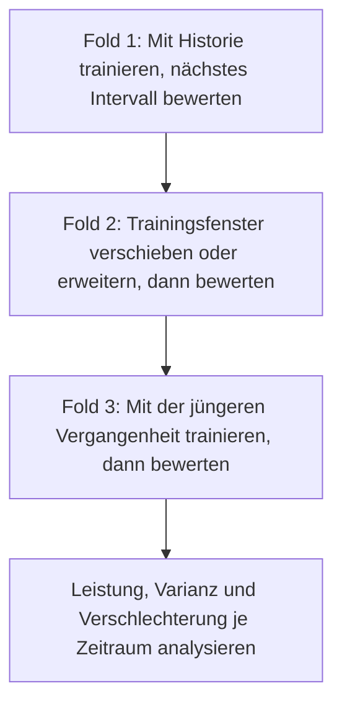



Bei der Validierung eines Zeitreihenmodells geht es nicht darum, wie gut es Vergangenheitsdaten erklärt. Sie soll **nachspielen, wie zuverlässig das Modell die jeweils nächste Entscheidung ausschließlich mit den zu diesem Zeitpunkt bekannten Informationen unterstützt hätte**. Selbst bei erhaltener Zeitreihenfolge können zukünftige Informationen durch Merkmalsbildung, überlappende Labels oder Hyperparameterauswahl in den Backtest gelangen und ihn zu optimistisch machen.

Die folgenden Prinzipien gelten nicht nur für numerische Prognosen wie die Bedarfsplanung, sondern auch für Klassifikation, Risikobewertung und Anomalieerkennung, die über die Zeit wiederholt aufgerufen werden.

## 1. Das Problem: Zeit ist nicht nur eine weitere Spalte

### Zufällige Splits bilden den zukünftigen Einsatz nicht ab

Ein zufälliger Split unter der Annahme unabhängig und identisch verteilter Daten mischt vergangene und zukünftige Beobachtungen in Trainings- und Validierungsmenge. Folgende Abhängigkeiten können die gemessene Leistung künstlich erhöhen.

- Autokorrelation benachbarter Zeitpunkte
- wiederholte Messungen derselben Entität
- Saisonalität, Trends und Änderungen des Betriebsregimes
- mit Zukunftsinformation berechnete Aggregationen und Normalisierungen
- Unterschiede zwischen revidierten Enddaten und anfänglichen Echtzeitdaten

Im Betrieb wird aus der Vergangenheit die Zukunft vorhergesagt; die Validierung muss dieselbe Richtung einhalten.

### Ein einzelner Holdout beantwortet nur eine Frage zu einem Zeitraum

Das letzte Intervall als Testmenge zurückzuhalten ist notwendig, aber nicht hinreichend. Es kann zufällig besonders leicht oder schwer sein und Jahreszeiten, Ereignisse oder Betriebsbedingungen unzureichend repräsentieren. Wird die Modellauswahl an dieses eine Intervall angepasst, wird es faktisch ebenfalls zu Trainingsdaten.

### Drift ist kein einheitliches Phänomen

Die Ursachen von Leistungsänderungen nach der Bereitstellung müssen unterschieden werden.

| Änderung | Definition | Beispielhafte Bedeutung |
|---|---|---|
| Kovariatendrift | Änderung von \(P(X)\) | Häufigkeit, Wertebereich oder Fehlwertmuster der Eingaben ändern sich |
| Prior-Drift | Änderung von \(P(Y)\) | Basisrate eines Ereignisses ändert sich |
| Konzeptdrift | Änderung von \(P(Y\mid X)\) | Dieselbe Eingabe führt zu einem anderen Ergebnis |
| Richtliniendrift | Änderung der Entscheidungs- oder Erfassungsrichtlinie | Die Modellnutzung verändert die Beobachtung der Labels |
| Schemadrift | Änderung von Format, Einheit oder Codes | Bedeutung oder Datentyp einer Spalte ändert sich |

Eine veränderte Eingabeverteilung verschlechtert die Leistung nicht zwangsläufig. Umgekehrt kann die Leistung bei geändertem \(P(Y\mid X)\) sinken, obwohl die Eingabeverteilung stabil bleibt.

## 2. Mentales Modell: ein Simulator, der Produktionszeitpunkte wiederholt abspielt

### Prognoseursprung, Beobachtungsfenster und Horizont trennen

Seien der Prognoseursprung \(t\), die Länge des Beobachtungsfensters \(W\) und der Prognosehorizont \(H\).

\[
X_t = g\left(z_{t-W+1},\ldots,z_t\right), \qquad
y_{t,H} = h\left(z_{t+1},\ldots,z_{t+H}\right)
\]

Das Modell darf nur Daten erhalten, die am Ursprung \(t\) tatsächlich verfügbar waren. Werden Daten später als zu ihrem Ereigniszeitpunkt geladen, müssen sie zusätzlich `available_at <= t` erfüllen.

### Ein Backtest ist eine Folge simulierter Bereitstellungen

Bei der Rolling-Origin-Evaluation wird der Ursprung schrittweise verschoben und Training sowie Bewertung werden wiederholt.



Endet das Training für Fold \(k\) bei \(T_k\), beträgt die Lücke \(G\) und die Bewertungslänge \(V\), dann gilt:

\[
\mathcal{D}_{train}^{(k)} = \{t \le T_k\}, \qquad
\mathcal{D}_{valid}^{(k)} = \{T_k+G < t \le T_k+G+V\}
\]

Eine Lücke ist kein Schmuckelement, das immer eingefügt werden muss. Sie wird in folgenden Fällen benötigt.

- Merkmals- oder Labelfenster überlappen die Splitgrenze.
- Wegen später Labelreife ist die jüngste Ground Truth am Trainingsende noch unbekannt.
- Die Wirkung desselben Ereignisses hält in benachbarten Intervallen lange an.
- Datenaufbereitung, erneutes Training und Bereitstellung benötigen im Betrieb Zeit.

### Leistung über die Zeit als Verteilung behandeln

Wichtiger als eine einzelne Durchschnittszahl sind:

- Leistung je Zeitraum \(m_1,\ldots,m_K\)
- Leistung im schlechtesten Zeitraum \(\min_k m_k\)
- zeitlicher Trend und Volatilität
- bedingte Leistung nach Saison und Domäne
- Geschwindigkeit der Erholung nach erneutem Training

Modellauswahl maximiert nicht nur den Mittelwert, sondern begrenzt auch das Abwärtsrisiko.

\[
\text{score}(M)=\overline{m}(M)-\lambda\,\mathrm{Std}(m(M))-\gamma\,\mathrm{TailRisk}(m(M))
\]

\(\lambda,\gamma\) sind Entwurfsvariablen dafür, wie stark Sicherheit und Stabilität gewichtet werden.

## 3. Praktischer Ablauf

### Schritt 1. Zeitsemantik im Datenvertrag festlegen

Mindestens vier Zeitangaben sind zu unterscheiden.

| Zeit | Bedeutung |
|---|---|
| Ereigniszeit | Zeitpunkt des Ereignisses in der realen Welt |
| Aufnahmezeit | Zeitpunkt der Ankunft im System |
| Verfügbarkeitszeit | Zeitpunkt, ab dem validierte und verarbeitete Daten dem Modell bereitstanden |
| Labelzeit | Zeitpunkt, zu dem das Ergebnis beobachtet oder endgültig festgestellt wurde |

Bei korrigierten Daten muss der zuerst veröffentlichte vom endgültig revidierten Wert unterschieden werden. Ein Backtest mit ausschließlich revidierten Endwerten liefert einem Echtzeitmodell sauberere Informationen, als es im Betrieb besitzen wird.

Für jede Zeitreihe werden folgende Regeln dokumentiert.

- Zeitzone und Behandlung der Sommerzeit
- Abtastfrequenz und Regeln für unregelmäßige Intervalle
- Behandlung doppelter und ungeordnet eintreffender Ereignisse
- Unterscheidung fehlender Werte von echten Nullen
- Historie von Einheiten-, Sensor- und Codeänderungen
- Toleranz für verspätet eintreffende Daten

### Schritt 2. Einen zur Einsatzfrage passenden Split wählen

#### Expandierendes Fenster

Vergangene Daten werden fortlaufend angesammelt.

\[
[1,T_1]\rightarrow V_1,\quad [1,T_2]\rightarrow V_2,\ldots
\]

Dies eignet sich, wenn langfristige Historie gültig bleibt und die Datenmenge wichtig ist.

#### Gleitendes Fenster

Es wird nur ein jüngeres Fenster fester Länge verwendet.

\[
[T_1-W,T_1]\rightarrow V_1,\quad [T_2-W,T_2]\rightarrow V_2,\ldots
\]

Das ist vorteilhaft, wenn alte Regime von der Gegenwart abweichen und Konzeptdrift schnell ist. Dafür können seltene Muster und saisonale Zyklen verloren gehen.

#### Geblockter Split

Die Daten werden in feste, zusammenhängende Trainings-, Validierungs- und Testblöcke geteilt. Das ist rechnerisch einfach, kann die Modellauswahl aber von einem einzigen Validierungszeitraum abhängig machen.

#### Gruppierter zeitlicher Split

Zeitreihenfolge und Entitätsgrenzen bleiben gleichzeitig erhalten. Der Entwurf unterscheidet sich je nachdem, ob die Aufgabe die „Zukunft vorhandener Entitäten“ prognostiziert oder auf die „Zukunft neuer Entitäten“ verallgemeinern soll.

### Schritt 3. Merkmalsbildung zeitpunktgetreu gestalten

Merkmalscode ist eine Hauptquelle zeitlicher Leakage.

- Ein zentrierter gleitender Mittelwert enthält Zukunftswerte.
- Standardisierung des gesamten Datensatzes nutzt zukünftige Mittelwerte und Varianzen.
- Vorwärtsauffüllen kann eine Splitgrenze überschreiten.
- Künftige Zielaggregationen können in Merkmale geraten.
- Resampling und Interpolation können beidseitig auf zukünftige Beobachtungen zugreifen.

Die Merkmalsfunktion erhält deshalb einen ausdrücklichen Stichtag.

```python
def make_features(history, cutoff):
    visible = history[
        (history.event_time <= cutoff)
        & (history.available_time <= cutoff)
    ]

    return {
        "last_value": visible.value.iloc[-1],
        "mean_7": visible.tail(7).value.mean(),
        "age_seconds": (cutoff - visible.available_time.iloc[-1]).total_seconds(),
    }
```

Ein geeigneter Test vergleicht zwei Betriebsarten des Merkmalsgenerators.

1. Batchbetrieb, der die gesamte Vergangenheit auf einmal berechnet und Zukunftsbezüge verbietet
2. Replaybetrieb, der schrittweise fortschreitet und nur die jeweils sichtbaren Informationen verwendet

Beide Ergebnisse müssen übereinstimmen.

### Schritt 4. Labelüberlappung und Reife behandeln

Bezeichnet ein Label ein Ereignis innerhalb der nächsten \(H\) Perioden, überlappen sich die Labelfenster benachbarter Zeilen. Nahe einer Splitgrenze können Trainings- und Validierungslabels dasselbe zukünftige Ereignis enthalten.

Mögliche Gegenmaßnahmen:

- Abstand zwischen Bewertungsursprüngen vergrößern.
- Zwischen Splits ein Embargo von mindestens einem Prognosehorizont einfügen.
- Nach Ereignis oder Episode gruppieren.
- Einheiten für Standardfehler und Bootstrap korrelationsgerecht wählen.

Wird ein Label erst nach \(L\) Tagen finalisiert, stammt das jüngste zum erneuten Training bei \(T\) verfügbare Label ungefähr aus der Zeit vor \(T-L\). Diese Verzögerung muss der Backtest reproduzieren.

### Schritt 5. Zuerst Baselines demselben Backtest unterziehen

Baselines für Zeitreihen sind leistungsfähig.

- letzten Wert fortschreiben
- Wert aus dem vorigen saisonalen Zyklus
- gleitender Mittelwert oder Median
- einfacher Trend
- vorhandener regelbasierter Score
- regularisiertes lineares Modell

Übertrifft das Modell eine saisonale naive Baseline nicht beständig, sollten Daten, Horizont und Verlustdefinition geprüft werden, bevor eine komplexere Architektur hinzukommt.

Bei mehreren Prognosehorizonten wird die Leistung für jeden Horizont getrennt betrachtet.

\[
\mathrm{MAE}_h = \frac{1}{N_h}\sum_i |y_{i,t+h}-\hat y_{i,t+h}|
\]

Ein Gesamtmittel kann bewirken, dass zahlreiche kurzfristige Beispiele Fehler bei langen Horizonten verdecken.

### Schritt 6. Modellauswahl und endgültige Bewertung trennen

Empfohlene Struktur:

1. Kandidatenmodelle und Merkmale über mehrere historische Folds vergleichen.
2. Nach Fold-Mittelwert, Varianz, schlechtestem Intervall und Kosten auswählen.
3. Auswahlregel und Hyperparameter einfrieren.
4. Einmalig auf dem jüngsten versiegelten Testintervall bewerten.
5. Mit einer getrennten Richtlinie entscheiden, ob vor der Bereitstellung einschließlich Testintervall neu trainiert wird.

Hyperparameter für jeden Fold anhand seiner Validierungsleistung abzustimmen und anschließend dieselben Fold-Ergebnisse zu berichten ist optimistisch. Falls erforderlich, wird ein verschachtelter Backtest mit erhaltener Zeitordnung verwendet.

### Schritt 7. Leistung nach Zeitraum und Bedingung zerlegen

Je nach Vorhersageproblem sind unter anderem folgende Segmente zu untersuchen.

- Prognosehorizont
- Tageszeit, Wochentag und Saison
- Länge der Beobachtungshistorie
- Fehlwertanteil und Verzögerung der Eingaben
- neue oder vorhandene Entität
- Zielgröße oder Ereignisschwere
- bekannter Betriebszustand

Neben Durchschnittsmetriken werden Fehlerverteilung, Bias, Quantile und schlechtestes Intervall betrachtet. Werden Vorhersageintervalle ausgegeben, ist auch ihre empirische Abdeckung zu validieren.

\[
\widehat{\mathrm{Coverage}}_{1-\alpha}
=\frac{1}{n}\sum_i \mathbf{1}\left(y_i\in[L_i,U_i]\right)
\]

Selbst bei erreichter Zielabdeckung sind übermäßig breite Intervalle nutzlos. Mittlere Breite und bedingte Abdeckung müssen gemeinsam geprüft werden.

### Schritt 8. Produktionsüberwachung nach Labelverzögerung entwerfen

#### Sofort verfügbare Betriebsmetriken

- Schema, Einheiten, Wertebereiche und Kategoriemengen
- Verzögerung und Aktualität eingehender Daten
- Raten fehlender, doppelter und ungeordnet eintreffender Ereignisse
- Inferenzlatenz, Fehlerrate und Fallbackrate
- Verteilung von Vorhersagen, Scores und Unsicherheit
- Alarm- und Aktionsraten

#### Driftsignale ohne Labels

- kontinuierlich: Quantilverschiebung, PSI und distanzbasierte Statistiken
- kategorial: Häufigkeitsänderungen und Anteil neuer Kategorien
- multivariat: Domänenklassifikator zur Unterscheidung vergangener und aktueller Daten
- Embeddings: Änderungen von Distanz, Dichte und Nachbarschaftsstruktur

Ein Alarm darf nicht allein auf statistischer Signifikanz beruhen. Bei großen Stichproben werden belanglose Unterschiede signifikant; Kriterien für praktische Bedeutung und Dauer müssen hinzukommen.

#### Qualitätsmetriken nach Labelreife

- Vorhersagefehler oder Klassifikationsmetriken
- Kalibrierung und Abdeckung von Vorhersageintervallen
- Richtlinienkosten und Durchsatz
- Leistungsunterschiede nach Gruppe und Tageszeit
- Vergleich vor und nach erneutem Training

### Schritt 9. Alarme mit Reaktionen verknüpfen

Überwachung besteht nicht im Zeichnen von Grafiken, sondern im Automatisieren und Dokumentieren von Reaktionsabläufen.

| Signal | Erste Diagnose | Mögliche Reaktion |
|---|---|---|
| Schemaverletzung | Änderung beim Erzeuger oder Parsingfehler | Eingabe sperren, Fallback nutzen, Vertrag wiederherstellen |
| Veraltete Daten | Verzögerung bei Erfassung oder Aggregation | Merkmale als veraltet markieren, Vorhersagen aussetzen |
| Plötzliche Verschiebung der Scoreverteilung | Eingabedrift oder Codeänderung | Schattenvergleich, ursächliche Segmente untersuchen |
| Schlechtere Kalibrierung | Änderung von Basisrate oder Beziehung | Neu kalibrieren, Schwellen prüfen |
| Leistungsabfall | Konzeptdrift oder Labeländerung | Neu trainieren, Merkmale überarbeiten, zurückrollen |

Erneutes Training darf nicht die Standardantwort auf jeden Alarm sein. Es kann einen Fehler der Datenpipeline oder eine geänderte Labeldefinition hinter einem neuen Modell verbergen.

## 4. Checkliste für Evaluation und Validierung

### Zeit und Daten

- [ ] Ereignis-, Aufnahme-, Verfügbarkeits- und Labelzeit sind unterschieden.
- [ ] Für Zeitzonen, Duplikate, ungeordnete Ereignisse und verspätete Ankünfte bestehen Regeln.
- [ ] Unterschiede zwischen anfänglichen Echtzeitwerten und späteren Revisionen wurden geprüft.
- [ ] Merkmale verwenden ausschließlich Informationen, die am Prognoseursprung verfügbar waren.
- [ ] Batchmerkmale stimmen mit Merkmalen aus sequenziellem Replay überein.

### Splits und Backtesting

- [ ] Der Split bildet die tatsächliche Reihenfolge von Training und Vorhersage im Betrieb nach.
- [ ] Lücke oder Embargo berücksichtigt Überlappungen von Beobachtungs- und Labelfenstern.
- [ ] Abhängigkeiten desselben Ereignisses oder derselben Entität überschreiten keine Grenzen.
- [ ] Die Leistungsverteilung wurde über mehrere rollierende Ursprünge bewertet.
- [ ] Folds zur Modellauswahl und endgültiger Test sind getrennt.
- [ ] Die Verzögerung der Labelreife wird im Backtest nachgebildet.

### Evaluation

- [ ] Das Modell wird mit naiven, saisonalen und einfachen statistischen Baselines verglichen.
- [ ] Nicht nur der Mittelwert, sondern auch Varianz zwischen Zeiträumen und schlechtestes Intervall werden betrachtet.
- [ ] Die Leistung ist nach Horizont getrennt.
- [ ] Betrieblich wichtige Zeit- und Bedingungssegmente werden bewertet.
- [ ] Abdeckung und Breite der Vorhersageintervalle werden gemeinsam geprüft.
- [ ] Unsicherheit wird mit Einheiten geschätzt, welche die Korrelationsstruktur erhalten.

### Betrieb

- [ ] Metriken vor und nach Labelreife sind unterschieden.
- [ ] Driftalarme enthalten Kriterien für Ausmaß, Dauer und geschäftliche Bedeutung.
- [ ] Jeder Alarm besitzt Verantwortliche, Diagnoseablauf, Fallback und Rollback.
- [ ] Bedingungen für Neukalibrierung, Schwellenänderung und erneutes Training sind getrennt.
- [ ] Modell-, Daten- und Richtlinienänderungen sind in Leistungsgrafiken markiert.

## 5. Grenzen und Vorbehalte

Erstens kann selbst ein sorgfältiges Replay der Vergangenheit einen nie dagewesenen Strukturbruch nicht bewerten. Dafür sind Stressszenarien, Domänenwissen und konservative Fallbacks erforderlich.

Zweitens erzeugen viele Backtest-Folds nicht automatisch mehr unabhängige Evidenz. Überlappende Trainings- und Bewertungsintervalle sind stark korreliert; dem Standardfehler eines einfachen Mittels darf daher nicht zu viel Vertrauen geschenkt werden.

Drittens zeigen Driftstatistiken nicht die Ursache. Lineage und Änderungshistorie werden benötigt, um Datenqualitätsprobleme, Populations-, Richtlinien- und Konzeptänderungen auseinanderzuhalten.

Viertens verbessert häufiges erneutes Training die Aktualität, kann aber seltene Muster vergessen und die betriebliche Variabilität erhöhen. Expandierendes oder gleitendes Fenster und Trainingsfrequenz sind gemeinsam durch Backtests auszuwählen.

Schließlich verändern modellgestützte Handlungen zukünftige Daten und Labels. Ein Zeitreihensystem ist kein passiver Prädiktor, sondern eine mit seiner Umgebung interagierende Richtlinie. Langfristige Überwachung muss diese Rückkopplung einschließen.
