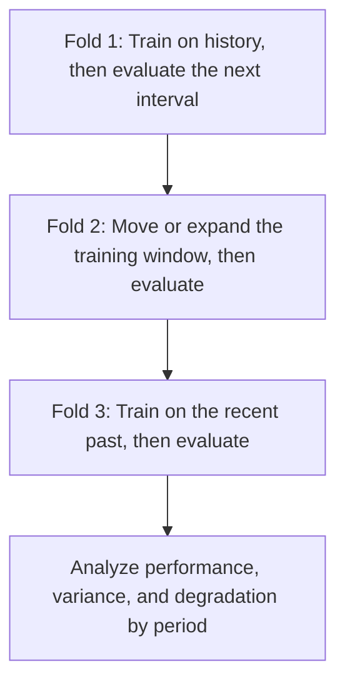



Validating a time-series model is not about checking how well it explains past data. It is **about replaying how reliably it would have supported the next decision using only the information known at that point in time**. Even when time order is preserved, future information entering through feature generation, label overlap, or hyperparameter selection can easily make a backtest optimistic.

The principles in this article apply not only to numeric forecasts such as demand prediction, but also to classification, risk scoring, and anomaly detection that are invoked repeatedly over time.

## 1. The Problem: Time Is Not Just Another Column

### Random Splits Do Not Simulate Future Deployment

In a random split that assumes independent and identically distributed data, past and future observations are mixed across training and validation sets. The following dependencies in time series can inflate performance.

- Autocorrelation between nearby points in time
- Repeated measurements of the same entity
- Seasonality, trends, and changes in the operating regime
- Aggregation and normalization calculated with future information
- Differences between revised final data and initial real-time data

Deployment predicts the future from the past, so validation must follow the same direction.

### A Single Holdout Is Only One Question About One Period

Keeping the final interval as a test set is necessary but insufficient. That interval may happen to be easy or difficult and may not represent seasons, events, or operating conditions. If model selection is overfit to one interval, that interval effectively becomes training data as well.

### Drift Is Not a Single Phenomenon

The causes of performance changes after deployment must be distinguished.

| Change | Definition | Illustrative meaning |
|---|---|---|
| covariate drift | Change in \(P(X)\) | Changes in input frequency, range, or missingness patterns |
| prior drift | Change in \(P(Y)\) | Change in the base rate of an event |
| concept drift | Change in \(P(Y\mid X)\) | The same input implies a different outcome |
| policy drift | Change in decision or collection policy | How the model is used changes label observation |
| schema drift | Change in format, units, or codes | A column's meaning or data type changes |

A change in the input distribution does not necessarily reduce performance, while performance can degrade when \(P(Y\mid X)\) changes even if the input distribution remains stable.

## 2. Mental Model: A Simulator That Repeatedly Replays Production Moments

### Separate the Forecast Origin, Observation Window, and Horizon

Let the forecast origin be \(t\), observation-window length be \(W\), and forecast horizon be \(H\).

\[
X_t = g\left(z_{t-W+1},\ldots,z_t\right), \qquad
y_{t,H} = h\left(z_{t+1},\ldots,z_{t+H}\right)
\]

The model must receive only data that was actually available at origin \(t\). If data is loaded later than its event time, it must also satisfy `available_at <= t`.

### A Backtest Is a Series of Simulated Deployments

Rolling-origin evaluation moves the origin forward and repeats training and evaluation.



If the end of training for fold \(k\) is \(T_k\), the gap is \(G\), and evaluation length is \(V\), then:

\[
\mathcal{D}_{train}^{(k)} = \{t \le T_k\}, \qquad
\mathcal{D}_{valid}^{(k)} = \{T_k+G < t \le T_k+G+V\}
\]

A gap is not a decoration that should always be added. It is needed in the following cases.

- Feature or label windows overlap across the split boundary.
- Because labels mature late, the most recent ground truth is not known at the end of training.
- The effect of the same event persists for a long time in adjacent intervals.
- Data preparation, retraining, and deployment take time in production.

### Treat Performance over Time as a Distribution

The following matter more than a single average performance number.

- Performance by period \(m_1,\ldots,m_K\)
- Worst-period performance \(\min_k m_k\)
- Temporal trend and volatility
- Conditional performance by season and domain
- Speed of performance recovery after retraining

Model selection is not just about maximizing the average; it is also about limiting downside risk.

\[
\text{score}(M)=\overline{m}(M)-\lambda\,\mathrm{Std}(m(M))-\gamma\,\mathrm{TailRisk}(m(M))
\]

\(\lambda,\gamma\) are design variables that express how much safety and stability matter.

## 3. Practical Workflow

### Step 1. Put Time Semantics in the Data Contract

Distinguish at least four times.

| Time | Meaning |
|---|---|
| event time | When the event occurred in the real world |
| ingestion time | When it arrived in the system |
| available time | When validation and processing made it available to the model |
| label time | When the outcome was observed or finalized |

For data that is corrected, distinguish the first published value from the final revised value. Backtesting a real-time prediction model using only final revised values gives it cleaner information than it will have in deployment.

Record the following for each time series.

- Time zone and daylight-saving-time handling
- Sampling frequency and rules for irregular intervals
- Handling of duplicate and out-of-order events
- Distinction between missing values and actual zeroes
- History of unit, sensor, and code changes
- Tolerance for late-arriving data

### Step 2. Choose a Split That Matches the Deployment Question

#### Expanding Window

Continue accumulating past data.

\[
[1,T_1]\rightarrow V_1,\quad [1,T_2]\rightarrow V_2,\ldots
\]

This is suitable when long-term history remains valid and the amount of data matters.

#### Sliding Window

Use only a recent window of fixed length.

\[
[T_1-W,T_1]\rightarrow V_1,\quad [T_2-W,T_2]\rightarrow V_2,\ldots
\]

This can be advantageous when old regimes differ from the present and concept drift is fast. In exchange, it may lose rare patterns and seasonal cycles.

#### Blocked Split

Divide the data into fixed, contiguous training, validation, and test blocks. This is computationally simple, but model selection may become dependent on a single validation period.

#### Grouped Temporal Split

Preserve both time order and entity boundaries. The design differs depending on whether the task predicts the “future of existing entities” or generalizes to the “future of new entities.”

### Step 3. Make Feature Generation Point-in-Time Safe

Feature code is a major source of time-series leakage.

- A centered moving average includes future values.
- Standardizing the entire dataset uses future means and variances.
- Forward fill can cross a split boundary.
- Future aggregation of the target may be mixed into features.
- Resampling and interpolation may refer to future observations on both sides.

Design the feature function to accept an explicit cutoff.

```python
def make_features(history, cutoff):
    visible = history[
        (history.event_time <= cutoff)
        & (history.available_time <= cutoff)
    ]

    return {
        "last_value": visible.value.iloc[-1],
        "mean_7": visible.tail(7).value.mean(),
        "age_seconds": (cutoff - visible.available_time.iloc[-1]).total_seconds(),
    }
```

A good test compares the feature generator in two modes.

1. A batch mode that calculates the entire past at once while forbidding future references
2. A replay mode that advances one time step at a time and calculates only from information visible then

The two results must match.

### Step 4. Handle Label Overlap and Maturity

When the label represents an event within the next \(H\) periods, the label windows of adjacent rows overlap. Near a split boundary, training and validation labels may share the same future event.

Ways to respond:

- Increase the interval between evaluation origins.
- Place an embargo of at least the prediction horizon between splits.
- Group by event or episode.
- Choose standard-error and bootstrap units that account for correlation.

Furthermore, if a label is finalized after \(L\) days, the latest label available for retraining at time \(T\) is approximately from before \(T-L\). Reproduce this delay in the backtest.

### Step 5. Put Baselines Through the Same Backtest First

Time-series baselines are strong.

- Carry forward the last value
- Value from the previous seasonal cycle
- Moving mean or median
- Simple trend
- Existing rule-based score
- Regularized linear model

If the model cannot consistently outperform a seasonal naive baseline, revisit the data, horizon, and loss definition before adding a more complex architecture.

When forecasting multiple horizons, inspect performance separately by horizon.

\[
\mathrm{MAE}_h = \frac{1}{N_h}\sum_i |y_{i,t+h}-\hat y_{i,t+h}|
\]

Looking only at the overall average can let numerous near-horizon samples hide failures at longer horizons.

### Step 6. Separate Model Selection from Final Evaluation

Recommended structure:

1. Compare candidate models and features across several historical folds.
2. Select using fold mean, variance, worst interval, and cost.
3. Freeze the selection rule and hyperparameters.
4. Evaluate once on the most recent sealed test interval.
5. Use a separate policy to decide whether to retrain on data through the test interval before deployment.

Tuning hyperparameters to each fold's validation performance and then reporting the same fold scores is optimistic. If necessary, use a nested backtest that preserves time order.

### Step 7. Decompose Performance by Period and Condition

Depending on the prediction problem, examine slices such as the following.

- Forecast horizon
- Time of day, day of week, and season
- Length of observation history
- Level of missingness and delay in inputs
- Whether the entity is new or existing
- Target magnitude or event severity
- Known operating state

Along with average metrics, inspect the error distribution, bias, quantiles, and worst interval. If prediction intervals are produced, validate empirical coverage as well.

\[
\widehat{\mathrm{Coverage}}_{1-\alpha}
=\frac{1}{n}\sum_i \mathbf{1}\left(y_i\in[L_i,U_i]\right)
\]

Even if coverage meets the target, the intervals are useless if they are excessively wide. Inspect mean width and conditional coverage together.

### Step 8. Design Production Monitoring by Label Delay

#### Operational Metrics Available Immediately

- Schema, units, ranges, and category sets
- Data arrival delay and freshness
- Missing, duplicate, and out-of-order event rates
- Inference latency, error rate, and fallback rate
- Distribution of predictions, scores, and uncertainty
- Alert and action rates

#### Drift Signals Without Labels

- Continuous: quantile shift, PSI, and distance-based statistics
- Categorical: changes in frequency and proportion of new categories
- Multivariate: use a domain classifier to test whether past and current data can be distinguished
- Embeddings: changes in distance, density, and neighborhood structure

Do not raise an alert based on statistical significance alone. With large samples, trivial differences are significant. Add criteria for practical importance and duration.

#### Quality Metrics After Labels Mature

- Prediction error or classification metrics
- Calibration and prediction-interval coverage
- Policy cost and throughput
- Performance gaps by group and time of day
- Comparison before and after retraining

### Step 9. Connect Alerts to Responses

Monitoring is not the work of making graphs; it is the work of automating and documenting response procedures.

| Signal | Initial diagnosis | Possible response |
|---|---|---|
| Schema violation | Producer change or parsing error | Block input, use fallback, restore contract |
| Staleness | Collection or aggregation delay | Mark stale features, withhold predictions |
| Sudden score-distribution shift | Input drift or code change | Shadow comparison, investigate causal slices |
| Calibration degradation | Change in base rate or relationship | Recalibrate, review thresholds |
| Performance degradation | Concept drift or label change | Retrain, revise features, roll back |

Retraining must not be the default answer to every alert. It can conceal a data-pipeline failure or a changed label definition behind a new model.

## 4. Evaluation and Validation Checklist

### Time and Data

- [ ] Event, ingestion, available, and label times are distinguished.
- [ ] Rules exist for time zones, duplicates, out-of-order events, and late arrivals.
- [ ] Differences between initial real-time values and later revisions have been checked.
- [ ] Features use only information available at the forecast origin.
- [ ] Batch features match sequential replay features.

### Splits and Backtesting

- [ ] The split simulates the actual order of training and prediction in deployment.
- [ ] A gap/embargo accounts for overlap in observation and label windows.
- [ ] Dependencies involving the same event or entity do not cross boundaries.
- [ ] The performance distribution has been evaluated across several rolling origins.
- [ ] Model-selection folds and the final test are separate.
- [ ] Label-maturity delay is reproduced in the backtest.

### Evaluation

- [ ] The model is compared with naive, seasonal, and simple statistical baselines.
- [ ] Variance across periods and the worst interval are inspected, not just the average.
- [ ] Performance is separated by horizon.
- [ ] Operationally important time and condition slices are evaluated.
- [ ] Prediction-interval coverage and width are both checked.
- [ ] Uncertainty is estimated with units that preserve the correlation structure.

### Operations

- [ ] Pre-label and post-label metrics are distinguished.
- [ ] Drift alerts include criteria for magnitude, duration, and business importance.
- [ ] Each alert has a defined owner, diagnostic procedure, fallback, and rollback.
- [ ] Conditions for recalibration, threshold changes, and retraining are separate.
- [ ] Model, data, and policy changes are marked on performance graphs.

## 5. Limitations and Caveats

First, even a meticulous replay of the past cannot evaluate an unprecedented structural change. Stress scenarios, domain knowledge, and conservative fallbacks are necessary.

Second, creating many backtest folds does not automatically produce more independent evidence. Overlapping training and evaluation intervals are strongly correlated, so do not place excessive confidence in the standard error of a simple average.

Third, drift statistics do not reveal the cause. Lineage and change history are needed to distinguish data-quality problems, population changes, policy changes, and concept drift.

Fourth, frequent retraining improves recency but can forget rare patterns and amplify operational variability. Select expanding or sliding windows and the retraining frequency together through backtesting.

Finally, actions taken using a model alter future data and labels. A time-series system is not a passive predictor but a policy that interacts with its environment. Long-term monitoring must include this feedback.
