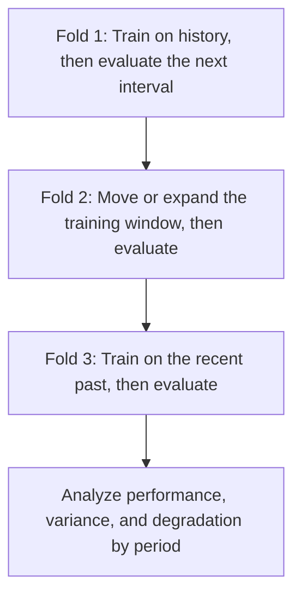



Validar un modelo de series temporales no se trata de comprobar qué tan bien explica datos pasados. Se trata de **reproducir cuán confiablemente habría respaldado la siguiente decisión utilizando solo la información conocida en ese momento**. Incluso cuando se conserva el orden temporal, la información futura que ingresa a través de la generación de características, la superposición de etiquetas o la selección de hiperparámetros puede fácilmente hacer que una prueba retrospectiva sea optimista.

Los principios de este artículo se aplican no solo a los pronósticos numéricos, como la predicción de la demanda, sino también a la clasificación, la puntuación de riesgos y la detección de anomalías que se invocan repetidamente a lo largo del tiempo.

## 1. El problema: el tiempo no es una columna más

### Las divisiones aleatorias no simulan una implementación futura

En una división aleatoria que supone datos independientes y distribuidos de manera idéntica, las observaciones pasadas y futuras se mezclan en conjuntos de entrenamiento y validación. Las siguientes dependencias en series temporales pueden inflar el rendimiento.

- Autocorrelación entre puntos cercanos en el tiempo.
- Mediciones repetidas de la misma entidad.
- Estacionalidad, tendencias y cambios en el régimen operativo.
- Agregación y normalización calculadas con información futura.
- Diferencias entre los datos finales revisados y los datos iniciales en tiempo real

La implementación predice el futuro a partir del pasado, por lo que la validación debe seguir la misma dirección.

### Una única resistencia es sólo una pregunta sobre un período

Mantener el intervalo final como conjunto de prueba es necesario pero insuficiente. Ese intervalo puede ser fácil o difícil y puede no representar estaciones, eventos o condiciones operativas. Si la selección del modelo se sobreajusta a un intervalo, ese intervalo también se convierte efectivamente en datos de entrenamiento.

### La deriva no es un fenómeno único

Deben distinguirse las causas de los cambios de rendimiento después de la implementación.

| Cambiar | Definición | Significado ilustrativo |
|---|---|---|
| deriva de covariables | Cambio en \(P(X)\) | Cambios en la frecuencia de entrada, el rango o los patrones de faltas |
| deriva previa | Cambio en \(P(Y)\) | Cambio en la tarifa base de un evento |
| deriva del concepto | Cambio en \(P(Y\mid X)\) | La misma entrada implica un resultado diferente |
| deriva política | Cambio de decisión o política de cobro | La forma en que se utiliza el modelo cambia la observación de la etiqueta |
| deriva del esquema | Cambio de formato, unidades o códigos | El significado de una columna o el tipo de datos cambian |

Un cambio en la distribución de entrada no necesariamente reduce el rendimiento, mientras que el rendimiento puede degradarse cuando \(P(Y\mid X)\) cambia incluso si la distribución de entrada permanece estable.

## 2. Modelo mental: un simulador que reproduce repetidamente momentos de producción

### Separe el origen del pronóstico, la ventana de observación y el horizonte

Sea el origen del pronóstico \(t\), la longitud de la ventana de observación sea \(W\) y el horizonte de pronóstico sea \(H\).

\[
X_t = g\left(z_{t-W+1},\ldots,z_t\right), \qquad
y_{t,H} = h\left(z_{t+1},\ldots,z_{t+H}\right)
\]

El modelo debe recibir solo datos que realmente estuvieran disponibles en el origen \(t\). Si los datos se cargan después de la hora del evento, también deben cumplir `available_at <= t`.

### Un backtest es una serie de implementaciones simuladas

La evaluación del origen continuo hace avanzar el origen y repite el entrenamiento y la evaluación.



Si el final del entrenamiento para el pliegue \(k\) es \(T_k\), la brecha es \(G\) y la duración de la evaluación es \(V\), entonces:

\[
\mathcal{D}_{train}^{(k)} = \{t \le T_k\}, \qquad
\mathcal{D}_{valid}^{(k)} = \{T_k+G < t \le T_k+G+V\}
\]

Un hueco no es una decoración que deba añadirse siempre. Es necesario en los siguientes casos.

- Las ventanas de entidades o etiquetas se superponen a lo largo del límite dividido.
- Debido a que las etiquetas maduran tarde, la verdad fundamental más reciente no se conoce al final del entrenamiento.
- El efecto de un mismo evento persiste durante mucho tiempo en intervalos adyacentes.
- La preparación, el reentrenamiento y la implementación de datos toman tiempo en producción.

### Trate el rendimiento a lo largo del tiempo como una distribución

Lo siguiente importa más que un único número de rendimiento promedio.

- Rendimiento por periodo \(m_1,\ldots,m_K\)
- Desempeño del peor período \(\min_k m_k\)
- Temporal tendencia y volatilidad
- Rendimiento condicional por temporada y dominio.
- Velocidad de recuperación del rendimiento después del reentrenamiento

La selección del modelo no se trata sólo de maximizar el promedio; también se trata de limitar el riesgo de caídas.

\[
\text{score}(M)=\overline{m}(M)-\lambda\,\mathrm{Std}(m(M))-\gamma\,\mathrm{TailRisk}(m(M))
\]

\(\lambda,\gamma\) son variables de diseño que expresan cuánto importan la seguridad y la estabilidad.

## 3. Flujo de trabajo práctico

### Paso 1. Poner la semántica de tiempo en el contrato de datos

Distinguir al menos cuatro veces.

| Hora | Significado |
|---|---|
| hora del evento | Cuando ocurrió el evento en el mundo real |
| tiempo de ingestión | Cuando llegó al sistema |
| tiempo disponible | Cuando la validación y el procesamiento lo pusieron a disposición del modelo |
| tiempo de etiqueta | Cuándo se observó o finalizó el resultado |

Para los datos corregidos, distinga el primer valor publicado del valor final revisado. Realizar una prueba retrospectiva de un modelo de predicción en tiempo real utilizando solo valores finales revisados ​​le brinda información más limpia que la que tendrá en la implementación.

Registre lo siguiente para cada serie de tiempo.

- Manejo de zona horaria y horario de verano
- Frecuencia de muestreo y reglas para intervalos irregulares.
- Manejo de eventos duplicados y fuera de orden.
- Distinción entre valores faltantes y ceros reales
- Historial de cambios de unidad, sensor y código.
- Tolerancia a los datos que llegan tarde

### Paso 2. Elija una división que coincida con la pregunta de implementación

#### Ventana desplegable

Continúe acumulando datos pasados.

\[
[1,T_1]\rightarrow V_1,\quad [1,T_2]\rightarrow V_2,\ldots
\]

Esto es adecuado cuando el historial a largo plazo sigue siendo válido y la cantidad de datos es importante.

#### Ventana corrediza

Utilice sólo una ventana reciente de longitud fija.

\[
[T_1-W,T_1]\rightarrow V_1,\quad [T_2-W,T_2]\rightarrow V_2,\ldots
\]

Esto puede resultar ventajoso cuando los antiguos regímenes difieren del presente y la deriva conceptual es rápida. A cambio, puede perder patrones raros y ciclos estacionales.

#### División bloqueada

Divida los datos en bloques fijos y contiguos de entrenamiento, validación y prueba. Esto es computacionalmente simple, pero la selección del modelo puede depender de un único período de validación.

#### Agrupado Temporal Dividido

Preservar tanto el orden temporal como los límites de las entidades. El diseño difiere dependiendo de si la tarea predice el “futuro de entidades existentes” o se generaliza al “futuro de entidades nuevas”.

### Paso 3. Hacer que la generación de funciones en un momento dado sea segura

El código de característica es una fuente importante de fugas de series temporales.

- Una media móvil centrada incluye valores futuros.
- La estandarización de todo el conjunto de datos utiliza medias y variaciones futuras.
- El relleno directo puede cruzar un límite dividido.
- La agregación futura del objetivo puede mezclarse con funciones.
- El remuestreo y la interpolación pueden referirse a futuras observaciones de ambos lados.

Diseñe la función característica para aceptar un límite explícito.

```python
def make_features(history, cutoff):
    visible = history[
        (history.event_time <= cutoff)
        & (history.available_time <= cutoff)
    ]

    return {
        "last_value": visible.value.iloc[-1],
        "mean_7": visible.tail(7).value.mean(),
        "age_seconds": (cutoff - visible.available_time.iloc[-1]).total_seconds(),
    }
```

Una buena prueba compara el generador de funciones en dos modos.

1. Un modo por lotes que calcula todo el pasado a la vez y prohíbe referencias futuras.
2. Un modo de repetición que avanza un paso de tiempo a la vez y calcula solo a partir de la información visible en ese momento.

Los dos resultados deben coincidir.

### Paso 4. Manejar la superposición y la madurez de las etiquetas

Cuando la etiqueta representa un evento dentro de los siguientes \(H\) períodos, las ventanas de etiquetas de las filas adyacentes se superponen. Cerca de un límite dividido, las etiquetas de capacitación y validación pueden compartir el mismo evento futuro.

Formas de responder:

- Incrementar el intervalo entre orígenes de evaluación.
- Colocar un embargo de al menos el horizonte de predicción entre splits.
- Agrupar por evento o episodio.
- Elija unidades de error estándar y de arranque que tengan en cuenta la correlación.

Además, si una etiqueta se finaliza después de \(L\) días, la última etiqueta disponible para volver a capacitarse en el momento \(T\) es aproximadamente anterior a \(T-L\). Reproduzca este retraso en el backtest.

### Paso 5. Primero, someta las líneas de base al mismo backtest

Las líneas de base de las series temporales son sólidas.

- Llevar adelante el último valor
- Valor del ciclo estacional anterior
- Media móvil o mediana
- Tendencia sencilla
- Puntuación basada en reglas existente
- Modelo lineal regularizado.

Si el modelo no puede superar consistentemente una línea de base ingenua estacional, revise los datos, el horizonte y la definición de pérdidas antes de agregar una arquitectura más compleja.

Al pronosticar múltiples horizontes, inspeccione el desempeño por separado por horizonte.

\[
\mathrm{MAE}_h = \frac{1}{N_h}\sum_i |y_{i,t+h}-\hat y_{i,t+h}|
\]

Observar únicamente el promedio general puede permitir que numerosas muestras cercanas al horizonte oculten fallas en horizontes más largos.

### Paso 6. Separar la selección del modelo de la evaluación final

Estructura recomendada:

1. Compare modelos y características candidatos en varios pliegues históricos.
2. Seleccione utilizando la media, la varianza, el peor intervalo y el costo.
3. Congele la regla de selección y los hiperparámetros.
4. Evalúe una vez en el intervalo de prueba sellado más reciente.
5. Utilice una política separada para decidir si volver a capacitarse con los datos durante el intervalo de prueba antes de la implementación.

Ajustar los hiperparámetros al rendimiento de validación de cada pliegue y luego informar las mismas puntuaciones de pliegue es optimista. Si es necesario, utilice una prueba retrospectiva anidada que preserve el orden temporal.

### Paso 7. Descomponer el desempeño por período y condición

Dependiendo del problema de predicción, examine sectores como el siguiente.

- Horizonte de previsión
- Hora del día, día de la semana y temporada.
- Duración del historial de observación.
- Nivel de faltantes y retrasos en las entradas
- Si la entidad es nueva o existente.
- Magnitud objetivo o gravedad del evento
- Estado operativo conocido

Junto con las métricas promedio, inspeccione la distribución del error, el sesgo, los cuantiles y el peor intervalo. Si se producen intervalos de predicción, valide también la cobertura empírica.

\[
\widehat{\mathrm{Coverage}}_{1-\alpha}
=\frac{1}{n}\sum_i \mathbf{1}\left(y_i\in[L_i,U_i]\right)
\]

Incluso si la cobertura alcanza el objetivo, los intervalos son inútiles si son excesivamente amplios. Inspeccione el ancho medio y la cobertura condicional juntos.

### Paso 8. Monitoreo de producción de diseño por retraso de etiqueta

#### Métricas operativas disponibles inmediatamente

- Esquema, unidades, rangos y conjuntos de categorías.
- Retraso en la llegada de datos y frescura.
- Tasas de eventos faltantes, duplicados y desordenados
- Latencia de inferencia, tasa de error y tasa de retroceso
- Distribución de predicciones, puntuaciones e incertidumbre.
- Tasas de alerta y acción.

#### Señales de deriva sin etiquetas

- Continuo: desplazamiento de cuantiles, PSI y estadísticas basadas en distancia
- Categórico: cambios en la frecuencia y proporción de nuevas categorías.
- Multivariado: utilice un clasificador de dominio para probar si se pueden distinguir los datos pasados y actuales.
- Incrustaciones: cambios en la distancia, densidad y estructura de vecindad.

No genere una alerta basándose únicamente en la significación estadística. Con muestras grandes, las diferencias triviales son significativas. Agregue criterios de importancia práctica y duración.

#### Métricas de calidad después de que las etiquetas maduran

- Error de predicción o métricas de clasificación.
- Cobertura de intervalos de calibración y predicción.
- Costo y rendimiento de la política
- Brechas de rendimiento por grupo y hora del día.
- Comparación antes y después del reciclaje.

### Paso 9. Conectar alertas con respuestas

El seguimiento no es el trabajo de hacer gráficos; es el trabajo de automatizar y documentar los procedimientos de respuesta.

| Señal | Diagnóstico inicial | Posible respuesta |
|---|---|---|
| Violación del esquema | Cambio de productor o error de análisis | Bloquear entrada, utilizar respaldo, restaurar contrato |
| Estancamiento | Retraso en la recogida o agregación | Marcar características obsoletas y ocultar predicciones |
| Cambio repentino en la distribución de puntuaciones | Deriva de entrada o cambio de código | Comparación de sombras, investigar sectores causales |
| Degradación de la calibración | Cambio en la tasa base o relación | Recalibrar, revisar umbrales |
| Degradación del rendimiento | Deriva de concepto o cambio de etiqueta | Volver a entrenar, revisar funciones, retroceder |

El reciclaje no debe ser la respuesta predeterminada a todas las alertas. Puede ocultar una falla en la canalización de datos o una definición de etiqueta modificada detrás de un nuevo modelo.

## 4. Lista de verificación de evaluación y validación

### Tiempo y datos

- [ ] Se distinguen tiempos de evento, ingesta, disponibilidad y etiqueta.
- [] Existen reglas para zonas horarias, duplicados, eventos fuera de orden y llegadas tardías.
- [ ] Se han comprobado las diferencias entre los valores iniciales en tiempo real y las revisiones posteriores.
- [] Las funciones utilizan únicamente información disponible en el origen del pronóstico.
- [] Las funciones por lotes coinciden con las funciones de reproducción secuencial.

### Divisiones y backtesting

- [] La división simula el orden real de entrenamiento y predicción en la implementación.
- [ ] Una brecha/embargo explica la superposición en las ventanas de observación y etiqueta.
- [ ] Las dependencias que involucran el mismo evento o entidad no cruzan fronteras.
- [ ] La distribución del rendimiento se ha evaluado en varios orígenes rodantes.
- [ ] Los pliegues de selección de modelo y la prueba final son separados.
- [ ] El retraso en el vencimiento de la etiqueta se reproduce en el backtest.

### Evaluación

- [ ] El modelo se compara con líneas de base estadísticas ingenuas, estacionales y simples.
- [ ] Se inspecciona la varianza entre períodos y el peor intervalo, no solo el promedio.
- [ ] El rendimiento está separado por horizonte.
- [ ] Se evalúan los segmentos de tiempo y condición operativamente importantes.
- [] Se verifican la cobertura y el ancho del intervalo de predicción.
- [ ] La incertidumbre se estima con unidades que preservan la estructura de correlación.

### Operaciones

- [ ] Se distinguen métricas pre-etiquetado y post-etiquetado.
- [] Las alertas de deriva incluyen criterios de magnitud, duración e importancia comercial.
- [ ] Cada alerta tiene un propietario, un procedimiento de diagnóstico, un respaldo y una reversión definidos.
- [ ] Las condiciones para la recalibración, los cambios de umbral y el reentrenamiento son independientes.
- [ ] Los cambios de modelo, datos y políticas están marcados en gráficos de rendimiento.

## 5. Limitaciones y advertencias

En primer lugar, ni siquiera una meticulosa repetición del pasado puede evaluar un cambio estructural sin precedentes. Se necesitan escenarios de estrés, conocimiento del dominio y alternativas conservadoras.

En segundo lugar, crear muchos pliegues de backtest no produce automáticamente más evidencia independiente. Los intervalos superpuestos de entrenamiento y evaluación están fuertemente correlacionados, por lo que no confíe excesivamente en el error estándar de un promedio simple.

En tercer lugar, las estadísticas de la deriva no revelan la causa. El linaje y la historia de cambios son necesarios para distinguir los problemas de calidad de los datos, los cambios demográficos, los cambios de políticas y la deriva de conceptos.

En cuarto lugar, el reentrenamiento frecuente mejora la experiencia reciente, pero puede olvidar patrones raros y amplificar la variabilidad operativa. Seleccione ventanas expandibles o deslizantes y la frecuencia de reentrenamiento juntas mediante pruebas retrospectivas.

Finalmente, las acciones tomadas utilizando un modelo alteran los datos y etiquetas futuros. Un sistema de series de tiempo no es un predictor pasivo sino una política que interactúa con su entorno. El seguimiento a largo plazo debe incluir esta retroalimentación.
