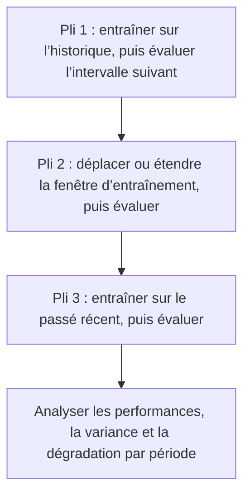



Valider un modèle de série temporelle ne consiste pas à vérifier dans quelle mesure il explique les données passées. Il s’agit **de rejouer la fiabilité avec laquelle il aurait aidé à prendre la décision suivante en utilisant uniquement les informations connues à cet instant**. Même lorsque l’ordre temporel est préservé, des informations futures introduites par la génération des variables, le chevauchement des étiquettes ou la sélection des hyperparamètres peuvent facilement rendre un backtest trop optimiste.

Les principes de cet article s’appliquent non seulement aux prévisions numériques telles que la demande, mais aussi à la classification, à l’évaluation des risques et à la détection d’anomalies invoquées de manière répétée dans le temps.

## 1. Le problème : le temps n’est pas une colonne comme les autres

### Les découpages aléatoires ne simulent pas un futur déploiement

Dans un découpage aléatoire qui suppose des données indépendantes et identiquement distribuées, les observations passées et futures sont mélangées entre les ensembles d’entraînement et de validation. Les dépendances suivantes présentes dans les séries temporelles peuvent gonfler les performances.

- Autocorrélation entre instants proches
- Mesures répétées de la même entité
- Saisonnalité, tendances et changements de régime de fonctionnement
- Agrégation et normalisation calculées à l’aide d’informations futures
- Différences entre les données finales révisées et les données initiales en temps réel

Le déploiement prédit le futur à partir du passé ; la validation doit donc suivre la même direction.

### Un seul ensemble réservé ne pose qu’une question sur une seule période

Conserver le dernier intervalle comme ensemble de test est nécessaire, mais insuffisant. Cet intervalle peut être fortuitement facile ou difficile et ne pas représenter les saisons, les événements ou les conditions de fonctionnement. Si la sélection du modèle est surajustée à un seul intervalle, celui-ci devient de fait lui aussi une donnée d’entraînement.

### La dérive n’est pas un phénomène unique

Il faut distinguer les causes des changements de performances après le déploiement.

| Changement | Définition | Signification illustrative |
|---|---|---|
| dérive des covariables | Changement de \(P(X)\) | Changements dans la fréquence, l’étendue ou les motifs de valeurs manquantes des entrées |
| dérive de la loi a priori | Changement de \(P(Y)\) | Changement du taux de base d’un événement |
| dérive de concept | Changement de \(P(Y\mid X)\) | La même entrée implique un résultat différent |
| dérive de politique | Changement dans la politique de décision ou de collecte | La manière dont le modèle est utilisé modifie l’observation des étiquettes |
| dérive de schéma | Changement de format, d’unités ou de codes | La signification ou le type d’une colonne change |

Un changement dans la distribution des entrées ne réduit pas nécessairement les performances, tandis que celles-ci peuvent se dégrader lorsque \(P(Y\mid X)\) change même si la distribution des entrées reste stable.

## 2. Modèle mental : un simulateur qui rejoue sans cesse les instants de production

### Séparer l’origine de la prévision, la fenêtre d’observation et l’horizon

Notons l’origine de la prévision \(t\), la longueur de la fenêtre d’observation \(W\) et l’horizon de prévision \(H\).

\[
X_t = g\left(z_{t-W+1},\ldots,z_t\right), \qquad
y_{t,H} = h\left(z_{t+1},\ldots,z_{t+H}\right)
\]

Le modèle ne doit recevoir que les données réellement disponibles à l’origine \(t\). Si des données sont chargées après leur heure d’événement, elles doivent aussi satisfaire `available_at <= t`.

### Un backtest est une suite de déploiements simulés

L’évaluation à origine glissante avance l’origine et répète l’entraînement et l’évaluation.



Si la fin de l’entraînement du pli \(k\) est \(T_k\), l’intervalle de séparation \(G\) et la longueur d’évaluation \(V\), alors :

\[
\mathcal{D}_{train}^{(k)} = \{t \le T_k\}, \qquad
\mathcal{D}_{valid}^{(k)} = \{T_k+G < t \le T_k+G+V\}
\]

Un intervalle de séparation n’est pas un ornement à ajouter systématiquement. Il est nécessaire dans les cas suivants.

- Les fenêtres de variables ou d’étiquettes se chevauchent de part et d’autre de la frontière du découpage.
- Comme les étiquettes arrivent à maturité tardivement, la vérité terrain la plus récente n’est pas connue à la fin de l’entraînement.
- L’effet d’un même événement persiste longtemps dans les intervalles adjacents.
- La préparation des données, le réentraînement et le déploiement prennent du temps en production.

### Traiter les performances dans le temps comme une distribution

Les éléments suivants comptent davantage qu’une seule performance moyenne.

- Performance par période \(m_1,\ldots,m_K\)
- Performance de la pire période \(\min_k m_k\)
- Tendance temporelle et volatilité
- Performance conditionnelle selon la saison et le domaine
- Vitesse de récupération des performances après réentraînement

La sélection du modèle ne consiste pas seulement à maximiser la moyenne ; elle doit aussi limiter le risque de baisse.

\[
\text{score}(M)=\overline{m}(M)-\lambda\,\mathrm{Std}(m(M))-\gamma\,\mathrm{TailRisk}(m(M))
\]

\(\lambda,\gamma\) sont des variables de conception qui expriment l’importance accordée à la sécurité et à la stabilité.

## 3. Workflow pratique

### Étape 1. Intégrer la sémantique du temps au contrat de données

Distinguez au moins quatre temps.

| Temps | Signification |
|---|---|
| temps de l’événement | Moment où l’événement s’est produit dans le monde réel |
| temps d’ingestion | Moment où il est arrivé dans le système |
| temps de disponibilité | Moment où la validation et le traitement l’ont rendu disponible au modèle |
| temps de l’étiquette | Moment où le résultat a été observé ou finalisé |

Pour les données corrigées, distinguez la première valeur publiée de la valeur finale révisée. Effectuer le backtest d’un modèle de prédiction en temps réel uniquement avec des valeurs finales révisées lui fournit des informations plus propres que celles dont il disposera lors du déploiement.

Consignez les éléments suivants pour chaque série temporelle.

- Fuseau horaire et gestion de l’heure d’été
- Fréquence d’échantillonnage et règles relatives aux intervalles irréguliers
- Traitement des événements dupliqués et désordonnés
- Distinction entre valeurs manquantes et véritables zéros
- Historique des changements d’unités, de capteurs et de codes
- Tolérance envers les données arrivant tardivement

### Étape 2. Choisir un découpage adapté à la question du déploiement

#### Fenêtre croissante

Continuer à accumuler les données passées.

\[
[1,T_1]\rightarrow V_1,\quad [1,T_2]\rightarrow V_2,\ldots
\]

Cette méthode convient lorsque l’historique à long terme reste valide et que la quantité de données compte.

#### Fenêtre glissante

Utiliser uniquement une fenêtre récente de longueur fixe.

\[
[T_1-W,T_1]\rightarrow V_1,\quad [T_2-W,T_2]\rightarrow V_2,\ldots
\]

Cette méthode peut être avantageuse lorsque les anciens régimes diffèrent du présent et que la dérive de concept est rapide. En contrepartie, elle peut perdre des motifs rares et des cycles saisonniers.

#### Découpage par blocs

Diviser les données en blocs contigus et fixes d’entraînement, de validation et de test. Cette méthode est simple sur le plan du calcul, mais la sélection du modèle peut devenir dépendante d’une seule période de validation.

#### Découpage temporel groupé

Préserver à la fois l’ordre temporel et les frontières des entités. La conception diffère selon que la tâche prédit le « futur d’entités existantes » ou généralise au « futur de nouvelles entités ».

### Étape 3. Garantir la sûreté temporelle de la génération des variables

Le code de création des variables est une source majeure de fuite temporelle.

- Une moyenne mobile centrée inclut des valeurs futures.
- La standardisation de l’ensemble du jeu de données utilise des moyennes et variances futures.
- La propagation vers l’avant peut traverser une frontière de découpage.
- Une future agrégation de la cible peut être mélangée aux variables.
- Le rééchantillonnage et l’interpolation peuvent faire référence à des observations futures des deux côtés.

Concevez la fonction de création des variables pour qu’elle accepte une date limite explicite.

```python
def make_features(history, cutoff):
    visible = history[
        (history.event_time <= cutoff)
        & (history.available_time <= cutoff)
    ]

    return {
        "last_value": visible.value.iloc[-1],
        "mean_7": visible.tail(7).value.mean(),
        "age_seconds": (cutoff - visible.available_time.iloc[-1]).total_seconds(),
    }
```

Un bon test compare le générateur de variables dans deux modes.

1. Un mode par lots qui calcule tout le passé en une fois tout en interdisant les références futures
2. Un mode de relecture qui avance d’un pas de temps à la fois et calcule uniquement à partir des informations alors visibles

Les deux résultats doivent correspondre.

### Étape 4. Gérer le chevauchement et la maturité des étiquettes

Lorsque l’étiquette représente un événement dans les \(H\) périodes suivantes, les fenêtres d’étiquettes des lignes adjacentes se chevauchent. Près d’une frontière de découpage, les étiquettes d’entraînement et de validation peuvent partager le même événement futur.

Réponses possibles :

- Augmenter l’intervalle entre les origines d’évaluation.
- Placer entre les découpages un embargo au moins égal à l’horizon de prédiction.
- Regrouper par événement ou épisode.
- Choisir des unités d’erreur standard et de bootstrap qui tiennent compte de la corrélation.

En outre, si une étiquette est finalisée après \(L\) jours, la dernière étiquette disponible pour un réentraînement au temps \(T\) date approximativement d’avant \(T-L\). Reproduisez ce délai dans le backtest.

### Étape 5. Soumettre d’abord les références au même backtest

Les références des séries temporelles sont solides.

- Reporter la dernière valeur
- Valeur du cycle saisonnier précédent
- Moyenne ou médiane mobile
- Tendance simple
- Score existant fondé sur des règles
- Modèle linéaire régularisé

Si le modèle ne peut pas surpasser régulièrement une référence saisonnière naïve, réexaminez les données, l’horizon et la définition de la perte avant d’ajouter une architecture plus complexe.

Lors de prévisions à plusieurs horizons, examinez séparément les performances de chaque horizon.

\[
\mathrm{MAE}_h = \frac{1}{N_h}\sum_i |y_{i,t+h}-\hat y_{i,t+h}|
\]

Ne regarder que la moyenne globale peut permettre aux nombreux échantillons à court horizon de masquer les échecs aux horizons plus lointains.

### Étape 6. Séparer la sélection du modèle de l’évaluation finale

Structure recommandée :

1. Comparer les modèles et variables candidats sur plusieurs plis historiques.
2. Effectuer la sélection selon la moyenne des plis, la variance, le pire intervalle et le coût.
3. Figer la règle de sélection et les hyperparamètres.
4. Évaluer une seule fois sur l’intervalle de test scellé le plus récent.
5. Utiliser une politique distincte pour décider d’un éventuel réentraînement sur les données allant jusqu’à l’intervalle de test avant le déploiement.

Ajuster les hyperparamètres aux performances de validation de chaque pli puis publier les scores de ces mêmes plis est optimiste. Si nécessaire, utilisez un backtest imbriqué qui préserve l’ordre temporel.

### Étape 7. Décomposer les performances par période et condition

Selon le problème de prédiction, examinez des tranches telles que les suivantes.

- Horizon de prévision
- Heure de la journée, jour de la semaine et saison
- Longueur de l’historique d’observation
- Niveau de valeurs manquantes et retard des entrées
- Entité nouvelle ou existante
- Amplitude de la cible ou gravité de l’événement
- État de fonctionnement connu

Avec les métriques moyennes, examinez la distribution des erreurs, le biais, les quantiles et le pire intervalle. Si des intervalles de prédiction sont produits, validez également leur couverture empirique.

\[
\widehat{\mathrm{Coverage}}_{1-\alpha}
=\frac{1}{n}\sum_i \mathbf{1}\left(y_i\in[L_i,U_i]\right)
\]

Même si la couverture atteint la cible, les intervalles sont inutiles s’ils sont excessivement larges. Examinez ensemble la largeur moyenne et la couverture conditionnelle.

### Étape 8. Concevoir la supervision de production selon le retard des étiquettes

#### Métriques opérationnelles disponibles immédiatement

- Schéma, unités, plages et ensembles de catégories
- Retard d’arrivée et fraîcheur des données
- Taux d’événements manquants, dupliqués et désordonnés
- Latence d’inférence, taux d’erreur et taux de repli
- Distribution des prédictions, scores et incertitudes
- Taux d’alertes et d’actions

#### Signaux de dérive sans étiquettes

- Variables continues : déplacement des quantiles, PSI et statistiques fondées sur les distances
- Variables catégorielles : changements de fréquence et de proportion des nouvelles catégories
- Analyse multivariée : utiliser un classifieur de domaine pour vérifier si les données passées et actuelles peuvent être distinguées
- Plongements : changements de distance, de densité et de structure du voisinage

Ne déclenchez pas d’alerte uniquement sur la significativité statistique. Avec de grands échantillons, des différences insignifiantes sont significatives. Ajoutez des critères d’importance pratique et de durée.

#### Métriques de qualité après la maturité des étiquettes

- Erreur de prédiction ou métriques de classification
- Calibrage et couverture des intervalles de prédiction
- Coût de la politique et débit
- Écarts de performance par groupe et heure de la journée
- Comparaison avant et après réentraînement

### Étape 9. Relier les alertes aux réponses

La supervision n’est pas le travail qui consiste à créer des graphiques ; elle consiste à automatiser et à documenter les procédures de réponse.

| Signal | Diagnostic initial | Réponse possible |
|---|---|---|
| Violation du schéma | Changement du producteur ou erreur d’analyse | Bloquer l’entrée, utiliser le repli, restaurer le contrat |
| Données périmées | Retard de collecte ou d’agrégation | Marquer les variables périmées, suspendre les prédictions |
| Déplacement soudain de la distribution des scores | Dérive des entrées ou modification du code | Comparaison fantôme, enquête sur les tranches causales |
| Dégradation du calibrage | Changement du taux de base ou de la relation | Recalibrer, réexaminer les seuils |
| Dégradation des performances | Dérive de concept ou changement d’étiquette | Réentraîner, réviser les variables, revenir en arrière |

Le réentraînement ne doit pas être la réponse par défaut à chaque alerte. Il peut dissimuler une défaillance du pipeline de données ou une modification de la définition des étiquettes derrière un nouveau modèle.

## 4. Liste de contrôle de l’évaluation et de la validation

### Temps et données

- [ ] Les temps d’événement, d’ingestion, de disponibilité et d’étiquette sont distingués.
- [ ] Il existe des règles pour les fuseaux horaires, les doublons, les événements désordonnés et les arrivées tardives.
- [ ] Les différences entre les valeurs initiales en temps réel et les révisions ultérieures ont été vérifiées.
- [ ] Les variables n’utilisent que les informations disponibles à l’origine de la prévision.
- [ ] Les variables calculées par lots correspondent à celles obtenues par relecture séquentielle.

### Découpages et backtests

- [ ] Le découpage simule l’ordre réel d’entraînement et de prédiction lors du déploiement.
- [ ] Un intervalle de séparation ou embargo tient compte du chevauchement des fenêtres d’observation et d’étiquettes.
- [ ] Les dépendances liées au même événement ou à la même entité ne franchissent pas les frontières.
- [ ] La distribution des performances a été évaluée sur plusieurs origines glissantes.
- [ ] Les plis de sélection du modèle et le test final sont distincts.
- [ ] Le délai de maturité des étiquettes est reproduit dans le backtest.

### Évaluation

- [ ] Le modèle est comparé à des références naïves, saisonnières et statistiques simples.
- [ ] La variance entre périodes et le pire intervalle sont examinés, pas seulement la moyenne.
- [ ] Les performances sont séparées par horizon.
- [ ] Les tranches temporelles et conditionnelles importantes pour l’exploitation sont évaluées.
- [ ] La couverture et la largeur des intervalles de prédiction sont toutes deux vérifiées.
- [ ] L’incertitude est estimée avec des unités qui préservent la structure de corrélation.

### Exploitation

- [ ] Les métriques antérieures et postérieures à la disponibilité des étiquettes sont distinguées.
- [ ] Les alertes de dérive comportent des critères d’amplitude, de durée et d’importance métier.
- [ ] Chaque alerte a un responsable, une procédure de diagnostic, un mécanisme de repli et un retour arrière définis.
- [ ] Les conditions de recalibrage, de modification des seuils et de réentraînement sont distinctes.
- [ ] Les modifications du modèle, des données et de la politique sont indiquées sur les graphiques de performance.

## 5. Limites et mises en garde

Premièrement, même une relecture méticuleuse du passé ne peut évaluer un changement structurel sans précédent. Des scénarios de contrainte, la connaissance du domaine et des mécanismes de repli prudents sont nécessaires.

Deuxièmement, créer de nombreux plis de backtest ne produit pas automatiquement davantage de preuves indépendantes. Les intervalles d’entraînement et d’évaluation qui se chevauchent sont fortement corrélés ; n’accordez donc pas une confiance excessive à l’erreur standard d’une simple moyenne.

Troisièmement, les statistiques de dérive n’en révèlent pas la cause. La traçabilité et l’historique des changements sont nécessaires pour distinguer les problèmes de qualité des données, les changements de population, les changements de politique et la dérive de concept.

Quatrièmement, des réentraînements fréquents améliorent l’actualité, mais peuvent faire oublier les motifs rares et amplifier la variabilité opérationnelle. Sélectionnez conjointement, au moyen de backtests, une fenêtre croissante ou glissante et la fréquence de réentraînement.

Enfin, les actions prises à l’aide d’un modèle modifient les données et les étiquettes futures. Un système de séries temporelles n’est pas un prédicteur passif, mais une politique qui interagit avec son environnement. La supervision à long terme doit inclure cette boucle de rétroaction.
