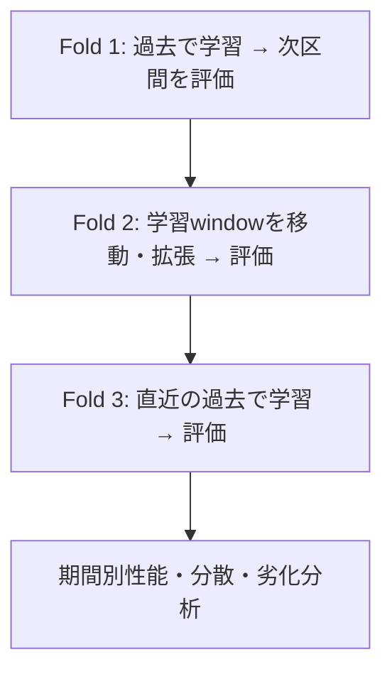



時系列モデルの検証は、過去データをうまく説明できるか確認する作業ではない。**その時点までに知られていた情報だけで、次の時点の意思決定をどれほど安定して支援できたかを再現する作業**である。時間順序を保っても、特徴量生成、ラベルの重複、ハイパーパラメータ選択へ未来情報が入れば、backtestは容易に楽観的になる。

本稿の原則は、需要予測のような数値予測だけでなく、時間とともに繰り返し呼び出される分類・リスクスコア・異常検知にも適用できる。

## 1. 問題：時間は単なる1列ではない

### ランダム分割は将来のデプロイを模倣しない

独立同分布を仮定するランダム分割では、過去と未来の観測値がtrainとvalidationへ混在する。時系列には次の依存性があるため、性能が水増しされ得る。

- 近接時点の自己相関
- 同一個体で反復測定された値
- 季節性・trend・運用体系の変化
- 未来情報から計算した集計・正規化
- 修正済み最終データとリアルタイム初期データの差

デプロイでは過去から未来を予測するため、検証もその方向に従わなければならない。

### 1回のholdoutは特定期間に対する1つの問いにすぎない

最後の1区間をtestにすることは必要だが十分ではない。その区間が偶然簡単または難しい場合があり、季節・event・運用条件を代表しない可能性もある。モデル選択を1区間へ過度に合わせると、その区間も事実上のtraining dataになる。

### driftは一つの現象ではない

デプロイ後の性能変化の原因を区別する必要がある。

| 変化 | 定義 | 例としての意味 |
|---|---|---|
| covariate drift | \(P(X)\)の変化 | 入力頻度・範囲・欠損patternの変化 |
| prior drift | \(P(Y)\)の変化 | eventの基本発生率の変化 |
| concept drift | \(P(Y\mid X)\)の変化 | 同じ入力が異なる結果を意味する |
| policy drift | 意思決定・収集方針の変化 | モデル利用法がラベル観測を変える |
| schema drift | 形式・単位・codeの変化 | 列の意味やdata typeが変わる |

入力分布が変わっても必ず性能が低下するわけではなく、入力分布が安定していても\(P(Y\mid X)\)が変われば性能は低下し得る。

## 2. Mental model：運用時点を繰り返し再生するsimulator

### 予測原点、観測window、horizonを分離する

予測原点を\(t\)、観測window長を\(W\)、予測horizonを\(H\)とする。

\[
X_t = g\left(z_{t-W+1},\ldots,z_t\right), \qquad
y_{t,H} = h\left(z_{t+1},\ldots,z_{t+H}\right)
\]

モデルは原点\(t\)で実際に利用可能だったデータだけを受け取る必要がある。データがevent timeより遅れてロードされるなら、`available_at <= t`も満たさなければならない。

### backtestは複数の仮想デプロイである

Rolling-origin evaluationは原点を前進させ、学習と評価を繰り返す。



fold \(k\)の学習終了を\(T_k\)、gapを\(G\)、評価長を\(V\)とすると、

\[
\mathcal{D}_{train}^{(k)} = \{t \le T_k\}, \qquad
\mathcal{D}_{valid}^{(k)} = \{T_k+G < t \le T_k+G+V\}
\]

gapは無条件に入れる装飾ではない。次の場合に必要である。

- 特徴量またはラベルwindowがsplit境界を越えて重複する。
- ラベル確定の遅延により、学習終了時点では直近の正解が分からない。
- 同じeventの影響が隣接区間へ長く残る。
- 運用上、データ整理・再学習・デプロイに時間がかかる。

### 時間に沿った性能を一つの分布として見る

平均性能一つより次が重要である。

- 期間別性能\(m_1,\ldots,m_K\)
- 最悪期間の性能 \(\min_k m_k\)
- 時間trendと変動性
- 季節・ドメイン別の条件付き性能
- 再学習後の性能回復速度

モデル選択は平均を最大化するだけでなく、downside riskを制限する問題である。

\[
\text{score}(M)=\overline{m}(M)-\lambda\,\mathrm{Std}(m(M))-\gamma\,\mathrm{TailRisk}(m(M))
\]

\(\lambda,\gamma\)は安全性と安定性をどの程度重視するかを示す設計変数である。

## 3. 実践workflow

### Step 1. 時間の意味をデータ契約へ入れる

最低4種類の時刻を区別する。

| 時刻 | 意味 |
|---|---|
| event time | 現実でeventが発生した時刻 |
| ingestion time | システムへ到着した時刻 |
| available time | 検証・加工を経てモデルが使用可能になった時刻 |
| label time | 結果が観測または最終確定した時刻 |

訂正されるデータなら、初回公開値と最終修正値も区別する。リアルタイム予測モデルを最終修正値だけでbacktestすると、実際のデプロイよりきれいな情報を使ってしまう。

各時系列へ次を記録する。

- 標準time zoneとdaylight saving timeの処理
- sampling周期と不規則intervalの規則
- 重複・逆順eventの処理
- 欠損と実際の0の区別
- 単位・sensor・codeの変更履歴
- late-arriving dataの許容限界

### Step 2. デプロイ上の問いに合うsplitを選ぶ

#### Expanding window

過去データを継続的に蓄積する。

\[
[1,T_1]\rightarrow V_1,\quad [1,T_2]\rightarrow V_2,\ldots
\]

長期履歴が依然有効で、データ量が重要な場合に適する。

#### Sliding window

直近の固定長だけを使う。

\[
[T_1-W,T_1]\rightarrow V_1,\quad [T_2-W,T_2]\rightarrow V_2,\ldots
\]

古い体系が現在と異なり、concept driftが速い場合に有利なことがある。一方で希少patternや季節周期を失い得る。

#### Blocked split

固定された連続blockへtrain・validation・testを分ける。計算は単純だが、モデル選択が一つのvalidation期間へ依存し得る。

#### Grouped temporal split

時間順序と個体境界を同時に守る。「既存個体の未来」を予測するのか、「新規個体の未来」へ一般化するのかで設計が異なる。

### Step 3. 特徴量生成器を時点安全にする

時系列漏洩の主因は特徴量codeである。

- centered moving averageは未来値を含む。
- 全データの標準化は未来の平均・分散を使う。
- forward fillがsplitを越える可能性がある。
- 目的変数の未来集計が特徴量へ混ざる可能性がある。
- resampling・interpolationが未来の観測値を両側から参照し得る。

特徴量関数はcutoffを明示的に受け取るよう設計する。

```python
def make_features(history, cutoff):
    visible = history[
        (history.event_time <= cutoff)
        & (history.available_time <= cutoff)
    ]

    return {
        "last_value": visible.value.iloc[-1],
        "mean_7": visible.tail(7).value.mean(),
        "age_seconds": (cutoff - visible.available_time.iloc[-1]).total_seconds(),
    }
```

良いtestは、特徴量生成器を次の2方式で比較する。

1. 過去全体を一度に計算しつつ、未来参照を禁止するbatch方式
2. 時間を1stepずつ進め、当時見えていた情報だけで計算するreplay方式

両者の結果は一致しなければならない。

### Step 4. ラベル重複とmaturityを処理する

未来\(H\)期間内のeventをラベルにすると、隣接行のラベルwindowが重なる。split境界付近では学習ラベルとvalidationラベルが同じ未来eventを共有し得る。

対処方法：

- 評価原点間の間隔を広げる。
- split間にprediction horizon以上のembargoを置く。
- event・episode単位でgroup化する。
- 相関を反映して標準誤差とbootstrap単位を決める。

また、ラベルが\(L\)日後に確定するなら、時点\(T\)で再学習に使える最新ラベルはおおよそ\(T-L\)以前である。backtestでもこの遅延をそのまま再現する。

### Step 5. baselineから同じbacktestへ入れる

時系列baselineは強力である。

- 直前値を維持
- 季節周期前の値
- 移動平均・中央値
- 単純trend
- 既存rule-based score
- 正規化した線形モデル

モデルがseasonal naiveを安定して上回らないなら、複雑な構造よりdata・horizon・lossの定義を再点検すべきである。

複数horizonを予測するときは、horizon別性能を分けて見る。

\[
\mathrm{MAE}_h = \frac{1}{N_h}\sum_i |y_{i,t+h}-\hat y_{i,t+h}|
\]

全体平均だけでは、近いhorizonの多くの標本が遠いhorizonの失敗を隠し得る。

### Step 6. モデル選択と最終評価を分離する

推奨構造：

1. 複数の過去foldで候補モデルと特徴量を比較する。
2. foldの平均・分散・最悪区間・コストを基準に選ぶ。
3. 選択規則とハイパーパラメータを固定する。
4. 最新の封印済みtest区間で一度だけ評価する。
5. デプロイ前にtestまで含めて再学習するかは、別の方針として決める。

ハイパーパラメータを各foldのvalidation性能へ合わせ、同じfoldのscoreを報告すると楽観的になる。必要なら時間順序を守るnested backtestを使う。

### Step 7. 性能を期間・条件別に分解する

予測問題に応じて、次のsliceを検討する。

- 予測horizon
- 時間帯・曜日・季節
- 観測履歴の長さ
- 入力欠損・遅延の水準
- 個体が新規か既存か
- 目標値の大きさまたはevent severity
- 既知の運用状態

平均指標とともに誤差分布、bias、quantile、最悪区間を見る。予測区間を出力するならempirical coverageも検証する。

\[
\widehat{\mathrm{Coverage}}_{1-\alpha}
=\frac{1}{n}\sum_i \mathbf{1}\left(y_i\in[L_i,U_i]\right)
\]

coverageが目標と同じでも、区間が広すぎれば役に立たない。平均幅とconditional coverageを併せて見る。

### Step 8. デプロイmonitoringを遅延水準別に設計する

#### 即時確認できる運用指標

- schema、単位、範囲、category集合
- データ到着遅延とfreshness
- 欠損率・重複率・逆順event
- inference latency、エラー率、fallback率
- 予測値・score・不確実性分布
- alert・action率

#### ラベルなしで見るdriftシグナル

- 連続型：quantile shift、PSI、距離ベース統計
- カテゴリ型：頻度変化、新category比率
- 多変量：domain classifierで過去・現在の識別可能性を評価
- embedding：距離・密度・近傍構造の変化

統計的有意性だけでアラートを発しない。標本が大きければ些細な差も有意になる。実質的重要度の基準と持続時間条件を併用する。

#### ラベル成熟後に確認する品質指標

- 予測誤差または分類指標
- calibrationと予測区間coverage
- policy costとthroughput
- 集団・時間帯別の性能差
- 再学習前後の比較

### Step 9. アラートから対応へ接続する

monitoringはグラフを作る作業ではなく、対応手順を自動化・文書化する作業である。

| シグナル | 一次診断 | 可能な対応 |
|---|---|---|
| schema違反 | producer変更・parsingエラー | 入力遮断、fallback、契約復旧 |
| freshness悪化 | 収集・集計遅延 | 古い特徴量を表示、予測保留 |
| score分布の急変 | 入力drift・code変更 | shadow比較、原因sliceの調査 |
| calibration劣化 | base rate・関係の変化 | 再calibration、閾値再検討 |
| 性能劣化 | concept drift・ラベル変化 | 再学習、特徴量修正、rollback |

すべてのアラートへの基本回答を再学習にしてはならない。data pipeline障害やラベル定義変更を新モデルで覆い隠す可能性があるためである。

## 4. 評価・検証checklist

### 時間とデータ

- [ ] event、ingestion、available、label timeを区別した。
- [ ] 標準time zone、重複、逆順、late arrivalの規則がある。
- [ ] リアルタイム初期値と事後修正値の差を確認した。
- [ ] 特徴量は原点当時に利用可能だった情報だけを使う。
- [ ] batch特徴量と逐次replay特徴量が一致する。

### 分割とbacktest

- [ ] splitが実際のデプロイにおける学習・予測順序を模倣する。
- [ ] 観測window・ラベルwindowの重複に必要なgap/embargoがある。
- [ ] 同じevent・個体の依存性が境界を越えない。
- [ ] 複数rolling originで性能分布を評価した。
- [ ] モデル選択用foldと最終testを分離した。
- [ ] label maturity delayをbacktestへ再現した。

### 評価

- [ ] naive・seasonal・単純統計baselineと比較した。
- [ ] 平均だけでなく期間別分散と最悪区間を見る。
- [ ] horizon別性能を分離した。
- [ ] 運用上重要な時間・条件sliceを評価した。
- [ ] 予測区間のcoverageと幅を同時に確認した。
- [ ] 相関構造を保持する単位で不確実性を推定した。

### 運用

- [ ] ラベル前指標とラベル後指標を区別した。
- [ ] driftアラートに大きさ・持続時間・業務重要度の条件がある。
- [ ] アラートごとに担当者、診断手順、fallback、rollbackが定義されている。
- [ ] 再calibration、閾値変更、再学習の条件が分離されている。
- [ ] モデル・データ・方針の変更時点を性能グラフへ表示する。

## 5. 限界と注意点

第一に、過去を精緻に再生しても、前例のない構造変化は評価できない。stress scenario、domain knowledge、保守的なfallbackが必要である。

第二に、backtest foldを多く作っても、独立した証拠が自動的に増えるわけではない。重複する学習・評価区間は強く相関するため、単純平均の標準誤差を過信してはならない。

第三に、drift統計は原因を教えない。data quality問題、母集団変化、policy change、concept driftを区別するにはlineageと変更履歴が必要である。

第四に、頻繁な再学習はfreshnessを高める一方、希少patternを忘れ、運用変動を拡大し得る。expanding/sliding windowと再学習周期はbacktestで一緒に選ぶ。

最後に、モデルを使った行動が将来のデータとラベルを変える。時系列システムは受動的な予測器ではなく、環境と相互作用するpolicyである。長期monitoringにはこのfeedbackを含めなければならない。
