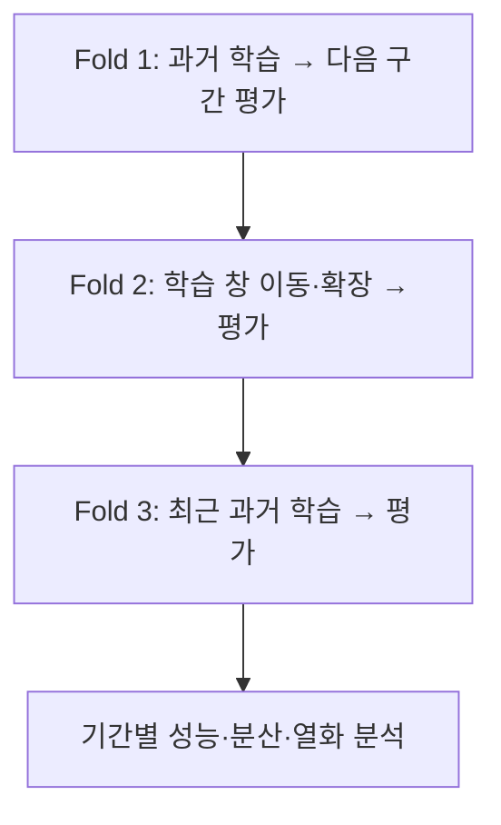



시계열 모델의 검증은 과거 데이터를 잘 설명하는지 확인하는 일이 아니다. **그 시점까지 알려진 정보로 다음 시점의 결정을 얼마나 안정적으로 지원했을지 재연하는 일**이다. 시간 순서를 보존해도 특징 생성, 레이블 중첩, 하이퍼파라미터 선택에서 미래 정보가 들어가면 백테스트는 쉽게 낙관적으로 변한다.

이 글의 원칙은 수요 예측 같은 수치 예측뿐 아니라, 시간에 따라 반복 호출되는 분류·위험 점수·이상 탐지에도 적용된다.

## 1. 문제: 시간은 단순한 열 하나가 아니다

### 무작위 분할은 미래 배포를 모사하지 않는다

독립·동일분포를 가정한 무작위 분할에서는 과거와 미래 관측치가 train과 validation에 섞인다. 시계열에는 다음 의존성이 있어 성능이 부풀 수 있다.

- 가까운 시점의 자기상관
- 같은 개체에서 반복 측정된 값
- 계절성·추세·운영 체계 변화
- 미래 정보로 계산된 집계·정규화
- 수정된 최종 데이터와 실시간 초도 데이터의 차이

배포에서는 과거로 미래를 예측하므로 검증도 그 방향을 따라야 한다.

### 한 번의 holdout은 특정 시기에 대한 한 번의 질문일 뿐이다

마지막 구간 하나를 test로 두는 것은 필요하지만 충분하지 않다. 그 구간이 우연히 쉽거나 어려울 수 있고, 계절·이벤트·운영 조건을 대표하지 못할 수 있다. 모델 선택을 한 구간에 과도하게 맞추면 그 구간도 사실상 훈련 데이터가 된다.

### 드리프트는 하나의 현상이 아니다

배포 후 성능 변화의 원인은 구분해야 한다.

| 변화 | 정의 | 예시적 의미 |
|---|---|---|
| covariate drift | \(P(X)\) 변화 | 입력 빈도·범위·결측 패턴 변화 |
| prior drift | \(P(Y)\) 변화 | 사건의 기본 발생률 변화 |
| concept drift | \(P(Y\mid X)\) 변화 | 같은 입력이 다른 결과를 의미 |
| policy drift | 의사결정·수집 정책 변화 | 모델 사용 방식이 레이블 관측을 바꿈 |
| schema drift | 형식·단위·코드 변화 | 열 의미나 자료형이 바뀜 |

입력 분포가 변했다고 반드시 성능이 떨어지는 것은 아니며, 입력 분포가 안정적이어도 \(P(Y\mid X)\)가 변하면 성능은 떨어질 수 있다.

## 2. Mental model: 운영 시점을 반복 재생하는 시뮬레이터

### 예측 원점, 관측 창, 지평을 분리한다

예측 원점을 \(t\), 관측 창 길이를 \(W\), 예측 지평을 \(H\)라고 하자.

\[
X_t = g\left(z_{t-W+1},\ldots,z_t\right), \qquad
y_{t,H} = h\left(z_{t+1},\ldots,z_{t+H}\right)
\]

모델은 원점 \(t\)에서 실제로 사용 가능했던 데이터만 받아야 한다. 데이터가 사건 시각보다 늦게 적재된다면 `available_at <= t`도 만족해야 한다.

### 백테스트는 여러 개의 가상 배포다

Rolling-origin evaluation은 원점을 앞으로 이동하며 학습과 평가를 반복한다.



fold \(k\)의 학습 종료를 \(T_k\), gap을 \(G\), 평가 길이를 \(V\)라 하면:

\[
\mathcal{D}_{train}^{(k)} = \{t \le T_k\}, \qquad
\mathcal{D}_{valid}^{(k)} = \{T_k+G < t \le T_k+G+V\}
\]

gap은 무조건 넣는 장식이 아니다. 다음 경우에 필요하다.

- 특징 또는 레이블 창이 split 경계를 넘어 중첩된다.
- 레이블 확정 지연 때문에 훈련 종료 시점에 최근 정답을 알 수 없다.
- 같은 사건의 영향이 인접 구간에 오래 남는다.
- 운영상 데이터 정리·재학습·배포에 시간이 걸린다.

### 시간에 따른 성능을 하나의 분포로 본다

평균 성능 하나보다 다음이 중요하다.

- 기간별 성능 \(m_1,\ldots,m_K\)
- 최악 기간 성능 \(\min_k m_k\)
- 시간 추세와 변동성
- 계절·도메인별 조건부 성능
- 재학습 이후 성능 회복 속도

모델 선택은 평균을 최대화하는 것뿐 아니라 하방 위험을 제한하는 문제다.

\[
\text{score}(M)=\overline{m}(M)-\lambda\,\mathrm{Std}(m(M))-\gamma\,\mathrm{TailRisk}(m(M))
\]

\(\lambda,\gamma\)는 안전성과 안정성을 얼마나 중요하게 보는지 나타내는 설계 변수다.

## 3. 실전 workflow

### Step 1. 시간 의미를 데이터 계약에 넣는다

최소 네 시간을 구분한다.

| 시간 | 의미 |
|---|---|
| event time | 현실에서 사건이 발생한 시각 |
| ingestion time | 시스템에 도착한 시각 |
| available time | 검증·가공을 거쳐 모델이 사용할 수 있게 된 시각 |
| label time | 결과가 관측되거나 최종 확정된 시각 |

정정되는 데이터라면 최초 공개값과 최종 수정값도 구분한다. 실시간 예측 모델을 최종 수정값만으로 백테스트하면 실제 배포보다 깨끗한 정보를 사용하게 된다.

각 시계열에 다음을 기록한다.

- 표준 시간대와 일광절약시간 처리
- 샘플링 주기와 불규칙 간격 규칙
- 중복·역순 사건 처리
- 결측과 실제 0의 구분
- 단위·센서·코드 변경 이력
- 늦게 도착한 데이터의 허용 한계

### Step 2. 배포 질문에 맞는 split을 고른다

#### Expanding window

과거 데이터를 계속 누적한다.

\[
[1,T_1]\rightarrow V_1,\quad [1,T_2]\rightarrow V_2,\ldots
\]

장기 이력이 여전히 유효하고 데이터 양이 중요한 경우 적합하다.

#### Sliding window

최근 고정 길이만 사용한다.

\[
[T_1-W,T_1]\rightarrow V_1,\quad [T_2-W,T_2]\rightarrow V_2,\ldots
\]

오래된 체계가 현재와 다르고 concept drift가 빠른 경우 유리할 수 있다. 대신 희귀 패턴과 계절 주기를 잃을 수 있다.

#### Blocked split

고정된 연속 블록으로 train·validation·test를 나눈다. 계산은 단순하지만 모델 선택이 한 validation 기간에 종속될 수 있다.

#### Grouped temporal split

시간 순서와 개체 경계를 동시에 지킨다. “기존 개체의 미래”를 예측하는지, “새 개체의 미래”에 일반화하는지에 따라 설계가 달라진다.

### Step 3. 특징 생성기를 시점 안전하게 만든다

시계열 누수의 주요 원인은 특징 코드다.

- 중앙 정렬 이동평균은 미래 값을 포함한다.
- 전체 데이터 표준화는 미래 평균·분산을 사용한다.
- forward fill이 split을 넘어갈 수 있다.
- 목표 변수의 미래 집계가 특징으로 섞일 수 있다.
- 리샘플링·보간이 미래 관측치를 양쪽에서 참조할 수 있다.

특징 함수는 명시적으로 cutoff를 받게 설계한다.

```python
def make_features(history, cutoff):
    visible = history[
        (history.event_time <= cutoff)
        & (history.available_time <= cutoff)
    ]

    return {
        "last_value": visible.value.iloc[-1],
        "mean_7": visible.tail(7).value.mean(),
        "age_seconds": (cutoff - visible.available_time.iloc[-1]).total_seconds(),
    }
```

좋은 테스트는 특징 생성기를 두 방식으로 비교한다.

1. 전체 과거를 한 번에 계산하되 미래 참조를 금지한 batch 방식
2. 시간을 한 칸씩 전진시키며 당시 보이는 정보만 계산하는 replay 방식

두 결과가 같아야 한다.

### Step 4. 레이블 중첩과 maturity를 처리한다

미래 \(H\) 기간 내 사건을 레이블로 만들면 인접 행의 레이블 창이 겹친다. split 경계 근처에서는 학습 레이블과 validation 레이블이 같은 미래 사건을 공유할 수 있다.

대응 방법:

- 평가 원점 사이 간격을 늘린다.
- split 사이에 prediction horizon 이상의 embargo를 둔다.
- 사건·에피소드 단위로 그룹화한다.
- 상관을 반영해 표준오차와 bootstrap 단위를 정한다.

또한 레이블이 \(L\)일 후 확정된다면, 시점 \(T\)에 재학습할 수 있는 최신 레이블은 대략 \(T-L\) 이전이다. 백테스트에서도 이 지연을 그대로 재현한다.

### Step 5. 베이스라인부터 동일한 백테스트에 넣는다

시계열 베이스라인은 강하다.

- 직전 값 유지
- 계절 주기 전 값
- 이동 평균·중앙값
- 단순 추세
- 기존 규칙 기반 점수
- 정규화된 선형 모델

모델이 계절 naive를 안정적으로 이기지 못한다면 복잡한 구조보다 데이터·지평·손실 정의를 다시 점검해야 한다.

여러 지평을 예측할 때는 지평별 성능을 따로 본다.

\[
\mathrm{MAE}_h = \frac{1}{N_h}\sum_i |y_{i,t+h}-\hat y_{i,t+h}|
\]

전체 평균만 보면 가까운 지평의 많은 표본이 먼 지평의 실패를 가릴 수 있다.

### Step 6. 모델 선택과 최종 평가를 분리한다

권장 구조:

1. 여러 과거 fold에서 후보 모델과 특징을 비교한다.
2. fold 평균·분산·최악 구간·비용을 기준으로 선택한다.
3. 선택 규칙과 하이퍼파라미터를 고정한다.
4. 가장 최근의 봉인된 test 구간에서 한 번 평가한다.
5. 배포 전 test까지 포함해 재학습할지는 별도 정책으로 정한다.

하이퍼파라미터를 매 fold의 validation 성능에 맞춘 뒤 같은 fold 점수를 보고하면 낙관적이다. 필요하면 시간 순서를 유지한 nested backtest를 사용한다.

### Step 7. 성능을 기간·조건별로 분해한다

예측 문제에 따라 다음 슬라이스를 검토한다.

- 예측 지평
- 시간대·요일·계절
- 관측 이력 길이
- 입력 결측·지연 수준
- 개체의 신규·기존 여부
- 목표값 크기 또는 사건 심각도
- 알려진 운영 상태

평균 지표와 함께 오차 분포, bias, 분위수, 최악 구간을 본다. 예측 구간을 출력한다면 경험적 coverage도 검증한다.

\[
\widehat{\mathrm{Coverage}}_{1-\alpha}
=\frac{1}{n}\sum_i \mathbf{1}\left(y_i\in[L_i,U_i]\right)
\]

coverage가 목표와 같더라도 구간이 지나치게 넓으면 쓸모가 없다. 평균 폭과 조건부 coverage를 같이 본다.

### Step 8. 배포 모니터링을 지연 수준별로 설계한다

#### 즉시 확인 가능한 운영 지표

- 스키마, 단위, 범위, 범주 집합
- 데이터 도착 지연과 신선도
- 결측률·중복률·역순 사건
- 추론 지연, 오류율, fallback 비율
- 예측값·점수·불확실성 분포
- 경보·행동률

#### 레이블 없이 보는 drift 신호

- 연속형: quantile shift, PSI, 거리 기반 통계
- 범주형: 빈도 변화, 새로운 범주 비율
- 다변량: 도메인 분류기로 과거/현재 구분 가능성 평가
- 임베딩: 거리·밀도·이웃 구조 변화

통계적 유의성만으로 경보를 울리지 않는다. 표본이 크면 사소한 차이도 유의하다. 실제 중요도 기준과 지속 시간 조건을 함께 둔다.

#### 레이블 성숙 후 확인하는 품질 지표

- 예측 오차 또는 분류 지표
- calibration과 예측 구간 coverage
- 정책 비용과 처리량
- 집단·시간대별 성능 격차
- 재학습 전후 비교

### Step 9. 경보에서 대응까지 연결한다

모니터링은 그래프를 만드는 일이 아니라 대응 절차를 자동화·문서화하는 일이다.

| 신호 | 1차 진단 | 가능한 대응 |
|---|---|---|
| schema 위반 | 생산자 변경·파싱 오류 | 입력 차단, fallback, 계약 복구 |
| 신선도 악화 | 수집·집계 지연 | 오래된 특징 표시, 예측 보류 |
| 점수 분포 급변 | 입력 drift·코드 변경 | shadow 비교, 원인 슬라이스 조사 |
| calibration 열화 | base rate·관계 변화 | 재보정, 임계값 재검토 |
| 성능 열화 | concept drift·레이블 변화 | 재학습, 특징 수정, 롤백 |

재학습을 모든 경보의 기본 답으로 삼으면 안 된다. 데이터 파이프라인 장애나 레이블 정의 변경을 새 모델로 덮을 수 있기 때문이다.

## 4. 평가·검증 checklist

### 시간과 데이터

- [ ] event, ingestion, available, label time을 구분했다.
- [ ] 표준 시간대, 중복, 역순, 늦은 도착 규칙이 있다.
- [ ] 실시간 초도값과 사후 수정값의 차이를 확인했다.
- [ ] 특징은 원점 당시 사용 가능했던 정보만 쓴다.
- [ ] batch 특징과 순차 replay 특징이 일치한다.

### 분할과 백테스트

- [ ] split이 실제 배포의 학습·예측 순서를 모사한다.
- [ ] 관측 창·레이블 창 중첩에 필요한 gap/embargo가 있다.
- [ ] 같은 사건·개체의 의존성이 경계를 넘지 않는다.
- [ ] 여러 rolling origin에서 성능 분포를 평가했다.
- [ ] 모델 선택용 fold와 최종 test를 분리했다.
- [ ] 레이블 maturity delay를 백테스트에 재현했다.

### 평가

- [ ] naive·seasonal·단순 통계 베이스라인과 비교했다.
- [ ] 평균뿐 아니라 기간별 분산과 최악 구간을 본다.
- [ ] 지평별 성능을 분리했다.
- [ ] 운영상 중요한 시간·조건 슬라이스를 평가했다.
- [ ] 예측 구간의 coverage와 폭을 함께 확인했다.
- [ ] 상관 구조를 보존하는 단위로 불확실성을 추정했다.

### 운영

- [ ] 레이블 전 지표와 레이블 후 지표를 구분했다.
- [ ] drift 경보에 크기·지속 시간·업무 중요도 조건이 있다.
- [ ] 경보마다 담당자, 진단 절차, fallback, 롤백이 정의되었다.
- [ ] 재보정, 임계값 변경, 재학습의 조건이 분리되었다.
- [ ] 모델·데이터·정책 변경 시점을 성능 그래프에 표시한다.

## 5. 한계와 주의점

첫째, 과거를 정교하게 재생해도 전례 없는 구조 변화는 평가할 수 없다. 스트레스 시나리오, 도메인 지식, 보수적 fallback이 필요하다.

둘째, backtest fold를 많이 만들면 독립적인 증거가 자동으로 늘어나는 것은 아니다. 겹치는 학습·평가 구간은 강하게 상관되어 있으므로 단순 평균의 표준오차를 과신하면 안 된다.

셋째, drift 통계는 원인을 말해 주지 않는다. 데이터 품질 문제, 모집단 변화, 정책 변화, concept drift를 구분하려면 lineage와 변경 이력이 필요하다.

넷째, 빈번한 재학습은 최신성은 높이지만 희귀 패턴을 잊고 운영 변동을 확대할 수 있다. expanding/sliding window와 재학습 주기는 백테스트로 함께 선택한다.

마지막으로, 모델을 사용한 행동이 미래 데이터와 레이블을 바꾼다. 시계열 시스템은 수동적인 예측기가 아니라 환경과 상호작용하는 정책이다. 장기 모니터링에는 이 피드백을 포함해야 한다.
