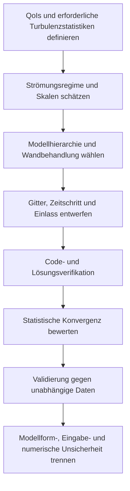



Ein Turbulenzmodell ist kein Menü, aus dem „das genaue Modell“ gewählt wird.
Es ist eine Wahl der Mittelung, Filterung und Annahmen, mit denen die Wirkungen nicht aufgelöster Skalen geschlossen werden.
Vor Kosten und Genauigkeit ist daher zu fragen, **welche Information verworfen wird**.

## 1. Warum Turbulenz schwierig ist

Die inkompressiblen Navier-Stokes-Gleichungen lauten

$$
\frac{\partial\mathbf u}{\partial t}
+\mathbf u\cdot\nabla\mathbf u
=-\frac{1}{\rho}\nabla p+\nu\nabla^2\mathbf u,
\qquad
\nabla\cdot\mathbf u=0
$$

.
Der nichtlineare Advektionsterm erzeugt Energietransfer zwischen Skalen.
In große Strukturen eingebrachte kinetische Energie wird schrittweise zu kleineren Skalen übertragen und nahe der Kolmogorov-Skala durch Viskosität dissipiert.

Die repräsentative dimensionslose Kennzahl ist die Reynolds-Zahl.

$$
\mathrm{Re}=\frac{UL}{\nu}.
$$

Bei hohen Reynolds-Zahlen wächst die Lücke zwischen größten und kleinsten Skalen, sodass eine direkte Auflösung jeder Skala schwierig wird.

## 2. Mittelung und Filterung stellen unterschiedliche Fragen

### Reynolds-Mittelung

Die Geschwindigkeit wird in Mittelwert und Schwankung zerlegt.

$$
u_i=\overline{u}_i+u_i',
\qquad
\overline{u_i'}=0.
$$

In der gemittelten Impulsgleichung tritt die Reynolds-Spannung auf.

$$
\frac{\partial\overline u_i}{\partial t}
+\overline u_j\frac{\partial\overline u_i}{\partial x_j}
=-\frac{1}{\rho}\frac{\partial\overline p}{\partial x_i}
+\nu\frac{\partial^2\overline u_i}{\partial x_j^2}
-\frac{\partial\overline{u_i'u_j'}}{\partial x_j}.
$$

Das Auftreten der neuen Unbekannten \(-\overline{u_i'u_j'}\) ist das Schließungsproblem.

### Räumliche Filterung

LES löst Wirbel oberhalb der Filterweite auf und modelliert die Wirkung kleinerer Skalen als Subgrid-Spannung.

$$
\tau_{ij}^{sgs}=\overline{u_i u_j}-\bar u_i\bar u_j.
$$

Der Filter ist mit tatsächlichem Gitter und Diskretisierung verflochten; ein nomineller Filter allein garantiert daher keine exakte Trennung.

## 3. DNS: Grenzen der Bezeichnung als modellfreie Berechnung

DNS versucht, jede dynamische Skala ohne Turbulenzmodell aufzulösen.
Folgende Entscheidungen und Fehler verbleiben dennoch.

- maßgebliche Gleichung und konstitutive Annahme
- Gebiet und Randbedingung
- räumliche und zeitliche Diskretisierung
- Gebietsgröße und Abtastdauer
- Entfernung des anfänglichen Transienten
- statistischer Konvergenzfehler

DNS verringert Schließungsmodellfehler, ist aber nicht „die vollständige Wahrheit der Realität“.
Insbesondere bei komplexen Geometrien und hohen Reynolds-Zahlen steigen die Kosten stark.

## 4. RANS: Mittelgrößen direkt vorhersagen

Die Wirbelviskositätshypothese setzt die anisotrope Reynolds-Spannung zum mittleren Dehnungstensor in Beziehung.

$$
-\overline{u_i'u_j'}
=2\nu_t S_{ij}-\frac{2}{3}k\delta_{ij},
$$

$$
S_{ij}=\frac{1}{2}
\left(
\frac{\partial\overline u_i}{\partial x_j}
+\frac{\partial\overline u_j}{\partial x_i}
\right).
$$

Diese Annahme ist recheneffizient, komprimiert aber die Richtungsinformation der Reynolds-Spannung erheblich in eine einzige skalare Wirbelviskosität.
Bei starker Rotation, Krümmung, Ablösung, Nichtgleichgewichtsturbulenz und ausgeprägter Anisotropie können ihre Grenzen deutlich werden.

### Fragen an repräsentative RANS-Familien

- Eingleichungsmodell: Wie wird Wirbelviskosität aus einer Transportvariablen aufgebaut?
- Zweigleichungsmodell: Wie werden \(k\) und Dissipationsskala transportiert?
- Reynolds-Spannungsmodell: Wie viel Anisotropie bleibt erhalten, wenn die Spannungskomponenten selbst gelöst werden?
- Transitionsmodell: Welche Korrelationen und Variablen bilden laminar-turbulenten Übergang ab?

Wichtiger als der Modellname sind Anwendungsbereich, wandnahe Formulierung, Spezifikation der Einlassturbulenz und Kompressibilitätskorrektur.

## 5. LES: große Strukturen berechnen, kleine modellieren

Entscheidend für LES ist eine ausreichende räumliche und zeitliche Auflösung der aufgelösten Turbulenz.
Nur das SGS-Modell zu ändern macht aus grobem instationärem RANS keine LES.

Ein SGS-Wirbelviskositätsmodell besitzt gewöhnlich die Form

$$
\tau_{ij}^{sgs}-\frac{1}{3}\tau_{kk}^{sgs}\delta_{ij}
=-2\nu_{sgs}\bar S_{ij}
$$

.
Ein dynamisches Verfahren schätzt Modellkoeffizienten aus lokaler oder gemittelter Information.
Filterkommutation, Rückstreuung, wandnahes Verhalten und numerische Dissipation wirken weiterhin.

## 6. Wände dominieren Kosten und Fehler

Nahe einer Wand liegen viskose Unterschicht, Pufferschicht und logarithmische Schicht.
Die Wandkoordinate ist definiert durch

$$
y^+=\frac{u_\tau y}{\nu},
\qquad
u_\tau=\sqrt{\tau_w/\rho}
$$

.

### Wandauflösender Ansatz

Wandnahe Strukturen werden durch erste Zelle und wandparallele Auflösung direkt aufgelöst.
Die Kosten sind hoch, Gitteranisotropie und Zeitschrittbedingungen streng.

### Wandmodellierter Ansatz

Wand und erster aufgelöster Punkt werden durch ein Wandmodell verbunden.
Dies senkt Kosten, führt aber Modellformunsicherheit bei Druckgradienten, Ablösung, Rauheit und Wärmeübertragung ein.

### RANS-Wandfunktion

Sie beruht häufig auf einem logarithmischen Gesetz und einer Gleichgewichtsannahme.
Es ist zu prüfen, ob die erste Zelle in der beabsichtigten Schicht liegt und ob Gitteränderungen die Übergangsregion empfindlich machen.

## 7. Kriterien zur Wahl von RANS, LES oder DNS

| Kriterium | RANS | LES | DNS |
|---|---|---|---|
| Direkt erhaltene Information | vor allem mittlere Felder | große instationäre Strukturen und Statistiken | alle aufgelösten Skalen |
| Umfang der Schließung | Großteil der Turbulenzwirkungen | Subgrid-Skalen | keine Turbulenzschließung |
| Rechenkosten | niedrig | hoch | sehr hoch |
| Wandnahe Belastung | modellabhängig | sehr hoch oder Wandmodell nötig | sehr hoch |
| Statistische Abtastung | bei stationär niedrig | erforderlich | erforderlich |
| Hauptrisiko | Modellform-Bias | verflochtene Wirkungen von Auflösung, Sampling und SGS | Gebiet, Sampling und Kosten |

Die Wahl beginnt beim Ziel.
Sie hängt davon ab, ob mittlerer Druckverlust, Frequenz einer kohärenten Struktur oder ein hochwertiger Benchmark die Zielgröße ist.

## 8. Reiz und Risiko hybrider RANS–LES

Ein hybrides Verfahren gleicht Kosten aus, indem es nahe Wänden RANS und für abgelöste große Strukturen LES verwendet.
Das Gitter kann jedoch einen Moduswechsel an einer unbeabsichtigten Stelle auslösen; eine Abnahme modellierter Spannung oder Grauzone kann entstehen.

Folgende Fragen sind ausdrücklich zu beantworten.

- Welche Längenskala trennt RANS- und LES-Region?
- Löst das Gitter den Modellwechsel an einer physikalisch geeigneten Stelle aus?
- Wie wird aufgelöste Turbulenz am Einlass erzeugt?
- Sind Spannung und Energieinhalt über die Schnittstelle stetig?

## 9. Statistische Konvergenz

Das Zeitmittel einer instationären Berechnung,

$$
\langle q\rangle_T=\frac{1}{T}\int_{t_0}^{t_0+T}q(t)\,dt
$$

, ist eine endliche Stichprobe.
Selbst bei scheinbar großer Stichprobenzahl macht starke Autokorrelation die effektive Zahl klein.

Ist die integrale Korrelationszeit \(\tau_{int}\), kann konzeptionell mit

$$
N_{eff}\sim\frac{T}{2\tau_{int}}
$$

gerechnet werden.
Neben dem Mittel werden Konfidenzintervalle, Änderungen von Blockmitteln und Niederfrequenzstabilität des Spektrums berichtet.

## 10. Umgang mit Modellformunsicherheit

Mehrere Modelle auszuführen und nur ihre Streuung zu zeigen ist lediglich ein Ausgangspunkt.
Teilen diese Modelle dieselben strukturellen Annahmen, kann die Streuung die wahre Unsicherheit unterschätzen.

Unsicherheitsquellen werden getrennt.

- Schließungsstruktur
- Koeffizienten und Kalibrierungsbereich
- Einlassturbulenz
- Wandbehandlung und Rauheit
- numerische Dissipation
- Netz und Filterweite
- Sampling-Unsicherheit
- Rand- und Gebietskürzung

Ansätze wie Eigenraumstörung der RANS-Reynolds-Spannung, Koeffizientenunsicherheit und bayessche Modellmittelung sind möglich, ihre Ergebnisse hängen jedoch vom Prior und der Definition zulässiger Störungen ab.

## 11. Verifikations- und Validierungsworkflow

1. Tatsächliche QoIs unter Mittelwert, RMS, Spektrum und Wandfluss notieren.
2. Gitter um erwartete Lagen von Grenz- und Scherschichten entwerfen.
3. Nicht nur Intensität der Einlassturbulenz, sondern auch ihre Längen- und Zeitskalen angleichen.
4. Intervall zur Entfernung des Transienten vom Abtastintervall trennen.
5. Gitter-, Zeitschritt- und Modellvariationen schrittweise vergleichen, statt alle zugleich zu vermischen.
6. Räumliche und zeitliche Filterung der Validierungsdaten an die Definition des berechneten Ergebnisses anpassen.

## 12. Prüfliste zur Validierung

- [ ] Die vom Modell vorhergesagten Größen entsprechen den benötigten QoIs.
- [ ] Reynolds-Zahl und wichtige dimensionslose Gruppen werden berichtet.
- [ ] Quellen von Einlassturbulenzvariablen und Längenskalen sind dokumentiert.
- [ ] Wandnahes Netz stimmt mit der Wandbehandlung überein.
- [ ] \(y^+\) wird als Verteilung statt als einzelner Mittelwert untersucht.
- [ ] Aufgelöster Energieanteil und Spektrum werden in LES untersucht.
- [ ] Gebietsgröße begrenzt große Strukturen nicht.
- [ ] Zeitschritt löst die schnellste relevante Dynamik auf.
- [ ] Anfänglicher Transient ist vom Sampling ausgeschlossen.
- [ ] Statistischer Fehler unter Berücksichtigung der Autokorrelation wird dargestellt.
- [ ] Numerische Diffusion wurde möglichst von SGS- oder Schließungsdissipation unterschieden.
- [ ] Mindestens eine Modellform-Sensitivität wurde evaluiert.

## 13. Häufige Fehlermuster und Einschränkungen

### Das gesamte Gitter anhand eines einzigen \(y^+\)-Ziels bewerten

Neben der ersten wandnormalen Zelle sind Abstände in Strömungs- und Spannweitenrichtung, Wachstumsrate und Auflösung in Ablösungsregionen wichtig.

### Stationäres RANS nur anhand von Residuen validieren

Numerische iterative Konvergenz beweist nicht, dass ein Schließungsmodell die Realität wiedergibt.

### Eine grobe Berechnung LES nennen

Ohne aufgelöstes Spektrum, SGS-Aktivität und Gittersensitivität ist die Qualität der aufgelösten Turbulenz unbekannt.

### Einen experimentellen Punkt direkt mit einem Zellpunkt vergleichen

Räumliche und zeitliche Mittelung des Messgeräts müssen an den rechnerischen Abtastoperator angepasst werden.

### Jede Differenz zwischen Modellen als Unsicherheitsband behandeln

Es gibt keine Garantie, dass das Modellensemble mögliche Strukturen repräsentiert.
Bedeutung des Bands und ausgelassene Unsicherheiten sind anzugeben.

## 14. Offizielle und primäre Referenzen

- Reynolds, O., „On the Dynamical Theory of Incompressible Viscous Fluids“, 1895.
- Kolmogorov, A. N., „The Local Structure of Turbulence in Incompressible Viscous Fluid“, 1941.
- Smagorinsky, J., „General Circulation Experiments with the Primitive Equations“, 1963.
- Germano et al., „A Dynamic Subgrid-Scale Eddy Viscosity Model“, 1991.
- NASA Turbulence Modeling Resource, [Modelle, Verifikationsfälle und Validierungsdaten](https://turbmodels.larc.nasa.gov/).
- NASA CFD Vision 2030, [Forschungsroadmap](https://ntrs.nasa.gov/citations/20140003093).

Die beste Frage bei der Wahl eines Turbulenzmodells lautet nicht „Welches Modell ist das beste?“
Sie lautet: **Welche Skalen werden aufgelöst, welche Information wird dem Modell anvertraut, und wie zeigt sich diese Wahl in der Unsicherheit der QoI?**
