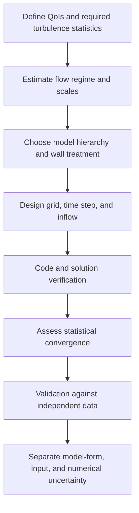



A turbulence model is not a menu from which to choose “the accurate model.”
It is a choice of the averaging, filtering, and assumptions used to close the effects of unresolved scales.
Therefore, before asking about cost and accuracy, ask **what information is discarded**.

## 1. Why Turbulence Is Difficult

The incompressible Navier–Stokes equations are

$$
\frac{\partial\mathbf u}{\partial t}
+\mathbf u\cdot\nabla\mathbf u
=-\frac{1}{\rho}\nabla p+\nu\nabla^2\mathbf u,
\qquad
\nabla\cdot\mathbf u=0
$$

.
The nonlinear advection term produces energy transfer between scales.
Kinetic energy injected into large structures is progressively transferred to smaller scales and dissipated by viscosity near the Kolmogorov scale.

The representative dimensionless number is the Reynolds number.

$$
\mathrm{Re}=\frac{UL}{\nu}.
$$

At high Reynolds numbers, the gap between the largest and smallest scales grows, making it difficult to resolve every scale directly.

## 2. Averaging and Filtering Pose Different Questions

### Reynolds Averaging

Decompose velocity into a mean and a fluctuation.

$$
u_i=\overline{u}_i+u_i',
\qquad
\overline{u_i'}=0.
$$

Reynolds stress appears in the mean momentum equation.

$$
\frac{\partial\overline u_i}{\partial t}
+\overline u_j\frac{\partial\overline u_i}{\partial x_j}
=-\frac{1}{\rho}\frac{\partial\overline p}{\partial x_i}
+\nu\frac{\partial^2\overline u_i}{\partial x_j^2}
-\frac{\partial\overline{u_i'u_j'}}{\partial x_j}.
$$

The appearance of the new unknown \(-\overline{u_i'u_j'}\) is the closure problem.

### Spatial Filtering

LES resolves eddies larger than the filter width and models the effect of smaller scales as subgrid-scale stress.

$$
\tau_{ij}^{sgs}=\overline{u_i u_j}-\bar u_i\bar u_j.
$$

The filter is entangled with the actual grid and discretization, so a nominal filter alone does not guarantee an exact separation.

## 3. DNS: The Limits of Calling It a Model-Free Calculation

DNS attempts to resolve every dynamical scale without a turbulence model.
The following choices and errors nevertheless remain.

- governing equation and constitutive assumption
- domain and boundary condition
- spatial and temporal discretization
- domain size and sampling duration
- removal of the initial transient
- statistical convergence error

DNS reduces closure-model error, but it is not “the complete truth of reality.”
Its cost rises sharply, especially for complex geometries and high Reynolds numbers.

## 4. RANS: Directly Predicting Mean Quantities

The eddy-viscosity hypothesis relates anisotropic Reynolds stress to the mean strain.

$$
-\overline{u_i'u_j'}
=2\nu_t S_{ij}-\frac{2}{3}k\delta_{ij},
$$

$$
S_{ij}=\frac{1}{2}
\left(
\frac{\partial\overline u_i}{\partial x_j}
+\frac{\partial\overline u_j}{\partial x_i}
\right).
$$

This assumption is computationally efficient, but it substantially compresses the directional information in Reynolds stress into a single scalar eddy viscosity.
Its limitations can become pronounced under strong rotation, curvature, separation, nonequilibrium turbulence, and substantial anisotropy.

### Questions for Representative RANS Families

- one-equation model: How is eddy viscosity constructed from a single transport variable?
- two-equation model: How are \(k\) and the dissipation scale transported?
- Reynolds-stress model: How much anisotropy is preserved by solving the stress components themselves?
- transition model: Which correlations and variables represent laminar–turbulent transition?

More than the model name, examine the application range, near-wall formulation, inlet-turbulence specification, and compressibility correction.

## 5. LES: Computing Large Structures and Modeling Small Ones

The key to LES is sufficient spatial and temporal resolution of resolved turbulence.
Changing only the SGS model does not turn coarse unsteady RANS into LES.

An eddy-viscosity SGS model usually has the form

$$
\tau_{ij}^{sgs}-\frac{1}{3}\tau_{kk}^{sgs}\delta_{ij}
=-2\nu_{sgs}\bar S_{ij}
$$

.
A dynamic procedure estimates model coefficients from local or averaged information.
Filter commutation, backscatter, near-wall behavior, and numerical dissipation still have an effect.

## 6. Walls Dominate Cost and Error

Near a wall are the viscous sublayer, buffer layer, and logarithmic layer.
The wall coordinate is defined by

$$
y^+=\frac{u_\tau y}{\nu},
\qquad
u_\tau=\sqrt{\tau_w/\rho}
$$

.

### Wall-Resolved Approach

Resolve near-wall structures directly through the first cell and wall-parallel resolution.
The cost is high, while grid anisotropy and time-step constraints are severe.

### Wall-Modeled Approach

Connect the wall and first resolved point with a wall model.
This lowers cost, but introduces model-form uncertainty for pressure gradients, separation, roughness, and heat transfer.

### RANS Wall Function

It often depends on a log law and an equilibrium assumption.
Check whether the first cell lies within the intended layer and whether changes in the grid make the blending region sensitive.

## 7. Criteria for Choosing RANS, LES, or DNS

| Criterion | RANS | LES | DNS |
|---|---|---|---|
| Information obtained directly | Primarily mean fields | Large unsteady structures and statistics | All resolved scales |
| Scope of closure | Most turbulence effects | Subgrid scales | No turbulence closure |
| Computational cost | Low | High | Very high |
| Near-wall burden | Model-dependent | Very high, or requires a wall model | Very high |
| Statistical sampling | Low if steady | Required | Required |
| Main risk | Model-form bias | Entangled resolution, sampling, and SGS effects | Domain, sampling, and cost |

The choice begins with the objective.
It depends on whether the quantity of interest is mean pressure loss, the frequency of a coherent structure, or a high-quality benchmark.

## 8. The Appeal and Risk of Hybrid RANS–LES

A hybrid method balances cost by using RANS near walls and LES for separated large structures.
However, the grid may trigger a mode switch in an unintended location, and modeled-stress depletion or a gray area may arise.

State the following questions explicitly.

- What length scale separates the RANS and LES regions?
- Does the grid induce the model switch in a physically appropriate location?
- How is resolved turbulence generated at the inflow?
- Are stress and energy content continuous across the interface?

## 9. Statistical Convergence

The time average of an unsteady calculation,

$$
\langle q\rangle_T=\frac{1}{T}\int_{t_0}^{t_0+T}q(t)\,dt
$$

, is a finite sample.
Even when the apparent sample count is large, strong autocorrelation makes the effective sample count small.

If the integral correlation time is \(\tau_{int}\), one can think conceptually in terms of

$$
N_{eff}\sim\frac{T}{2\tau_{int}}
$$

.
Report not only the mean, but also confidence intervals, changes in block averages, and the low-frequency stability of the spectrum.

## 10. How to Handle Model-Form Uncertainty

Running several models and presenting only their spread is merely a starting point.
If those models share the same structural assumptions, the spread may underestimate the true uncertainty.

Separate the sources of uncertainty.

- closure structure
- coefficients and calibration domain
- inlet turbulence
- wall treatment and roughness
- numerical dissipation
- mesh and filter width
- sampling uncertainty
- boundary and domain truncation

Approaches such as eigenspace perturbation of RANS Reynolds stress, coefficient uncertainty, and Bayesian model averaging are possible, but their results depend on the prior and the definition of admissible perturbations.

## 11. Verification and Validation Workflow

1. Write down the actual QoIs among the mean, RMS, spectrum, and wall flux.
2. Design the grid around the expected locations of boundary and shear layers.
3. Match not only inlet-turbulence intensity, but also its length and time scales.
4. Separate the transient-removal interval from the sampling interval.
5. Compare grid, time-step, and model variations step by step rather than mixing them all at once.
6. Match the spatial and temporal filtering of validation data to the definition of the computed result.

## 12. Validation Checklist

- [ ] The quantities predicted by the model match the required QoIs.
- [ ] The Reynolds number and major dimensionless groups are reported.
- [ ] The sources of inlet-turbulence variables and length scales are documented.
- [ ] The near-wall mesh is consistent with the wall treatment.
- [ ] \(y^+\) is examined as a distribution rather than a single average.
- [ ] The resolved-energy fraction and spectrum are examined in LES.
- [ ] The domain size does not constrain large structures.
- [ ] The time step resolves the fastest relevant dynamics.
- [ ] The initial transient is excluded from sampling.
- [ ] Statistical error that accounts for autocorrelation is presented.
- [ ] An attempt has been made to distinguish numerical diffusion from SGS or closure dissipation.
- [ ] At least one model-form sensitivity has been evaluated.

## 13. Common Failure Patterns and Limitations

### Evaluating the Entire Grid Against a Single \(y^+\) Target

In addition to the first wall-normal cell, streamwise and spanwise spacing, growth rate, and resolution in separation regions matter.

### Validating Steady RANS Using Only Residuals

Numerical iterative convergence is not evidence that a closure model reproduces reality.

### Calling a Coarse Calculation LES

Without a resolved spectrum, SGS activity, and grid sensitivity, the quality of resolved turbulence is unknown.

### Directly Comparing an Experimental Point with a Cell Point

The spatial and temporal averaging of the measurement device must be matched to the computational sampling operator.

### Treating Every Difference Between Models as an Uncertainty Band

There is no guarantee that the model ensemble represents the possible structures.
State what the band means and which uncertainties it omits.

## 14. Official and Primary References

- Reynolds, O., “On the Dynamical Theory of Incompressible Viscous Fluids,” 1895.
- Kolmogorov, A. N., “The Local Structure of Turbulence in Incompressible Viscous Fluid,” 1941.
- Smagorinsky, J., “General Circulation Experiments with the Primitive Equations,” 1963.
- Germano et al., “A Dynamic Subgrid-Scale Eddy Viscosity Model,” 1991.
- NASA Turbulence Modeling Resource, [Models, verification cases, and validation data](https://turbmodels.larc.nasa.gov/).
- NASA CFD Vision 2030, [Research roadmap](https://ntrs.nasa.gov/citations/20140003093).

The best question when choosing a turbulence model is not “Which model is best?”
It is **Which scales will be resolved, what information will be entrusted to the model, and how will that choice appear in the uncertainty of the QoI?**
