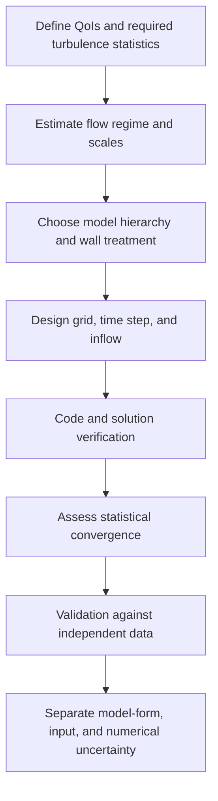



Un modelo de turbulencia no es un menú para elegir "el modelo exacto".
Es una elección del promedio, el filtrado y los supuestos utilizados para cerrar los efectos de las escalas no resueltas.
Por lo tanto, antes de preguntar sobre el costo y la precisión, pregunte **qué información se descarta**.

## 1. Por qué la turbulencia es difícil

Las ecuaciones incompresibles de Navier-Stokes son

$$
\frac{\partial\mathbf u}{\partial t}
+\mathbf u\cdot\nabla\mathbf u
=-\frac{1}{\rho}\nabla p+\nu\nabla^2\mathbf u,
\qquad
\nabla\cdot\mathbf u=0
$$

.
El término de advección no lineal produce transferencia de energía entre escalas.
La energía cinética inyectada en estructuras grandes se transfiere progresivamente a escalas más pequeñas y se disipa por viscosidad cercana a la escala de Kolmogorov.

El número adimensional representativo es el número de Reynolds.

$$
\mathrm{Re}=\frac{UL}{\nu}.
$$

Con números de Reynolds elevados, la brecha entre las escalas más grande y más pequeña crece, lo que dificulta la resolución de cada escala directamente.

## 2. Promediar y filtrar plantean preguntas diferentes

### Promedio de Reynolds

Descomponga la velocidad en una media y una fluctuación.

$$
u_i=\overline{u}_i+u_i',
\qquad
\overline{u_i'}=0.
$$

La tensión de Reynolds aparece en la ecuación del momento medio.

$$
\frac{\partial\overline u_i}{\partial t}
+\overline u_j\frac{\partial\overline u_i}{\partial x_j}
=-\frac{1}{\rho}\frac{\partial\overline p}{\partial x_i}
+\nu\frac{\partial^2\overline u_i}{\partial x_j^2}
-\frac{\partial\overline{u_i'u_j'}}{\partial x_j}.
$$

La aparición del nuevo desconocido \(-\overline{u_i'u_j'}\) es el problema de cierre.

### Filtrado espacial

LES resuelve remolinos mayores que el ancho del filtro y modela el efecto de escalas más pequeñas como estrés a escala de subcuadrícula.

$$
\tau_{ij}^{sgs}=\overline{u_i u_j}-\bar u_i\bar u_j.
$$

El filtro está entrelazado con la rejilla y la discretización reales, por lo que un filtro nominal por sí solo no garantiza una separación exacta.

## 3. DNS: Los límites de llamarlo cálculo sin modelo

DNS intenta resolver cada escala dinámica sin un modelo de turbulencia.
Sin embargo, persisten las siguientes opciones y errores.

- ecuación rectora y supuesto constitutivo
- dominio y condición de frontera
- discretización espacial y temporal
- tamaño del dominio y duración del muestreo
- eliminación del transitorio inicial
- error de convergencia estadística

DNS reduce el error del modelo de cierre, pero no es "la verdad completa de la realidad".
Su coste aumenta considerablemente, especialmente para geometrías complejas y números de Reynolds elevados.

## 4. RANS: Predicción directa de cantidades medias

La hipótesis de la viscosidad turbulenta relaciona la tensión de Reynolds anisotrópica con la deformación media.

$$
-\overline{u_i'u_j'}
=2\nu_t S_{ij}-\frac{2}{3}k\delta_{ij},
$$

$$
S_{ij}=\frac{1}{2}
\left(
\frac{\partial\overline u_i}{\partial x_j}
+\frac{\partial\overline u_j}{\partial x_i}
\right).
$$

Esta suposición es computacionalmente eficiente, pero comprime sustancialmente la información direccional en la tensión de Reynolds en una única viscosidad de remolino escalar.
Sus limitaciones pueden volverse pronunciadas bajo fuerte rotación, curvatura, separación, turbulencia de desequilibrio y anisotropía sustancial.

### Preguntas para las familias representativas RANS

- modelo de una ecuación: ¿Cómo se construye la viscosidad turbulenta a partir de una única variable de transporte?
- modelo de dos ecuaciones: ¿Cómo se transportan \(k\) y la escala de disipación?
- Modelo de tensión de Reynolds: ¿Cuánta anisotropía se conserva al resolver los propios componentes de la tensión?
- modelo de transición: ¿Qué correlaciones y variables representan una transición laminar-turbulenta?

Más que el nombre del modelo, examine el rango de aplicación, la formulación cerca de la pared, la especificación de turbulencia de entrada y la corrección de compresibilidad.

## 5. LES: Computación de estructuras grandes y modelado de estructuras pequeñas

La clave para LES es una resolución espacial y temporal suficiente de la turbulencia resuelta.
Cambiar solo el modelo SGS no convierte el RANS basto e inestable en LES.

Un modelo de viscosidad turbulenta SGS normalmente tiene la forma

$$
\tau_{ij}^{sgs}-\frac{1}{3}\tau_{kk}^{sgs}\delta_{ij}
=-2\nu_{sgs}\bar S_{ij}
$$

.
Un procedimiento dinámico estima los coeficientes del modelo a partir de información local o promediada.
La conmutación del filtro, la retrodispersión, el comportamiento cerca de la pared y la disipación numérica siguen teniendo efecto.

## 6. Los muros dominan el costo y el error

Cerca de una pared se encuentran la subcapa viscosa, la capa amortiguadora y la capa logarítmica.
La coordenada de la pared está definida por

$$
y^+=\frac{u_\tau y}{\nu},
\qquad
u_\tau=\sqrt{\tau_w/\rho}
$$

.

### Enfoque resuelto en la pared

Resuelva estructuras cercanas a la pared directamente a través de la primera celda y la resolución paralela a la pared.
El costo es alto, mientras que la anisotropía de la red y las limitaciones de tiempo son severas.

### Enfoque modelado en pared

Conecte la pared y el primer punto resuelto con un modelo de pared.
Esto reduce el costo, pero introduce incertidumbre en la forma del modelo para los gradientes de presión, la separación, la rugosidad y la transferencia de calor.

### RANS Función de pared

A menudo depende de una ley logarítmica y de un supuesto de equilibrio.
Compruebe si la primera celda se encuentra dentro de la capa deseada y si los cambios en la cuadrícula hacen que la región de fusión sea sensible.

## 7. Criterios para elegir RANS, LES o DNS

| Criterio | RANS | LES | DNS |
|---|---|---|---|
| Información obtenida directamente | Principalmente campos medios | Grandes estructuras y estadísticas inestables | Todas las escalas resueltas |
| Alcance del cierre | La mayoría de los efectos de las turbulencias | Escalas de subcuadrícula | Cierre sin turbulencias |
| Costo computacional | Bajo | Alto | Muy alto |
| Carga cerca de la pared | Dependiente del modelo | Muy alto o requiere un modelo de pared | Muy alto |
| Muestreo estadístico | Bajo si estable | Requerido | Requerido |
| Riesgo principal | Sesgo de forma de modelo | Resolución entrelazada, muestreo y efectos SGS | Dominio, muestreo y costo |

La elección comienza con el objetivo.
Depende de si la cantidad de interés es la pérdida de presión media, la frecuencia de una estructura coherente o un punto de referencia de alta calidad.

## 8. El atractivo y el riesgo del híbrido RANS–LES

Un método híbrido equilibra los costos mediante el uso de RANS cerca de las paredes y LES para estructuras grandes separadas.
Sin embargo, la red puede activar un cambio de modo en una ubicación no deseada y puede surgir un agotamiento de la tensión modelada o un área gris.

Plantee las siguientes preguntas explícitamente.

- ¿Qué escala de longitud separa las regiones RANS y LES?
- ¿La red induce el cambio de modelo en un lugar físicamente apropiado?
- ¿Cómo se genera la turbulencia resuelta en la entrada?
- ¿El contenido de estrés y energía es continuo en toda la interfaz?

## 9. Convergencia estadística

El promedio de tiempo de un cálculo inestable,

$$
\langle q\rangle_T=\frac{1}{T}\int_{t_0}^{t_0+T}q(t)\,dt
$$

, es una muestra finita.
Incluso cuando el recuento de muestra aparente es grande, una autocorrelación fuerte hace que el recuento de muestra efectivo sea pequeño.

Si el tiempo de correlación integral es \(\tau_{int}\), se puede pensar conceptualmente en términos de

$$
N_{eff}\sim\frac{T}{2\tau_{int}}
$$

.
Informe no sólo la media, sino también los intervalos de confianza, los cambios en los promedios de bloques y la estabilidad del espectro en baja frecuencia.

## 10. Cómo manejar la incertidumbre modelo-forma

Ejecutar varios modelos y presentar solo su distribución es simplemente un punto de partida.
Si esos modelos comparten los mismos supuestos estructurales, el diferencial puede subestimar la verdadera incertidumbre.

Separar las fuentes de incertidumbre.

- estructura de cierre
- coeficientes y dominio de calibración
- turbulencia de entrada
- tratamiento de paredes y rugosidad
- disipación numérica
- ancho de malla y filtro
- incertidumbre del muestreo
- truncamiento de límites y dominios

Enfoques como la perturbación del espacio propio de RANS tensión de Reynolds, la incertidumbre del coeficiente y el promedio del modelo bayesiano son posibles, pero sus resultados dependen de la definición previa y de las perturbaciones admisibles.

## 11. Flujo de trabajo de verificación y validación

1. Anote las QoI reales entre la media, RMS, el espectro y el flujo de pared.
2. Diseñe la cuadrícula alrededor de las ubicaciones esperadas de las capas límite y de corte.
3. Hacer coincidir no sólo la intensidad de la turbulencia de entrada, sino también su duración y escalas de tiempo.
4. Separe el intervalo de eliminación de transitorios del intervalo de muestreo.
5. Compare las variaciones de cuadrícula, paso de tiempo y modelo paso a paso en lugar de mezclarlas todas a la vez.
6. Haga coincidir el filtrado espacial y temporal de los datos de validación con la definición del resultado calculado.

## 12. Lista de verificación de validación

- [ ] Las cantidades predichas por el modelo coinciden con las QoI requeridas.
- [ ] Se informa el número de Reynolds y los principales grupos adimensionales.
- [ ] Se documentan las fuentes de las variables de turbulencia de entrada y las escalas de longitud.
- [ ] La malla cercana a la pared es consistente con el tratamiento de la pared.
- [ ] \(y^+\) se examina como una distribución en lugar de un promedio único.
- [ ] La fracción de energía resuelta y el espectro se examinan en LES.
- [ ] El tamaño del dominio no limita las grandes estructuras.
- [ ] El paso de tiempo resuelve la dinámica relevante más rápida.
- [ ] El transitorio inicial se excluye del muestreo.
- [ ] Se presenta el error estadístico que da cuenta de la autocorrelación.
- [ ] Se ha intentado distinguir la difusión numérica de SGS o disipación de cierre.
- [ ] Se ha evaluado al menos la sensibilidad de una forma de modelo.

## 13. Patrones de fallas y limitaciones comunes

### Evaluación de toda la cuadrícula frente a un único objetivo \(y^+\)

Además de la primera celda normal de la pared, el espaciamiento en sentido de la corriente y del tramo, la tasa de crecimiento y la resolución en las regiones de separación son importantes.

### Validando constante RANS usando solo residuos

La convergencia iterativa numérica no es evidencia de que un modelo de cierre reproduzca la realidad.

### Llamar a un cálculo aproximado LES

Sin un espectro resuelto, actividad SGS y sensibilidad de la red, se desconoce la calidad de la turbulencia resuelta.

### Comparación directa de un punto experimental con un punto de celda

El promedio espacial y temporal del dispositivo de medición debe coincidir con el operador de muestreo computacional.

### Tratar cada diferencia entre modelos como una banda de incertidumbre

No hay garantía de que el conjunto modelo represente las estructuras posibles.
Indique qué significa la banda y qué incertidumbres omite.

## 14. Referencias oficiales y primarias

- Reynolds, O., “Sobre la teoría dinámica de los fluidos viscosos incompresibles”, 1895.
- Kolmogorov, A. N., “La estructura local de la turbulencia en un fluido viscoso incompresible”, 1941.
- Smagorinsky, J., “Experimentos de circulación general con ecuaciones primitivas”, 1963.
- Germano et al., “Un modelo dinámico de viscosidad de remolino a escala de subred”, 1991.
- NASA Recurso de modelado de turbulencias, [Modelos, casos de verificación y datos de validación](https://turbmodels.larc.nasa.gov/).
- NASA CFD Visión 2030, [Hoja de ruta de investigación](https://ntrs.nasa.gov/citations/20140003093).

La mejor pregunta al elegir un modelo de turbulencia no es "¿Qué modelo es mejor?"
Es **¿Qué escalas se resolverán, qué información se confiará al modelo y cómo aparecerá esa elección en la incertidumbre del QoI?**
