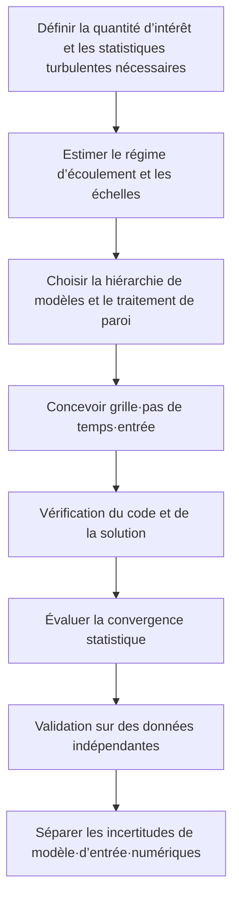



Un modèle de turbulence n’est pas un menu dans lequel il suffirait de choisir « le modèle exact ».
Il s’agit de décider par quelle moyenne, quel filtre et quelles hypothèses fermer l’effet des échelles non résolues.
Avant même le coût et la précision, il faut donc demander **quelles informations sont abandonnées**.

## 1. Pourquoi la turbulence est difficile

Les équations de Navier–Stokes incompressibles s’écrivent

$$
\frac{\partial\mathbf u}{\partial t}
+\mathbf u\cdot\nabla\mathbf u
=-\frac{1}{\rho}\nabla p+\nu\nabla^2\mathbf u,
\qquad
\nabla\cdot\mathbf u=0
$$

Le terme convectif non linéaire engendre un transfert d’énergie entre les échelles.
L’énergie cinétique injectée dans les grandes structures passe progressivement aux petites échelles, puis se dissipe par viscosité près de l’échelle de Kolmogorov.

Le nombre sans dimension représentatif est celui de Reynolds.

$$
\mathrm{Re}=\frac{UL}{\nu}.
$$

À grand nombre de Reynolds, l’écart entre la plus grande et la plus petite échelle s’accroît, ce qui rend difficile leur résolution directe intégrale.

## 2. Moyenne et filtrage posent des questions différentes

### Moyenne de Reynolds

On décompose la vitesse en moyenne et fluctuation.

$$
u_i=\overline{u}_i+u_i',
\qquad
\overline{u_i'}=0.
$$

Les contraintes de Reynolds apparaissent alors dans l’équation de quantité de mouvement moyenne.

$$
\frac{\partial\overline u_i}{\partial t}
+\overline u_j\frac{\partial\overline u_i}{\partial x_j}
=-\frac{1}{\rho}\frac{\partial\overline p}{\partial x_i}
+\nu\frac{\partial^2\overline u_i}{\partial x_j^2}
-\frac{\partial\overline{u_i'u_j'}}{\partial x_j}.
$$

L’apparition de nouvelles inconnues (-\overline{u_i'u_j'}) constitue le problème de fermeture.

### Filtrage spatial

La LES résout les tourbillons plus grands que la largeur du filtre et modélise l’effet des petites échelles sous forme de contraintes de sous-maille.

$$
\tau_{ij}^{sgs}=\overline{u_i u_j}-\bar u_i\bar u_j.
$$

Le filtre étant imbriqué avec la grille et la discrétisation réelles, le seul filtre nominal ne garantit pas une séparation exacte.

## 3. DNS : limites de l’expression « calcul sans modèle »

La DNS cherche à résoudre toutes les échelles dynamiques sans modèle de turbulence.
Les choix et erreurs suivants subsistent néanmoins.

- équations gouvernantes et hypothèses constitutives ;
- domaine et conditions aux limites ;
- discrétisation spatiale et temporelle ;
- taille du domaine et durée d’échantillonnage ;
- élimination du régime transitoire initial ;
- erreur de convergence statistique.

La DNS réduit l’erreur du modèle de fermeture, mais n’est pas pour autant « la vérité parfaite du réel ».
Son coût augmente très rapidement, en particulier pour les géométries complexes et les grands nombres de Reynolds.

## 4. RANS : prédire directement les grandeurs moyennes

L’hypothèse de viscosité turbulente relie les contraintes de Reynolds anisotropes à la déformation moyenne.

$$
-\overline{u_i'u_j'}
=2\nu_t S_{ij}-\frac{2}{3}k\delta_{ij},
$$

$$
S_{ij}=\frac{1}{2}
\left(
\frac{\partial\overline u_i}{\partial x_j}
+\frac{\partial\overline u_j}{\partial x_i}
\right).
$$

Cette hypothèse est efficace sur le plan du calcul, mais comprime fortement l’information directionnelle des contraintes de Reynolds en une unique viscosité turbulente scalaire.
Ses limites peuvent devenir manifestes en présence d’une forte rotation, d’une courbure, d’un décollement, d’une turbulence hors équilibre ou d’une grande anisotropie.

### Questions propres aux principales familles RANS

- Modèle à une équation : quelle variable de transport sert à construire la viscosité turbulente ?
- Modèle à deux équations : comment transporte-t-on (k) et l’échelle de dissipation ?
- Modèle aux contraintes de Reynolds : dans quelle mesure l’anisotropie est-elle préservée en résolvant directement les composantes des contraintes ?
- Modèle de transition : quelles corrélations et variables représentent le passage laminaire–turbulent ?

Plus que le nom du modèle, il faut vérifier son domaine d’application, sa formulation près de la paroi, la spécification de la turbulence à l’entrée et les corrections de compressibilité.

## 5. LES : calculer les grandes structures et modéliser les petites

Le principe essentiel de la LES consiste à fournir à la turbulence résolue une résolution spatio-temporelle suffisante.
Le simple remplacement du modèle SGS ne transforme pas une RANS instationnaire grossière en LES.

Un modèle SGS à viscosité turbulente prend généralement la forme

$$
\tau_{ij}^{sgs}-\frac{1}{3}\tau_{kk}^{sgs}\delta_{ij}
=-2\nu_{sgs}\bar S_{ij}
$$

La procédure dynamique estime le coefficient du modèle à partir d’informations locales ou moyennées.
La commutation du filtre, le transfert inverse, le comportement près des parois et la dissipation numérique continuent cependant d’influencer le résultat.

## 6. La paroi domine le coût et l’erreur

À proximité d’une paroi se trouvent la sous-couche visqueuse, la couche tampon et la couche logarithmique.
La coordonnée de paroi est définie par

$$
y^+=\frac{u_\tau y}{\nu},
\qquad
u_\tau=\sqrt{\tau_w/\rho}
$$

### Approche résolue jusqu’à la paroi

La première cellule et la résolution parallèle à la paroi permettent de résoudre directement les structures proches de celle-ci.
Le coût est élevé, l’anisotropie de la grille importante et la contrainte sur le pas de temps sévère.

### Approche avec modèle de paroi

Un modèle relie la paroi au premier point résolu.
Le coût diminue, mais des incertitudes de modèle apparaissent pour le gradient de pression, le décollement, la rugosité et les transferts thermiques.

### Fonction de paroi en RANS

Elle repose souvent sur la loi logarithmique et une hypothèse d’équilibre.
Il faut vérifier que la première cellule se trouve dans la couche visée et que le résultat ne devient pas excessivement sensible au changement de grille dans la zone de raccordement.

## 7. Critères de choix entre RANS, LES et DNS

| Critère | RANS | LES | DNS |
|---|---|---|---|
| Information obtenue directement | principalement le champ moyen | grandes structures instationnaires et statistiques | toutes les échelles résolues |
| Étendue de la fermeture | majeure partie des effets turbulents | échelles de sous-maille | aucune fermeture turbulente |
| Coût de calcul | faible | élevé | très élevé |
| Charge près des parois | dépend du modèle | très grande ou modèle de paroi | très grande |
| Échantillonnage statistique | faible si stationnaire | indispensable | indispensable |
| Risque principal | biais de forme du modèle | combinaison résolution·échantillonnage·SGS | domaine·échantillonnage·coût |

Le choix part de l’objectif.
Il diffère selon que la quantité d’intérêt est la perte de pression moyenne, la fréquence d’une structure cohérente ou la production d’une référence de haute qualité.

## 8. Atouts et risques des méthodes hybrides RANS–LES

Une méthode hybride emploie la RANS près des parois et la LES pour les grandes structures détachées afin d’arbitrer le coût.
Toutefois, la grille peut déclencher involontairement le changement de mode, et provoquer un appauvrissement des contraintes modélisées ou une zone grise.

Les questions suivantes doivent être explicitées.

- Quelle échelle de longueur sépare les zones RANS et LES ?
- La grille provoque-t-elle le changement de modèle à un emplacement physiquement pertinent ?
- Comment la turbulence résolue est-elle générée à l’entrée ?
- Les contraintes et le contenu énergétique sont-ils continus à l’interface ?

## 9. Convergence statistique

La moyenne temporelle d’un calcul instationnaire

$$
\langle q\rangle_T=\frac{1}{T}\int_{t_0}^{t_0+T}q(t)\,dt
$$

est un échantillon fini.
Même lorsque le nombre d’échantillons paraît grand, une autocorrélation forte réduit leur nombre effectif.

Si l’on note le temps de corrélation intégré (\tau_{int}), on peut concevoir approximativement

$$
N_{eff}\sim\frac{T}{2\tau_{int}}
$$

Il faut présenter non seulement la moyenne, mais aussi l’intervalle de confiance, la variation des moyennes par blocs et la stabilité du spectre aux basses fréquences.

## 10. Traiter l’incertitude de modèle

Exécuter plusieurs modèles et ne présenter que leur dispersion n’est qu’un début.
S’ils partagent les mêmes hypothèses structurelles, cette dispersion peut sous-estimer l’incertitude réelle.

Il faut séparer les sources d’incertitude.

- structure de la fermeture ;
- coefficients et domaine d’étalonnage ;
- turbulence à l’entrée ;
- traitement de la paroi et rugosité ;
- dissipation numérique ;
- maillage et largeur de filtre ;
- incertitude d’échantillonnage ;
- troncature des frontières et du domaine.

Des approches comme la perturbation de l’espace propre des contraintes de Reynolds en RANS, l’incertitude des coefficients ou la moyenne bayésienne de modèles sont possibles, mais leurs résultats dépendent de l’a priori et de la définition des perturbations admissibles.

## 11. Processus de vérification et de validation

1. Préciser la véritable quantité d’intérêt parmi moyenne, RMS, spectre et flux pariétal.
2. Concevoir la grille à partir de la position attendue des couches limites et des couches de cisaillement.
3. Faire correspondre non seulement l’intensité de la turbulence d’entrée, mais aussi ses échelles de longueur et de temps.
4. Séparer l’intervalle d’élimination du transitoire de l’intervalle d’échantillonnage.
5. Comparer progressivement la grille, le pas de temps et les variantes de modèle plutôt que de les modifier simultanément.
6. Faire correspondre les filtres spatiaux et temporels des données de validation à la définition des résultats calculés.

## 12. Liste de contrôle de la validation

- [ ] La grandeur prédite par le modèle correspond à la quantité d’intérêt requise.
- [ ] Le nombre de Reynolds et les principaux groupes sans dimension sont indiqués.
- [ ] La provenance des variables et de l’échelle de longueur de la turbulence d’entrée est connue.
- [ ] Le maillage près de la paroi et son traitement sont cohérents.
- [ ] La distribution de (y^+) est contrôlée, et non une moyenne unique.
- [ ] Pour une LES, la part d’énergie résolue et le spectre ont été examinés.
- [ ] Il a été vérifié que la taille du domaine ne contraint pas les grandes structures.
- [ ] Le pas de temps résout la dynamique pertinente la plus rapide.
- [ ] Le régime transitoire initial est exclu de l’échantillonnage.
- [ ] L’erreur statistique présentée tient compte de l’autocorrélation.
- [ ] Une distinction entre diffusion numérique et dissipation SGS ou de fermeture a été recherchée.
- [ ] Au moins une sensibilité à la forme du modèle a été évaluée.

## 13. Échecs fréquents et limites

### Évaluer tout le maillage à partir d’une seule cible de (y^+)

Outre la première cellule normale à la paroi, l’espacement longitudinal et transversal, le taux de croissance et la résolution de la zone de décollement sont importants.

### Valider une RANS stationnaire sur le seul résidu

La convergence des itérations numériques ne prouve pas que le modèle de fermeture reproduit la réalité.

### Appeler LES un calcul grossier

Sans spectre résolu, activité SGS ni sensibilité à la grille, la qualité de la turbulence résolue reste inconnue.

### Comparer directement un point expérimental à un point de cellule

Les moyennes spatiales et temporelles de l’instrument de mesure doivent correspondre à l’opérateur d’échantillonnage du calcul.

### Traiter tout écart entre modèles comme une bande d’incertitude

Rien ne garantit que l’ensemble des modèles représente toutes les structures possibles.
Il faut expliciter le sens de la bande et les incertitudes omises.

## 14. Références officielles et sources originales

- Reynolds, O., « Sur la théorie dynamique des fluides visqueux incompressibles », 1895.
- Kolmogorov, A. N., « La structure locale de la turbulence dans un fluide visqueux incompressible », 1941.
- Smagorinsky, J., « Expériences de circulation générale avec les équations primitives », 1963.
- Germano et al., « Un modèle dynamique de viscosité turbulente de sous-maille », 1991.
- Ressources de la NASA sur la modélisation de la turbulence, [modèles, cas de vérification et données de validation](https://turbmodels.larc.nasa.gov/).
- NASA CFD Vision 2030, [feuille de route de la recherche](https://ntrs.nasa.gov/citations/20140003093).

La meilleure question à poser pour choisir un modèle de turbulence n’est pas « quel est le meilleur modèle ? ».
C’est : **quelles échelles sont résolues, quelles informations sont confiées au modèle et comment ce choix se manifeste-t-il dans l’incertitude de la quantité d’intérêt ?**
