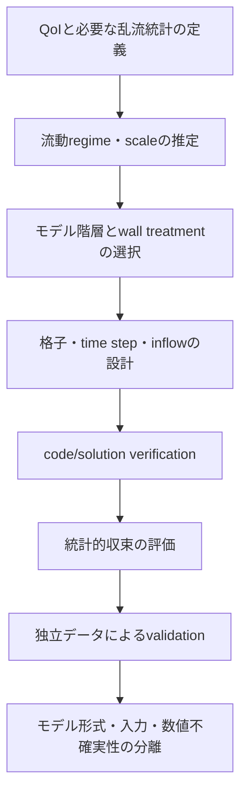



乱流モデルは「正確なモデルを選ぶメニュー」ではない。
解像しないscaleの影響を、どの平均、フィルタ、仮定で閉じるかを選ぶものである。
したがって、コストと精度だけでなく、**どの情報を捨てるのか**を最初に問う必要がある。

## 1. 乱流が難しい理由

非圧縮性Navier–Stokes方程式は

$$
\frac{\partial\mathbf u}{\partial t}
+\mathbf u\cdot\nabla\mathbf u
=-\frac{1}{\rho}\nabla p+\nu\nabla^2\mathbf u,
\qquad
\nabla\cdot\mathbf u=0
$$

である。
非線形対流項はscale間のエネルギー輸送を生み出す。
大きな構造へ注入された運動エネルギーは徐々に小さなscaleへ移り、Kolmogorov scale付近で粘性によって散逸する。

代表的な無次元数はReynolds数である。

$$
\mathrm{Re}=\frac{UL}{\nu}.
$$

高いReynolds数では最大scaleと最小scaleの隔たりが大きくなり、すべてのscaleを直接解像することが難しい。

## 2. 平均とフィルタは異なる問いを作る

### Reynolds averaging

速度を平均とfluctuationに分ける。

$$
u_i=\overline{u}_i+u_i',
\qquad
\overline{u_i'}=0.
$$

平均運動量方程式にはReynolds stressが現れる。

$$
\frac{\partial\overline u_i}{\partial t}
+\overline u_j\frac{\partial\overline u_i}{\partial x_j}
=-\frac{1}{\rho}\frac{\partial\overline p}{\partial x_i}
+\nu\frac{\partial^2\overline u_i}{\partial x_j^2}
-\frac{\partial\overline{u_i'u_j'}}{\partial x_j}.
$$

新たな未知量 \(-\overline{u_i'u_j'}\) が生じることがclosure problemである。

### Spatial filtering

LESはfilter widthより大きいeddyを解像し、小さなscaleの影響をsubgrid-scale stressとしてモデル化する。

$$
\tau_{ij}^{sgs}=\overline{u_i u_j}-\bar u_i\bar u_j.
$$

フィルタは実際の格子・discretizationと絡み合うため、名目上のfilterだけでは正確な分離を保証できない。

## 3. DNS：「モデルのない計算」という表現の限界

DNSは乱流モデルを使わず、すべての動力学的scaleを解像しようとする。
しかし、それでも次の選択と誤差が残る。

- governing equationとconstitutive assumption
- domainとboundary condition
- 空間・時間discretization
- domain sizeとsampling duration
- 初期transientの除去
- 統計的収束誤差

DNSはclosure model errorを減らすが、「現実の完全な真実」ではない。
特に複雑形状と高いReynolds数では、コストが急激に増大する。

## 4. RANS：平均量を直接予測する

eddy-viscosity仮説はanisotropic Reynolds stressを平均strainと結び付ける。

$$
-\overline{u_i'u_j'}
=2\nu_t S_{ij}-\frac{2}{3}k\delta_{ij},
$$

$$
S_{ij}=\frac{1}{2}
\left(
\frac{\partial\overline u_i}{\partial x_j}
+\frac{\partial\overline u_j}{\partial x_i}
\right).
$$

この仮定は計算効率が高い一方、Reynolds stressの方向情報を一つのscalar eddy viscosityへ大幅に圧縮する。
強い回転、曲率、separation、非平衡乱流、大きなanisotropyでは、限界が顕著になり得る。

### 代表的なRANS系列で問うべきこと

- one-equation model：どの一つのtransport variableからeddy viscosityを構成するか。
- two-equation model：\(k\) とdissipation scaleをどのように輸送するか。
- Reynolds-stress model：stress component自体を解いてanisotropyをどこまで保つか。
- transition model：laminar–turbulent遷移をどのcorrelationと変数で表すか。

モデル名よりも、適用範囲、near-wall formulation、inlet turbulence specification、compressibility correctionを確認する必要がある。

## 5. LES：大きな構造を計算し、小さな構造をモデル化する

LESの核心は、resolved turbulenceが十分な時空間解像度を持つことである。
SGS modelだけを変えても、coarse unsteady RANSがLESになるわけではない。

eddy-viscosity SGS modelは通常、

$$
\tau_{ij}^{sgs}-\frac{1}{3}\tau_{kk}^{sgs}\delta_{ij}
=-2\nu_{sgs}\bar S_{ij}
$$

という形をとる。
dynamic procedureは局所情報または平均化した情報からmodel coefficientを推定する。
ただし、filter commutation、backscatter、near-wall behavior、numerical dissipationは依然として影響する。

## 6. 壁面がコストと誤差を支配する

壁面近傍にはviscous sublayer、buffer layer、logarithmic layerが存在する。
wall coordinateは

$$
y^+=\frac{u_\tau y}{\nu},
\qquad
u_\tau=\sqrt{\tau_w/\rho}
$$

で定義する。

### wall-resolvedアプローチ

最初のセルと壁面平行方向の解像度によってnear-wall structureを直接解像する。
コストが高く、grid anisotropyとtime stepへの制限が厳しい。

### wall-modeledアプローチ

壁面と最初の解像点の間をwall modelで結ぶ。
コストは下がるが、pressure gradient、separation、roughness、heat transferにモデル形式の不確実性が生じる。

### RANS wall function

log-lawとequilibrium assumptionに依存する場合が多い。
最初のセルがintended layerに入っているか、blending領域で格子変更に敏感でないかを確認する必要がある。

## 7. RANS、LES、DNSを選ぶ基準

| 基準 | RANS | LES | DNS |
|---|---|---|---|
| 直接得られる情報 | 平均場が中心 | 大きな非定常構造と統計 | すべての解像scale |
| closureの範囲 | 乱流効果の大部分 | subgrid scale | 乱流closureなし |
| 計算コスト | 低い | 高い | 非常に高い |
| 壁面近傍の負担 | モデル依存 | 非常に大きい、またはwall model | 非常に大きい |
| 統計sampling | steadyなら低い | 必須 | 必須 |
| 主なリスク | model-form bias | 解像度・sampling・SGSの混在 | domain・sampling・コスト |

選択は目的から始める。
平均pressure lossがQoIなのか、coherent structureの周波数がQoIなのか、高品質なbenchmarkが必要なのかによって異なる。

## 8. hybrid RANS–LESの魅力とリスク

hybrid methodは壁面近傍にRANS、剥離した大きな構造にLESを配置し、コストを折衷する。
ただし、mode switchが格子によって意図しない形で起きることがあり、modeled stress depletionやgray areaが生じ得る。

次の問いを明示する必要がある。

- RANS領域とLES領域をどのlength scaleで区別するか。
- gridがmodel switchを物理的に適切な位置へ導くか。
- inflowでresolved turbulenceをどのように生成するか。
- interfaceでstressとenergy contentが連続しているか。

## 9. 統計的収束

非定常計算の時間平均

$$
\langle q\rangle_T=\frac{1}{T}\int_{t_0}^{t_0+T}q(t)\,dt
$$

は有限sampleである。
sample数が多く見えても、autocorrelationが強ければ有効標本数は少ない。

積分相関時間を \(\tau_{int}\) とすれば、概念的には

$$
N_{eff}\sim\frac{T}{2\tau_{int}}
$$

と考えられる。
平均値だけでなく、confidence interval、block averageの変化、spectrumの低周波安定性を報告する必要がある。

## 10. モデル形式の不確実性を扱う方法

複数のモデルを実行し、spreadだけを示すのは出発点にすぎない。
モデル群が同じ構造仮定を共有していれば、spreadが実際の不確実性を過小評価することがある。

不確実性の原因を分離する。

- closure structure
- coefficientとcalibration domain
- inlet turbulence
- wall treatmentとroughness
- numerical dissipation
- mesh/filter width
- sampling uncertainty
- boundary/domain truncation

RANS Reynolds stressのeigenspace perturbation、coefficient uncertainty、Bayesian model averagingなどのアプローチが可能だが、結果はpriorとadmissible perturbationの定義に依存する。

## 11. 検証・妥当性確認workflow

1. mean、RMS、spectrum、wall fluxのうち、実際のQoIを記す。
2. boundary layerとshear layerの予想位置を基準に格子を設計する。
3. inlet turbulenceのintensityだけでなく、length/time scaleも合わせる。
4. transient除去区間とsampling区間を分ける。
5. grid/time-step/model variationを一度に混ぜず、段階的に比較する。
6. validationデータの空間・時間filteringと計算結果の定義を合わせる。

## 12. 検証チェックリスト

- [ ] モデルが予測するquantityと必要なQoIが一致している。
- [ ] Reynolds数と主要なdimensionless groupを報告した。
- [ ] inlet turbulence variableとlength scaleの出典がある。
- [ ] near-wall meshとwall treatmentが一貫している。
- [ ] \(y^+\) を単一の平均値ではなく、分布として確認した。
- [ ] LESでresolved energyの割合とspectrumを確認した。
- [ ] domain sizeが大きな構造を制限していないか確認した。
- [ ] time stepがfastest relevant dynamicsを解像している。
- [ ] initial transientをsamplingから除外した。
- [ ] autocorrelationを反映した統計誤差を提示した。
- [ ] 数値拡散とSGS/closure dissipationを区別しようとした。
- [ ] 少なくとも一つのmodel-form sensitivityを評価した。

## 13. よくある失敗パターンと限界

### \(y^+\) の目標一つで格子全体を評価する

壁面normal方向の最初のセルだけでなく、streamwise/spanwise spacing、growth rate、separation領域の解像度も重要である。

### steady RANSのresidualだけでvalidationする

数値反復の収束は、closure modelが現実を再現する証拠ではない。

### LESと名付けたcoarse calculation

resolved spectrum、SGS activity、grid sensitivityがなければ、resolved turbulenceの品質は分からない。

### 実験pointとcell pointを直接比較する

測定装置の空間・時間averagingと計算のsampling operatorを一致させる必要がある。

### モデル間の差をすべて不確実性bandとみなす

モデル集合が可能な構造を代表している保証はない。
bandの意味と、含まれていない不確実性を明示しなければならない。

## 14. 公式資料・原典

- Reynolds, O., “On the Dynamical Theory of Incompressible Viscous Fluids,” 1895.
- Kolmogorov, A. N., “The Local Structure of Turbulence in Incompressible Viscous Fluid,” 1941.
- Smagorinsky, J., “General Circulation Experiments with the Primitive Equations,” 1963.
- Germano et al., “A Dynamic Subgrid-Scale Eddy Viscosity Model,” 1991.
- NASA Turbulence Modeling Resource, [Models, verification cases, and validation data](https://turbmodels.larc.nasa.gov/).
- NASA CFD Vision 2030, [Research roadmap](https://ntrs.nasa.gov/citations/20140003093).

乱流モデルを選ぶ際の最善の問いは、「どのモデルが最良か」ではない。
**どのscaleを解像し、どの情報をモデルに委ね、その選択がQoIの不確実性にどう現れるか**である。
