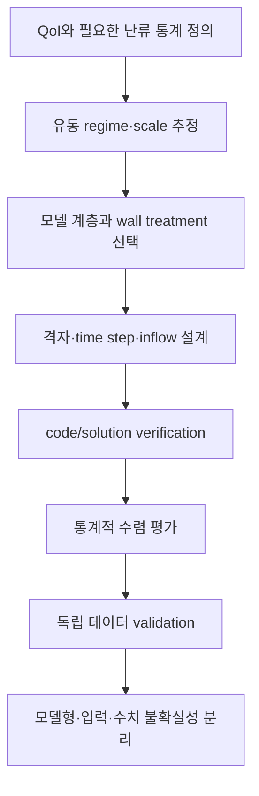



난류모델은 “정확한 모델을 고르는 메뉴”가 아니다.
해상하지 않는 scale의 효과를 어떤 평균, 필터, 가정으로 닫을지 선택하는 일이다.
따라서 비용과 정확도뿐 아니라 **어떤 정보를 버리는가**를 먼저 물어야 한다.

## 1. 난류가 어려운 이유

비압축성 Navier–Stokes 방정식은

$$
\frac{\partial\mathbf u}{\partial t}
+\mathbf u\cdot\nabla\mathbf u
=-\frac{1}{\rho}\nabla p+\nu\nabla^2\mathbf u,
\qquad
\nabla\cdot\mathbf u=0
$$

이다.
비선형 대류항은 scale 사이 에너지 전달을 만든다.
큰 구조에서 주입된 운동에너지가 점차 작은 scale로 전달되고, Kolmogorov scale 부근에서 점성으로 소산된다.

대표 무차원수는 Reynolds 수다.

$$
\mathrm{Re}=\frac{UL}{\nu}.
$$

높은 Reynolds 수에서는 가장 큰 scale과 가장 작은 scale의 격차가 커져 모든 scale을 직접 해상하기 어렵다.

## 2. 평균과 필터는 다른 질문을 만든다

### Reynolds averaging

속도를 평균과 fluctuation으로 나눈다.

$$
u_i=\overline{u}_i+u_i',
\qquad
\overline{u_i'}=0.
$$

평균 운동량 방정식에는 Reynolds stress가 나타난다.

$$
\frac{\partial\overline u_i}{\partial t}
+\overline u_j\frac{\partial\overline u_i}{\partial x_j}
=-\frac{1}{\rho}\frac{\partial\overline p}{\partial x_i}
+\nu\frac{\partial^2\overline u_i}{\partial x_j^2}
-\frac{\partial\overline{u_i'u_j'}}{\partial x_j}.
$$

새로운 미지수 (-\overline{u_i'u_j'})가 생기는 것이 closure problem이다.

### Spatial filtering

LES는 filter width보다 큰 eddy를 해상하고 작은 scale의 효과를 subgrid-scale stress로 모델링한다.

$$
\tau_{ij}^{sgs}=\overline{u_i u_j}-\bar u_i\bar u_j.
$$

필터는 실제 격자·discretization과 얽혀 있어 명목 filter만으로 정확한 분리를 보장하지 않는다.

## 3. DNS: 모델 없는 계산이라는 표현의 한계

DNS는 난류모델 없이 모든 동역학적 scale을 해상하려 한다.
그러나 여전히 다음 선택과 오차가 남는다.

- governing equation과 constitutive assumption
- domain과 boundary condition
- 공간·시간 discretization
- domain size와 sampling duration
- 초기 transient 제거
- 통계적 수렴 오차

DNS는 closure model error를 줄이지만 “현실의 완전한 진실”은 아니다.
특히 복잡한 형상과 높은 Reynolds 수에서는 비용이 급격히 증가한다.

## 4. RANS: 평균량을 직접 예측한다

eddy-viscosity 가설은 anisotropic Reynolds stress를 평균 strain과 연결한다.

$$
-\overline{u_i'u_j'}
=2\nu_t S_{ij}-\frac{2}{3}k\delta_{ij},
$$

$$
S_{ij}=\frac{1}{2}
\left(
\frac{\partial\overline u_i}{\partial x_j}
+\frac{\partial\overline u_j}{\partial x_i}
\right).
$$

이 가정은 계산 효율이 높지만 Reynolds stress의 방향 정보를 하나의 scalar eddy viscosity로 크게 압축한다.
강한 회전, 곡률, separation, 비평형 난류, 큰 anisotropy에서는 한계가 두드러질 수 있다.

### 대표 RANS 계열의 질문

- one-equation model: 어떤 transport variable 하나로 eddy viscosity를 구성하는가?
- two-equation model: (k)와 dissipation scale을 어떻게 운반하는가?
- Reynolds-stress model: stress component 자체를 풀어 anisotropy를 얼마나 보존하는가?
- transition model: laminar–turbulent 전이를 어떤 correlation과 변수로 표현하는가?

모델 이름보다 적용 범위, near-wall formulation, inlet turbulence specification, compressibility correction을 확인해야 한다.

## 5. LES: 큰 구조를 계산하고 작은 구조를 모델링한다

LES의 핵심은 resolved turbulence가 충분한 시공간 해상도를 갖는 것이다.
SGS model만 바꾼다고 coarse unsteady RANS가 LES가 되지는 않는다.

eddy-viscosity SGS model은 보통

$$
\tau_{ij}^{sgs}-\frac{1}{3}\tau_{kk}^{sgs}\delta_{ij}
=-2\nu_{sgs}\bar S_{ij}
$$

형태다.
dynamic procedure는 국소 또는 평균된 정보로 model coefficient를 추정한다.
하지만 filter commutation, backscatter, near-wall behavior, numerical dissipation이 여전히 영향을 준다.

## 6. 벽이 비용과 오차를 지배한다

벽 근처에는 viscous sublayer, buffer layer, logarithmic layer가 존재한다.
wall coordinate는

$$
y^+=\frac{u_\tau y}{\nu},
\qquad
u_\tau=\sqrt{\tau_w/\rho}
$$

로 정의한다.

### wall-resolved 접근

첫 셀과 벽 평행 방향 해상도로 near-wall structure를 직접 해상한다.
비용이 크고 grid anisotropy 및 time step 제한이 강하다.

### wall-modeled 접근

벽과 첫 해상점 사이를 wall model로 연결한다.
비용을 낮추지만 pressure gradient, separation, roughness, heat transfer에서 모델형 불확실성이 생긴다.

### RANS wall function

log-law와 equilibrium assumption에 의존하는 경우가 많다.
첫 셀이 intended layer에 들어가는지, blending 구간에서 격자 변화에 민감하지 않은지 확인해야 한다.

## 7. RANS, LES, DNS를 선택하는 기준

| 기준 | RANS | LES | DNS |
|---|---|---|---|
| 직접 얻는 정보 | 평균장 중심 | 큰 비정상 구조와 통계 | 모든 해상 scale |
| closure 범위 | 대부분 난류 효과 | subgrid scale | 난류 closure 없음 |
| 계산비용 | 낮음 | 높음 | 매우 높음 |
| 벽 근처 부담 | 모델 의존 | 매우 큼 또는 wall model | 매우 큼 |
| 통계 sampling | steady면 낮음 | 필수 | 필수 |
| 주요 위험 | model-form bias | 해상도·sampling·SGS 혼합 | domain·sampling·비용 |

선택은 목적에서 시작한다.
평균 pressure loss가 QoI인지, coherent structure의 주파수가 QoI인지, 고품질 benchmark가 필요한지에 따라 달라진다.

## 8. hybrid RANS–LES의 매력과 위험

hybrid method는 벽 근처에 RANS, 분리된 큰 구조에 LES를 배치해 비용을 절충한다.
하지만 mode switch가 격자에 의해 의도치 않게 발생할 수 있고 modeled stress depletion이나 gray area가 생길 수 있다.

다음 질문을 명시해야 한다.

- RANS와 LES 영역은 어떤 length scale로 구분되는가?
- grid가 model switch를 물리적으로 적절한 곳에 유도하는가?
- inflow에서 resolved turbulence가 어떻게 생성되는가?
- interface에서 stress와 energy content가 연속적인가?

## 9. 통계적 수렴

비정상 계산의 시간평균

$$
\langle q\rangle_T=\frac{1}{T}\int_{t_0}^{t_0+T}q(t)\,dt
$$

은 유한 sample이다.
sample 수가 많아 보여도 autocorrelation이 강하면 유효 표본 수는 작다.

적분 상관시간을 (	au_{int})라 하면 개념적으로

$$
N_{eff}\sim\frac{T}{2\tau_{int}}
$$

로 생각할 수 있다.
평균값뿐 아니라 confidence interval, block average 변화, spectrum의 저주파 안정성을 보고해야 한다.

## 10. 모델형 불확실성을 다루는 법

모델 여러 개를 돌려 spread만 제시하는 것은 시작일 뿐이다.
모델들이 같은 구조 가정을 공유하면 spread가 실제 불확실성을 과소평가할 수 있다.

불확실성 원인을 분리한다.

- closure structure
- coefficient와 calibration domain
- inlet turbulence
- wall treatment와 roughness
- numerical dissipation
- mesh/filter width
- sampling uncertainty
- boundary/domain truncation

RANS Reynolds stress의 eigenspace perturbation, coefficient uncertainty, Bayesian model averaging 같은 접근이 가능하지만 결과는 prior와 admissible perturbation 정의에 의존한다.

## 11. 검증·검증 워크플로

1. mean, RMS, spectrum, wall flux 중 실제 QoI를 적는다.
2. boundary layer와 shear layer의 예상 위치를 기준으로 격자를 설계한다.
3. inlet turbulence의 intensity뿐 아니라 length/time scale을 맞춘다.
4. transient 제거 구간과 sampling 구간을 분리한다.
5. grid/time-step/model variation을 한꺼번에 섞지 말고 단계적으로 비교한다.
6. validation 데이터의 공간·시간 filtering과 계산 결과의 정의를 맞춘다.

## 12. 검증 체크리스트

- [ ] 모델이 예측하는 quantity와 요구 QoI가 일치한다.
- [ ] Reynolds 수와 주요 dimensionless group을 보고했다.
- [ ] inlet turbulence variable과 length scale 출처가 있다.
- [ ] near-wall mesh와 wall treatment가 일관된다.
- [ ] (y^+)를 평균 하나가 아니라 분포로 확인했다.
- [ ] LES에서 resolved energy 비중과 spectrum을 확인했다.
- [ ] domain size가 큰 구조를 제한하지 않는지 확인했다.
- [ ] time step이 fastest relevant dynamics를 해상한다.
- [ ] initial transient를 sampling에서 제외했다.
- [ ] autocorrelation을 반영한 통계 오차를 제시했다.
- [ ] 수치확산과 SGS/closure dissipation을 구분하려 했다.
- [ ] 최소 하나 이상의 model-form sensitivity를 평가했다.

## 13. 자주 실패하는 패턴과 한계

### (y^+) 목표 하나로 격자 전체를 평가

벽 normal 첫 셀 외에도 streamwise/spanwise spacing, growth rate, separation 영역 해상도가 중요하다.

### steady RANS의 residual만으로 validation

수치 반복 수렴은 closure model이 현실을 재현한다는 증거가 아니다.

### LES라고 이름 붙인 coarse calculation

resolved spectrum, SGS activity, grid sensitivity가 없으면 resolved turbulence의 품질을 알 수 없다.

### 실험 point와 cell point를 직접 비교

측정 장비의 공간·시간 averaging과 계산 sampling operator를 맞춰야 한다.

### 모델 간 차이를 모두 불확실성 band로 간주

모델 집합이 가능한 구조를 대표한다는 보장이 없다.
band의 의미와 누락된 불확실성을 명시해야 한다.

## 14. 공식·원전 참고자료

- Reynolds, O., “On the Dynamical Theory of Incompressible Viscous Fluids,” 1895.
- Kolmogorov, A. N., “The Local Structure of Turbulence in Incompressible Viscous Fluid,” 1941.
- Smagorinsky, J., “General Circulation Experiments with the Primitive Equations,” 1963.
- Germano et al., “A Dynamic Subgrid-Scale Eddy Viscosity Model,” 1991.
- NASA Turbulence Modeling Resource, [Models, verification cases, and validation data](https://turbmodels.larc.nasa.gov/).
- NASA CFD Vision 2030, [Research roadmap](https://ntrs.nasa.gov/citations/20140003093).

난류모델 선택의 가장 좋은 질문은 “어느 모델이 최고인가?”가 아니다.
**어떤 scale을 해상하고, 어떤 정보를 모델에 맡기며, 그 선택이 QoI의 불확실성에 어떻게 나타나는가?**이다.
