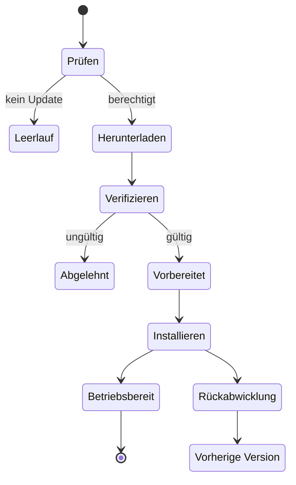
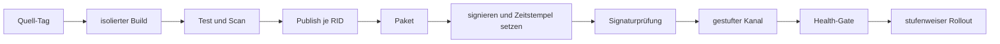



Ein Deployment ist nicht schon deshalb abgeschlossen, weil eine Desktop-Anwendung zu einer einzigen ausführbaren Datei gebündelt wurde.
Installation, Updates, Wiederherstellung, Signierung, Kompatibilität und Supportende müssen als eine zusammenhängende Lieferkette entworfen werden.

Außerdem kann Code, der auf einem Gerät des Benutzers läuft, letztlich beobachtet und verändert werden.
Obfuskation und Anti-Tamper-Maßnahmen erhöhen lediglich den Aufwand; vollständige Vertraulichkeit oder Integrität garantieren sie nicht.

## 1. Zuerst Bedrohungsmodell und Deployment-Modell trennen

Fragen zum Deployment:

- Welche Windows-Versionen und CPU-Architekturen werden unterstützt?
- Wird die Laufzeit mitgeliefert?
- Sind Administratorrechte erforderlich?
- Werden Offline-Installation und Unternehmens-Deployment benötigt?
- Wie sieht der automatische Update-Kanal aus?
- Wie werden Rollback und Supportzeitraum verwaltet?

Sicherheitsfragen:

- Ist der Angreifer ein gewöhnlicher Benutzer, ein lokaler Administrator oder Malware?
- Was soll geschützt werden: ein API-Secret, ein Algorithmus, eine Lizenz oder Benutzerdaten?
- Welches sichere Verhalten ist nach dem Erkennen einer Manipulation erforderlich?
- Was lässt sich offline ohne serverseitige Validierung garantieren?

## 2. Grundlegende Grenzen von WPF

WPF ist ein .NET-Framework für Desktop-Benutzeroberflächen unter Windows.
Es nutzt den Dispatcher des UI-Threads, XAML-Ressourcen, Datenbindung und native Interoperabilität.

Neben verwalteten Assemblies können Deployment-Artefakte Folgendes enthalten:

- .NET-Laufzeit
- native DLLs
- Inhalts-/Ressourcendateien
- Konfiguration
- lokale Datenbank
- Modell-/Datenartefakte
- Installer- und Update-Metadaten

Wird die Dateiliste nicht ausdrücklich inventarisiert, kann die Anwendung in der Entwicklungsumgebung funktionieren und auf einem sauberen Rechner dennoch scheitern.

## 3. Framework-abhängig oder eigenständig

### Framework-abhängig

Auf dem Gerät muss eine kompatible .NET-Laufzeit installiert sein.

- Das Artefakt kann kleiner sein.
- Es profitiert von gemeinsamen Sicherheitsupdates der Laufzeit.
- Es hängt von der vorhandenen Laufzeit und der Richtlinie zum Versions-Roll-forward ab.

### Eigenständig

Die Anwendung liefert die Ziellaufzeit selbst mit.

- Dies verringert die Abhängigkeit von einer Laufzeitinstallation auf dem Gerät.
- Für jedes Betriebssystem und jede Architektur ist ein eigener Publish-Vorgang erforderlich.
- Das Artefakt wird größer, und die Pflege der Laufzeit wird Teil des Anwendungs-Deployments.

Das Mitliefern der Laufzeit macht eine Anwendung nicht dauerhaft sicher.
Wird eine verwundbare Laufzeit entdeckt, muss die Anwendung erneut veröffentlicht und ausgerollt werden.

## 4. Was Single-File-Publishing tatsächlich bedeutet

.NET Single File ist eine Komfortoption für das Deployment; sie beseitigt nicht automatisch sämtliche Dateizugriffe und nativen Abhängigkeiten.
Sie gilt jeweils für ein bestimmtes Betriebssystem und eine bestimmte Architektur, und einige native Bibliotheken können extrahiert werden.

Zu beachten sind unter anderem:

- Verhaltensunterschiede bei APIs wie `Assembly.Location`
- Berücksichtigung von `AppContext.BaseDirectory` beim Zugriff auf Inhalte neben der ausführbaren Datei
- Berechtigungen des Verzeichnisses für native Extraktion
- Dekomprimierungskosten beim Start
- Pfadannahmen in Bibliotheken von Drittanbietern
- Reihenfolge von Signierung und Bündelung

Single File, Trimming und ReadyToRun sollten nicht gleichzeitig aktiviert werden. Jede Kombination ist einzeln auf einem sauberen Rechner zu testen.

## 5. Trimming und Reflection

Trimming entfernt Code, den die statische Analyse als ungenutzt bestimmt.
Statische Erreichbarkeitsanalyse kann WPF-Bindings, XAML, Serializer, Reflection und das Laden von Plugins übersehen.

Trim-Warnungen sollten nicht einfach unterdrückt werden; die Absicht wird mit Root-Deskriptoren, Annotationen, Quellgenerierung und ähnlichen Mechanismen ausgedrückt.
Bei einer Anwendung mit vielen dynamischen Funktionen kann das Kompatibilitätsrisiko größer sein als der Nutzen des Trimmings.

## 6. Die Rolle von MSIX

MSIX stellt Windows-Deployment-Funktionen wie deklarative Paketidentität, Installation und Entfernung, Updates sowie Datei-/Registry-Virtualisierung bereit.
Da nicht jedes Legacy-Verhalten und nicht jede Treiber-/Dienstinstallation auf dieselbe Weise unterstützt wird, müssen Fähigkeiten und Beschränkungen geprüft werden.

Ein MSIX-Paket benötigt für das Deployment eine gültige Signatur, und seine Publisher-Identität muss mit dem Zertifikatssubjekt übereinstimmen.

## 7. Was Code-Signierung garantiert

Eine Signatur hilft zu prüfen, dass die vom Benutzer empfangenen Bytes seit der Signierung unverändert sind und von dem durch das Zertifikat ausgewiesenen Herausgeber signiert wurden.

Was Signierung nicht garantiert:

- dass der Code des Herausgebers sicher ist
- Verhinderung von Laufzeitspeicher-Manipulationen
- Schutz von Secrets vor einem lokalen Administrator
- Schutz gegen einen verwundbaren Update-Server
- automatische Erkennung bösartiger signierter Abhängigkeiten

Der Schutz des privaten Signierschlüssels ist ein Kernbestandteil der Lieferkettensicherheit.

## 8. Zeitstempel

Ein Zeitstempel weist nach, dass die Signatur erstellt wurde, während das Zertifikat gültig war.
Laut Microsoft-Dokumentation kann ein mit Zeitstempel versehenes Paket auch nach Ablauf des Zertifikats anhand des Signierzeitpunkts validiert werden.

Eine Signier-Pipeline folgt üblicherweise dieser Reihenfolge:

1. Reproduzierbarer Release-Build
2. Malware-, Abhängigkeits- und Richtlinienprüfungen
3. Paketerstellung
4. Signierung mit einem geschützten Dienst oder hardwaregestützten Schlüssel
5. Anbringen eines RFC-3161-Zeitstempels
6. Signaturprüfung in einer getrennten Umgebung
7. Veröffentlichung in einem unveränderlichen Release-Repository

Der Signierschlüssel darf weder im Quell-Repository noch in einer gewöhnlichen CI-Umgebungsvariable gespeichert werden.

## 9. Auch die Signatur des Update-Manifests prüfen

Wird nur das Binary signiert, während Update-Metadaten angreifbar bleiben, sind ein Rollback-Angriff oder die Einschleusung einer bösartigen URL möglich.

Der Update-Client sollte Folgendes prüfen:

- Kanal- und Anwendungsidentität
- Version und monotone Rollback-Richtlinie
- Paket-Digest
- Paketsignatur und Vertrauenskette
- Manifestsignatur
- minimal unterstützte Version
- Rollout-Ring und Ablauf
- Downloadgröße und Inhaltstyp

TLS schützt den Transportweg, ersetzt aber nicht die langfristige Herkunftssicherung des Artefakts.

## 10. Ein sicherer Update-Zustandsautomat

Download und Installation werden getrennt, Daten in ein Staging-Verzeichnis geschrieben und das Ergebnis anschließend geprüft.
Mit Fault Injection werden ein Stromausfall während des Vorgangs, eine volle Festplatte, eine Antivirus-Sperre und Dateien getestet, die während der Anwendungsausführung in Gebrauch sind.

## 11. Atomarität und Rollback

Wird die aktuelle Installation während eines Updates direkt überschrieben, entsteht ein Teilzustand.

- versionierte Installationsverzeichnisse
- atomares Umschalten von Zeiger, Symlink oder Registrierung
- eine parallel vorhandene vorige Version
- Vorwärts-/Rückwärtskompatibilität für Schemamigrationen
- Commit nach einem Health-Check

Ist eine Datenbankmigration irreversibel, stellt ein reiner Binary-Rollback das System nicht wieder her.
Ein Expand–Migrate–Contract-Muster und eine Backup-Richtlinie müssen gemeinsam entworfen werden.

## 12. Release-Kanäle

Kanäle wie Stable, Preview und Internal werden getrennt; Geräte dürfen nicht beliebig in einen Kanal mit geringerem Vertrauensniveau wechseln.
Ein gestufter Rollout begrenzt den Schadensradius von Fehlern.

Zu beobachtende Metriken:

- Erfolg bei Update-Erkennung und Download
- Fehler bei der Signaturprüfung
- Installations-/Rollback-Rate
- Startzustand
- absturzfreie Sitzungen
- Versionsverbreitung und nicht mehr unterstützte Population

Telemetrie muss den Grundsätzen minimaler Erhebung, Einwilligung, Aufbewahrung und der Datenschutzrichtlinie entsprechen.

## 13. Lizenzierung ist ein Autorisierungsproblem

Statt einen Lizenzschlüssel durch Komplexität zu verstecken, wird festgelegt, welche Berechtigungen wem und bis wann erteilt werden.

Beispiele für Lizenz-Claims:

- Produkt und Edition
- Feature-Berechtigung
- pseudonyme Subjekt-/Kunden-ID
- Ausgabe-/Ablaufzeitpunkt
- Richtlinie zur Gerätebindung
- Offline-Kulanzzeitraum
- Aussteller und Schlüssel-ID

Claims werden mit dem privaten Schlüssel des Servers signiert, während nur der öffentliche Prüfschlüssel an den Client verteilt wird.
Ein symmetrisches Secret im Client kann extrahiert und zur Fälschung von Lizenzen missbraucht werden.

## 14. Abwägungen bei Offline-Lizenzierung

In einer vollständig offline betriebenen Umgebung sind Echtzeit-Widerruf und Prüfungen gleichzeitiger Nutzung schwierig.

Mögliche Verfahren:

- eine signierte Berechtigung mit langer Gültigkeit
- kurze Gültigkeit mit periodischer Erneuerung
- eine Challenge-Response-Aktivierungsdatei
- ein hardwaregebundener Claim
- ein Floating-License-Server

Ein Hardware-Fingerabdruck verursacht Probleme bei Gerätewechsel und Datenschutz.
Richtlinien für fälschliche Ablehnung, Reaktivierung, Zurücksetzen der Uhr und Notfallwiederherstellung sind gemeinsam zu entwerfen.

## 15. Ein Client-Secret ist kein Secret

Es ist davon auszugehen, dass ein kompetenter Angreifer jeden in einem Binary eingebetteten API-Schlüssel, Verschlüsselungsschlüssel oder jedes Datenbankpasswort extrahieren kann.

Stattdessen:

- Sensible Operationen und langlebige Zugangsdaten verbleiben auf dem Server.
- Einen öffentlichen OAuth-/OIDC-Client-Flow mit PKCE verwenden.
- Benutzerspezifische Token im Anmeldedatentresor des Betriebssystems speichern.
- Kurzlebige Token und Scopes verwenden.
- Berechtigungen und Rate Limits serverseitig validieren.

Obfuskation kann den Analyseaufwand für Namen und Kontrollfluss erhöhen, ist aber kein Schlüsseltresor.

## 16. Praktische Ebenen des Manipulationsschutzes

- Prüfung von Paket-/Assembly-Signaturen
- sichere Updates und Rollback-Schutz
- Integritätsmanifest
- Obfuskation
- Anti-Debugging/Anti-Hooking
- serverseitige Verhaltensvalidierung
- Telemetrie und Anomalieerkennung

Aggressives Anti-Debugging kann Barrierefreiheit, Absturzdiagnose, Fehlalarmrate von Antivirenprogrammen und Wartbarkeit beeinträchtigen.
Anhand des Bedrohungsmodells wird der Schutzwert mit seinen Betriebskosten verglichen.

## 17. Plugins und native Abhängigkeiten

Das Laden von Plugins erweitert die Vertrauensgrenze.

- zugelassenen Herausgeber oder Digest prüfen
- API-Oberfläche minimieren
- in einem getrennten Prozess mit IPC isolieren
- Fähigkeiten einschränken
- Abstürze/Timeouts isolieren
- einen Versionskompatibilitätsvertrag definieren

Um DLL-Search-Order-Hijacking zu verhindern, werden absolute Pfade und sichere Lade-APIs verwendet; beschreibbare Verzeichnisse werden ausgeschlossen.

## 18. Schutz lokaler Daten

Für Benutzerdaten und Token werden Betriebssystem-Kontogrenzen und Verschlüsselung eingesetzt.
Es ist jedoch zu dokumentieren, dass diese Maßnahmen keinen vollständigen Schutz vor einem lokalen Administrator oder dem Laufzeitkontext des aktiven Benutzers bieten.

- Speicherung sensibler Informationen minimieren
- ein ACL-beschränktes benutzerspezifisches Verzeichnis verwenden
- einen vom Betriebssystem geschützten Anmeldedatenspeicher verwenden
- Schlüsselrotation und Bereinigung bei der Abmeldung durchführen
- Logs schwärzen
- eine Crash-Dump-Richtlinie definieren
- Lebenszyklus temporärer Dateien verwalten

## 19. CI/CD-Release-Pipeline

CI-Build-Identität, Quellrevision, Dependency Lock, SDK-Version, Paket-Digest und Signierereignis werden in der Release-Provenienz aufgezeichnet.

## 20. Prüfliste zur Verifikation

- [ ] Die Matrix unterstützter Betriebssysteme, Architekturen und Laufzeiten ist festgelegt.
- [ ] Installation, Start und Deinstallation wurden auf einer sauberen VM getestet.
- [ ] Richtlinien für frameworkabhängige und eigenständige Bereitstellung sind eindeutig.
- [ ] Kompatibilität von Single File, Pfaden und Reflection wurde getestet.
- [ ] Der Paket-Publisher stimmt mit der Zertifikatsidentität überein.
- [ ] Der Signierschlüssel wird nicht langfristig auf dem Build-Agent gespeichert.
- [ ] Zeitstempel und Signatur werden in einem unabhängigen Schritt geprüft.
- [ ] Die Authentizität von Update-Manifest und Binary wird geprüft.
- [ ] Updates wurden bei Stromausfall, voller Festplatte und Netzwerkunterbrechung getestet.
- [ ] Rollback und Datenschema-Kompatibilität wurden verifiziert.
- [ ] Ablauf der Offline-Lizenz, Uhrzeit- und Geräteänderungen wurden getestet.
- [ ] Das Client-Binary enthält kein langlebiges Secret.
- [ ] Logs, Dumps und temporäre Dateien wurden auf sensible Informationen untersucht.
- [ ] Richtlinien für Supportende und erzwungene Mindestversion bestehen.

## 21. Häufige Fehlermuster und Einschränkungen

### Die Annahme, eine einzelne EXE mache Installation überflüssig

Verantwortung für Laufzeit, native Bibliotheken, beschreibbare Pfade, Dateizuordnungen, Updates und Deinstallation bleibt bestehen.

### Der Glaube, Signierung verhindere Reverse Engineering

Signierung verifiziert Authentizität und Integrität, bietet aber keine Vertraulichkeit des Codes.

### Ein API-Secret innerhalb von Obfuskation speichern

Ein zur Ausführung benötigtes Secret erscheint schließlich im Speicher oder auf einem Aufrufpfad.

### Die Annahme, bei automatischen Updates sei das Neueste stets das Beste

Sie können ebenso schnell einen fehlerhaften Release verbreiten.
Ein gestufter Rollout, ein Health-Gate und Rollback sind erforderlich.

### Hardwarebindung zu streng gestalten

Legitime Geräteänderungen können als Angriffe missverstanden werden und Supportkosten sowie Verluste für Benutzer erhöhen.

## 22. Offizielle und primäre Referenzen

- Microsoft, [WPF-Dokumentation](https://learn.microsoft.com/en-us/dotnet/desktop/wpf/).
- Microsoft, [.NET-Single-File-Deployment](https://learn.microsoft.com/en-us/dotnet/core/deploying/single-file/overview).
- Microsoft, [Übersicht zur MSIX-Paketsignierung](https://learn.microsoft.com/en-us/windows/msix/package/signing-package-overview).
- Microsoft, [App-Paket mit SignTool signieren](https://learn.microsoft.com/en-us/windows/msix/package/sign-app-package-using-signtool).
- Microsoft, [.NET-Anwendungs-Deployment](https://learn.microsoft.com/en-us/dotnet/core/deploying/).
- OWASP, [Desktop App Security Top 10](https://owasp.org/www-project-desktop-app-security-top-10/).

Das Ziel von Desktop-Sicherheit ist keine unentzifferbare ausführbare Datei.
Es besteht darin, **Angriffsaufwand und Schadensradius durch überprüfbares Deployment, sichere Updates, serverzentrierte Autorisierung und ehrliche lokale Vertrauensgrenzen zu steuern**.
