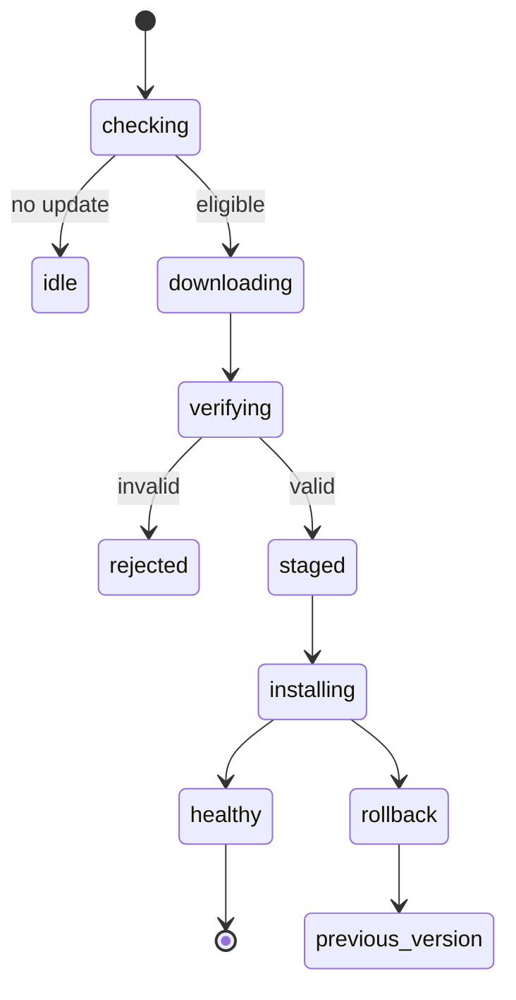
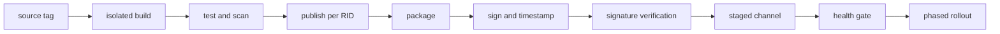



Deployment is not complete just because a desktop app has been bundled into a single executable.
Installation, updates, recovery, signing, compatibility, and end of support must be designed as one supply chain.

Moreover, code running on a user-owned device can ultimately be observed and modified.
Obfuscation and anti-tamper measures merely raise the cost; they do not guarantee complete confidentiality or integrity.

## 1. Separate the threat model from the deployment model first

Deployment questions:

- Which Windows versions and CPU architectures are targeted?
- Will the runtime be included?
- Are administrator privileges required?
- Are offline installation and enterprise deployment required?
- What is the automatic update channel?
- How will rollback and the support period be managed?

Security questions:

- Is the attacker an ordinary user, a local administrator, or malware?
- What needs protection: an API secret, an algorithm, a license, or user data?
- What safe behavior is required after tampering is detected?
- What can be guaranteed offline without server-side validation?

## 2. WPF's fundamental boundaries

WPF is a .NET desktop UI framework for Windows.
It uses the UI thread's Dispatcher, XAML resources, data binding, and native interop.

In addition to managed assemblies, deployment artifacts may include the following:

- .NET runtime
- native DLLs
- content/resource files
- configuration
- local database
- model/data artifacts
- installer and update metadata

Unless the file list is inventoried explicitly, the application may work in the development environment but fail on a clean machine.

## 3. Framework-dependent vs. self-contained

### Framework-dependent

The device must have a compatible .NET runtime.

- The artifact can be smaller.
- It benefits from shared runtime security updates.
- It depends on the runtime being present and on the version roll-forward policy.

### Self-contained

The app distributes the target runtime with itself.

- This reduces dependency on runtime installation on the device.
- Publishing is required for each OS and architecture.
- The artifact grows, and responsibility for runtime servicing becomes part of app deployment.

Including the runtime does not make the application permanently safe.
When a vulnerable runtime is discovered, the app must be republished and redeployed.

## 4. What single-file publish actually means

.NET single-file is a deployment-convenience option; it does not automatically eliminate all file access and native dependencies.
It is specific to an OS and architecture, and some native libraries may be extracted.

Items that require attention include:

- behavioral differences in APIs such as `Assembly.Location`
- considering `AppContext.BaseDirectory` for content access beside the executable
- permissions on the native extraction directory
- startup decompression cost
- path assumptions in third-party libraries
- signing and bundling order

Rather than enabling single-file, trimming, and ReadyToRun all at once, test each combination on a clean machine.

## 5. Trimming and reflection

Trimming removes code that static analysis determines is unused.
Static reachability analysis can miss WPF binding, XAML, serializers, reflection, and plugin loading.

Do not simply suppress trim warnings; express intent with root descriptors, annotations, source generation, and similar mechanisms.
For an app with many dynamic features, the compatibility risk may outweigh the benefits of trimming.

## 6. The role of MSIX

MSIX provides Windows deployment features such as declarative package identity, installation and removal, updates, and file/registry virtualization.
Because not every legacy behavior or driver/service installation is supported in the same way, verify the capabilities and constraints.

An MSIX package needs a valid signature for deployment, and its publisher identity must match the certificate subject.

## 7. What code signing guarantees

A signature helps verify that the bytes received by a user have not changed since signing and that they were signed by the publisher represented by the certificate.

What signing does not guarantee:

- that the publisher's code is safe
- prevention of runtime memory tampering
- protection of secrets from a local administrator
- defense against a vulnerable update server
- automatic detection of malicious signed dependencies

Protecting the private signing key is central to supply-chain security.

## 8. Timestamping

A timestamp provides evidence that the signature was created while the certificate was valid.
According to Microsoft documentation, a timestamped package can be validated based on the signing time even after the certificate expires.

A signing pipeline generally follows this sequence:

1. Reproducible release build
2. Malware, dependency, and policy checks
3. Package creation
4. Signing with a protected service or hardware-backed key
5. Applying an RFC 3161 timestamp
6. Signature verification in a separate environment
7. Publishing to an immutable release repository

Do not store the signing key in the source repository or in an ordinary CI environment variable.

## 9. Verify the update manifest's signature too

If only the binary is signed while update metadata remains attackable, rollback or malicious URL injection becomes possible.

The update client should verify:

- channel and application identity
- version and monotonic rollback policy
- package digest
- package signature and trust chain
- manifest signature
- minimum supported version
- rollout ring and expiration
- download size and content type

TLS protects the transport path, but it does not replace the artifact's long-term provenance.

## 10. A safe update state machine

Separate downloading from installation, write to a staging directory, and then verify the result.
Use fault injection to test a power loss midway through the process, a full disk, an antivirus lock, and files in use while the application is running.

## 11. Atomicity and rollback

Overwriting the current installation directly during an update produces a partial state.

- versioned installation directories
- atomic pointer/symlink/registration switching
- a side-by-side previous version
- forward/backward compatibility for schema migration
- commit after a health check

If a DB migration is irreversible, binary rollback alone will not recover the system.
Design an expand–migrate–contract pattern and a backup policy together.

## 12. Release channels

Separate channels such as stable, preview, and internal, and prevent devices from arbitrarily moving to a lower-trust channel.
A phased rollout reduces the blast radius of failures.

Metrics to observe:

- update discovery and download success
- signature verification failures
- installation/rollback rate
- startup health
- crash-free sessions
- version adoption and the unsupported population

Telemetry must follow the principles of minimal collection, consent, retention, and the privacy policy.

## 13. Licensing is an authorization problem

Instead of hiding a license key through complexity, specify which permissions are granted, to whom, and until when.

Examples of license claims include:

- product and edition
- feature entitlement
- subject/customer pseudonymous ID
- issue/expiration time
- device-binding policy
- offline grace period
- issuer and key ID

Sign claims with the server's private key and distribute only the public verification key to the client.
Putting a symmetric secret in the client allows it to be extracted and abused to forge licenses.

## 14. Trade-offs of offline licensing

In a fully offline environment, real-time revocation and concurrent-use checks are difficult.

Options include:

- a signed entitlement with a long validity period
- a short validity period with periodic renewal
- a challenge-response activation file
- a hardware-bound claim
- a floating license server

A hardware fingerprint creates device-replacement and privacy issues.
Design policies for false rejection, reactivation, clock rollback, and disaster recovery together.

## 15. A client secret is not a secret

Assume that a skilled attacker can extract any API key, encryption key, or database password embedded in a binary.

Instead:

- Keep sensitive operations and long-lived credentials on the server.
- Use an OAuth/OIDC public-client flow with PKCE.
- Store per-user tokens in the OS credential vault.
- Use short-lived tokens and scopes.
- Have the server validate entitlements and rate limits.

Obfuscation can raise the cost of analyzing names and control flow, but it is not a key vault.

## 16. Practical layers of tamper resistance

- package/assembly signature verification
- secure updates and rollback protection
- integrity manifest
- obfuscation
- anti-debugging/anti-hooking
- server-side behavioral validation
- telemetry and anomaly detection

Strong anti-debugging can harm accessibility, crash diagnosis, antivirus false-positive rates, and maintainability.
Use the threat model to compare the value of protection with its operating cost.

## 17. Plugins and native dependencies

Loading plugins broadens the trust boundary.

- check an allowed publisher or digest
- minimize the API surface
- isolate in a separate process with IPC
- restrict capabilities
- isolate crashes/timeouts
- define a version compatibility contract

To avoid DLL search-order hijacking, use absolute paths and safe load APIs, and exclude writable directories.

## 18. Local data protection

Use OS account boundaries and encryption for user data and tokens.
However, document that these measures cannot provide complete defense against a local administrator or the active user's runtime context.

- minimize storage of sensitive information
- use an ACL-restricted per-user directory
- use an OS-protected credential store
- perform key rotation and cleanup on logout
- redact logs
- define a crash-dump policy
- manage the temporary-file lifecycle

## 19. CI/CD release pipeline

Record the CI build identity, source revision, dependency lock, SDK version, package digest, and signing event in the release provenance.

## 20. Verification checklist

- [ ] The supported OS, architecture, and runtime matrix is specified.
- [ ] Installation, launch, and uninstallation have been tested on a clean VM.
- [ ] The framework-dependent and self-contained policies are clear.
- [ ] Single-file, path, and reflection compatibility has been tested.
- [ ] The package publisher matches the certificate identity.
- [ ] The signing key is not stored long-term on the build agent.
- [ ] The timestamp and signature are verified in an independent step.
- [ ] The authenticity of both the update manifest and the binary is verified.
- [ ] Updates have been tested under power loss, disk-full, and network-cut conditions.
- [ ] Rollback and data-schema compatibility have been verified.
- [ ] Offline license expiration, clock changes, and device changes have been tested.
- [ ] The client binary contains no long-lived secret.
- [ ] Logs, dumps, and temporary files have been inspected for sensitive information.
- [ ] There are end-of-support and enforced minimum-version policies.

## 21. Common failure patterns and limitations

### Assuming that a single exe eliminates the need for installation

Responsibilities for the runtime, native libraries, writable paths, file associations, updates, and uninstallation remain.

### Believing that signing prevents reverse engineering

Signing verifies authenticity and integrity, but it does not provide code confidentiality.

### Storing an API secret inside obfuscation

A secret required for execution eventually appears in memory or on a call path.

### Assuming automatic updates always mean the latest is best

They can also spread a broken release quickly.
A staged rollout, health gate, and rollback are required.

### Making hardware binding too strict

Legitimate device changes may be mistaken for attacks, increasing support costs and user losses.

## 22. Official and primary references

- Microsoft, [WPF documentation](https://learn.microsoft.com/en-us/dotnet/desktop/wpf/).
- Microsoft, [.NET single-file deployment](https://learn.microsoft.com/en-us/dotnet/core/deploying/single-file/overview).
- Microsoft, [MSIX package signing overview](https://learn.microsoft.com/en-us/windows/msix/package/signing-package-overview).
- Microsoft, [Sign an app package using SignTool](https://learn.microsoft.com/en-us/windows/msix/package/sign-app-package-using-signtool).
- Microsoft, [.NET application deployment](https://learn.microsoft.com/en-us/dotnet/core/deploying/).
- OWASP, [Desktop App Security Top 10](https://owasp.org/www-project-desktop-app-security-top-10/).

The goal of desktop security is not an indecipherable executable.
It is **to manage attack cost and blast radius by combining verifiable deployment, secure updates, server-centric authorization, and honest local trust boundaries**.
