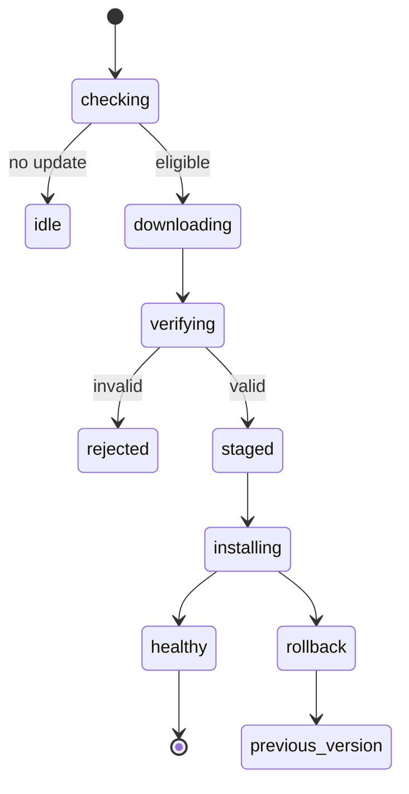
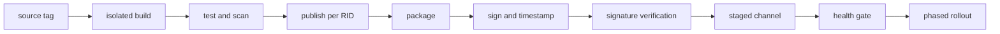



La implementación no está completa solo porque una aplicación de escritorio se haya incluido en un único ejecutable.
La instalación, las actualizaciones, la recuperación, la firma, la compatibilidad y el fin del soporte deben diseñarse como una sola cadena de suministro.

Además, el código que se ejecuta en un dispositivo propiedad del usuario puede, en última instancia, observarse y modificarse.
Las medidas de ofuscación y antimanipulación simplemente aumentan el costo; no garantizan total confidencialidad o integridad.

## 1. Primero separe el modelo de amenaza del modelo de implementación

Preguntas de implementación:

- ¿A qué Windows versiones y CPU arquitecturas se dirigen?
- ¿Se incluirá el tiempo de ejecución?
- ¿Se requieren privilegios de administrador?
- ¿Se requiere instalación fuera de línea e implementación empresarial?
- ¿Cuál es el canal de actualización automática?
- ¿Cómo se gestionará la reversión y el período de soporte?

Preguntas de seguridad:

- ¿El atacante es un usuario normal, un administrador local o un malware?
- ¿Qué necesita protección: un secreto API, un algoritmo, una licencia o datos de usuario?
- ¿Qué comportamiento seguro se requiere después de que se detecta una manipulación?
- ¿Qué se puede garantizar fuera de línea sin validación del lado del servidor?

## 2. Límites fundamentales de WPF

WPF es un marco de escritorio .NET UI para Windows.
Utiliza el despachador del subproceso UI, los recursos XAML, el enlace de datos y la interoperabilidad nativa.

Además de los ensamblados administrados, los artefactos de implementación pueden incluir lo siguiente:

- .NET tiempo de ejecución
- DLL nativas
- archivos de contenido/recursos
- configuración
- base de datos local
- artefactos de modelo/datos
- instalador y actualizar metadatos

A menos que la lista de archivos esté inventariada explícitamente, la aplicación puede funcionar en el entorno de desarrollo pero fallar en una máquina limpia.

## 3. Dependiente del marco versus autónomo

### Depende del marco

El dispositivo debe tener un tiempo de ejecución .NET compatible.

- El artefacto puede ser más pequeño.
- Se beneficia de actualizaciones de seguridad en tiempo de ejecución compartidas.
- Depende de la presencia del tiempo de ejecución y de la política de avance de la versión.

### Autónomo

La aplicación distribuye consigo misma el tiempo de ejecución de destino.

- Esto reduce la dependencia de la instalación del tiempo de ejecución en el dispositivo.
- Se requiere publicación para cada OS y arquitectura.
- El artefacto crece y la responsabilidad del mantenimiento del tiempo de ejecución se convierte en parte de la implementación de la aplicación.

Incluir el tiempo de ejecución no hace que la aplicación sea permanentemente segura.
Cuando se descubre un tiempo de ejecución vulnerable, la aplicación se debe volver a publicar e implementar.

## 4. Qué significa realmente la publicación en un solo archivo

.NET el archivo único es una opción conveniente para la implementación; no elimina automáticamente todo el acceso a archivos y las dependencias nativas.
Es específico de una OS y una arquitectura, y se pueden extraer algunas bibliotecas nativas.

Los elementos que requieren atención incluyen:

- diferencias de comportamiento en API como `Assembly.Location`
- considerando `AppContext.BaseDirectory` para acceder al contenido además del ejecutable
- permisos en el directorio de extracción nativo
- costo de descompresión inicial
- suposiciones de ruta en bibliotecas de terceros
- firma y agrupación de pedidos

En lugar de habilitar la fila única, el recorte y ReadyToRun al mismo tiempo, pruebe cada combinación en una máquina limpia.

## 5. Recorte y reflexión.

El recorte elimina el código que el análisis estático determina que no se utiliza.
El análisis de accesibilidad estática puede omitir el enlace WPF, XAML, los serializadores, la reflexión y la carga de complementos.

No se limite a suprimir las advertencias de ajuste; expresar intención con descriptores raíz, anotaciones, generación de fuentes y mecanismos similares.
Para una aplicación con muchas funciones dinámicas, el riesgo de compatibilidad puede superar los beneficios del recorte.

## 6. El papel de MSIX

MSIX proporciona funciones de implementación Windows como identidad declarativa del paquete, instalación y eliminación, actualizaciones y virtualización de archivos/registro.
Debido a que no todos los comportamientos heredados o la instalación de controladores/servicios se admiten de la misma manera, verifique las capacidades y restricciones.

Un paquete MSIX necesita una firma válida para su implementación y su identidad de editor debe coincidir con el asunto del certificado.

## 7. Qué garantiza la firma de código

Una firma ayuda a verificar que los bytes recibidos por un usuario no hayan cambiado desde la firma y que fueron firmados por el editor representado por el certificado.

Qué no garantiza el fichaje:

- que el código del editor sea seguro
- prevención de manipulación de la memoria en tiempo de ejecución
- protección de secretos de un administrador local
- defensa contra un servidor de actualización vulnerable
- detección automática de dependencias firmadas maliciosas

Proteger la clave de firma privada es fundamental para la seguridad de la cadena de suministro.

## 8. Marca de tiempo

Una marca de tiempo proporciona evidencia de que la firma se creó mientras el certificado era válido.
Según la documentación de Microsoft, un paquete con marca de tiempo se puede validar según el momento de la firma incluso después de que caduque el certificado.

Un proceso de firma generalmente sigue esta secuencia:

1. Versión de lanzamiento reproducible
2. Comprobaciones de políticas, dependencias y malware
3. Creación de paquetes
4. Firmar con un servicio protegido o una clave respaldada por hardware
5. Aplicar una marca de tiempo RFC 3161
6. Verificación de firma en un entorno separado
7. Publicar en un repositorio de versiones inmutable

No almacene la clave de firma en el repositorio de origen ni en una variable de entorno ordinaria CI.

## 9. Verifique también la firma del manifiesto de actualización

Si solo se firma el binario mientras los metadatos de actualización siguen siendo atacables, es posible una reversión o una inyección maliciosa URL.

El cliente de actualización debe verificar:

- identidad del canal y de la aplicación
- versión y política de reversión monótona
- resumen del paquete
- firma del paquete y cadena de confianza
- firma manifiesta
- versión mínima soportada
- anillo desplegable y caducidad
- tamaño de descarga y tipo de contenido

TLS protege la ruta de transporte, pero no reemplaza la procedencia a largo plazo del artefacto.

## 10. Una máquina de estado de actualización segura

Separe la descarga de la instalación, escriba en un directorio provisional y luego verifique el resultado.
Utilice la inyección de fallas para probar una pérdida de energía a mitad del proceso, un disco lleno, un bloqueo antivirus y archivos en uso mientras se ejecuta la aplicación.

## 11. Atomicidad y reversión

Sobrescribir la instalación actual directamente durante una actualización produce un estado parcial.

- directorios de instalación versionados
- puntero atómico/enlace simbólico/cambio de registro
- una versión anterior en paralelo
- compatibilidad hacia adelante/hacia atrás para la migración de esquemas
- comprometerse después de un control de salud

Si una migración DB es irreversible, la reversión binaria por sí sola no recuperará el sistema.
Diseñen juntos un patrón de expansión, migración y contratación y una política de respaldo.

## 12. Canales de lanzamiento

Separe canales como estable, de vista previa e interno, y evite que los dispositivos se muevan arbitrariamente a un canal de menor confianza.
Una implementación gradual reduce el radio de falla de la explosión.

Métricas a observar:

- descubrimiento de actualización y descarga exitosa
- fallos de verificación de firma
- tasa de instalación/reversión
- salud inicial
- sesiones sin fallos
- adopción de versiones y población no compatible

La telemetría debe seguir los principios de recopilación mínima, consentimiento, retención y política de privacidad.

## 13. La concesión de licencias es un problema de autorización

En lugar de ocultar una clave de licencia debido a la complejidad, especifique qué permisos se otorgan, a quién y hasta cuándo.

Ejemplos de reclamaciones de licencia incluyen:

- producto y edición
- derecho a funciones
- sujeto/cliente seudónimo ID
- tiempo de emisión/vencimiento
- política de vinculación de dispositivos
- período de gracia fuera de línea
- emisor y clave ID

Firme reclamos con la clave privada del servidor y distribuya solo la clave de verificación pública al cliente.
Poner un secreto simétrico en el cliente permite extraerlo y abusar de él para falsificar licencias.

## 14. Compensaciones de las licencias fuera de línea

En un entorno completamente fuera de línea, las comprobaciones de revocación y uso simultáneo en tiempo real son difíciles.

Las opciones incluyen:

- un derecho firmado con un largo período de validez
- un período de validez corto con renovación periódica
- un archivo de activación de desafío-respuesta
- un reclamo vinculado al hardware
- un servidor de licencia flotante

Una huella digital de hardware crea problemas de privacidad y reemplazo de dispositivos.
Diseñe juntos políticas para falso rechazo, reactivación, reversión de reloj y recuperación ante desastres.

## 15. Un secreto de cliente no es un secreto

Supongamos que un atacante experto puede extraer cualquier clave API, clave de cifrado o contraseña de base de datos incrustada en un binario.

En lugar de eso:

- Mantenga operaciones confidenciales y credenciales de larga duración en el servidor.
- Utilice un flujo de cliente público OAuth/OIDC con PKCE.
- Almacenar tokens por usuario en la bóveda de credenciales OS.
- Utilice tokens y alcances de corta duración.
- Haga que el servidor valide los derechos y los límites de tarifas.

La ofuscación puede aumentar el costo de analizar nombres y controlar el flujo, pero no es un almacén de claves.

## 16. Capas prácticas de resistencia a la manipulación

- verificación de firma de paquete/ensamblaje
- actualizaciones seguras y protección contra reversiones
- integridad manifiesta
- ofuscación
- anti-depuración/anti-enganche
- validación del comportamiento del lado del servidor
- telemetría y detección de anomalías

Una potente antidepuración puede perjudicar la accesibilidad, el diagnóstico de fallos, las tasas de falsos positivos del antivirus y la capacidad de mantenimiento.
Utilice el modelo de amenaza para comparar el valor de la protección con su costo operativo.

## 17. Complementos y dependencias nativas

Cargar complementos amplía el límite de confianza.

- comprobar un editor permitido o un resumen
- minimizar la superficie API
- aislar en un proceso separado con IPC
- restringir capacidades
- aislar fallos/tiempos de espera
- definir un contrato de compatibilidad de versiones

Para evitar el secuestro del orden de búsqueda DLL, utilice rutas absolutas y API de carga segura, y excluya los directorios grabables.

## 18. Protección de datos locales

Utilice OS límites de cuenta y cifrado para tokens y datos de usuario.
Sin embargo, documente que estas medidas no pueden proporcionar una defensa completa contra un administrador local o el contexto de tiempo de ejecución del usuario activo.

- minimizar el almacenamiento de información confidencial
- utilice un directorio por usuario restringido ACL-
- utilizar un almacén de credenciales protegido OS-
- realizar rotación de claves y limpieza al cerrar sesión
- redactar registros
- definir una política de volcado de memoria
- gestionar el ciclo de vida del archivo temporal

## 19. Canal de lanzamiento CI/CD

Registre la identidad de compilación CI, la revisión del código fuente, el bloqueo de dependencia, la versión SDK, el resumen del paquete y el evento de firma en el origen de la versión.

## 20. Lista de verificación de verificación

- [ ] Se especifica la OS, la arquitectura y la matriz de tiempo de ejecución admitidas.
- [ ] La instalación, el inicio y la desinstalación se han probado en un VM limpio.
- [ ] Las políticas dependientes del marco y autónomas son claras.
- [] Se ha probado la compatibilidad de un solo archivo, ruta y reflexión.
- [] El editor del paquete coincide con la identidad del certificado.
- [] La clave de firma no se almacena a largo plazo en el agente de compilación.
- [ ] La marca de tiempo y la firma se verifican en un paso independiente.
- [] Se verifica la autenticidad tanto del manifiesto de actualización como del binario.
- [ ] Las actualizaciones se han probado en condiciones de corte de energía, disco lleno y corte de red.
- [] Se ha verificado la compatibilidad con la reversión y el esquema de datos.
- [] Se han probado la caducidad de la licencia sin conexión, los cambios de reloj y los cambios de dispositivo.
- [] El binario del cliente no contiene ningún secreto de larga duración.
- [] Se han inspeccionado registros, volcados y archivos temporales en busca de información confidencial.
- [] Existen políticas de fin de soporte y de versión mínima obligatorias.

## 21. Patrones de fallas comunes y limitaciones

### Suponiendo que un solo archivo ejecutable elimina la necesidad de instalación

Siguen existiendo responsabilidades sobre el tiempo de ejecución, las bibliotecas nativas, las rutas de escritura, las asociaciones de archivos, las actualizaciones y la desinstalación.

### Creer que firmar impide la ingeniería inversa

La firma verifica la autenticidad y la integridad, pero no proporciona confidencialidad del código.

### Almacenamiento de un secreto API dentro de la ofuscación

Un secreto requerido para la ejecución eventualmente aparece en la memoria o en una ruta de llamada.

### Asumir que las actualizaciones automáticas siempre significan que lo último es lo mejor

También pueden propagar rápidamente una liberación rota.
Se requiere una implementación por etapas, una puerta de estado y una reversión.

### Hacer que la vinculación del hardware sea demasiado estricta

Los cambios legítimos en los dispositivos pueden confundirse con ataques, lo que aumenta los costos de soporte y las pérdidas de usuarios.

## 22. Referencias oficiales y primarias.

- Microsoft, [documentación WPF] (https://learn.microsoft.com/en-us/dotnet/desktop/wpf/).
- Microsoft, [.NET implementación de un solo archivo](https://learn.microsoft.com/en-us/dotnet/core/deploying/single-file/overview).
- Microsoft, [MSIX descripción general de la firma del paquete](https://learn.microsoft.com/en-us/windows/msix/package/signing-package-overview).
- Microsoft, [Firmar un paquete de aplicación usando SignTool](https://learn.microsoft.com/en-us/windows/msix/package/sign-app-package-using-signtool).
- Microsoft, [.NET implementación de aplicaciones](https://learn.microsoft.com/en-us/dotnet/core/deploying/).
- OWASP, [Las 10 principales seguridad de aplicaciones de escritorio](https://owasp.org/www-project-desktop-app-security-top-10/).

El objetivo de la seguridad del escritorio no es un ejecutable indescifrable.
Se trata de **administrar el costo del ataque y el radio de la explosión combinando implementación verificable, actualizaciones seguras, autorización centrada en el servidor y límites de confianza locales honestos**.
