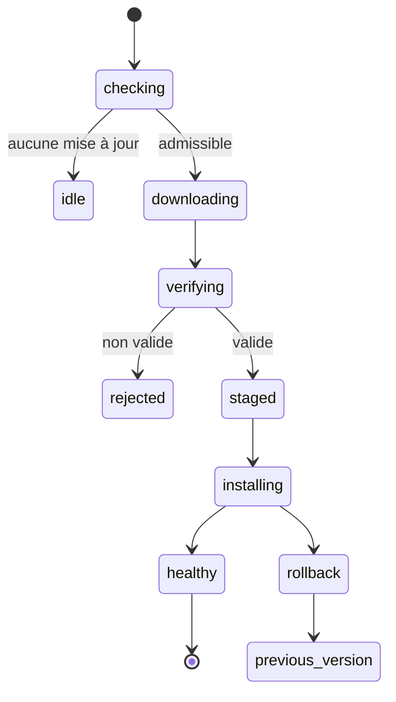



Le déploiement n’est pas terminé simplement parce qu’une application de bureau a été regroupée dans un exécutable unique.
Installation, mises à jour, récupération, signature, compatibilité et fin du support doivent être conçues comme une seule chaîne d’approvisionnement.

En outre, le code exécuté sur un appareil appartenant à l’utilisateur peut, en dernier ressort, être observé et modifié.
L’obscurcissement et les mesures anti-altération ne font qu’augmenter le coût de l’attaque ; ils ne garantissent ni confidentialité ni intégrité absolues.

## 1. Commencer par séparer le modèle de menace du modèle de déploiement

Questions relatives au déploiement :

- Quelles versions de Windows et quelles architectures de processeur sont ciblées ?
- L’environnement d’exécution sera-t-il inclus ?
- Des privilèges administrateur sont-ils nécessaires ?
- L’installation hors ligne et le déploiement en entreprise sont-ils requis ?
- Quel est le canal de mise à jour automatique ?
- Comment seront gérés le retour en arrière et la période de support ?

Questions relatives à la sécurité :

- L’attaquant est-il un utilisateur ordinaire, un administrateur local ou un logiciel malveillant ?
- Que faut-il protéger : un secret d’API, un algorithme, une licence ou des données utilisateur ?
- Quel comportement sûr est requis après la détection d’une altération ?
- Que peut-on garantir hors ligne sans validation côté serveur ?

## 2. Frontières fondamentales de WPF

WPF est une infrastructure .NET d’interface de bureau pour Windows.
Elle utilise le Dispatcher du thread d’interface, les ressources XAML, la liaison de données et l’interopérabilité native.

Outre les assemblages managés, les artefacts de déploiement peuvent comprendre :

- environnement d’exécution .NET
- DLL natives
- fichiers de contenu ou de ressources
- configuration
- base de données locale
- artefacts de modèles ou de données
- programme d’installation et métadonnées de mise à jour

Sans inventaire explicite de la liste des fichiers, l’application peut fonctionner dans l’environnement de développement, mais échouer sur une machine propre.

## 3. Dépendance à l’infrastructure ou déploiement autonome

### Dépendant de l’infrastructure

L’appareil doit disposer d’un environnement d’exécution .NET compatible.

- L’artefact peut être plus petit.
- Il bénéficie des mises à jour de sécurité de l’environnement partagé.
- Il dépend de la présence de cet environnement et de la politique de report de version.

### Autonome

L’application distribue elle-même l’environnement d’exécution ciblé.

- Cela réduit la dépendance à l’installation d’un environnement sur l’appareil.
- Une publication est nécessaire pour chaque système d’exploitation et chaque architecture.
- L’artefact grossit et la maintenance de l’environnement d’exécution devient une responsabilité du déploiement de l’application.

Inclure l’environnement d’exécution ne sécurise pas définitivement l’application.
Lorsqu’une vulnérabilité y est découverte, l’application doit être republiée et redéployée.

## 4. Ce que signifie réellement la publication en fichier unique

Le fichier unique .NET est une option qui facilite le déploiement ; il n’élimine pas automatiquement tous les accès aux fichiers ni toutes les dépendances natives.
Il est propre à un système d’exploitation et à une architecture, et certaines bibliothèques natives peuvent être extraites.

Les éléments à surveiller comprennent :

- les différences de comportement d’API telles que `Assembly.Location`
- l’utilisation éventuelle de `AppContext.BaseDirectory` pour accéder au contenu situé à côté de l’exécutable
- les autorisations du répertoire d’extraction des fichiers natifs
- le coût de décompression au démarrage
- les hypothèses de chemin dans les bibliothèques tierces
- l’ordre des opérations de signature et de regroupement

Au lieu d’activer simultanément le fichier unique, l’élagage et ReadyToRun, testez chaque combinaison sur une machine propre.

## 5. Élagage et réflexion

L’élagage supprime le code que l’analyse statique juge inutilisé.
L’analyse d’accessibilité statique peut manquer les liaisons WPF, le XAML, les sérialiseurs, la réflexion et le chargement des extensions.

Ne vous contentez pas de supprimer les avertissements d’élagage ; exprimez l’intention avec des descripteurs racines, des annotations, la génération de source et des mécanismes analogues.
Pour une application dotée de nombreuses fonctions dynamiques, le risque de compatibilité peut dépasser les avantages de l’élagage.

## 6. Rôle de MSIX

MSIX fournit des fonctions de déploiement Windows telles que l’identité déclarative du paquet, l’installation et la suppression, les mises à jour ainsi que la virtualisation des fichiers et du registre.
Tous les comportements hérités ou toutes les installations de pilotes et de services n’étant pas pris en charge de la même manière, il faut vérifier les capacités et les contraintes.

Un paquet MSIX doit posséder une signature valide pour être déployé, et l’identité de son éditeur doit correspondre au sujet du certificat.

## 7. Garanties de la signature de code

Une signature aide à vérifier que les octets reçus par l’utilisateur n’ont pas changé depuis leur signature et qu’ils ont été signés par l’éditeur représenté par le certificat.

Ce que la signature ne garantit pas :

- que le code de l’éditeur est sûr
- l’impossibilité d’altérer la mémoire à l’exécution
- la protection des secrets contre un administrateur local
- la défense contre un serveur de mise à jour vulnérable
- la détection automatique des dépendances signées malveillantes

La protection de la clé privée de signature est au cœur de la sécurité de la chaîne d’approvisionnement.

## 8. Horodatage

Un horodatage prouve que la signature a été créée pendant la période de validité du certificat.
D’après la documentation Microsoft, un paquet horodaté peut être validé en fonction de l’heure de signature même après l’expiration du certificat.

Un pipeline de signature suit généralement cette séquence :

1. Compilation de version reproductible
2. Contrôles des logiciels malveillants, des dépendances et des politiques
3. Création du paquet
4. Signature avec un service protégé ou une clé adossée au matériel
5. Application d’un horodatage RFC 3161
6. Vérification de la signature dans un environnement distinct
7. Publication dans un dépôt de versions immuable

Ne stockez pas la clé de signature dans le dépôt source ni dans une variable d’environnement CI ordinaire.

## 9. Vérifier aussi la signature du manifeste de mise à jour

Si seul le binaire est signé alors que les métadonnées de mise à jour restent attaquables, un retour en arrière ou l’injection d’une URL malveillante devient possible.

Le client de mise à jour doit vérifier :

- le canal et l’identité de l’application
- la version et la politique monotone de protection contre les retours en arrière
- le condensat du paquet
- la signature du paquet et la chaîne de confiance
- la signature du manifeste
- la version minimale prise en charge
- l’anneau de déploiement et la date d’expiration
- la taille du téléchargement et le type de contenu

TLS protège le trajet du transport, mais ne remplace pas la provenance à long terme de l’artefact.

## 10. Machine à états pour des mises à jour sûres

Séparez le téléchargement de l’installation, écrivez dans un répertoire de préparation, puis vérifiez le résultat.
Recourez à l’injection de défaillances pour tester une coupure de courant en cours d’opération, un disque plein, le verrouillage par un antivirus et les fichiers utilisés pendant l’exécution de l’application.

## 11. Atomicité et retour en arrière

Écraser directement l’installation actuelle pendant une mise à jour produit un état partiel.

- répertoires d’installation versionnés
- basculement atomique de pointeur, de lien symbolique ou d’enregistrement
- conservation côte à côte de la version précédente
- compatibilité ascendante et descendante pour la migration du schéma
- validation après un contrôle d’intégrité

Si une migration de base de données est irréversible, le retour en arrière du seul binaire ne restaurera pas le système.
Concevez conjointement une stratégie d’extension–migration–réduction et une politique de sauvegarde.

## 12. Canaux de publication

Séparez les canaux stable, préversion et interne, et empêchez les appareils de passer arbitrairement à un canal de confiance inférieure.
Un déploiement progressif réduit le rayon d’impact des défaillances.

Métriques à observer :

- découverte des mises à jour et réussite du téléchargement
- échecs de vérification de signature
- taux d’installation et de retour en arrière
- état de santé au démarrage
- sessions sans plantage
- adoption des versions et population non prise en charge

La télémétrie doit respecter les principes de collecte minimale, de consentement, de conservation et la politique de confidentialité.

## 13. La gestion des licences est un problème d’autorisation

Au lieu de dissimuler une clé de licence par la complexité, précisez quelles autorisations sont accordées, à qui et jusqu’à quand.

Exemples de déclarations de licence :

- produit et édition
- droit d’accès à une fonction
- identifiant pseudonyme du sujet ou du client
- heure d’émission et d’expiration
- politique de liaison à l’appareil
- délai de grâce hors ligne
- émetteur et identifiant de clé

Signez les déclarations avec la clé privée du serveur et ne distribuez au client que la clé publique de vérification.
Placer un secret symétrique dans le client permet de l’extraire et d’en abuser pour fabriquer des licences.

## 14. Compromis des licences hors ligne

Dans un environnement entièrement hors ligne, la révocation en temps réel et les contrôles d’utilisation simultanée sont difficiles.

Les options comprennent :

- un droit signé à longue durée de validité
- une courte durée de validité avec renouvellement périodique
- un fichier d’activation par question-réponse
- une déclaration liée au matériel
- un serveur de licences flottantes

Une empreinte matérielle crée des problèmes de remplacement des appareils et de confidentialité.
Concevez conjointement les politiques relatives aux faux rejets, à la réactivation, au recul de l’horloge et à la reprise après sinistre.

## 15. Un secret côté client n’est pas un secret

Supposez qu’un attaquant compétent peut extraire toute clé d’API, clé de chiffrement ou tout mot de passe de base de données intégré dans un binaire.

À la place :

- Conservez les opérations sensibles et les identifiants à longue durée de vie sur le serveur.
- Utilisez un flux de client public OAuth/OIDC avec PKCE.
- Stockez les jetons propres aux utilisateurs dans le coffre d’identifiants du système d’exploitation.
- Utilisez des jetons à courte durée de vie et des portées limitées.
- Faites valider par le serveur les droits et les limites de débit.

L’obscurcissement peut augmenter le coût de l’analyse des noms et du flux de contrôle, mais ce n’est pas un coffre de clés.

## 16. Couches pratiques de résistance à l’altération

- vérification de la signature du paquet ou de l’assemblage
- mises à jour sécurisées et protection contre le retour en arrière
- manifeste d’intégrité
- obscurcissement
- techniques anti-débogage et anti-interception
- validation comportementale côté serveur
- télémétrie et détection des anomalies

Un anti-débogage agressif peut nuire à l’accessibilité, au diagnostic des plantages, au taux de faux positifs des antivirus et à la maintenabilité.
Utilisez le modèle de menace pour comparer la valeur de la protection à son coût d’exploitation.

## 17. Extensions et dépendances natives

Le chargement d’extensions élargit la frontière de confiance.

- vérifier un éditeur autorisé ou un condensat
- réduire au minimum la surface de l’API
- isoler dans un processus distinct avec IPC
- restreindre les capacités
- isoler les plantages et les expirations de délai
- définir un contrat de compatibilité des versions

Pour éviter le détournement de l’ordre de recherche des DLL, utilisez des chemins absolus et des API de chargement sûres, et excluez les répertoires accessibles en écriture.

## 18. Protection des données locales

Utilisez les frontières des comptes du système d’exploitation et le chiffrement pour les données utilisateur et les jetons.
Documentez toutefois que ces mesures ne peuvent assurer une protection complète contre un administrateur local ou le contexte d’exécution de l’utilisateur actif.

- réduire au minimum le stockage d’informations sensibles
- utiliser un répertoire propre à l’utilisateur et protégé par des ACL
- utiliser un coffre d’identifiants protégé par le système d’exploitation
- effectuer la rotation des clés et le nettoyage lors de la déconnexion
- expurger les journaux
- définir une politique pour les vidages mémoire après plantage
- gérer le cycle de vie des fichiers temporaires

## 19. Pipeline de publication CI/CD

```mermaid
flowchart LR
  A[étiquette source] --> B[compilation isolée]
  B --> C[tests et analyse]
  C --> D[publication par RID]
  D --> E[empaquetage]
  E --> F[signature et horodatage]
  F --> G[vérification de la signature]
  G --> H[canal de préparation]
  H --> I[contrôle d’intégrité]
  I --> J[déploiement progressif]
```

Consignez dans la provenance de la version l’identité de la compilation CI, la révision source, le verrouillage des dépendances, la version du SDK, le condensat du paquet et l’événement de signature.

## 20. Liste de contrôle de la vérification

- [ ] La matrice des systèmes d’exploitation, architectures et environnements d’exécution pris en charge est-elle définie ?
- [ ] L’installation, le lancement et la désinstallation ont-ils été testés sur une machine virtuelle propre ?
- [ ] Les politiques de dépendance à l’infrastructure et de déploiement autonome sont-elles explicites ?
- [ ] La compatibilité avec le fichier unique, les chemins et la réflexion a-t-elle été testée ?
- [ ] L’éditeur du paquet correspond-il à l’identité du certificat ?
- [ ] La clé de signature n’est-elle pas conservée à long terme sur l’agent de compilation ?
- [ ] L’horodatage et la signature sont-ils vérifiés dans une étape indépendante ?
- [ ] L’authenticité du manifeste de mise à jour et du binaire est-elle vérifiée ?
- [ ] Les mises à jour ont-elles été testées en cas de coupure de courant, de disque plein et d’interruption du réseau ?
- [ ] Le retour en arrière et la compatibilité du schéma de données ont-ils été vérifiés ?
- [ ] L’expiration des licences hors ligne, les changements d’horloge et les changements d’appareil ont-ils été testés ?
- [ ] Le binaire client est-il dépourvu de secret à longue durée de vie ?
- [ ] Les journaux, vidages et fichiers temporaires ont-ils été inspectés pour détecter les informations sensibles ?
- [ ] Existe-t-il des politiques de fin de support et d’imposition d’une version minimale ?

## 21. Modes d’échec fréquents et limites

### Supposer qu’un seul fichier exe élimine le besoin d’installation

Les responsabilités relatives à l’environnement d’exécution, aux bibliothèques natives, aux chemins accessibles en écriture, aux associations de fichiers, aux mises à jour et à la désinstallation subsistent.

### Croire que la signature empêche l’ingénierie inverse

La signature vérifie l’authenticité et l’intégrité, mais n’assure pas la confidentialité du code.

### Stocker un secret d’API dans l’obscurcissement

Un secret nécessaire à l’exécution finit par apparaître en mémoire ou sur un chemin d’appel.

### Supposer qu’avec les mises à jour automatiques, la dernière version est toujours la meilleure

Elles peuvent aussi propager rapidement une version défectueuse.
Un déploiement progressif, un contrôle d’intégrité et un retour en arrière sont nécessaires.

### Rendre la liaison au matériel trop stricte

Des changements légitimes d’appareil peuvent être pris pour des attaques, ce qui augmente les coûts d’assistance et les pertes d’utilisateurs.

## 22. Références officielles et primaires

- Microsoft, [documentation WPF](https://learn.microsoft.com/en-us/dotnet/desktop/wpf/).
- Microsoft, [déploiement .NET en fichier unique](https://learn.microsoft.com/en-us/dotnet/core/deploying/single-file/overview).
- Microsoft, [présentation de la signature des paquets MSIX](https://learn.microsoft.com/en-us/windows/msix/package/signing-package-overview).
- Microsoft, [signer un paquet d’application avec SignTool](https://learn.microsoft.com/en-us/windows/msix/package/sign-app-package-using-signtool).
- Microsoft, [déploiement d’applications .NET](https://learn.microsoft.com/en-us/dotnet/core/deploying/).
- OWASP, [dix principaux risques de sécurité des applications de bureau](https://owasp.org/www-project-desktop-app-security-top-10/).

L’objectif de la sécurité d’une application de bureau n’est pas d’obtenir un exécutable indéchiffrable.
Il consiste à **gérer le coût de l’attaque et son rayon d’impact en combinant un déploiement vérifiable, des mises à jour sûres, une autorisation centrée sur le serveur et des frontières de confiance locales honnêtes**.
