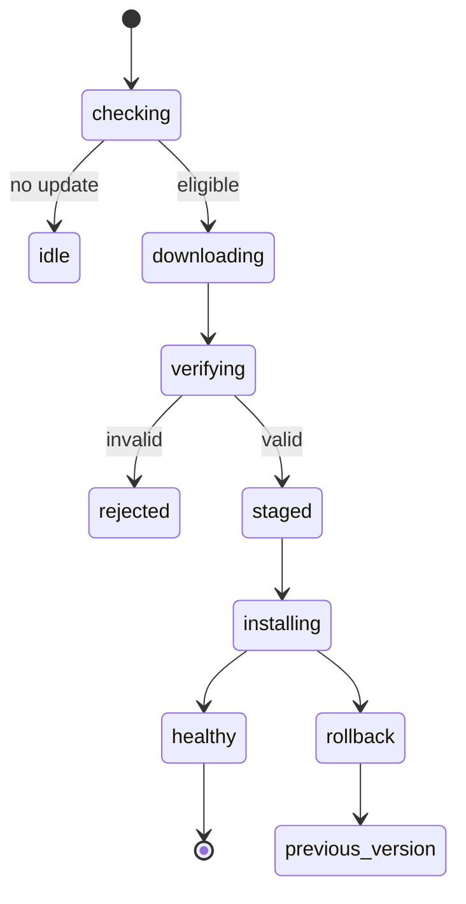
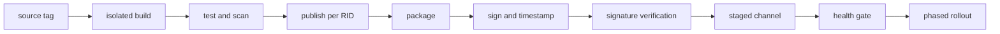



デスクトップアプリを一つの実行ファイルにまとめただけで、配布が完了するわけではない。
インストール・更新・復旧・署名・互換性・サポート終了まで、一つのsupply chainとして設計しなければならない。

また、ユーザーが所有するデバイス上で実行されるコードは、最終的には観察・修正され得る。
obfuscationとanti-tamperはコストを高めるだけで、完全な機密性や完全性を保証するものではない。

## 1. まず脅威モデルと配布モデルを分ける

配布に関する問い：

- 対象となるWindowsとCPU architectureは何か？
- runtimeを含めるか？
- 管理者権限が必要か？
- offlineインストールとenterprise配布が必要か？
- 自動更新channelは何か？
- rollbackとサポート期間をどのように管理するか？

セキュリティに関する問い：

- 攻撃者は一般ユーザー、ローカル管理者、malwareのうち誰か？
- 保護対象はAPI secret、algorithm、license、ユーザーデータのうち何か？
- 改ざん検知後にどのような安全な動作が必要か？
- サーバー検証なしにofflineで保証できるものは何か？

## 2. WPFの基本境界

WPFはWindows向けの.NET desktop UI frameworkである。
UI threadのDispatcher、XAML resource、data binding、native interopを使用する。

配布artifactにはmanaged assembly以外にも、次のものが含まれる場合がある。

- .NET runtime
- native DLL
- content/resource file
- configuration
- local database
- model/data artifact
- installerとupdate metadata

ファイル一覧を明示的にinventoryしなければ、開発環境では動作してもclean machineで失敗する。

## 3. Framework-dependentとself-contained

### Framework-dependent

デバイスに互換性のある.NET runtimeが必要である。

- artifactを小さくできる場合がある。
- shared runtime security updateを活用する。
- runtimeの存在とversion roll-forwardポリシーに依存する。

### Self-contained

アプリが対象runtimeを一緒に配布する。

- デバイスでのruntimeインストールへの依存を減らす。
- OSとarchitecture別のpublishが必要である。
- artifactが大きくなり、runtime servicingの責任もアプリ配布に含まれる。

runtimeを含めれば恒久的に安全になるわけではない。
脆弱なruntimeが見つかった場合は、アプリを再度publishして配布しなければならない。

## 4. Single-file publishの実際の意味

.NET single-fileは配布を容易にするオプションであり、すべてのfile accessとnative dependencyが自動的に消えるわけではない。
OSとarchitectureに固有で、一部のnative libraryはextractionされる場合がある。

注意すべき項目は次のとおりである。

- `Assembly.Location`のようなAPIの動作差
- 実行ファイルの隣にあるcontentへのアクセスでは`AppContext.BaseDirectory`の使用を検討
- native extraction directoryの権限
- startup decompressionのコスト
- third-party libraryのpath assumption
- signingとbundlingの順序

single-file、trimming、ReadyToRunを一度に有効にするのではなく、組み合わせごとにclean-machine testを行う。

## 5. Trimmingとreflection

trimmingは、静的解析で使用されていないcodeを削除する。
WPF binding、XAML、serializer、reflection、plugin loadingは、静的な到達可能性解析で見落とされる場合がある。

trim warningを単に抑制せず、root descriptor、annotation、source generationなどで意図を表す。
動的機能が多いアプリでは、trimmingの利得より互換性リスクが大きい場合がある。

## 6. MSIXの役割

MSIXは、宣言的なpackage identity、インストール・削除、update、ファイル/registry virtualizationのようなWindowsの配布機能を提供する。
すべてのlegacy動作やdriver/serviceのインストールが同じ方法でサポートされるわけではないため、capabilityと制約を確認する。

MSIX packageの配布には有効なsignatureが必要であり、publisher identityとcertificate subjectが一致していなければならない。

## 7. Code signingが保証すること

署名は、ユーザーが受け取ったbytesが署名後に変更されておらず、certificateが示すpublisherによって署名されたことの検証に役立つ。

署名が保証しないもの：

- publisherのcodeが安全であるという保証
- 実行中のmemory改ざん防止
- local administratorからのsecret保護
- 脆弱なupdate serverに対する防御
- 悪意あるsigned dependencyの自動検出

private signing keyの保護がsupply-chain securityの中核である。

## 8. Timestamping

timestampは、certificateが有効である間に署名したという証拠を残す。
Microsoftのドキュメントによれば、timestamped packageはcertificateの有効期限後も署名時点を基準に検証できる。

署名pipelineは一般に次の順序で進む。

1. 再現可能なrelease build
2. malware・dependency・policy検査
3. package作成
4. protected serviceまたはhardware-backed keyによる署名
5. RFC 3161 timestampの適用
6. 別環境でsignatureを検証
7. immutable release repositoryへpublish

署名keyをsource repositoryや一般的なCI environment variableに保管してはならない。

## 9. Update manifestも署名を検証する

binaryだけを署名し、update metadataが攻撃可能であれば、rollbackやmalicious URL injectionが可能になる。

update clientが検証する項目：

- channelとapplication identity
- versionとmonotonic rollback policy
- package digest
- package signatureとtrust chain
- manifest signature
- minimum supported version
- rollout ringとexpiry
- download sizeとcontent type

TLSは転送経路を保護するが、artifactの長期的なprovenanceの代わりにはならない。

## 10. 安全な更新状態機械

ダウンロードとインストールを分離し、staging directoryへ書き込んだ後に検証する。
途中の電源断、disk full、antivirus lock、実行中のfile使用をfault-injectionで試験する。

## 11. Atomicityとrollback

更新中にcurrent installを直接上書きするとpartial stateになる。

- versioned install directory
- atomic pointer/symlink/registrationの切り替え
- side-by-side previous version
- schema migrationのforward/backward compatibility
- health check後のcommit

DB migrationが不可逆であれば、binary rollbackだけでは復旧できない。
expand–migrate–contract patternとbackupポリシーを併せて設計する。

## 12. Release channel

stable、preview、internalのようなchannelを分離し、deviceが任意に低trustのchannelへ移動できないようにする。
phased rolloutはfailure blast radiusを縮小する。

観測する指標：

- update discoveryとdownload success
- signature verification failure
- install/rollback rate
- startup health
- crash-free session
- version adoptionとunsupported population

telemetryは最小限の収集、同意、retention、privacy policyに従う。

## 13. Licensingはauthorizationの問題である

license keyを複雑に隠すことよりも、どの権限をいつまで誰に与えるかを明示する。

license claimの例は次のとおりである。

- productとedition
- feature entitlement
- subject/customer pseudonymous ID
- issued/expiry time
- device binding policy
- offline grace period
- issuerとkey ID

claimにはサーバーのprivate keyで署名し、clientにはpublic verification keyだけを配布する。
対称secretをclientに入れると、抽出後にlicense偽造へ悪用される可能性がある。

## 14. Offline licensingのtrade-off

完全offlineでは、リアルタイムの取消しと同時使用の確認が難しい。

選択肢は次のとおりである。

- 長い有効期間のsigned entitlement
- 短い有効期間と定期的なrenewal
- challenge-response activation file
- hardware-bound claim
- floating license server

hardware fingerprintはデバイス交換と個人情報の問題を生む。
false rejection、再アクティベーション、clock rollback、disaster recoveryのポリシーも併せて作る。

## 15. Client secretはsecretではない

binaryに含まれるAPI key、encryption key、database passwordは、熟練した攻撃者が抽出できるものと仮定する。

代わりに：

- 機密性の高い演算とlong-lived credentialをserverに置く。
- OAuth/OIDCのpublic-client flowとPKCEを使用する。
- OS credential vaultにはユーザーごとのtokenを保存する。
- short-lived tokenとscopeを使用する。
- serverがentitlementとrate limitを検証する。

obfuscationは名前とcontrol flowの解析コストを高められるが、key vaultではない。

## 16. Tamper resistanceの現実的な階層

- package/assembly signature verification
- secure update and rollback protection
- integrity manifest
- obfuscation
- anti-debugging/anti-hooking
- server-side behavioral validation
- telemetryとanomaly detection

強力なanti-debuggingは、アクセシビリティ、crash diagnosis、antivirus false positive、保守性を悪化させる場合がある。
保護する価値と運用コストをthreat modelに基づいて比較する。

## 17. Pluginとnative dependency

pluginを読み込むとtrust boundaryが広がる。

- 許可されたpublisherまたはdigestの検査
- 最小限のAPI surface
- 別processとIPCによる隔離
- capabilityの制限
- crash/timeoutの隔離
- version compatibility contract

DLL search order hijackingを避けるには、絶対パス、安全なload API、writable directoryの除外を使用する。

## 18. Local data protection

ユーザーデータとtokenには、OSアカウント境界とencryptionを活用する。
ただし、ローカル管理者と実行中のユーザーcontextを完全には防御できないことを文書化する。

- 機密情報の保存を最小化
- ACLが制限されたper-user directory
- OS-protected credential store
- key rotationとlogout cleanup
- log redaction
- crash dumpポリシー
- temp file lifecycle

## 19. CI/CD release pipeline

CI build identity、source revision、dependency lock、SDK version、package digest、signing eventをrelease provenanceに保存する。

## 20. 検証チェックリスト

- [ ] サポート対象のOS・architecture・runtime matrixを明示した。
- [ ] clean VMでinstall、launch、uninstallを試験した。
- [ ] framework-dependentとself-containedのポリシーが明確である。
- [ ] single-file/path/reflectionの互換性を試験した。
- [ ] package publisherとcertificate identityが一致している。
- [ ] signing keyがbuild agentに長期保存されていない。
- [ ] timestampとsignatureを独立した段階で検証する。
- [ ] update manifestとbinaryの両方についてauthenticityを確認する。
- [ ] power loss・disk full・network cutのupdate testを行った。
- [ ] rollbackとdata schema compatibilityを検証した。
- [ ] offline licenseのexpiry・clock change・device changeを試験した。
- [ ] client binaryにlong-lived secretがない。
- [ ] log・dump・temp file内の機密情報を検査した。
- [ ] サポート終了と強制minimum versionのポリシーがある。

## 21. よく失敗するパターンと限界

### exe一つならインストールは不要だと判断する

runtime、native library、writable path、file association、update、uninstallの責任は残る。

### 署名すればリバースエンジニアリングを防げると信じる

署名はauthenticityとintegrityを検証するが、code confidentialityは提供しない。

### obfuscation内にAPI secretを保存する

実行に必要なsecretは、最終的にmemoryやcall pathに現れる。

### 自動更新が常に最新版を意味する

broken releaseを急速に拡散する可能性もある。
staged rollout、health gate、rollbackが必要である。

### hardware bindingを強力にする

正当なデバイス変更を攻撃と誤認し、サポートコストとユーザーの損失が増える場合がある。

## 22. 公式・一次参考資料

- Microsoft, [WPF documentation](https://learn.microsoft.com/en-us/dotnet/desktop/wpf/).
- Microsoft, [.NET single-file deployment](https://learn.microsoft.com/en-us/dotnet/core/deploying/single-file/overview).
- Microsoft, [MSIX package signing overview](https://learn.microsoft.com/en-us/windows/msix/package/signing-package-overview).
- Microsoft, [Sign an app package using SignTool](https://learn.microsoft.com/en-us/windows/msix/package/sign-app-package-using-signtool).
- Microsoft, [.NET application deployment](https://learn.microsoft.com/en-us/dotnet/core/deploying/).
- OWASP, [Desktop App Security Top 10](https://owasp.org/www-project-desktop-app-security-top-10/).

デスクトップセキュリティの目標は、解読不能な実行ファイルではない。
**検証可能な配布、安全な更新、サーバー中心の権限、正直なローカル信頼境界を組み合わせ、攻撃コストと被害範囲を管理すること**である。
