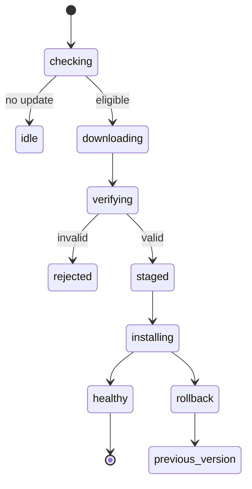
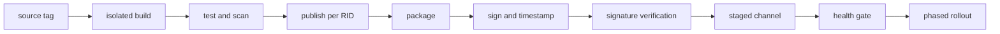



데스크톱 앱을 실행 파일 하나로 묶었다고 배포가 끝나는 것은 아니다.
설치·업데이트·복구·서명·호환성·지원 종료까지 하나의 supply chain으로 설계해야 한다.

또한 사용자가 소유한 장치에서 실행되는 코드는 결국 관찰·수정될 수 있다.
obfuscation과 anti-tamper는 비용을 높일 뿐 완전한 비밀성이나 무결성을 보장하지 않는다.

## 1. 먼저 위협모델과 배포모델을 분리한다

배포 질문:

- 대상 Windows와 CPU architecture는 무엇인가?
- runtime을 포함할 것인가?
- 관리자 권한이 필요한가?
- offline 설치와 enterprise 배포가 필요한가?
- 자동 업데이트 채널은 무엇인가?
- rollback과 지원기간은 어떻게 관리하는가?

보안 질문:

- 공격자는 일반 사용자, 로컬 관리자, malware 중 누구인가?
- 보호할 것은 API secret, algorithm, license, 사용자 데이터 중 무엇인가?
- 변조 탐지 후 어떤 안전한 동작이 필요한가?
- 서버 검증 없이 offline에서 보장 가능한 것은 무엇인가?

## 2. WPF의 기본 경계

WPF는 Windows용 .NET desktop UI framework다.
UI thread의 Dispatcher, XAML resource, data binding, native interop를 사용한다.

배포 artifact에는 managed assembly 외에도 다음이 포함될 수 있다.

- .NET runtime
- native DLL
- content/resource file
- configuration
- local database
- model/data artifact
- installer와 update metadata

파일 목록을 명시적으로 inventory하지 않으면 개발환경에서는 동작하고 clean machine에서 실패한다.

## 3. Framework-dependent와 self-contained

### Framework-dependent

장치에 호환 .NET runtime이 필요하다.

- artifact가 작을 수 있다.
- shared runtime security update를 활용한다.
- runtime 존재와 version roll-forward 정책에 의존한다.

### Self-contained

앱이 대상 runtime을 함께 배포한다.

- 장치 runtime 설치 의존성을 줄인다.
- OS와 architecture별 publish가 필요하다.
- artifact가 커지고 runtime servicing 책임이 앱 배포에 포함된다.

runtime을 포함한다고 영구히 안전한 것이 아니다.
취약한 runtime이 발견되면 앱을 다시 publish하고 배포해야 한다.

## 4. Single-file publish의 실제 의미

.NET single-file은 배포 편의 옵션이며 모든 file access와 native dependency가 자동으로 사라지는 것은 아니다.
OS와 architecture에 특정되고, 일부 native library는 extraction될 수 있다.

주의할 항목은 다음과 같다.

- `Assembly.Location` 같은 API의 동작 차이
- 실행 파일 옆 content 접근은 `AppContext.BaseDirectory` 사용 검토
- native extraction directory의 권한
- startup decompression 비용
- third-party library의 path assumption
- signing과 bundling 순서

single-file, trimming, ReadyToRun을 한꺼번에 켜기보다 조합별 clean-machine test를 한다.

## 5. Trimming과 reflection

trimming은 정적 분석에서 사용하지 않는 code를 제거한다.
WPF binding, XAML, serializer, reflection, plugin loading은 정적 도달성 분석이 놓칠 수 있다.

trim warning을 단순 억제하지 말고 root descriptor, annotation, source generation 등으로 의도를 표현한다.
동적 기능이 많은 앱은 trimming 이득보다 호환성 위험이 클 수 있다.

## 6. MSIX의 역할

MSIX는 선언적 package identity, 설치·제거, update, 파일/registry virtualization 같은 Windows 배포 기능을 제공한다.
모든 legacy 동작과 driver/service 설치가 같은 방식으로 지원되는 것은 아니므로 capability와 제약을 확인한다.

MSIX package는 배포를 위해 유효한 signature가 필요하며 publisher identity와 certificate subject가 일치해야 한다.

## 7. Code signing이 보장하는 것

서명은 사용자가 받은 bytes가 서명 후 바뀌지 않았고, certificate가 나타내는 publisher가 서명했음을 검증하는 데 도움을 준다.

서명이 보장하지 않는 것:

- publisher의 code가 안전하다는 보장
- 실행 중 memory 변조 방지
- local administrator로부터 secret 보호
- 취약한 update server 방어
- 악성 signed dependency 자동 탐지

private signing key 보호가 supply-chain security의 핵심이다.

## 8. Timestamping

timestamp는 certificate가 유효할 때 서명했다는 증거를 남긴다.
Microsoft 문서상 timestamped package는 certificate 만료 뒤에도 서명 시점 기준으로 검증될 수 있다.

서명 pipeline은 일반적으로 다음 순서를 따른다.

1. 재현 가능한 release build
2. malware·dependency·policy 검사
3. package 생성
4. protected service 또는 hardware-backed key로 서명
5. RFC 3161 timestamp 적용
6. 별도 환경에서 signature 검증
7. immutable release repository에 publish

서명 key를 source repository나 일반 CI environment variable에 보관하지 않는다.

## 9. Update manifest도 서명 검증한다

binary만 서명하고 update metadata가 공격 가능하면 rollback 또는 malicious URL injection이 가능하다.

update client가 검증할 항목:

- channel과 application identity
- version과 monotonic rollback policy
- package digest
- package signature와 trust chain
- manifest signature
- minimum supported version
- rollout ring과 expiry
- download size와 content type

TLS는 전송 경로를 보호하지만 artifact의 장기적 provenance를 대신하지 않는다.

## 10. 안전한 업데이트 상태기계

다운로드와 설치를 분리하고 staging directory에 쓴 뒤 검증한다.
중간 전원 손실, disk full, antivirus lock, 실행 중 file 사용을 fault-injection으로 시험한다.

## 11. Atomicity와 rollback

업데이트 중 current install을 직접 덮어쓰면 partial state가 된다.

- versioned install directory
- atomic pointer/symlink/registration 전환
- side-by-side previous version
- schema migration의 forward/backward compatibility
- health check 후 commit

DB migration이 비가역적이면 binary rollback만으로 복구되지 않는다.
expand–migrate–contract pattern과 backup 정책을 함께 설계한다.

## 12. Release channel

stable, preview, internal 같은 channel을 분리하고 device가 임의로 낮은 trust channel로 이동하지 않게 한다.
phased rollout은 failure blast radius를 줄인다.

관측할 지표:

- update discovery와 download success
- signature verification failure
- install/rollback rate
- startup health
- crash-free session
- version adoption과 unsupported population

telemetry는 최소수집, 동의, retention, privacy policy를 따른다.

## 13. Licensing은 authorization 문제다

license key를 복잡하게 숨기는 것보다 어떤 권한을 언제까지 누구에게 부여하는지를 명시한다.

license claim 예시는 다음과 같다.

- product와 edition
- feature entitlement
- subject/customer pseudonymous ID
- issued/expiry time
- device binding policy
- offline grace period
- issuer와 key ID

claim은 서버 private key로 서명하고 client에는 public verification key만 배포한다.
대칭 secret을 client에 넣으면 추출 후 license 위조에 악용될 수 있다.

## 14. Offline licensing의 trade-off

완전 offline에서는 실시간 취소와 동시사용 확인이 어렵다.

선택지는 다음과 같다.

- 긴 유효기간의 signed entitlement
- 짧은 유효기간과 주기적 renewal
- challenge-response activation file
- hardware-bound claim
- floating license server

hardware fingerprint는 장치 교체와 개인정보 문제를 만든다.
false rejection, 재활성화, clock rollback, disaster recovery 정책을 함께 만든다.

## 15. Client secret은 secret이 아니다

binary에 포함된 API key, encryption key, database password는 숙련된 공격자가 추출할 수 있다고 가정한다.

대신:

- 민감한 연산과 long-lived credential을 server에 둔다.
- OAuth/OIDC의 public-client flow와 PKCE를 사용한다.
- OS credential vault에는 사용자별 token을 저장한다.
- short-lived token과 scope를 사용한다.
- server가 entitlement와 rate limit을 검증한다.

obfuscation은 이름과 control flow 분석 비용을 높일 수 있지만 key vault가 아니다.

## 16. Tamper resistance의 현실적 계층

- package/assembly signature verification
- secure update and rollback protection
- integrity manifest
- obfuscation
- anti-debugging/anti-hooking
- server-side behavioral validation
- telemetry와 anomaly detection

강한 anti-debugging은 접근성, crash diagnosis, antivirus false positive, 유지보수를 악화할 수 있다.
보호 가치와 운영비용을 threat model로 비교한다.

## 17. Plugin과 native dependency

plugin을 로드하면 trust boundary가 넓어진다.

- 허용 publisher 또는 digest 검사
- 최소 API surface
- 별도 process와 IPC 격리
- capability 제한
- crash/timeout 격리
- version compatibility contract

DLL search order hijacking을 피하려면 절대경로, 안전한 load API, writable directory 배제를 사용한다.

## 18. Local data protection

사용자 데이터와 token은 OS 계정 경계와 encryption을 활용한다.
단, 로컬 관리자와 실행 중 사용자 context를 완전히 방어할 수 없음을 문서화한다.

- 민감정보 최소 저장
- ACL이 제한된 per-user directory
- OS-protected credential store
- key rotation과 logout cleanup
- log redaction
- crash dump 정책
- temp file lifecycle

## 19. CI/CD release pipeline

CI build identity, source revision, dependency lock, SDK version, package digest, signing event를 release provenance에 저장한다.

## 20. 검증 체크리스트

- [ ] 지원 OS·architecture·runtime matrix를 명시했다.
- [ ] clean VM에서 install, launch, uninstall을 시험했다.
- [ ] framework-dependent와 self-contained 정책이 명확하다.
- [ ] single-file/path/reflection 호환성을 시험했다.
- [ ] package publisher와 certificate identity가 일치한다.
- [ ] signing key가 build agent에 장기 저장되지 않는다.
- [ ] timestamp와 signature를 독립 단계에서 검증한다.
- [ ] update manifest와 binary 모두 authenticity를 확인한다.
- [ ] power loss·disk full·network cut update test를 했다.
- [ ] rollback과 data schema compatibility를 검증했다.
- [ ] offline license expiry·clock change·device change를 시험했다.
- [ ] client binary에 long-lived secret이 없다.
- [ ] log·dump·temp file에서 민감정보를 검사했다.
- [ ] 지원종료와 강제 minimum version 정책이 있다.

## 21. 자주 실패하는 패턴과 한계

### exe 하나면 설치가 필요 없다고 판단

runtime, native library, writable path, file association, update, uninstall 책임은 남는다.

### 서명하면 역공학이 막힌다고 믿기

서명은 authenticity와 integrity를 검증하지만 code confidentiality를 제공하지 않는다.

### obfuscation 안에 API secret 저장

실행에 필요한 secret은 결국 memory나 call path에 나타난다.

### 자동 업데이트가 항상 최신을 의미

broken release를 빠르게 확산할 수도 있다.
staged rollout, health gate, rollback이 필요하다.

### hardware binding을 강하게 만들기

정상 장치 변경을 공격으로 오인해 지원비용과 사용자 손실이 커질 수 있다.

## 22. 공식·원전 참고자료

- Microsoft, [WPF documentation](https://learn.microsoft.com/en-us/dotnet/desktop/wpf/).
- Microsoft, [.NET single-file deployment](https://learn.microsoft.com/en-us/dotnet/core/deploying/single-file/overview).
- Microsoft, [MSIX package signing overview](https://learn.microsoft.com/en-us/windows/msix/package/signing-package-overview).
- Microsoft, [Sign an app package using SignTool](https://learn.microsoft.com/en-us/windows/msix/package/sign-app-package-using-signtool).
- Microsoft, [.NET application deployment](https://learn.microsoft.com/en-us/dotnet/core/deploying/).
- OWASP, [Desktop App Security Top 10](https://owasp.org/www-project-desktop-app-security-top-10/).

데스크톱 보안의 목표는 해독 불가능한 실행파일이 아니다.
**검증 가능한 배포, 안전한 업데이트, 서버 중심 권한, 정직한 로컬 신뢰경계를 조합해 공격 비용과 피해범위를 관리하는 것**이다.
