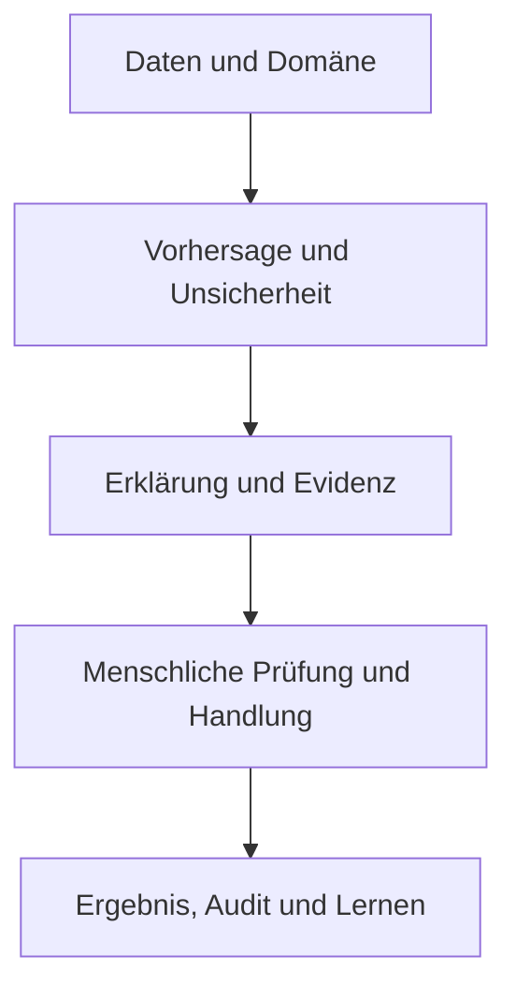



In sicherheitskritischen Bereichen ist erklärbare KI (XAI) kein dekoratives Diagramm zur Merkmalsbedeutung. Eine Erklärung ist eine **Schnittstelle, um Modellentscheidungen zu verstehen, Fehler zu erkennen, Menschen bei einer angemessenen Annahme oder Ablehnung zu unterstützen und Entscheidungen nachträglich zu prüfen**.

Gleichzeitig ist eine Erklärung kein Sicherheitsnachweis. Eine plausible Erklärung kann eine falsche Vorhersage scheinbar rechtfertigen oder Prüfende zu übermäßigem Modellvertrauen verleiten. XAI muss deshalb gemeinsam mit Modellleistung, Unsicherheit, Domänengrenzen, Arbeitsabläufen und menschlichen Faktoren validiert werden.

## 1. Das Problem: der Unterschied zwischen „erklärbar“ und „sicher einsetzbar“

### Eine Erklärung kann nicht jede Frage beantworten

Erklärungsanfragen haben unterschiedliche Zwecke.

| Beteiligte | Konkrete Frage |
|---|---|
| Modellentwickler | Hat das Modell eine falsche Korrelation oder Leckage gelernt? |
| Fachprüfende | Was muss ich in diesem Fall überprüfen? |
| Betroffene Person | Warum wurde so entschieden, und was kann ich berichtigen oder anfechten? |
| Sicherheit oder Audit | Welche Daten, welches Modell, welche Richtlinie und welche Freigabe führten zur Entscheidung? |
| Betriebsverantwortliche | Wann muss das Modell abgelehnt, gestoppt oder zurückgerollt werden? |

Allen Zielgruppen dieselbe globale Ansicht der Merkmalsbedeutung anzubieten lässt entweder notwendige Informationen aus oder erzeugt Missverständnisse.

### Erklärbarkeit und Transparenz sind anders

- **Erklärbarkeit**: zeigt Eingaben, Regeln, ähnliche Fälle oder andere Faktoren, die zu einer Ausgabe beigetragen haben
- **Transparenz**: legt außerdem Daten- und Modellversion, Zweck, Grenzen und Betriebsrichtlinien offen
- **Interpretabilität**: der Grad, in dem Menschen die Struktur oder Beziehungen eines Modells direkt verstehen können
- **Auditierbarkeit**: Fähigkeit, den Entscheidungsprozess nachträglich zu rekonstruieren und zu prüfen

Eine lokale Erklärung für ein komplexes Modell macht dessen Datenherkunft oder Entscheidungsrichtlinie noch nicht transparent.

### Eine Post-hoc-Erklärung kann eine Annäherung sein, die sich vom Modell unterscheidet

Viele XAI-Methoden nähern ein Originalmodell \(f\) in der Umgebung eines Punktes durch ein einfacheres Modell \(g\) an.

\[
g_x = \arg\min_{g\in\mathcal G}
\mathcal L\left(f,g,\pi_x\right)+\Omega(g)
\]

- \(\pi_x\): Gewichtung in der Umgebung des zu erklärenden Punktes \(x\)
- \(\mathcal L\): Abweichung zwischen Original- und Erklärungsmodell
- \(\Omega\): Komplexität der Erklärung

Das Ergebnis erklärt \(g_x\), nicht den internen kausalen Mechanismus des Originalmodells. Qualität und Stabilität der lokalen Approximation müssen validiert werden.

### Merkmalsbeitrag ist keine kausale Wirkung

„Merkmal A hat die Vorhersage erhöht“ bezeichnet gewöhnlich einen assoziativen Beitrag innerhalb der Modellfunktion. Daraus folgt nicht, dass eine reale Änderung von A das Ergebnis verbessert. Werden korrelierte Merkmale, Mediatoren, Messproxies und richtlinienbedingte Ergebnisse vermischt, können schädliche Handlungen daraus abgeleitet werden.

## 2. Mentales Modell: ein Entscheidungssicherheitsfall, keine Modellerklärung

Sichere Entscheidungen lassen sich in fünf Ebenen betrachten.



1. Ist der Input in der unterstützten Domäne und von ausreichender Qualität?
2. Wurden die Vorhersage und Unsicherheit bestätigt?
3. Gibt die Erklärung Modell und Daten getreu wieder?
4. Nutzt ein Mensch sie für eine bessere Entscheidung?
5. Lassen sich Ergebnisse und Übersteuerungen verfolgen, um das System zu verbessern?

Ein Ausfall in einer Schicht kann nicht durch eine Grafik in einer anderen repariert werden.

### Human-in-the-Loop bedeutet nicht „eine Person drückt den letzten Knopf“

Wenn eine Person einfach die Modellausgabe genehmigt, gibt es keine sinnvolle Kontrolle. Die sinnvolle menschliche Kontrolle erfordert Folgendes.

- genügend Zeit und Information
- Befugnis, das Modell abzulehnen
- Alternativaktionen und Eskalationswege
- Training, um Modellunsicherheit und Grenzen zu verstehen
- Organisationsgestaltung, die Übersteuerungen nicht bestraft
- Kriterien und unabhängige Signale für das Urteil ohne Modell

Zusammenarbeit wirkt am besten, wenn menschliche Fehler und Modellfehler möglichst unabhängig sind. Stützen sich Menschen auf dieselben Merkmale und Verzerrungen wie das Modell, korrelieren auch ihre Fehler.

### „Ich weiß es nicht“ durch selektive Vorhersage in eine Handlung übersetzen

Statt jeden Fall entscheiden zu müssen, kann ein Modell bestimmte Fälle zurückstellen.

\[
\hat y(x)=
\begin{cases}
f(x), & c(x)\ge\tau \text{ und } x\in\mathcal X_{support}\\
\text{zurückstellen}, & \text{andernfalls}
\end{cases}
\]

- \(c(x)\): Vertrauenswert auf Basis von Konfidenz oder Unsicherheit
- \(\mathcal X_{support}\): validierte Anwendungsdomäne
- \(\tau\): Schwelle für die Zurückstellung

Eine höhere Rückstellungsschwelle senkt gewöhnlich das Fehlerrisiko der verbleibenden Fälle. Dieser Zielkonflikt wird mit einer Risiko-Abdeckungs-Kurve bewertet.

\[
\mathrm{coverage}(\tau)=P(c(X)\ge\tau), \qquad
\mathrm{risk}(\tau)=E[\ell(f(X),Y)\mid c(X)\ge\tau]
\]

## 3. Praktischer Arbeitsablauf

### Schritt 1. Erklärungsanforderungen aus der Risikoanalyse ableiten

Wählen Sie zuerst kein Erklärungstool. Identifizieren Sie zuerst Fehlermodi.

- falsche Eingaben, Einheiten oder fehlende Werte
- Datenleck- oder Proxy-Variablen
- Eingabe außerhalb der unterstützten Domäne
- überhöhte Konfidenz oder schlechte Kalibrierung
- verschlechterte Leistung in wichtigen Untergruppen
- korrektes Modell mit ungeeigneter Richtlinienschwelle
- Automatisierungsverzerrung
- Deutung von Erklärungen als kausale Handlungsempfehlung
- Müdigkeit durch wiederholte Warnungen
- Unfähigkeit, die Grundlage einer Entscheidung danach zu rekonstruieren

Für jedes Risiko werden vorbeugende, erkennende, mindernde und wiederherstellende Kontrollen definiert. Beispielsweise wirken Domänenprüfung und Rückstellung direkter gegen OOD-Risiken als ein Diagramm der Merkmalsbeiträge.

### Schritt 2. Geben Sie die Frage, das Publikum und die Aktion der Erklärung an

Beispielerklärungsspezifikation:

```yaml
audience: "숙련된 현장 검토자"
question: "왜 이 사례가 우선 검토 대상으로 분류되었는가?"
decision: "즉시 검토 / 일반 대기열 / 상급자 escalation"
content:
  - "검증된 상위 기여 신호"
  - "입력 신선도와 누락"
  - "예측 확률과 보정 상태"
  - "OOD·불확실성 경고"
  - "확인해야 할 원자료 링크"
prohibited_claims:
  - "특징을 바꾸면 결과가 개선된다는 인과 주장"
  - "설명만으로 확정 판정"
```

Eine Erklärung soll der nutzenden Person helfen und darf nicht lediglich das Modell rechtfertigen.

### Schritt 3. Zuerst eine interpretierbare Baseline erstellen

Ein einfaches erklärbares Modell ist ein wichtiger Maßstab.

- Linear- oder Additivmodelle
- kleine Regelsysteme oder flache Bäume
- monotone Modelle
- explizite Scorecards

Wenn der Leistungsgewinn aus einem komplexen Modell gering ist, kann die direkte Interpretationsfähigkeit, die einfache Validierung und die Stabilität eines einfachen Modells einen höheren Systemwert bieten.

Ein einfaches Modell ist nicht automatisch fair oder kausal richtig. Vorzeichen und Größe von Koeffizienten werden durch Merkmalsskalierung, Korrelation und Stichprobenauswahl beeinflusst.

### Schritt 4. Kombinieren Sie Erklärungsmethoden, die der Frage entsprechen

#### Globales Verhalten

- permutationsbasierte Bedeutung
- Teilabhängigkeit oder bedingte Beziehungen
- akkumulierte lokale Effekte
- globale Surrogatmodelle oder Regelextraktion
- Leistung und Fehleranalyse nach Zustand

Bei korrelierten Merkmalen kann ein anderes Merkmal dieselbe Information tragen, sodass Permutation die Bedeutung zu gering erscheinen lässt. Vorsicht gilt außerdem für Methoden, die unrealistische Merkmalskombinationen erzeugen.

#### Lokales Verhalten

- Merkmalsattribution
- lokale Surrogatmodelle
- ähnliche Fälle oder Prototypen
- kontrafaktische Erklärung
- Empfindlichkeit für Eingabeänderungen

Die Anwendung mehrerer Erklärungsmethoden auf einen Fall und die Überprüfung der Vereinbarung ist nützlich für die Diagnose, aber eine Einigung garantiert keine Wahrheit.

#### Prozesserklärung

- Welches Modell, Daten und Schwellen wurden verwendet?
- Wann wurde der Input gesammelt und validiert?
- Ist es im unterstützten Umfang des Modells?
- Wer hat die Entscheidung wann genehmigt oder übersteuert?
- Welcher Fallback oder welche Regel wurde angewandt?

Bei der Sicherheit und Prüfung können Prozesserklärungen wichtiger sein als Merkmalszuweisung.

### Schritt 5. Kontrafaktische Erklärungen mit realen Randbedingungen versehen

Ein Kontrafaktum fragt: „Welche kleinste Änderung würde die Ausgabe verändern?“

\[
x' = \arg\min_{z}
d(x,z)+\lambda\,\ell(f(z),y_{target})
\]

Ungezwungene Optimierungen führen zu unmöglichen oder unfairen Vorschlägen. Fügen Sie die folgenden Einschränkungen hinzu.

- unveränderliche Merkmale fixieren
- zeitliche Reihenfolge und kausale Abhängigkeiten erhalten
- zulässige Wertebereiche, Einheiten und Kategorienkombinationen einhalten
- Konsistenz zwischen den verbundenen Merkmalen
- tatsächliche Kosten für eine Aktion
- Vielfalt möglicher Alternativen

Ein Kontrafaktum beschreibt die Entscheidungsgrenze des Modells; es garantiert nicht, dass die vorgeschlagene Änderung das reale Ergebnis verursacht. Handlungsempfehlungen erfordern gesonderte kausale und domänenspezifische Evidenz.

### Schritt 6. XAI selbst quantitativ validieren

#### Treue

Wie genau nähert die Erklärung das lokale oder globale Verhalten des ursprünglichen Modells an?

- Unterschied zwischen der Vorhersage, die aus der Erklärung rekonstruiert wurde, und der ursprünglichen Vorhersage
- Ausgabeänderung, wenn wichtige Merkmale entfernt oder eingefügt werden
- Approximationsfehler in einer lokalen Umgebung

Erzeugt das Entfernen eines Merkmals OOD-Eingaben, lässt sich das Ergebnis kaum als Fidelity deuten. Dann sind bedingte Generierung oder Prüfungen der Domänengültigkeit nötig.

#### Stabilität

Wie viel ändert sich die Erklärung über ähnliche Eingaben oder Zufallssamen?

\[
S(x)=E_{x'\in N(x)}
\frac{\|e(x)-e(x')\|}{\|x-x'\|+\epsilon}
\]

Ändern sich Erklärungsrangfolgen stark, obwohl die Vorhersagen nahezu identisch bleiben, werden Prüfende leicht irregeführt. Bei korrelierten Merkmalen, die Beiträge untereinander aufteilen, sind gruppierte Erklärungen zu erwägen.

#### Robustheit und Sensibilität

- Bleibt die Erklärung unter kleinen irrelevanten Störungen stabil?
- Reagiert sie auf sinnvolle Merkmalsänderungen?
- Ist es sensibel für die Wahl des Basis- oder Hintergrunddatensatzes?
- Zeigt sie unberechtigte Sicherheit bei OOD-, fehlenden oder extremen Eingaben?

#### Vollständigkeit und Ungewissheit

Unerklärte Resteffekte und Erklärungsunsicherheit müssen sichtbar sein. Statt einer scheinbar exakten Rangfolge können Intervalle aus Bootstrap-Stichproben oder mehreren Hintergrunddatensätzen gezeigt werden.

### Schritt 7. Modellkonfidenz und Erklärungskonfidenz in der Oberfläche trennen

Die Prüfansicht zeigt mindestens:

- Vorhersage oder Risikobereich
- Wahrscheinlichkeitskalibrierstatus und Unsicherheit
- Eingabequalität, Aktualität und OOD-Warnungen
- Modellbeitragssignale
- Weg zur Inspektion von Quellennachweisen
- Alternativen und Eskalationsweg
- bekannte Modellbegrenzungen

Viele Dezimalstellen bei Wahrscheinlichkeiten suggerieren eine nicht vorhandene Präzision. Bänder oder Kategorien sollten dem Validierungsniveau entsprechen.

Die standardmäßige Anzeige der Erklärung kann die Verankerung intensivieren. Vergleichen Sie je nach Risiko auch eine Sequenz, in der die Person ein unabhängiges Urteil aufzeichnet, bevor Modellinformationen aufgedeckt werden.

### Schritt 8. Das Mensch-KI-Team an der tatsächlichen Aufgabe bewerten

Eine Erklärungsbefragung reicht nicht aus. Vergleichen Sie diese Bedingungen.

1. Allein das menschliche Urteil
2. Nur Modellausgabe
3. Modell + Erklärung
4. Modell + Unsicherheit + Erklärung + Rückstellungsverfahren

Bewertungsmetriken:

- Teamgenauigkeit, Sensitivität und Spezifität
- kritische Fehlerquote
- Entscheidungszeit und Arbeitsaufwand
- Ablehnungsrate von Menschen, wenn das Modell falsch ist
- Abnahmerate, wenn das Modell korrekt ist
- Kalibrierung von Über- und Untervertrauen
- Angemessenheit der Übersteuerung
- Variation der Gutachter
- Automatisierungsverzerrung und Ermüdung über langfristige Nutzung

Eine Erklärung ist womöglich nutzlos, wenn sie die Entscheidungszeit erhöht, ohne Fehler zu verringern. Umgekehrt ist sie wertvoll, wenn sie kritische Fehler reduziert, auch bei unveränderter Gesamtgenauigkeit.

### Schritt 9. Rückstellung und Eskalation mit dem Arbeitsablauf verknüpfen

Rückstellungsursachen werden unterschieden.

- OOD
- hohe epistemische Unsicherheit
- unzureichende Eingabequalität
- Uneinigkeit zwischen Modellen
- Nähe zur Entscheidungsgrenze
- hoher erwarteter Schaden
- obligatorische regulatorische Überprüfung

Alle zurückgestellten Fälle in dieselbe Warteschlange zu legen schafft einen Engpass. Fälle werden je nach Ursache und Risiko an eine erneute Messung, eine Datenanforderung, eine fachliche Prüfung, die Interpretation des Originals oder eine sichere Standardhandlung geleitet.

Beträgt die Prüfkapazität \(B\), muss die Schwelle neben der Genauigkeit auch die Stabilität der Warteschlange gewährleisten.

\[
E[N_{defer}] \le B
\]

Wird die Kapazität überschritten, dürfen vermeintlich risikoarme Fälle nicht einfach automatisiert werden. Eine ausdrückliche Priorisierungsrichtlinie legt fest, welche Risiken konservativ behandelt werden.

### Schritt 10. Die gesamte Entscheidung als prüfbares Ereignis aufzeichnen

Nach jeder Entscheidung werden folgende Angaben erfasst.

- Eingangs-Schnappschuss und Qualitätsstatus
- Modell, Vorverarbeitung, Erklärverfahren und Richtlinie
- Prognose, Unsicherheit und OOD Score
- Erklärung und Referenzdaten
- menschliches Urteil, Übersteuerung und Begründung
- endgültige Handlung und späteres Ergebnis
- Freigabe- und Eskalationszeitpunkte

Audit-Protokolle enthalten nur die erforderlichen Mindestangaben und unterliegen Zugriffskontrollen sowie Aufbewahrungsfristen. Da Freitextbegründungen vertrauliche Informationen enthalten können, werden strukturierte Begründungscodes mit eingeschränkt zugänglichen Notizen kombiniert.

### Schritt 11. Verwenden Sie Erklärungen und Überschreibungen als Modellverbesserungssignale

Überprüfen Sie regelmäßig die folgenden Muster.

- Ein besonderes Merkmal liefert immer wieder irreführende Erklärungen.
- OOD-Rückstellungen häufen sich in einem bestimmten Bereich.
- Fachprüfende übersteuern wiederholt denselben Fehlertyp.
- Die Akzeptanzraten unterscheiden sich unter den Gutachtern zu stark.
- Die Modellleistung bleibt gleich, während sich die Erklärungsstabilität verschlechtert.
- Die Erklärungen behindern die Inspektion wichtiger Belege.

Eine Übersteuerung ist nicht immer richtig. Nachdem das spätere Ergebnis feststeht, sind Modellfehler und menschliche Fehler gleichermaßen zu analysieren. Menschliche Entscheidungen unmittelbar als neue Trainingslabels zu übernehmen kann vorhandene Verzerrungen verstärken.

## 4. Evaluations- und Prüfcheckliste

### Zweck und Risiko

- [ ] Das Publikum, die Frage und die Folgeaktion der Erklärung sind angegeben.
- [ ] Es gibt einen konkreten Fehlermodus, den XAI mildern soll.
- [ ] Die Erklärung wird weder als Sicherheitsnachweis noch als kausale Begründung missbraucht.
- [ ] Es wurde mit einer einfachen, interpretierbaren Baseline verglichen.
- [ ] Risiken, die statt Erklärungen direkte Kontrollen wie Domänenwächter oder Validierungen benötigen, wurden unterschieden.

### Erklärungsqualität

- [ ] Globale, lokale und Prozesserklärungen werden nach ihrem Zweck unterschieden.
- [ ] Fidelity wurde quantitativ gegen das ursprüngliche Modell bewertet.
- [ ] Die Stabilität wurde auf ähnliche Eingaben, zufällige Samen und Hintergrundänderungen überprüft.
- [ ] Auswirkungen korrelierter Merkmale und unrealistischer Störungen wurden geprüft.
- [ ] Kontrafaktische Erklärungen berücksichtigen Machbarkeit, Unveränderlichkeit und kausale Randbedingungen.
- [ ] Erklärungsunsicherheit und bekannte Einschränkungen werden angezeigt.

### Modell und Domain

- [ ] Vorhergesagte Wahrscheinlichkeiten und Unsicherheiten wurden getrennt validiert.
- [ ] Eine unterstützte Domäne und OOD-Ablehnungsregeln sind festgelegt.
- [ ] Erklärungen und Leistungen wurden für wichtige Untergruppen, Extreme und fehlende Werte bewertet.
- [ ] Die Rückstellungsschwelle wurde aus der Risiko-Abdeckungs-Kurve ausgewählt.
- [ ] Die menschliche Überprüfungskapazität und Wartezeiten spiegeln sich wider.

### Mensch-KI-Zusammenarbeit

- [ ] Bedingungen nur mit Menschen, nur mit Modell und mit Erklärungen wurden anhand der tatsächlichen Aufgabe verglichen.
- [ ] Die angemessene menschliche Ablehnung fehlerhafter Modellausgaben wurde gemessen.
- [ ] Automatisierungsverzerrung, Verankerung, Müdigkeit und Arbeitsbelastung wurden ausgewertet.
- [ ] Gutachter haben die Befugnis, abzulehnen oder eskalieren und haben alternative Maßnahmen.
- [ ] Gründe für Übersteuerungen und nachfolgende Ergebnisse werden verfolgt.
- [ ] Die Erklärungsoberfläche wurde mit verschiedenen Kompetenzstufen und Rollen getestet.

### Governance

- [ ] Daten, Modell, Erklärverfahren, Richtlinie und menschliche Entscheidung sind nachvollziehbar versioniert.
- [ ] Sofortige Stopp-, Fallback- und Rollback-Verfahren gibt es für kritische Fehler.
- [ ] Erklärungsänderungen erhalten eine Bewertung des Regressions wie Modelländerungen.
- [ ] Auditprotokolle gelten für Datenminimierung, Zugriffskontrolle und Aufbewahrungsfristen.
- [ ] Es gibt Berufungs- und Nachentscheidungskorrekturpfade.

## 5. Grenzen und Vorsichtsmaßnahmen

Erstens lässt sich nicht jedes komplexe Modell vollständig verständlich machen. XAI liefert näherungsweise Evidenz für begrenzte Fragen und ersetzt weder Validierung noch Überwachung oder Fallbacks.

Zweitens wird ein System nicht allein dadurch sicher, dass ein Mensch beteiligt ist. Zeitdruck, fehlende Befugnisse, organisatorische Anreize und wiederholte Exposition können Prüfungen zu bloßen Formalitäten machen. Auch das menschliche Teilsystem muss getestet werden.

Drittens können Erklärungsstabilität und Fidelity in Konflikt stehen. Eine tatsächlich instabile Entscheidungsgrenze zu glätten erleichtert zwar das Verständnis, kann aber ein wichtiges Risiko verdecken. Die Instabilität ausdrücklich anzuzeigen kann sicherer sein.

Viertens reduziert eine Rückstellungsrichtlinie Modellfehler, verlagert jedoch Arbeit. Wird die Warteschlange der Fachprüfenden überlastet, entsteht durch Verzögerung ein neues Risiko.

Schließlich entsteht eine Rückkopplung zwischen Modell, Mensch und Richtlinie, wenn Entscheidungsergebnisse zu Trainingsdaten werden. Übersteuerungen müssen von beobachteten Ergebnissen getrennt werden; Auswahlverzerrungen sind bei Evaluation und erneutem Training zu berücksichtigen.
