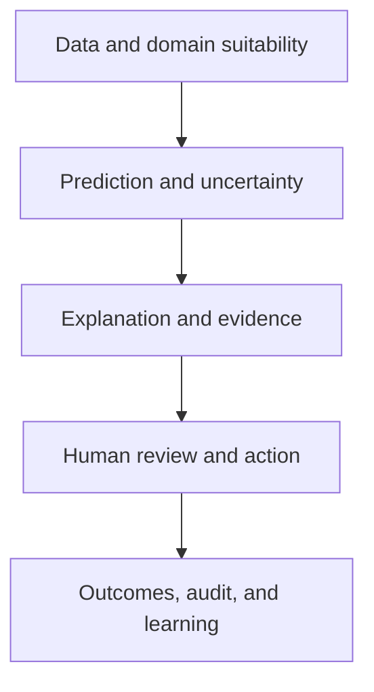



In safety-critical domains, explainable AI (XAI) is not a pretty feature-importance chart. An explanation is an **interface for understanding model judgments, finding errors, helping people accept or reject them appropriately, and auditing decisions afterward**.

At the same time, an explanation is not proof of safety. A plausible explanation can justify an incorrect prediction or cause a human reviewer to overtrust the model. XAI must therefore be validated together with model performance, uncertainty, domain boundaries, work procedures, and human factors.

## 1. The problem: the difference between “having an explanation” and “being safe to use”

### One explanation cannot answer every question

Explanation requests have different purposes.

| Stakeholder | Actual question |
|---|---|
| Model developer | Has the model learned a spurious correlation or leakage? |
| Frontline reviewer | What should I check in this case? |
| Affected person | Why was this decision made, and what can I correct or appeal? |
| Safety or audit owner | Which data, model, policy, and approval produced the decision? |
| Operations owner | When should the model be rejected, stopped, or rolled back? |

Giving one global feature-importance view to every audience either omits needed information or creates misunderstandings.

### Explainability and transparency are different

- **Explainability**: presents inputs, rules, similar cases, or other factors that contributed to a specific output
- **Transparency**: discloses and tracks data provenance, model version, purpose, limitations, and operating policy
- **Interpretability**: the degree to which people can directly understand a model's structure or relationships
- **Auditability**: the ability to reconstruct and verify the decision process afterward

Attaching a local explanation to a complex model does not make its data lineage or decision policy transparent.

### A post-hoc explanation may be an approximation distinct from the model

Many XAI methods approximate an original model \(f\) near a point with a simpler model \(g\).

\[
g_x = \arg\min_{g\in\mathcal G}
\mathcal L\left(f,g,\pi_x\right)+\Omega(g)
\]

- \(\pi_x\): weights around the point \(x\) being explained
- \(\mathcal L\): disagreement between the original model and explanation model
- \(\Omega\): explanation complexity

The result explains \(g_x\), not the original model's internal causal mechanism itself. The quality and stability of the local approximation must be validated.

### Feature contribution is not causal effect

“Feature A increased the prediction” usually means an associative contribution within the model function. It does not mean that changing A in the real world will improve the outcome. Mixing correlated features, mediators, measurement proxies, and policy outcomes can induce harmful actions.

## 2. Mental model: a decision safety case, not a model explanation

View safe decision-making in five layers.



1. Is the input within the supported domain and of sufficient quality?
2. Have the prediction and uncertainty been validated?
3. Is the explanation faithful to the model and data?
4. Does a person use it to make a better decision?
5. Can outcomes and overrides be tracked to improve the system?

A failure in one layer cannot be repaired by a graph in another.

### Human-in-the-loop does not mean “a person presses the final button”

If a person simply approves the model output, there is no meaningful control. Meaningful human control requires the following.

- enough time and information to decide
- authority to reject the model
- alternative actions and an escalation path
- training to understand model uncertainty and limitations
- organizational design that does not penalize overrides
- criteria and independent signals for judging without the model

Collaboration is most effective when human and model errors are independent. If people rely on the same features and biases as the model, their errors move together.

### Turn “I don't know” into an action through selective prediction

A model can defer some cases instead of being forced to process every one.

\[
\hat y(x)=
\begin{cases}
f(x), & c(x)\ge\tau \text{ and } x\in\mathcal X_{support}\\
\text{defer}, & \text{otherwise}
\end{cases}
\]

- \(c(x)\): a confidence score based on confidence or uncertainty
- \(\mathcal X_{support}\): validated support domain
- \(\tau\): deferral threshold

Increasing the deferral rate generally lowers errors among the remaining cases. Evaluate this tradeoff with a coverage–risk curve.

\[
\mathrm{coverage}(\tau)=P(c(X)\ge\tau), \qquad
\mathrm{risk}(\tau)=E[\ell(f(X),Y)\mid c(X)\ge\tau]
\]

## 3. Practical workflow

### Step 1. Derive explanation requirements from risk analysis

Do not choose an explanation tool first. Identify failure modes first.

- incorrect input, units, or missing values
- data leakage or proxy variables
- inputs outside the support domain
- overconfident probabilities or poor calibration
- degraded performance in important subgroups
- a correct model with an inappropriate policy threshold
- reviewer automation bias
- interpreting explanations as causal advice
- fatigue caused by repeated alerts
- inability to reconstruct the basis of a decision afterward

Define preventive, detective, mitigation, and recovery controls for each risk. For example, a domain guard and deferral are more direct controls for OOD risk than a feature-contribution chart.

### Step 2. Specify the explanation's question, audience, and action

Example explanation specification:

```yaml
audience: "숙련된 현장 검토자"
question: "왜 이 사례가 우선 검토 대상으로 분류되었는가?"
decision: "즉시 검토 / 일반 대기열 / 상급자 escalation"
content:
  - "검증된 상위 기여 신호"
  - "입력 신선도와 누락"
  - "예측 확률과 보정 상태"
  - "OOD·불확실성 경고"
  - "확인해야 할 원자료 링크"
prohibited_claims:
  - "특징을 바꾸면 결과가 개선된다는 인과 주장"
  - "설명만으로 확정 판정"
```

An explanation should help the user act, but it must not be used only to justify the model.

### Step 3. Build an interpretable baseline first

A simple explainable model is an important benchmark.

- linear or additive models
- small rule sets or shallow trees
- monotonic constrained models
- explicit scorecards

If the performance gain from a complex model is small, the direct interpretability, ease of validation, and stability of a simple model may offer greater system value.

A simple model is not automatically fair or causally correct. Coefficient sign and magnitude are affected by feature scale, correlation, and sample selection.

### Step 4. Combine explanation methods to match the question

#### Global behavior

- permutation-based importance
- partial dependence or conditional relationships
- accumulated local effects
- global surrogate or rule extraction
- performance and error analysis by condition

With correlated features, shuffling one may let another substitute its information and make its importance appear low. Also beware of methods that create unrealistic feature combinations.

#### Local behavior

- feature attribution
- local surrogate
- similar cases or prototypes
- counterfactual explanation
- sensitivity to input changes

Applying several explanation methods to one case and checking agreement is useful for diagnosis, but agreement does not guarantee truth.

#### Process explanation

- Which model, data, and threshold were used?
- When was the input collected and validated?
- Is it within the model's supported scope?
- Who approved or overrode it, and when?
- Which fallback or rule was applied?

For safety and auditing, process explanations may matter more than feature attribution.

### Step 5. Add real-world constraints to counterfactuals

A counterfactual asks, “What minimum change would alter the output?”

\[
x' = \arg\min_{z}
d(x,z)+\lambda\,\ell(f(z),y_{target})
\]

Unconstrained optimization produces impossible or unfair suggestions. Add the following constraints.

- fix immutable features
- temporal order and causal structure
- allowed ranges, units, and category combinations
- consistency among linked features
- actual cost of taking an action
- diversity among possible alternatives

A counterfactual explains the model's decision boundary; it does not guarantee that the suggested change will cause the real-world outcome. Action recommendations require separate causal and domain evidence.

### Step 6. Quantitatively validate XAI itself

#### Fidelity

How well does the explanation approximate the original model's local or global behavior?

- difference between the prediction reconstructed from the explanation and the original prediction
- output change when important features are removed or inserted
- approximation error in a local neighborhood

If removing a feature creates OOD inputs, the result is difficult to interpret as fidelity alone. Conditional generation or domain validity checks are needed.

#### Stability

How much does the explanation change across similar inputs or random seeds?

\[
S(x)=E_{x'\in N(x)}
\frac{\|e(x)-e(x')\|}{\|x-x'\|+\epsilon}
\]

If explanation rankings change greatly while predictions remain nearly identical, reviewers may become confused. Consider grouped explanations when correlated features divide contributions among themselves.

#### Robustness and sensitivity

- Does the explanation remain stable under small irrelevant perturbations?
- Does it respond to meaningful feature changes?
- Is it sensitive to the choice of baseline or background dataset?
- Does it show false confidence for OOD, missing, or extreme inputs?

#### Completeness and uncertainty

Show unexplained residual effects and explanation uncertainty. Instead of presenting one exact ranking, provide ranges across bootstrap samples or multiple background sets.

### Step 7. Design the UI to separate model confidence from explanation confidence

At minimum, distinguish the following on the review screen.

- prediction or risk range
- probability calibration status and uncertainty
- input quality, freshness, and OOD warnings
- model contribution signals
- path to inspect source evidence
- alternative actions and escalation
- known model limitations

Displaying probabilities to many decimal places can imply more precision than exists. Use ranges or categories that match the validation level.

Prominently displaying the explanation by default can intensify anchoring. Depending on the risk, also compare a sequence in which the person records an independent judgment before model information is revealed.

### Step 8. Evaluate the human–AI team on the actual task

An explanation-satisfaction survey is insufficient. Compare these conditions.

1. Human judgment alone
2. Model output only
3. Model + explanation
4. Model + uncertainty + explanation + deferral procedure

Evaluation metrics:

- team accuracy, sensitivity, and specificity
- critical error rate
- decision time and workload
- human rejection rate when the model is wrong
- acceptance rate when the model is correct
- overtrust and undertrust calibration
- appropriateness of overrides
- variation among reviewers
- automation bias and fatigue over long-term use

An explanation may not be useful if it increases decision time without reducing errors. Conversely, it has value if it reduces critical errors even when overall accuracy is unchanged.

### Step 9. Connect deferral and escalation to the workflow

Distinguish among causes of deferral.

- OOD
- high epistemic uncertainty
- insufficient input quality
- disagreement among models
- proximity to the decision boundary
- high expected harm
- mandatory regulatory review

Putting every deferred case into the same queue creates a bottleneck. Route cases by cause and risk to remeasurement, a request for more data, expert review, original interpretation, or a safe default action.

If review capacity is \(B\), the threshold must satisfy queue stability as well as accuracy.

\[
E[N_{defer}] \le B
\]

When capacity is exceeded, do not simply automate low-risk cases first. An explicit priority policy must state which risks receive conservative handling.

### Step 10. Record the entire decision as an auditable event

Connect the following to each decision.

- input snapshot and quality status
- model, preprocessing, explainer, and policy versions
- prediction, uncertainty, and OOD score
- explanation and reference data provided
- human judgment, override, and reason
- final action and subsequent outcome
- approval and escalation times

Preserve only the minimum necessary information in audit logs and apply access controls and retention periods. Because free-text reasons may contain sensitive information, combine structured reason codes with restricted notes.

### Step 11. Use explanations and overrides as model-improvement signals

Review the following patterns regularly.

- A particular feature repeatedly produces misleading explanations.
- OOD deferrals concentrate in a particular domain.
- Expert reviewers repeatedly override the same error type.
- Acceptance rates differ excessively among reviewers.
- Model performance remains the same while explanation stability deteriorates.
- Explanations obstruct inspection of important source evidence.

An override is not always correct. Analyze both model and human errors after the subsequent outcome is established. Training directly on human decisions as new labels can reinforce existing bias.

## 4. Evaluation and verification checklist

### Purpose and risk

- [ ] The explanation's audience, question, and follow-up action are specified.
- [ ] There is a concrete failure mode that XAI is intended to mitigate.
- [ ] The explanation is not misused as proof of safety or a causal claim.
- [ ] It has been compared with a simple, interpretable baseline.
- [ ] Risks that need direct controls such as domain guards or validation rather than explanations have been distinguished.

### Explanation quality

- [ ] Global, local, and process explanations have been distinguished by purpose.
- [ ] Fidelity has been evaluated quantitatively against the original model.
- [ ] Stability has been checked across similar inputs, random seeds, and background-set changes.
- [ ] Effects of correlated features and unrealistic perturbations have been reviewed.
- [ ] Feasibility, immutability, and causal constraints have been added to counterfactuals.
- [ ] Explanation uncertainty and known limitations are displayed.

### Model and domain

- [ ] Predicted probabilities and uncertainty have been validated separately.
- [ ] A support domain and OOD rejection rules exist.
- [ ] Explanations and performance have been evaluated for important subgroups, extremes, and missing values.
- [ ] The deferral threshold was selected from the coverage–risk curve.
- [ ] Human review capacity and waiting-time constraints are reflected.

### Human–AI collaboration

- [ ] Human-only, model-only, and explanation conditions were compared on the actual task.
- [ ] Appropriate human rejection of model errors was measured.
- [ ] Automation bias, anchoring, fatigue, and workload were evaluated.
- [ ] Reviewers have authority to reject or escalate and have alternative actions.
- [ ] Override reasons and subsequent outcomes are tracked.
- [ ] The explanation UI was tested for different expertise levels and roles.

### Governance

- [ ] Data, model, explainer, policy, and human-decision lineage exists.
- [ ] Immediate stop, fallback, and rollback procedures exist for critical errors.
- [ ] Explanation changes receive regression evaluation like model changes.
- [ ] Audit logs apply data minimization, access control, and retention periods.
- [ ] Appeal and post-decision correction paths exist.

## 5. Limitations and cautions

First, making every complex model fully understandable to people is difficult. XAI provides approximate evidence for limited questions and does not replace validation, monitoring, or fallback.

Second, merely having a person in the loop does not make a system safe. Time pressure, lack of authority, organizational incentives, and repeated exposure can reduce review to formal approval. The human system itself must be tested.

Third, explanation stability and fidelity may conflict. Smoothing an actually unstable decision boundary makes it easier to understand but can hide an important risk. Warning about the instability directly may be safer.

Fourth, a deferral policy reduces errors but moves workload elsewhere. If the expert queue saturates, delay becomes a new risk.

Finally, when decision outcomes become training data, a feedback loop forms among the model, humans, and policy. Distinguish overrides from observed outcomes, and account for selection bias in evaluation and retraining.
