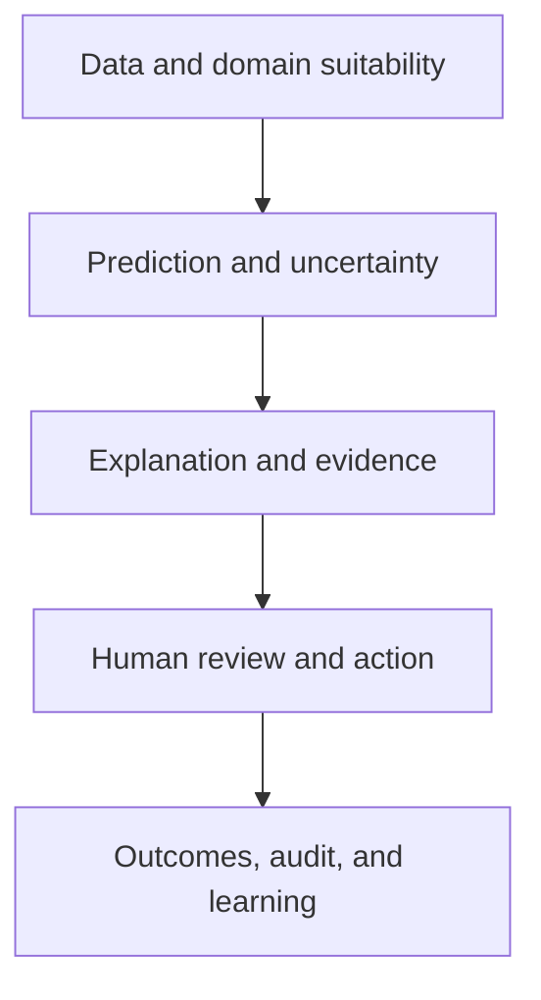



En dominios críticos para la seguridad, el AI (XAI) explicable no es un gráfico bonito de importancia de características. Una explicación es una **interfaz para comprender los juicios del modelo, encontrar errores, ayudar a las personas a aceptarlos o rechazarlos de manera apropiada y auditar las decisiones posteriores**.

Al mismo tiempo, una explicación no es prueba de seguridad. Una explicación plausible puede justificar una predicción incorrecta o hacer que un revisor humano confíe demasiado en el modelo. Por lo tanto, XAI debe validarse junto con el rendimiento del modelo, la incertidumbre, los límites del dominio, los procedimientos de trabajo y los factores humanos.

## 1. El problema: la diferencia entre “tener una explicación” y “ser seguro de usar”

### Una explicación no puede responder a todas las preguntas

Las solicitudes de explicación tienen diferentes propósitos.

| Parte interesada | Pregunta real |
|---|---|
| Desarrollador de modelos | ¿El modelo ha aprendido una correlación o fuga espuria? |
| Revisor de primera línea | ¿Qué debo comprobar en este caso? |
| Persona afectada | ¿Por qué se tomó esta decisión y qué puedo corregir o apelar? |
| Propietario de seguridad o auditoría | ¿Qué datos, modelo, política y aprobación produjeron la decisión? |
| Propietario de operaciones | ¿Cuándo se debe rechazar, detener o revertir el modelo? |

Dar una visión global de la importancia de las características a cada audiencia omite información necesaria o crea malentendidos.

### La explicabilidad y la transparencia son diferentes

- **Explicabilidad**: presenta entradas, reglas, casos similares u otros factores que contribuyeron a un resultado específico.
- **Transparencia**: divulga y rastrea la procedencia de los datos, la versión del modelo, el propósito, las limitaciones y la política operativa.
- **Interpretabilidad**: el grado en que las personas pueden comprender directamente la estructura o las relaciones de un modelo.
- **Auditabilidad**: la capacidad de reconstruir y verificar el proceso de decisión posteriormente

Adjuntar una explicación local a un modelo complejo no hace que su linaje de datos ni su política de decisiones sean transparentes.

### Una explicación post-hoc puede ser una aproximación distinta del modelo.

Muchos métodos XAI aproximan un modelo original \(f\) cerca de un punto con un modelo más simple \(g\).

\[
g_x = \arg\min_{g\in\mathcal G}
\mathcal L\left(f,g,\pi_x\right)+\Omega(g)
\]

- \(\pi_x\): pesos alrededor del punto \(x\) que se explica
- \(\mathcal L\): desacuerdo entre el modelo original y el modelo de explicación
- \(\Omega\): complejidad de la explicación

El resultado explica \(g_x\), no el mecanismo causal interno del modelo original en sí. Se debe validar la calidad y estabilidad de la aproximación local.

### La contribución de la característica no es un efecto causal

"La característica A aumentó la predicción" generalmente significa una contribución asociativa dentro de la función del modelo. Esto no significa que cambiar A en el mundo real mejorará el resultado. Combinar características correlacionadas, mediadores, indicadores de medición y resultados de políticas puede inducir acciones perjudiciales.

## 2. Modelo mental: un caso de seguridad de decisión, no una explicación modelo

Vea la toma de decisiones segura en cinco capas.



1. ¿La entrada está dentro del dominio admitido y es de calidad suficiente?
2. ¿Se han validado la predicción y la incertidumbre?
3. ¿La explicación es fiel al modelo y a los datos?
4. ¿La persona lo utiliza para tomar una mejor decisión?
5. ¿Se pueden realizar un seguimiento de los resultados y las anulaciones para mejorar el sistema?

Una falla en una capa no puede repararse mediante un gráfico en otra.

### Human-in-the-loop no significa "una persona presiona el último botón"

Si una persona simplemente aprueba el resultado del modelo, no existe un control significativo. Un control humano significativo requiere lo siguiente.

- suficiente tiempo e información para decidir
- autoridad para rechazar el modelo
- acciones alternativas y un camino de escalada
- formación para comprender la incertidumbre y las limitaciones del modelo
- diseño organizacional que no penaliza las anulaciones
- criterios y señales independientes para juzgar sin el modelo

La colaboración es más eficaz cuando los errores humanos y del modelo son independientes. Si las personas se basan en las mismas características y sesgos que el modelo, sus errores se mueven juntos.

### Convertir el “No sé” en una acción mediante la predicción selectiva

Un modelo puede aplazar algunos casos en lugar de verse obligado a procesarlos todos.

\[
\hat y(x)=
\begin{cases}
f(x), & c(x)\ge\tau \text{ and } x\in\mathcal X_{support}\\
\text{defer}, & \text{otherwise}
\end{cases}
\]

- \(c(x)\): una puntuación de confianza basada en la confianza o la incertidumbre
- \(\mathcal X_{support}\): dominio de soporte validado
- \(\tau\): umbral de aplazamiento

Aumentar la tasa de aplazamiento generalmente reduce los errores entre los casos restantes. Evalúe esta compensación con una curva cobertura-riesgo.

\[
\mathrm{coverage}(\tau)=P(c(X)\ge\tau), \qquad
\mathrm{risk}(\tau)=E[\ell(f(X),Y)\mid c(X)\ge\tau]
\]

## 3. Flujo de trabajo práctico

### Paso 1. Deducir los requisitos explicativos del análisis de riesgos

No elija primero una herramienta de explicación. Primero identifique los modos de falla.

- entrada incorrecta, unidades o valores faltantes
- fuga de datos o variables proxy
- entradas fuera del dominio de soporte
- probabilidades excesivamente confiadas o mala calibración
- rendimiento degradado en subgrupos importantes
- un modelo correcto con un umbral de política inadecuado
- sesgo de automatización del revisor
- interpretar explicaciones como consejos causales
- fatiga causada por alertas repetidas
- incapacidad para reconstruir la base de una decisión posteriormente

Definir controles preventivos, detectivos, de mitigación y de recuperación para cada riesgo. Por ejemplo, una protección de dominio y un aplazamiento son controles más directos para el riesgo OOD que un gráfico de contribución de funciones.

### Paso 2. Especifique la pregunta, la audiencia y la acción de la explicación.

Especificación de explicación de ejemplo:

```yaml
audience: "숙련된 현장 검토자"
question: "왜 이 사례가 우선 검토 대상으로 분류되었는가?"
decision: "즉시 검토 / 일반 대기열 / 상급자 escalation"
content:
  - "검증된 상위 기여 신호"
  - "입력 신선도와 누락"
  - "예측 확률과 보정 상태"
  - "OOD·불확실성 경고"
  - "확인해야 할 원자료 링크"
prohibited_claims:
  - "특징을 바꾸면 결과가 개선된다는 인과 주장"
  - "설명만으로 확정 판정"
```

Una explicación debe ayudar al usuario a actuar, pero no debe utilizarse únicamente para justificar el modelo.

### Paso 3. Construya primero una línea de base interpretable

Un modelo simple y explicable es un punto de referencia importante.

- modelos lineales o aditivos
- conjuntos de reglas pequeños o árboles poco profundos
- modelos restringidos monótonos
- cuadros de mando explícitos

Si la ganancia de rendimiento de un modelo complejo es pequeña, la interpretabilidad directa, la facilidad de validación y la estabilidad de un modelo simple pueden ofrecer un mayor valor del sistema.

Un modelo simple no es automáticamente justo ni causalmente correcto. El signo y la magnitud del coeficiente se ven afectados por la escala de características, la correlación y la selección de muestras.

### Paso 4. Combine métodos de explicación para que coincidan con la pregunta

#### Comportamiento global

- importancia basada en permutación
- dependencia parcial o relaciones condicionales
- efectos locales acumulados
- sustituto global o extracción de reglas
- análisis de rendimiento y errores por condición

Con características correlacionadas, mezclar una puede permitir que otra sustituya su información y hacer que su importancia parezca baja. También tenga cuidado con los métodos que crean combinaciones de características poco realistas.

#### Comportamiento local

- atribución de características
- sustituto local
- casos o prototipos similares
- explicación contrafactual
- sensibilidad a los cambios de entrada

Aplicar varios métodos de explicación a un caso y comprobar la concordancia es útil para el diagnóstico, pero la concordancia no garantiza la verdad.

#### Explicación del proceso

- ¿Qué modelo, datos y umbral se utilizaron?
- ¿Cuándo se recogieron y validaron los aportes?
- ¿Está dentro del alcance admitido del modelo?
- ¿Quién lo aprobó o anuló y cuándo?
- ¿Qué recurso o regla se aplicó?

Para la seguridad y la auditoría, las explicaciones del proceso pueden ser más importantes que la atribución de características.

### Paso 5. Agregar restricciones del mundo real a los contrafactuales

Un contrafactual pregunta: "¿Qué cambio mínimo alteraría el resultado?"

\[
x' = \arg\min_{z}
d(x,z)+\lambda\,\ell(f(z),y_{target})
\]

La optimización sin restricciones produce sugerencias imposibles o injustas. Agregue las siguientes restricciones.

- arreglar características inmutables
- orden temporal y estructura causal
- rangos, unidades y combinaciones de categorías permitidas
- coherencia entre las funciones vinculadas
- costo real de tomar una acción
- diversidad entre posibles alternativas

Un contrafactual explica el límite de decisión del modelo; no garantiza que el cambio sugerido cause el resultado en el mundo real. Las recomendaciones de acción requieren evidencia causal y de dominio separada.

### Paso 6. Validar cuantitativamente el propio XAI

#### Fidelidad

¿Qué tan bien se aproxima la explicación al comportamiento local o global del modelo original?

- diferencia entre la predicción reconstruida a partir de la explicación y la predicción original
- cambio de salida cuando se eliminan o insertan características importantes
- error de aproximación en un vecindario local

Si eliminar una característica crea OOD entradas, el resultado es difícil de interpretar como fidelidad únicamente. Se necesitan comprobaciones de validez de dominio o generación condicional.

#### Estabilidad

¿Cuánto cambia la explicación entre entradas similares o semillas aleatorias?

\[
S(x)=E_{x'\in N(x)}
\frac{\|e(x)-e(x')\|}{\|x-x'\|+\epsilon}
\]

Si las clasificaciones de las explicaciones cambian mucho mientras las predicciones siguen siendo casi idénticas, los revisores pueden confundirse. Considere explicaciones agrupadas cuando las características correlacionadas dividen las contribuciones entre sí.

#### Robustez y sensibilidad

- ¿La explicación permanece estable ante pequeñas perturbaciones irrelevantes?
- ¿Responde a cambios significativos en las funciones?
- ¿Es sensible a la elección del conjunto de datos de referencia o de antecedentes?
- ¿Muestra una confianza falsa para las entradas OOD, faltantes o extremas?

#### Integridad e incertidumbre

Muestre efectos residuales inexplicables e incertidumbre en la explicación. En lugar de presentar una clasificación exacta, proporcione rangos entre muestras de arranque o múltiples conjuntos de antecedentes.

### Paso 7. Diseñe UI para separar la confianza del modelo de la confianza de la explicación

Como mínimo, distinga lo siguiente en la pantalla de revisión.

- predicción o rango de riesgo
- probabilidad e incertidumbre del estado de calibración
- calidad de entrada, frescura y advertencias OOD
- señales de contribución del modelo
- ruta para inspeccionar la fuente de evidencia
- acciones alternativas y escalada
- limitaciones conocidas del modelo

Mostrar probabilidades con muchos decimales puede implicar más precisión de la que existe. Utilice rangos o categorías que coincidan con el nivel de validación.

Mostrar la explicación de forma destacada de forma predeterminada puede intensificar el anclaje. Dependiendo del riesgo, compare también una secuencia en la que la persona registra un juicio independiente antes de que se revele la información del modelo.

### Paso 8. Evaluar al equipo humano–AI en la tarea real

Una encuesta de explicación-satisfacción es insuficiente. Compara estas condiciones.

1. Sólo el juicio humano
2. Solo salida del modelo
3. Modelo + explicación
4. Modelo + incertidumbre + explicación + procedimiento de aplazamiento

Métricas de evaluación:

- precisión, sensibilidad y especificidad del equipo
- tasa de error crítico
- tiempo de decisión y carga de trabajo
- tasa de rechazo humano cuando el modelo es incorrecto
- tasa de aceptación cuando el modelo es correcto
- calibración de exceso y falta de confianza
- idoneidad de las anulaciones
- variación entre revisores
- sesgo de automatización y fatiga por el uso a largo plazo

Una explicación puede no ser útil si aumenta el tiempo de decisión sin reducir los errores. Por el contrario, tiene valor si reduce los errores críticos incluso cuando la precisión general no cambia.

### Paso 9. Conecte el aplazamiento y la escalada al flujo de trabajo

Distinguir entre causas de aplazamiento.

- OOD
- alta incertidumbre epistémica
- calidad de entrada insuficiente
- desacuerdo entre modelos
- proximidad al límite de decisión
- alto daño esperado
- revisión regulatoria obligatoria

Poner todos los casos aplazados en la misma cola crea un cuello de botella. Dirija los casos por causa y riesgo a una nueva medición, una solicitud de más datos, una revisión de expertos, una interpretación original o una acción predeterminada segura.

Si la capacidad de revisión es \(B\), el umbral debe satisfacer la estabilidad de la cola además de la precisión.

\[
E[N_{defer}] \le B
\]

Cuando se exceda la capacidad, no se limite a automatizar primero los casos de bajo riesgo. Una política de prioridad explícita debe establecer qué riesgos reciben un manejo conservador.

### Paso 10. Registre toda la decisión como un evento auditable

Conecte lo siguiente con cada decisión.

- instantánea de entrada y estado de calidad
- versiones de modelo, preprocesamiento, explicación y política
- predicción, incertidumbre y puntuación OOD
- explicación y datos de referencia proporcionados
- juicio humano, anulación y razón
- acción final y resultado posterior
- tiempos de aprobación y escalamiento

Conserve solo la información mínima necesaria en los registros de auditoría y aplique controles de acceso y períodos de retención. Dado que los motivos de texto libre pueden contener información confidencial, combine códigos de motivo estructurados con notas restringidas.

### Paso 11. Utilice explicaciones y anulaciones como señales de mejora del modelo

Revise los siguientes patrones con regularidad.

- Una característica particular produce repetidamente explicaciones engañosas.
- Los aplazamientos OOD se concentran en un dominio particular.
- Los revisores expertos anulan repetidamente el mismo tipo de error.
- Las tasas de aceptación difieren excesivamente entre los revisores.
- El rendimiento del modelo sigue siendo el mismo mientras que la estabilidad de la explicación se deteriora.
- Las explicaciones obstruyen la inspección de fuentes de evidencia importantes.

Una anulación no siempre es correcta. Analice tanto los errores humanos como los del modelo una vez establecido el resultado posterior. Entrenar directamente sobre las decisiones humanas como nuevas etiquetas puede reforzar los prejuicios existentes.

## 4. Lista de verificación de evaluación y verificación

### Propósito y riesgo

- [ ] Se especifica el público de la explicación, la pregunta y la acción de seguimiento.
- [ ] Hay un modo de falla concreto que XAI pretende mitigar.
- [ ] La explicación no se utiliza indebidamente como prueba de seguridad o como afirmación causal.
- [ ] Se ha comparado con una línea base simple e interpretable.
- [ ] Se han distinguido los riesgos que necesitan controles directos como guardias de dominio o validación en lugar de explicaciones.

### Calidad de la explicación

- [ ] Se han distinguido por finalidad las explicaciones globales, locales y de procesos.
- [ ] La fidelidad se ha evaluado cuantitativamente frente al modelo original.
- [] Se ha comprobado la estabilidad en entradas similares, semillas aleatorias y cambios en el conjunto de fondo.
- [ ] Se han revisado los efectos de características correlacionadas y perturbaciones poco realistas.
- [ ] A los contrafactuales se les han añadido restricciones de viabilidad, inmutabilidad y causalidad.
- [ ] Se muestran la incertidumbre de explicación y las limitaciones conocidas.

### Modelo y dominio

- [ ] Las probabilidades y la incertidumbre previstas se han validado por separado.
- [ ] Existen un dominio de soporte y OOD reglas de rechazo.
- [ ] Se han evaluado explicaciones y desempeño para subgrupos importantes, extremos y valores faltantes.
- [ ] El umbral de diferimiento se seleccionó de la curva cobertura-riesgo.
- [ ] Se reflejan las limitaciones de capacidad de revisión humana y tiempo de espera.

### Humano–AI colaboración

- [] Se compararon las condiciones de explicación solo humana, solo modelo y en la tarea real.
- [ ] Se midió el rechazo humano apropiado de los errores del modelo.
- [ ] Se evaluaron sesgo de automatización, anclaje, fatiga y carga de trabajo.
- [ ] Los revisores tienen autoridad para rechazar o escalar y tener acciones alternativas.
- [] Se realiza un seguimiento de los motivos de anulación y los resultados posteriores.
- [ ] La explicación UI se probó para diferentes niveles de experiencia y roles.

### Gobernanza

- [ ] Existe un linaje de datos, modelos, explicaciones, políticas y decisiones humanas.
- [ ] Existen procedimientos inmediatos de parada, retroceso y reversión para errores críticos.
- [] Los cambios de explicación reciben una evaluación de regresión como cambios de modelo.
- [ ] Los registros de auditoría aplican minimización de datos, control de acceso y períodos de retención.
- [ ] Existen vías de apelación y corrección posterior a la decisión.

## 5. Limitaciones y precauciones

En primer lugar, es difícil hacer que cada modelo complejo sea completamente comprensible para las personas. XAI proporciona evidencia aproximada para preguntas limitadas y no reemplaza la validación, el monitoreo ni el respaldo.

En segundo lugar, el simple hecho de tener una persona al tanto no hace que un sistema sea seguro. La presión del tiempo, la falta de autoridad, los incentivos organizacionales y la exposición repetida pueden reducir la revisión a una aprobación formal. El propio sistema humano debe ser puesto a prueba.

En tercer lugar, la estabilidad y la fidelidad de la explicación pueden entrar en conflicto. Suavizar un límite de decisión realmente inestable hace que sea más fácil de entender, pero puede ocultar un riesgo importante. Advertir directamente sobre la inestabilidad puede ser más seguro.

En cuarto lugar, una política de aplazamiento reduce los errores pero traslada la carga de trabajo a otra parte. Si la cola de expertos se satura, el retraso se convierte en un nuevo riesgo.

Finalmente, cuando los resultados de las decisiones se convierten en datos de entrenamiento, se forma un circuito de retroalimentación entre el modelo, los humanos y la política. Distinga las anulaciones de los resultados observados y tenga en cuenta el sesgo de selección en la evaluación y el reentrenamiento.
