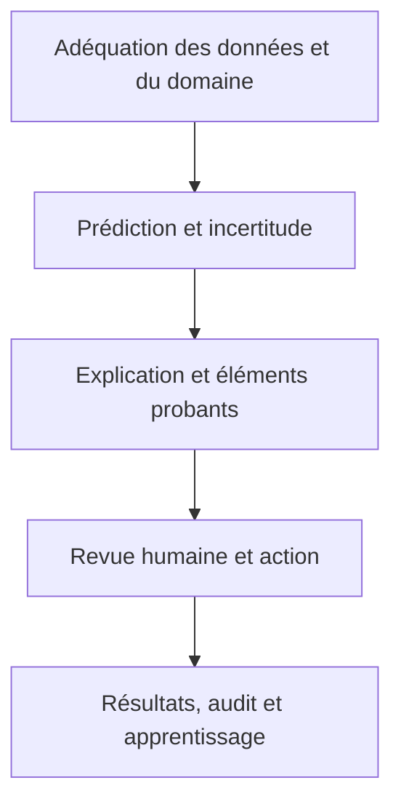



Dans les domaines critiques pour la sécurité, l’intelligence artificielle explicable (XAI) n’est pas un joli graphique d’importance des variables. Une explication est une **interface permettant de comprendre les jugements du modèle, de repérer les erreurs, d’aider les personnes à les accepter ou les rejeter de manière appropriée et d’auditer les décisions après coup**.

Dans le même temps, une explication ne constitue pas une preuve de sécurité. Une explication plausible peut justifier une prédiction incorrecte ou conduire un réviseur humain à accorder une confiance excessive au modèle. La XAI doit donc être validée avec les performances du modèle, l’incertitude, les limites du domaine, les procédures de travail et les facteurs humains.

## 1. Le problème : la différence entre « disposer d’une explication » et « pouvoir utiliser le système en toute sécurité »

### Une seule explication ne peut pas répondre à toutes les questions

Les demandes d’explication répondent à des objectifs différents.

| Partie prenante | Question réelle |
|---|---|
| Développeur du modèle | Le modèle a-t-il appris une corrélation fallacieuse ou une fuite de données ? |
| Réviseur de première ligne | Que dois-je vérifier dans ce cas ? |
| Personne concernée | Pourquoi cette décision a-t-elle été prise, et que puis-je corriger ou contester ? |
| Responsable de la sécurité ou de l’audit | Quelles données, quel modèle, quelle politique et quelle approbation ont produit la décision ? |
| Responsable des opérations | Quand faut-il rejeter, arrêter ou restaurer le modèle ? |

Présenter la même vue globale de l’importance des variables à tous les publics omet les informations nécessaires ou crée des malentendus.

### Explicabilité et transparence sont différentes

- **Explicabilité** : présente les entrées, règles, cas similaires ou autres facteurs ayant contribué à un résultat précis
- **Transparence** : divulgue et suit la provenance des données, la version du modèle, sa finalité, ses limites et la politique d’exploitation
- **Interprétabilité** : degré auquel les personnes peuvent comprendre directement la structure ou les relations d’un modèle
- **Auditabilité** : capacité à reconstruire et vérifier le processus de décision après coup

Joindre une explication locale à un modèle complexe ne rend pas transparente la traçabilité de ses données ni sa politique de décision.

### Une explication post-hoc peut être une approximation distincte du modèle

De nombreuses méthodes XAI approchent un modèle original \(f\) près d’un point au moyen d’un modèle plus simple \(g\).

\[
g_x = \arg\min_{g\in\mathcal G}
\mathcal L\left(f,g,\pi_x\right)+\Omega(g)
\]

- \(\pi_x\) : poids autour du point \(x\) expliqué
- \(\mathcal L\) : désaccord entre le modèle original et le modèle d’explication
- \(\Omega\) : complexité de l’explication

Le résultat explique \(g_x\), et non le mécanisme causal interne du modèle original lui-même. Il faut valider la qualité et la stabilité de l’approximation locale.

### La contribution d’une variable n’est pas un effet causal

« La variable A a augmenté la prédiction » désigne généralement une contribution associative au sein de la fonction du modèle. Cela ne signifie pas que modifier A dans le monde réel améliorera le résultat. Mélanger variables corrélées, médiateurs, proxies de mesure et résultats de politiques peut entraîner des actions nuisibles.

## 2. Modèle mental : un dossier de sûreté décisionnelle, pas une explication de modèle

Considérez la prise de décision sûre en cinq couches.



1. L’entrée appartient-elle au domaine pris en charge et présente-t-elle une qualité suffisante ?
2. La prédiction et son incertitude ont-elles été validées ?
3. L’explication est-elle fidèle au modèle et aux données ?
4. Une personne s’en sert-elle pour prendre une meilleure décision ?
5. Peut-on suivre les résultats et les dérogations afin d’améliorer le système ?

Une défaillance dans une couche ne peut pas être corrigée par un graphique dans une autre.

### Human-in-the-loop ne signifie pas « une personne appuie sur le bouton final »

Si une personne se contente d’approuver le résultat du modèle, il n’existe aucun contrôle réel. Un contrôle humain significatif exige les éléments suivants.

- suffisamment de temps et d’informations pour décider
- l’autorité nécessaire pour rejeter le modèle
- des actions alternatives et un chemin d’escalade
- une formation permettant de comprendre l’incertitude et les limites du modèle
- une organisation qui ne pénalise pas les dérogations
- des critères et des signaux indépendants permettant de juger sans le modèle

La collaboration est la plus efficace lorsque les erreurs humaines et celles du modèle sont indépendantes. Si les personnes s’appuient sur les mêmes variables et biais que le modèle, leurs erreurs évoluent ensemble.

### Transformer « je ne sais pas » en action grâce à la prédiction sélective

Un modèle peut différer certains cas au lieu d’être forcé à tous les traiter.

\[
\hat y(x)=
\begin{cases}
f(x), & c(x)\ge\tau \text{ et } x\in\mathcal X_{support}\\
\text{différer}, & \text{sinon}
\end{cases}
\]

- \(c(x)\) : score de confiance fondé sur la confiance ou l’incertitude
- \(\mathcal X_{support}\) : domaine de support validé
- \(\tau\) : seuil de report

Augmenter le taux de report réduit généralement les erreurs parmi les cas restants. Évaluez ce compromis avec une courbe couverture–risque.

\[
\mathrm{coverage}(\tau)=P(c(X)\ge\tau), \qquad
\mathrm{risk}(\tau)=E[\ell(f(X),Y)\mid c(X)\ge\tau]
\]

## 3. Workflow pratique

### Étape 1. Déduire les exigences d’explication de l’analyse des risques

Ne choisissez pas d’abord un outil d’explication. Identifiez d’abord les modes de défaillance.

- entrée incorrecte, unités erronées ou valeurs manquantes
- fuite de données ou variables proxies
- entrées hors du domaine de support
- probabilités trop confiantes ou mauvaise calibration
- performances dégradées dans des sous-groupes importants
- modèle correct avec un seuil de politique inapproprié
- biais d’automatisation du réviseur
- interprétation des explications comme des conseils causaux
- fatigue provoquée par des alertes répétées
- impossibilité de reconstruire après coup le fondement d’une décision

Définissez pour chaque risque des contrôles préventifs, détectifs, d’atténuation et de récupération. Par exemple, une garde de domaine et un report contrôlent plus directement le risque OOD qu’un graphique de contribution des variables.

### Étape 2. Préciser la question, le public et l’action de l’explication

Exemple de spécification d’explication :

```yaml
audience: "숙련된 현장 검토자"
question: "왜 이 사례가 우선 검토 대상으로 분류되었는가?"
decision: "즉시 검토 / 일반 대기열 / 상급자 escalation"
content:
  - "검증된 상위 기여 신호"
  - "입력 신선도와 누락"
  - "예측 확률과 보정 상태"
  - "OOD·불확실성 경고"
  - "확인해야 할 원자료 링크"
prohibited_claims:
  - "특징을 바꾸면 결과가 개선된다는 인과 주장"
  - "설명만으로 확정 판정"
```

Une explication doit aider l’utilisateur à agir, mais elle ne doit pas servir uniquement à justifier le modèle.

### Étape 3. Construire d’abord une baseline interprétable

Un modèle simple et explicable constitue un point de comparaison important.

- modèles linéaires ou additifs
- petits ensembles de règles ou arbres peu profonds
- modèles à contraintes monotones
- grilles de score explicites

Si le gain de performance d’un modèle complexe est faible, l’interprétabilité directe, la facilité de validation et la stabilité d’un modèle simple peuvent apporter davantage de valeur au système.

Un modèle simple n’est pas automatiquement équitable ni causalement correct. Le signe et l’amplitude des coefficients sont influencés par l’échelle des variables, leur corrélation et la sélection de l’échantillon.

### Étape 4. Combiner les méthodes d’explication en fonction de la question

#### Comportement global

- importance fondée sur la permutation
- dépendance partielle ou relations conditionnelles
- effets locaux accumulés
- surrogate global ou extraction de règles
- analyse des performances et des erreurs par condition

Avec des variables corrélées, en permuter une peut permettre à une autre de remplacer son information et donner l’impression que son importance est faible. Méfiez-vous également des méthodes qui créent des combinaisons de variables irréalistes.

#### Comportement local

- attribution de variables
- surrogate local
- cas similaires ou prototypes
- explication contrefactuelle
- sensibilité aux changements des entrées

Appliquer plusieurs méthodes d’explication à un cas et vérifier leur concordance est utile au diagnostic, mais leur accord ne garantit pas la vérité.

#### Explication du processus

- Quels modèle, données et seuil ont été utilisés ?
- Quand l’entrée a-t-elle été collectée et validée ?
- Se situe-t-elle dans le périmètre pris en charge par le modèle ?
- Qui l’a approuvée ou remplacée, et quand ?
- Quel fallback ou quelle règle a été appliqué ?

Pour la sécurité et l’audit, les explications du processus peuvent être plus importantes que l’attribution des variables.

### Étape 5. Ajouter des contraintes du monde réel aux contrefactuels

Un contrefactuel demande : « Quel changement minimal modifierait le résultat ? »

\[
x' = \arg\min_{z}
d(x,z)+\lambda\,\ell(f(z),y_{target})
\]

Une optimisation sans contrainte produit des suggestions impossibles ou injustes. Ajoutez les contraintes suivantes.

- fixer les variables immuables
- ordre temporel et structure causale
- plages autorisées, unités et combinaisons de catégories
- cohérence entre variables liées
- coût réel d’une action
- diversité des alternatives possibles

Un contrefactuel explique la frontière de décision du modèle ; il ne garantit pas que le changement suggéré produira le résultat dans le monde réel. Les recommandations d’action exigent des preuves causales et métier distinctes.

### Étape 6. Valider quantitativement la XAI elle-même

#### Fidélité

Dans quelle mesure l’explication approche-t-elle le comportement local ou global du modèle original ?

- différence entre la prédiction reconstruite à partir de l’explication et la prédiction originale
- variation de la sortie lorsque des variables importantes sont retirées ou insérées
- erreur d’approximation dans un voisinage local

Si le retrait d’une variable crée des entrées OOD, le résultat est difficile à interpréter uniquement en termes de fidélité. Une génération conditionnelle ou des contrôles de validité du domaine sont nécessaires.

#### Stabilité

Dans quelle mesure l’explication change-t-elle entre des entrées similaires ou des graines aléatoires ?

\[
S(x)=E_{x'\in N(x)}
\frac{\|e(x)-e(x')\|}{\|x-x'\|+\epsilon}
\]

Si le classement des explications change fortement alors que les prédictions restent presque identiques, les réviseurs risquent d’être désorientés. Envisagez des explications groupées lorsque des variables corrélées se répartissent les contributions.

#### Robustesse et sensibilité

- L’explication reste-t-elle stable sous de petites perturbations non pertinentes ?
- Réagit-elle aux changements significatifs des variables ?
- Est-elle sensible au choix de la baseline ou du jeu de données de référence ?
- Affiche-t-elle une fausse confiance pour des entrées OOD, manquantes ou extrêmes ?

#### Complétude et incertitude

Montrez les effets résiduels non expliqués et l’incertitude de l’explication. Au lieu de présenter un classement exact unique, fournissez des intervalles issus d’échantillons bootstrap ou de plusieurs jeux de référence.

### Étape 7. Concevoir l’interface pour séparer confiance du modèle et confiance de l’explication

Au minimum, distinguez les éléments suivants sur l’écran de revue.

- prédiction ou intervalle de risque
- état de calibration des probabilités et incertitude
- qualité et fraîcheur des entrées, et alertes OOD
- signaux de contribution du modèle
- moyen d’inspecter les preuves source
- actions alternatives et escalade
- limites connues du modèle

Afficher des probabilités avec de nombreuses décimales peut suggérer une précision qui n’existe pas. Utilisez des intervalles ou des catégories correspondant au niveau de validation.

Afficher l’explication en évidence par défaut peut accentuer l’ancrage. Selon le risque, comparez également une séquence dans laquelle la personne enregistre son jugement indépendant avant de voir les informations du modèle.

### Étape 8. Évaluer l’équipe humain–IA sur la tâche réelle

Une enquête de satisfaction sur les explications ne suffit pas. Comparez les conditions suivantes.

1. Jugement humain seul
2. Résultat du modèle seul
3. Modèle + explication
4. Modèle + incertitude + explication + procédure de report

Métriques d’évaluation :

- exactitude, sensibilité et spécificité de l’équipe
- taux d’erreurs critiques
- temps de décision et charge de travail
- taux de rejet humain lorsque le modèle se trompe
- taux d’acceptation lorsque le modèle a raison
- calibration de la confiance excessive et insuffisante
- pertinence des dérogations
- variation entre les réviseurs
- biais d’automatisation et fatigue lors d’un usage prolongé

Une explication peut être inutile si elle augmente le temps de décision sans réduire les erreurs. À l’inverse, elle a de la valeur si elle réduit les erreurs critiques même lorsque l’exactitude globale reste inchangée.

### Étape 9. Relier report et escalade au workflow

Distinguez les causes de report.

- OOD
- forte incertitude épistémique
- qualité insuffisante des entrées
- désaccord entre les modèles
- proximité de la frontière de décision
- préjudice attendu élevé
- revue réglementaire obligatoire

Placer tous les cas reportés dans la même file crée un goulot d’étranglement. Acheminez les cas selon leur cause et leur risque vers une nouvelle mesure, une demande de données supplémentaires, une revue experte, l’interprétation initiale ou une action sûre par défaut.

Si la capacité de revue est \(B\), le seuil doit satisfaire la stabilité de la file d’attente autant que l’exactitude.

\[
E[N_{defer}] \le B
\]

Lorsque la capacité est dépassée, ne vous contentez pas d’automatiser d’abord les cas à faible risque. Une politique de priorité explicite doit indiquer quels risques bénéficient d’un traitement conservateur.

### Étape 10. Enregistrer la décision complète comme un événement auditable

Reliez les éléments suivants à chaque décision.

- instantané des entrées et état de leur qualité
- versions du modèle, du prétraitement, de l’explicateur et de la politique
- prédiction, incertitude et score OOD
- explication et données de référence fournies
- jugement humain, dérogation et motif
- action finale et résultat ultérieur
- heures d’approbation et d’escalade

Ne conservez que les informations strictement nécessaires dans les journaux d’audit, et appliquez des contrôles d’accès et des durées de rétention. Comme les motifs en texte libre peuvent contenir des informations sensibles, associez des codes de motif structurés à des notes à accès restreint.

### Étape 11. Utiliser les explications et les dérogations comme signaux d’amélioration du modèle

Examinez régulièrement les tendances suivantes.

- Une variable donnée produit régulièrement des explications trompeuses.
- Les reports OOD se concentrent dans un domaine particulier.
- Les réviseurs experts corrigent régulièrement le même type d’erreur.
- Les taux d’acceptation diffèrent excessivement entre réviseurs.
- Les performances du modèle restent identiques tandis que la stabilité des explications se dégrade.
- Les explications gênent l’inspection d’éléments probants importants à la source.

Une dérogation n’est pas toujours correcte. Analysez les erreurs du modèle comme celles des personnes une fois le résultat ultérieur établi. Entraîner directement le modèle sur les décisions humaines comme nouvelles étiquettes peut renforcer les biais existants.

## 4. Liste de contrôle d’évaluation et de vérification

### Objectif et risque

- [ ] Le public, la question et l’action de suivi de l’explication sont précisés.
- [ ] Il existe un mode de défaillance concret que la XAI doit atténuer.
- [ ] L’explication n’est pas employée à tort comme preuve de sécurité ou affirmation causale.
- [ ] Elle a été comparée à une baseline simple et interprétable.
- [ ] Les risques qui exigent des contrôles directs comme des gardes de domaine ou une validation plutôt que des explications ont été distingués.

### Qualité des explications

- [ ] Les explications globales, locales et de processus ont été distinguées selon leur objectif.
- [ ] La fidélité a été évaluée quantitativement par rapport au modèle original.
- [ ] La stabilité a été vérifiée entre entrées similaires, graines aléatoires et changements du jeu de référence.
- [ ] Les effets des variables corrélées et des perturbations irréalistes ont été examinés.
- [ ] Des contraintes de faisabilité, d’immuabilité et de causalité ont été ajoutées aux contrefactuels.
- [ ] L’incertitude des explications et leurs limites connues sont affichées.

### Modèle et domaine

- [ ] Les probabilités prédites et l’incertitude ont été validées séparément.
- [ ] Un domaine de support et des règles de rejet OOD existent.
- [ ] Les explications et les performances ont été évaluées pour les sous-groupes importants, les extrêmes et les valeurs manquantes.
- [ ] Le seuil de report a été choisi à partir de la courbe couverture–risque.
- [ ] La capacité de revue humaine et les contraintes de temps d’attente sont prises en compte.

### Collaboration humain–IA

- [ ] Les conditions humain seul, modèle seul et avec explication ont été comparées sur la tâche réelle.
- [ ] Le rejet humain approprié des erreurs du modèle a été mesuré.
- [ ] Le biais d’automatisation, l’ancrage, la fatigue et la charge de travail ont été évalués.
- [ ] Les réviseurs ont l’autorité nécessaire pour rejeter ou escalader, et disposent d’actions alternatives.
- [ ] Les motifs de dérogation et les résultats ultérieurs sont suivis.
- [ ] L’interface d’explication a été testée pour différents niveaux d’expertise et rôles.

### Gouvernance

- [ ] La traçabilité des données, du modèle, de l’explicateur, de la politique et de la décision humaine existe.
- [ ] Des procédures immédiates d’arrêt, de fallback et de retour arrière existent pour les erreurs critiques.
- [ ] Les modifications d’explication font l’objet d’une évaluation de régression comme les modifications du modèle.
- [ ] Les journaux d’audit appliquent la minimisation des données, le contrôle d’accès et des durées de rétention.
- [ ] Des voies de recours et de correction après décision existent.

## 5. Limites et mises en garde

Premièrement, il est difficile de rendre chaque modèle complexe entièrement compréhensible par les personnes. La XAI fournit des éléments approximatifs pour des questions limitées et ne remplace ni la validation, ni la surveillance, ni le fallback.

Deuxièmement, la simple présence d’une personne dans la boucle ne rend pas un système sûr. La pression temporelle, le manque d’autorité, les incitations de l’organisation et l’exposition répétée peuvent réduire la revue à une approbation formelle. Le système humain lui-même doit être testé.

Troisièmement, la stabilité et la fidélité des explications peuvent entrer en conflit. Lisser une frontière de décision réellement instable facilite sa compréhension, mais peut masquer un risque important. Avertir directement de l’instabilité peut être plus sûr.

Quatrièmement, une politique de report réduit les erreurs, mais déplace la charge de travail ailleurs. Si la file des experts sature, le délai devient un nouveau risque.

Enfin, lorsque les résultats des décisions deviennent des données d’entraînement, une boucle de rétroaction se forme entre le modèle, les personnes et la politique. Distinguez les dérogations des résultats observés et tenez compte du biais de sélection lors de l’évaluation et du réentraînement.
