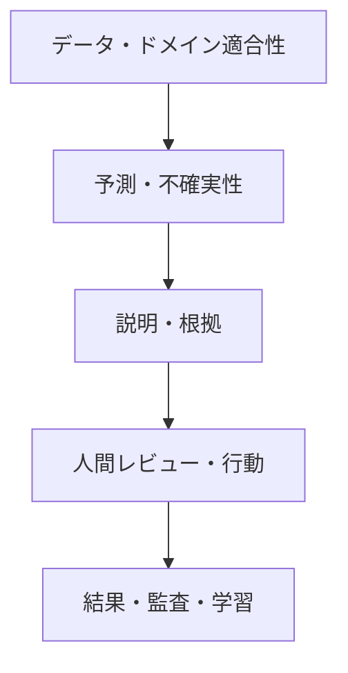



安全性が重要な領域で、説明可能性（XAI）は見栄えのよい特徴量重要度グラフではない。説明は、**モデルの判断を理解し、誤りを発見し、人が適切に受容・拒否し、後から意思決定を監査するためのインターフェース**である。

同時に、説明は安全性の証明ではない。もっともらしい説明が誤った予測を正当化したり、人間のレビュアーにモデルを過信させたりする可能性もある。したがってXAIは、モデル性能、不確実性、ドメイン境界、業務手順、人間要因とともに検証しなければならない。

## 1. 問題：「説明がある」ことと「安全に使用できる」ことの違い

### 一つの説明ですべての問いには答えられない

説明を求める目的はそれぞれ異なる。

| ステークホルダー | 実際の問い |
|---|---|
| モデル開発者 | モデルが誤った相関・漏洩を学習していないか。 |
| 現場レビュアー | この事例では何を確認すべきか。 |
| 影響を受ける人 | なぜこの決定になり、何を修正・異議申立てできるか。 |
| 安全・監査担当者 | どのデータ・モデル・方針・承認によって決定したか。 |
| 運用責任者 | いつモデルを拒否・停止・rollbackすべきか。 |

一つのglobal feature importanceをすべての対象者へ提供すると、必要情報を取りこぼすか、誤解を招く。

### 説明可能性と透明性は異なる

- **説明可能性**：特定の出力に寄与した入力・規則・類似事例などを提示
- **透明性**：データの出所、モデルversion、目的、制限、運用方針を公開・追跡
- **解釈可能性**：人がモデル構造や関係を直接理解できる程度
- **監査可能性**：意思決定過程を後から再構成し検証できる程度

複雑なモデルへlocal explanationを付けても、data lineageや意思決定方針が透明になるわけではない。

### Post-hoc説明はモデルとは別の近似モデルであり得る

多くのXAI手法は、元モデル\(f\)の周辺を単純なモデル\(g\)で近似する。

\[
g_x = \arg\min_{g\in\mathcal G}
\mathcal L\left(f,g,\pi_x\right)+\Omega(g)
\]

- \(\pi_x\)：説明対象点\(x\)周辺の重み
- \(\mathcal L\)：元モデルと説明モデルの不一致
- \(\Omega\)：説明の複雑さ

説明は\(g_x\)についての説明であって、元モデル内部の因果メカニズムそのものではない。局所近似の品質と安定性を検証する必要がある。

### 特徴量の寄与度は因果効果ではない

「特徴量Aが予測を高めた」という表現は、通常、モデル関数内での関連寄与を意味する。現実にAを変えれば結果が改善するという意味ではない。相関特徴量、中間変数、測定proxy、方針の結果が混ざると、誤った行動を誘導し得る。

## 2. Mental model：モデル説明ではなく意思決定のsafety case

安全な意思決定を次の5層として捉える。



1. 入力がサポート対象のドメイン内にあり、品質は十分か。
2. 予測と不確実性が検証されているか。
3. 説明がモデルとデータに忠実か。
4. 人が説明を使って、より良い決定をするか。
5. 結果とoverrideを追跡し、システムを改善できるか。

どれか一層の失敗を、他の層のグラフで補うことはできない。

### Human-in-the-loopは「人が最後のボタンを押す」ことではない

人がモデル出力をそのまま承認するなら、実質的な統制ではない。意味のある人間の統制には次が必要である。

- 決定に必要な時間と情報
- モデルを拒否する権限
- 代替行動とescalation経路
- モデルの不確実性・限界を理解するための教育
- overrideを不利益に扱わない組織設計
- モデルなしで判断する基準と独立シグナル

人間とモデルの誤りが独立しているとき、協働効果は大きい。人がモデルと同じ特徴・biasだけを見ると、誤りも一緒に動く。

### 選択的予測によって「分からない」を行動に変える

モデルは全事例を無理に処理せず、一部を保留できる。

\[
\hat y(x)=
\begin{cases}
f(x), & c(x)\ge\tau \text{ and } x\in\mathcal X_{support}\\
\text{defer}, & \text{otherwise}
\end{cases}
\]

- \(c(x)\)：confidenceまたは不確実性に基づく信頼スコア
- \(\mathcal X_{support}\)：検証済みのサポート対象ドメイン
- \(\tau\)：保留閾値

保留率を上げると、残りの事例の誤りは通常下がる。このtrade-offをcoverage–risk curveで評価する。

\[
\mathrm{coverage}(\tau)=P(c(X)\ge\tau), \qquad
\mathrm{risk}(\tau)=E[\ell(f(X),Y)\mid c(X)\ge\tau]
\]

## 3. 実践workflow

### Step 1. リスク分析から説明要件を導出する

説明ツールを先に選ばない。まずfailure modeを識別する。

- 誤った入力・単位・欠損
- データ漏洩・proxy変数
- サポート対象ドメイン外の入力
- 過信された確率・不適切なcalibration
- 重要なsubgroupでの性能低下
- モデルは正しいがpolicy thresholdが不適切
- レビュアーのautomation bias
- 説明を因果的助言と誤解
- 反復アラートによる疲労
- 後から決定根拠を再構成できない

各リスクについて予防、検知、緩和、復旧の統制を定める。たとえばOODリスクには、特徴量寄与度グラフよりdomain guardとdeferの方が直接的な統制である。

### Step 2. 説明の問い・対象・行動を明示する

説明仕様の例：

```yaml
audience: "숙련된 현장 검토자"
question: "왜 이 사례가 우선 검토 대상으로 분류되었는가?"
decision: "즉시 검토 / 일반 대기열 / 상급자 escalation"
content:
  - "검증된 상위 기여 신호"
  - "입력 신선도와 누락"
  - "예측 확률과 보정 상태"
  - "OOD·불확실성 경고"
  - "확인해야 할 원자료 링크"
prohibited_claims:
  - "특징을 바꾸면 결과가 개선된다는 인과 주장"
  - "설명만으로 확정 판정"
```

説明は利用者が取る行動を助ける一方、モデルを正当化する方向だけに使われてはならない。

### Step 3. まず解釈可能なbaselineを作る

説明可能な単純モデルは重要な比較基準である。

- 線形・加法モデル
- 小さなルール集合・浅いtree
- 単調制約モデル
- 明示的scorecard

複雑なモデルによる性能向上が小さいなら、単純モデルの直接的な解釈可能性、検証容易性、安定性の方が、システムとして大きな価値を持ち得る。

単純モデルも自動的に公平、あるいは因果的に正しいわけではない。係数の符号と大きさは特徴量のscale、相関、標本選択の影響を受ける。

### Step 4. 説明方法を問いに合わせて組み合わせる

#### Global behavior

- permutationに基づく重要度
- 部分依存・条件付き関係
- 累積局所効果
- 全体surrogate・ルール抽出
- 個別条件ごとの性能・誤差分析

相関する特徴量では、一つをシャッフルしたときに別の特徴量が情報を代替し、重要度が低く見える場合がある。非現実的な特徴量組み合わせを作る手法にも注意する。

#### Local behavior

- 特徴量寄与度
- 局所surrogate
- 類似事例・prototype
- counterfactual explanation
- 入力変化に対する感度

一つの事例へ複数の説明手法を適用し、一致を確認することは診断に有用だが、一致が真実を保証するわけではない。

#### Process explanation

- どのモデル・データ・閾値を使ったか。
- 入力はいつ収集・検証されたか。
- モデルのサポート対象範囲か。
- 誰がいつ承認・overrideしたか。
- どのfallback・ルールが適用されたか。

安全・監査ではfeature attributionよりprocess explanationの方が重要な場合がある。

### Step 5. Counterfactualへ現実的な制約を入れる

Counterfactualは「どの最小変更で出力が変わるか」を問う。

\[
x' = \arg\min_{z}
d(x,z)+\lambda\,\ell(f(z),y_{target})
\]

そのまま最適化すると、実現不可能または不当な提案が生じる。次の制約が必要である。

- 変更不能な特徴量を固定
- 時間的順序と因果構造
- 許容範囲・単位・カテゴリ組み合わせ
- 相互に関連する特徴量の一貫性
- 実際の行動コスト
- 複数の実行可能な代替案の多様性

Counterfactualはモデルの決定境界を説明するだけで、提案した変更が現実の結果を引き起こす保証はない。行動提案には別の因果・ドメイン根拠が必要である。

### Step 6. XAI自体を定量的に検証する

#### Fidelity

説明は元モデルの局所・全体挙動をどれほどよく近似するか。

- 説明から再構成した予測と元予測の差
- 重要特徴量を除去・挿入した際の出力変化
- local neighborhoodでの近似誤差

特徴量の除去がOOD入力を作る場合、結果を単純にfidelityとして解釈するのは難しい。条件付き生成やドメイン妥当性検査が必要である。

#### Stability

類似入力または異なる乱数で説明がどれほど変化するか。

\[
S(x)=E_{x'\in N(x)}
\frac{\|e(x)-e(x')\|}{\|x-x'\|+\epsilon}
\]

予測はほぼ同じなのに説明順位が大きく変われば、レビュアーが混乱する可能性がある。相関特徴量が互いに寄与度を分け合う場合は、group explanationを検討する。

#### Robustness and sensitivity

- 小さく無関係なperturbationに対して説明が維持されるか。
- 意味のある特徴量変化には反応するか。
- 基準値・background datasetの選択に敏感か。
- OOD・欠損・極端な入力で誤った確信を示さないか。

#### Completeness and uncertainty

説明されていない残余効果と説明の不確実性を表示する。一つの正確な順位のように見せるのではなく、bootstrap・複数の背景集合における範囲を提供できる。

### Step 7. モデルへの信頼と説明への信頼を分離してUIを設計する

レビュー画面では少なくとも次を区別する。

- 予測値またはリスク区間
- 確率calibrationの状態と不確実性
- 入力品質・freshness・OOD警告
- モデルの寄与シグナル
- 原資料の確認経路
- 代替行動・escalation
- モデルの既知の制限

確率を小数点以下何桁も表示すると、実際より精密に見える場合がある。検証水準に合った区間・カテゴリを使う。

説明を最初から大きく表示するとanchoringが強くなり得る。リスクに応じ、人が先に独立した判断を記録してからモデル情報を公開する順序も比較する。

### Step 8. 人間–AIチームを実際のtaskで評価する

説明への満足度アンケートだけでは不十分である。比較条件を設ける。

1. 人間だけで判断
2. モデル出力だけを提示
3. モデル + 説明を提示
4. モデル + 不確実性 + 説明 + defer手順

評価指標：

- チームの正確度・感度・特異度
- 重大エラー率
- 判断時間とworkload
- モデルが誤ったときの人間の拒否率
- モデルが正しいときの受容率
- 過信・低信頼calibration
- overrideの適切性
- レビュアー間のばらつき
- 長期利用によるautomation biasと疲労

説明が意思決定時間を増やしながらエラーを減らさないなら、有用でない可能性がある。反対に全体正確度が同じでも、重大エラーを減らすなら価値がある。

### Step 9. Deferとescalationを業務フローへ接続する

保留原因を区別する。

- OOD
- 高いepistemic uncertainty
- 入力品質不足
- モデル間の不一致
- 意思決定境界付近
- 予想される被害が大きい
- 規定上必須のレビュー

すべてのdeferを同じキューに入れるとボトルネックになる。原因とリスクに応じて、再測定、追加データ要求、熟練者レビュー、元の解釈実行、安全なdefault actionへ送る。

レビュー容量を\(B\)とすると、閾値は正確度だけでなくキューの安定性も満たさなければならない。

\[
E[N_{defer}] \le B
\]

容量を超えたとき、単に低リスク事例から自動化するのではなく、どのリスクを保守的に扱うか明示的な優先順位方針が必要である。

### Step 10. 意思決定全体を監査可能なeventとして記録する

個々の意思決定に次を結び付ける。

- 入力snapshotと品質状態
- モデル・前処理・説明器・policy version
- 予測、uncertainty、OOD score
- 提供した説明とreference data
- 人間の判断・override・理由
- 最終行動と後続結果
- 承認・escalation時刻

監査ログは必要最小限の情報だけを保持し、アクセス制御・保持期間を適用する。自由記述の理由には機密情報が入り得るため、構造化された理由コードと制限付きメモを併用する。

### Step 11. 説明とoverrideをモデル改善のシグナルとして活用する

次のパターンを定期的にレビューする。

- 特定の特徴量が繰り返し誤った説明を作る。
- OOD deferが特定ドメインへ集中する。
- 熟練レビュアーが同じエラー類型を繰り返しoverrideする。
- レビュアーごとの受容率が過度に異なる。
- モデル性能は同じだが説明の安定性が低下する。
- 説明が重要な原資料の確認を妨げる。

Overrideが常に正解とは限らない。後続結果が確定してから、モデルと人間の誤りをともに分析する。人間の判断をそのまま新しいlabelとして学習すると、既存biasを強化し得る。

## 4. 評価・検証checklist

### 目的とリスク

- [ ] 説明の対象、問い、後続行動が明示されている。
- [ ] XAIが緩和しようとする具体的failure modeがある。
- [ ] 説明が安全性の証明や因果主張として誤用されない。
- [ ] 単純で解釈可能なbaselineと比較した。
- [ ] 説明より直接的な統制（domain guard、validation）が必要なリスクを区別した。

### 説明品質

- [ ] global、local、process explanationを目的に応じて区別した。
- [ ] fidelityを元モデルに対して定量評価した。
- [ ] 類似入力・乱数・背景集合の変化に対するstabilityを確認した。
- [ ] 相関特徴量と非現実的perturbationの影響を検討した。
- [ ] counterfactualへ実行可能・不変・因果制約を入れた。
- [ ] 説明の不確実性と既知の限界を表示した。

### モデルとドメイン

- [ ] 予測確率とuncertaintyが別々に検証されている。
- [ ] サポート対象ドメインとOOD拒否規則がある。
- [ ] 重要subgroup・極端値・欠損で説明と性能を評価した。
- [ ] coverage–risk曲線によりdefer閾値を選んだ。
- [ ] 人間のレビュー容量と待ち時間制約を反映した。

### 人間–AI協働

- [ ] 人間のみ、モデルのみ、説明を含む条件を実taskで比較した。
- [ ] モデルの誤りを人が適切に拒否するか測定した。
- [ ] automation bias、anchoring、疲労、workloadを評価した。
- [ ] レビュアーには拒否・escalationの権限と代替行動がある。
- [ ] override理由と後続結果を追跡する。
- [ ] 説明UIを熟練度と役割に合わせてテストした。

### Governance

- [ ] データ・モデル・説明器・policy・人間の決定にlineageがある。
- [ ] 重大エラーに対する即時停止・fallback・rollback手順がある。
- [ ] 説明の変更もモデル変更と同様に回帰評価する。
- [ ] 監査ログに最小収集・アクセス制御・保持期間を適用する。
- [ ] 異議申立てと事後訂正の経路がある。

## 5. 限界と注意点

第一に、すべての複雑なモデルを人間が完全に理解できるようにすることは難しい。XAIは限定された問いへの近似的証拠であり、検証・監視・fallbackを代替しない。

第二に、人がloopにいるという事実だけでは安全にならない。時間的圧力、権限不足、組織的incentive、反復的な露出は、レビューを形式的承認に変え得る。人間システム自体を試験しなければならない。

第三に、説明の安定性とfidelityは競合し得る。実際に不安定な決定境界を滑らかに見せると、理解しやすくても重要なリスクを隠す。不安定性をそのまま警告する方が安全な場合がある。

第四に、保留方針はエラーを減らすが、workloadを別の場所へ移す。熟練者キューが飽和すると、遅延が新たなリスクになる。

最後に、意思決定結果が再び学習データになると、モデル・人間・方針のfeedback loopが生じる。overrideと観測された結果を区別し、選択biasを考慮して評価・再学習しなければならない。
