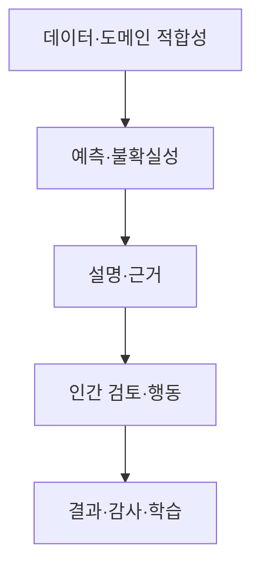



안전이 중요한 영역에서 설명 가능성(XAI)은 예쁜 특징 중요도 그래프가 아니다. 설명은 **모델 판단을 이해하고, 오류를 발견하고, 사람이 적절히 수용·거부하고, 사후에 의사결정을 감사하기 위한 인터페이스**다.

동시에 설명은 안전의 증명이 아니다. 그럴듯한 설명이 틀린 예측을 정당화하거나, 인간 검토자가 모델을 과신하게 만들 수도 있다. 따라서 XAI는 모델 성능, 불확실성, 도메인 경계, 업무 절차, 인간 요인과 함께 검증해야 한다.

## 1. 문제: “설명이 있다”와 “안전하게 사용할 수 있다”의 차이

### 하나의 설명이 모든 질문에 답하지 못한다

설명 요청의 목적은 서로 다르다.

| 이해관계자 | 실제 질문 |
|---|---|
| 모델 개발자 | 모델이 잘못된 상관·누수를 학습했는가? |
| 현장 검토자 | 이 사례에서 무엇을 확인해야 하는가? |
| 영향받는 사람 | 왜 이런 결정이 나왔고 무엇을 수정·이의제기할 수 있는가? |
| 안전·감사 담당자 | 어떤 데이터·모델·정책·승인으로 결정했는가? |
| 운영 책임자 | 언제 모델을 거부·중단·롤백해야 하는가? |

전역 특징 중요도 하나를 모든 대상에게 제공하면 필요한 정보를 놓치거나 오해를 만든다.

### 설명 가능성과 투명성은 다르다

- **설명 가능성**: 특정 출력에 기여한 입력·규칙·유사 사례 등을 제시
- **투명성**: 데이터 출처, 모델 버전, 목적, 제한, 운영 정책을 공개·추적
- **해석 가능성**: 사람이 모델 구조나 관계를 직접 이해할 수 있는 정도
- **감사 가능성**: 결정 과정을 사후 재구성하고 검증할 수 있는 정도

복잡한 모델에 local explanation을 붙였다고 데이터 lineage나 의사결정 정책이 투명해지는 것은 아니다.

### Post-hoc 설명은 모델과 다른 근사 모델일 수 있다

많은 XAI 방법은 원 모델 \(f\) 주변을 단순 모델 \(g\)로 근사한다.

\[
g_x = \arg\min_{g\in\mathcal G}
\mathcal L\left(f,g,\pi_x\right)+\Omega(g)
\]

- \(\pi_x\): 설명하려는 점 \(x\) 주변의 가중치
- \(\mathcal L\): 원 모델과 설명 모델의 불일치
- \(\Omega\): 설명 복잡도

설명은 \(g_x\)에 대한 설명이지 원 모델의 내부 인과 메커니즘 그 자체가 아니다. 국소 근사 품질과 안정성을 검증해야 한다.

### 특징 기여도는 인과 효과가 아니다

“특징 A가 예측을 높였다”는 말은 보통 모델 함수 안에서의 연관 기여를 뜻한다. A를 현실에서 바꾸면 결과가 좋아진다는 뜻은 아니다. 상관 특징, 중간 변수, 측정 대리변수, 정책 결과가 섞이면 잘못된 행동을 유도할 수 있다.

## 2. Mental model: 모델 설명이 아니라 의사결정 안전 케이스

안전한 의사결정을 다음 다섯 층으로 본다.



1. 입력이 지원 도메인 안에 있고 품질이 충분한가?
2. 예측과 불확실성이 검증되었는가?
3. 설명이 모델과 데이터에 충실한가?
4. 사람이 이를 이용해 더 나은 결정을 내리는가?
5. 결과와 override를 추적해 시스템을 개선할 수 있는가?

어느 한 층의 실패도 다른 층의 그래프로 보완되지 않는다.

### Human-in-the-loop는 “사람이 마지막 버튼을 누름”이 아니다

사람이 모델 출력을 그대로 승인한다면 실질적 통제가 아니다. 의미 있는 인간 통제에는 다음이 필요하다.

- 결정에 필요한 시간과 정보
- 모델을 거부할 권한
- 대안 행동과 escalation 경로
- 모델의 불확실성·한계를 이해할 교육
- override에 불이익을 주지 않는 조직 설계
- 모델 없이 판단하는 기준과 독립 신호

인간과 모델의 오류가 독립적일 때 협업 효과가 크다. 사람이 모델과 같은 특징·편향만 보면 오류가 함께 움직인다.

### 선택적 예측으로 “모르는 것”을 행동으로 만든다

모델이 모든 사례를 강제로 처리하지 않고 일부를 유보할 수 있다.

\[
\hat y(x)=
\begin{cases}
f(x), & c(x)\ge\tau \text{ and } x\in\mathcal X_{support}\\
\text{defer}, & \text{otherwise}
\end{cases}
\]

- \(c(x)\): confidence 또는 불확실성 기반 신뢰 점수
- \(\mathcal X_{support}\): 검증된 지원 도메인
- \(\tau\): 유보 임계값

유보율을 높이면 남은 사례의 오류는 대개 낮아진다. 이 교환관계를 coverage–risk curve로 평가한다.

\[
\mathrm{coverage}(\tau)=P(c(X)\ge\tau), \qquad
\mathrm{risk}(\tau)=E[\ell(f(X),Y)\mid c(X)\ge\tau]
\]

## 3. 실전 workflow

### Step 1. 위험 분석에서 설명 요구사항을 도출한다

설명 도구를 먼저 고르지 않는다. 실패 모드부터 식별한다.

- 잘못된 입력·단위·결측
- 데이터 누수·대리변수
- 지원 도메인 밖 입력
- 과신한 확률·잘못된 보정
- 중요한 하위집단 성능 저하
- 모델이 맞지만 정책 임계값이 부적절함
- 검토자의 automation bias
- 설명을 인과적 조언으로 오해
- 반복 경보로 인한 피로
- 사후에 결정 근거를 재구성할 수 없음

각 위험에 대해 예방, 탐지, 완화, 복구 통제를 정한다. 예를 들어 OOD 위험은 특징 기여도 그래프보다 domain guard와 defer가 더 직접적인 통제다.

### Step 2. 설명의 질문·대상·행동을 명시한다

설명 사양 예시:

```yaml
audience: "숙련된 현장 검토자"
question: "왜 이 사례가 우선 검토 대상으로 분류되었는가?"
decision: "즉시 검토 / 일반 대기열 / 상급자 escalation"
content:
  - "검증된 상위 기여 신호"
  - "입력 신선도와 누락"
  - "예측 확률과 보정 상태"
  - "OOD·불확실성 경고"
  - "확인해야 할 원자료 링크"
prohibited_claims:
  - "특징을 바꾸면 결과가 개선된다는 인과 주장"
  - "설명만으로 확정 판정"
```

설명은 사용자가 취할 행동을 돕되 모델을 정당화하는 방향으로만 쓰이지 않아야 한다.

### Step 3. 먼저 해석 가능한 베이스라인을 만든다

설명 가능한 단순 모델은 중요한 비교 기준이다.

- 선형·가법 모델
- 작은 규칙 집합·얕은 트리
- 단조 제약 모델
- 명시적 점수표

복잡한 모델의 성능 이득이 작다면 단순 모델의 직접 해석성, 검증 용이성, 안정성이 더 큰 시스템 가치를 가질 수 있다.

단순 모델도 자동으로 공정하거나 인과적으로 올바르지는 않다. 계수의 부호와 크기는 특징 스케일, 상관, 표본 선택에 영향을 받는다.

### Step 4. 설명 방법을 질문에 맞춰 조합한다

#### Global behavior

- permutation 기반 중요도
- 부분 의존·조건부 관계
- 누적 국소 효과
- 전체 surrogate·규칙 추출
- 개별 조건에 따른 성능·오차 분석

상관된 특징에서는 하나를 섞을 때 다른 특징이 정보를 대신해 중요도가 낮게 나올 수 있다. 비현실적인 특징 조합을 만드는 방법도 주의한다.

#### Local behavior

- 특징 기여도
- 국소 surrogate
- 유사 사례·prototype
- counterfactual explanation
- 입력 변화에 대한 민감도

한 사례에 여러 설명 방법을 적용해 일치 여부를 보는 것은 진단에 유용하지만, 일치가 진실을 보장하지는 않는다.

#### Process explanation

- 어떤 모델·데이터·임계값을 사용했는가?
- 입력은 언제 수집·검증되었는가?
- 모델이 지원하는 범위인가?
- 누가 언제 승인·override했는가?
- 어떤 fallback·규칙이 적용되었는가?

안전·감사에서는 feature attribution보다 process explanation이 더 중요할 수 있다.

### Step 5. Counterfactual에 현실 제약을 넣는다

Counterfactual은 “어떤 최소 변화로 출력이 바뀌는가?”를 묻는다.

\[
x' = \arg\min_{z}
d(x,z)+\lambda\,\ell(f(z),y_{target})
\]

그대로 최적화하면 불가능하거나 부당한 제안이 나온다. 다음 제약을 넣어야 한다.

- 변경 불가능한 특징 고정
- 시간적 순서와 인과 구조
- 허용 범위·단위·범주 조합
- 서로 연결된 특징의 일관성
- 실제 행동 비용
- 여러 가능한 대안의 다양성

Counterfactual은 모델의 결정 경계를 설명할 뿐, 제안한 변화가 현실 결과를 야기한다는 보장은 없다. 행동 권고에는 별도의 인과·도메인 근거가 필요하다.

### Step 6. XAI 자체를 정량 검증한다

#### Fidelity

설명이 원 모델의 국소·전역 동작을 얼마나 잘 근사하는가?

- 설명으로 재구성한 예측과 원 예측의 차이
- 중요 특징 제거·삽입 시 출력 변화
- local neighborhood에서의 근사 오차

특징 제거가 OOD 입력을 만들면 결과를 단순히 fidelity로 해석하기 어렵다. 조건부 생성이나 도메인 유효성 검사가 필요하다.

#### Stability

비슷한 입력이나 다른 난수에서 설명이 얼마나 변하는가?

\[
S(x)=E_{x'\in N(x)}
\frac{\|e(x)-e(x')\|}{\|x-x'\|+\epsilon}
\]

예측은 거의 같은데 설명 순위가 크게 바뀌면 검토자가 혼란을 겪을 수 있다. 상관 특징이 서로 기여도를 나누는 경우에는 그룹 설명을 고려한다.

#### Robustness and sensitivity

- 작은 무관 perturbation에 설명이 유지되는가?
- 의미 있는 특징 변화에는 반응하는가?
- 기준값·background dataset 선택에 민감한가?
- OOD·결측·극단 입력에서 거짓 확신을 보이는가?

#### Completeness and uncertainty

설명되지 않은 잔여 효과와 설명 불확실성을 표시한다. 하나의 정확한 순위처럼 보여 주기보다 bootstrap·여러 배경 집합에서의 범위를 제공할 수 있다.

### Step 7. 모델 신뢰와 설명 신뢰를 분리해 UI를 설계한다

검토 화면에 적어도 다음을 구분한다.

- 예측값 또는 위험 구간
- 확률 보정 상태와 불확실성
- 입력 품질·신선도·OOD 경고
- 모델 기여 신호
- 원자료 확인 경로
- 대안 행동·escalation
- 모델의 알려진 제한

확률을 소수점 여러 자리로 표시하면 실제보다 정밀해 보일 수 있다. 검증 수준에 맞는 구간·범주를 사용한다.

설명을 기본으로 크게 보여 주면 anchoring이 강해질 수 있다. 위험에 따라 사람이 먼저 독립 판단을 기록한 뒤 모델 정보를 공개하는 순서도 비교한다.

### Step 8. 인간–AI 팀을 실제 task로 평가한다

설명 만족도 설문만으로 충분하지 않다. 비교 조건을 둔다.

1. 인간만 판단
2. 모델 출력만 제공
3. 모델 + 설명 제공
4. 모델 + 불확실성 + 설명 + defer 절차

평가 지표:

- 팀의 정확도·민감도·특이도
- 중대한 오류율
- 판단 시간과 workload
- 모델이 틀렸을 때 인간의 거부율
- 모델이 맞았을 때 수용률
- 과신·저신뢰 calibration
- override의 적절성
- 검토자 간 변동
- 장기간 사용에 따른 automation bias와 피로

설명이 의사결정 시간을 늘리면서 오류를 줄이지 못하면 유용하지 않을 수 있다. 반대로 전체 정확도는 같아도 중대한 오류를 줄이면 가치가 있다.

### Step 9. Defer와 escalation을 업무 흐름에 연결한다

유보 원인은 구분한다.

- OOD
- 높은 epistemic uncertainty
- 입력 품질 부족
- 모델 간 불일치
- 의사결정 경계 근처
- 높은 예상 피해
- 규정상 필수 검토

모든 defer를 같은 대기열에 넣으면 병목이 생긴다. 원인과 위험도에 따라 재측정, 추가 데이터 요청, 숙련자 검토, 원본 해석 실행, 안전한 기본 행동으로 보낸다.

검토 용량을 \(B\)라 할 때 임계값은 정확도만 아니라 대기열 안정성도 만족해야 한다.

\[
E[N_{defer}] \le B
\]

용량을 넘으면 먼저 저위험 사례를 자동화하는 것이 아니라, 어떤 위험을 보수적으로 처리할지 명시적인 우선순위 정책이 필요하다.

### Step 10. 결정 전체를 감사 가능한 event로 기록한다

개별 의사결정에 다음을 연결한다.

- 입력 snapshot과 품질 상태
- 모델·전처리·설명기·policy version
- 예측, uncertainty, OOD score
- 제공된 설명과 reference data
- 인간 판단·override·사유
- 최종 행동과 후속 결과
- 승인·escalation 시각

감사 로그는 최소 필요 정보만 보존하고 접근 통제·보존 기간을 적용한다. 자유 텍스트 사유에는 민감정보가 들어갈 수 있으므로 구조화된 사유 코드와 제한된 메모를 병행한다.

### Step 11. 설명과 override를 모델 개선 신호로 활용한다

다음 패턴을 주기적으로 검토한다.

- 특정 특징이 반복적으로 잘못된 설명을 만든다.
- OOD defer가 특정 도메인에 집중된다.
- 숙련 검토자가 같은 오류 유형을 반복 override한다.
- 검토자별 수용률이 과도하게 다르다.
- 모델 성능은 같지만 설명 안정성이 저하된다.
- 설명이 중요한 원자료 확인을 방해한다.

Override가 항상 정답은 아니다. 후속 결과가 확정된 뒤 모델과 인간의 오류를 함께 분석한다. 인간 판단을 그대로 새 레이블로 학습하면 기존 편향을 강화할 수 있다.

## 4. 평가·검증 checklist

### 목적과 위험

- [ ] 설명의 대상, 질문, 후속 행동이 명시되었다.
- [ ] XAI가 완화하려는 구체적 실패 모드가 있다.
- [ ] 설명이 안전 증명이나 인과 주장으로 오용되지 않는다.
- [ ] 단순·해석 가능한 베이스라인과 비교했다.
- [ ] 설명보다 직접적인 통제(domain guard, validation)가 필요한 위험을 구분했다.

### 설명 품질

- [ ] global, local, process explanation을 목적에 맞게 구분했다.
- [ ] fidelity를 원 모델 대비 정량 평가했다.
- [ ] 유사 입력·난수·배경 집합 변화에서 stability를 확인했다.
- [ ] 상관 특징과 비현실적 perturbation의 영향을 검토했다.
- [ ] counterfactual에 실행 가능·불변·인과 제약을 넣었다.
- [ ] 설명 불확실성과 알려진 한계를 표시했다.

### 모델과 도메인

- [ ] 예측 확률과 uncertainty가 별도로 검증되었다.
- [ ] 지원 도메인과 OOD 거부 규칙이 있다.
- [ ] 중요 하위집단·극단·결측에서 설명과 성능을 평가했다.
- [ ] coverage–risk 곡선으로 defer 임계값을 선택했다.
- [ ] 인간 검토 용량과 대기 시간 제약을 반영했다.

### 인간–AI 협업

- [ ] 인간만, 모델만, 설명 포함 조건을 실제 task에서 비교했다.
- [ ] 모델 오류를 사람이 적절히 거부하는지 측정했다.
- [ ] automation bias, anchoring, 피로, workload를 평가했다.
- [ ] 검토자는 거부·escalation 권한과 대안 행동을 갖는다.
- [ ] override 사유와 후속 결과를 추적한다.
- [ ] 설명 UI를 숙련도와 역할에 맞게 테스트했다.

### Governance

- [ ] 데이터·모델·설명기·policy·인간 결정의 lineage가 있다.
- [ ] 중대한 오류에 즉시 중단·fallback·롤백 절차가 있다.
- [ ] 설명 변경도 모델 변경처럼 회귀 평가한다.
- [ ] 감사 로그에 최소 수집·접근 통제·보존 기간을 적용한다.
- [ ] 이의제기와 사후 정정 경로가 있다.

## 5. 한계와 주의점

첫째, 모든 복잡한 모델을 인간이 완전히 이해할 수 있게 만드는 것은 어렵다. XAI는 제한된 질문에 대한 근사적 증거이며, 검증·감시·fallback을 대체하지 않는다.

둘째, 사람이 loop에 있다는 사실만으로 안전하지 않다. 시간 압박, 권한 부족, 조직적 인센티브, 반복 노출은 형식적 승인으로 만들 수 있다. 인간 시스템 자체를 시험해야 한다.

셋째, 설명의 안정성과 fidelity는 충돌할 수 있다. 실제로 불안정한 결정 경계를 부드럽게 보여 주면 이해는 쉬워도 중요한 위험을 숨긴다. 불안정성을 그대로 경고하는 편이 안전할 수 있다.

넷째, 유보 정책은 오류를 줄이지만 workload를 다른 곳으로 이동시킨다. 숙련자 대기열이 포화되면 지연이 새로운 위험이 된다.

마지막으로, 의사결정 결과가 다시 학습 데이터가 되면 모델·인간·정책의 피드백 루프가 생긴다. override와 관측된 결과를 구분하고, 선택 편향을 고려해 평가·재학습해야 한다.
