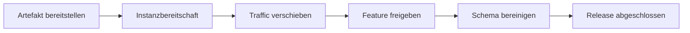



## Das Problem: Eine gesunde neue Instanz macht ein Deployment noch nicht sicher

Zero-Downtime-Deployment ist nicht bloß eine Funktion, die Traffic am Load Balancer schrittweise verschiebt.

Während eines Deployments existieren mindestens zwei Versionen gleichzeitig.

Auch Datenbanken, Caches, Queues und Clients koexistieren in unterschiedlichen Versionen.

Wer diese Realität ignoriert, verursacht folgende Probleme.

- Neuer Code scheitert, weil er ein Migrationsfeld liest, bevor es hinzugefügt wurde.
- Alter Code kann Nachrichten des neuen Codes nicht parsen.
- Ein Rollback erfolgt, nachdem Schema und Daten bereits irreversibel geändert wurden.
- Nach bestandener Readiness steigt die Latenz wegen eines kalten Caches sprunghaft an.
- Ein geringer Canary-Anteil entdeckt Fehler auf seltenen Pfaden nicht.
- Ein Feature Flag wird zu einer dauerhaften Verzweigung, wodurch Testkombinationen explodieren.
- Zustandsmetriken wirken normal, während eine kritische Benutzerkonversionsrate sinkt.

## Denkmodell: Ein Release ist die Summe mehrerer unabhängiger Übergänge

Jede Stufe muss unabhängig anhaltbar und reversibel sein.

### Deployment vom Release trennen

- **Deploy**: Ein Codeartefakt in der Laufzeitumgebung installieren.
- **Release**: Ein Feature für Benutzer freigeben.

Feature Flags erlauben, Code zuerst bereitzustellen und die Freigabe später zu steuern.

Fehler des Flag-Systems und veraltete Konfiguration werden jedoch zu neuen Abhängigkeiten.

### Rollback von Roll-forward unterscheiden

Ein Rollback ist schnell, wenn ein Fehler nur das Zurücksetzen eines Artefakts erfordert.

Wenn eine Datenmigration oder ein externer Seiteneffekt stattgefunden hat, kann das Vorwärts-Deployment einer korrigierenden Version sicherer sein.

Entscheiden Sie vor dem Deployment, welche Strategie unter welchen Bedingungen verwendet wird.

## Workflow: Kompatible Änderungen vornehmen

### Schritt 1. Die Deployment-Einheit unveränderlich machen

Weisen Sie dem Artefakt einen Inhaltsdigest und eine Build-Provenienz zu.

Erlauben Sie nicht, dass dasselbe Versionslabel auf unterschiedliche Bytes verweist.

Verfolgen Sie Konfigurations-, Feature-Flag- und Migrationsversion gemeinsam.

### Schritt 2. APIs in beide Richtungen kompatibel machen

Testen Sie während des Rollouts sowohl die Kombination alter Client/neuer Server als auch neuer Client/alter Server.

Führen Sie hinzugefügte Felder zunächst als optional ein.

Ignorieren Sie unbekannte Felder sicher.

Ändern Sie nicht die Bedeutung eines bestehenden Felds.

Wenn neues Verhalten erforderlich ist, erwägen Sie explizite Versionierung oder Capability Negotiation.

### Schritt 3. Expand-and-contract auf die Datenbank anwenden

1. Zuerst das additive Schema bereitstellen.
2. Bestätigen, dass alter Code mit dem neuen Schema weiterhin funktioniert.
3. Neuen Code bereitstellen, der alte und neue Felder verarbeitet.
4. Bei Bedarf doppelt schreiben und abgleichen.
5. Rate des Backfills begrenzen.
6. Lesepfad auf das neue Feld umstellen.
7. Altes Feld entfernen, nachdem jede alte Version verschwunden ist.

Testen Sie die Möglichkeit von DDL-Sperren und Tabellen-Rewrites mit einem produktionsähnlichen Datenvolumen.

### Schritt 4. Readiness zur Bedingung für sicheren Traffic machen

Ein Prozess ist nicht bereit, nur weil er gestartet ist.

- Konfiguration geladen
- Erforderliche lokale Initialisierung abgeschlossen
- Listener bereit
- Erforderliche Abhängigkeiten erreichbar
- Schemaversion kompatibel
- Aufwärmstatus

Machen Sie einen vorübergehenden Ausfall einer externen Abhängigkeit nicht zu einem Liveness-Neustart.

### Schritt 5. Eine repräsentative Canary-Kohorte auswählen

Ein zufälliger Anteil der Anfragen allein kann unzureichend sein.

Berücksichtigen Sie Mandanten, Regionen, Geräte, Endpunkte und Datenformen.

Sie können mit einer internen oder risikoarmen Kohorte beginnen.

Bewerten Sie bei Sticky Sessions und zustandsbehafteten Workflows das Problem, dass derselbe Benutzer zwischen Versionen wechselt.

### Schritt 6. Automatisierte Abbruchmetriken im Voraus festlegen

Die Auswahl der während des Deployments zu untersuchenden Metriken erzeugt Bestätigungsbias.

Vergleichen Sie mindestens:

- Anfragefehlerrate
- Latenzperzentile
- Sättigung
- Abhängigkeitsfehler
- Wiederholungsquote
- Queue-Alter
- Kritische geschäftliche Erfolgsquote
- Datenqualitätsinvarianten

Vergleichen Sie Canary und Baseline im selben Zeitraum und bei denselben Traffic-Merkmalen.

### Schritt 7. Den Lebenszyklus des Feature Flags entwerfen

Flag-Metadaten sollten enthalten:

- Verantwortliche Person
- Zweck und Risiko
- Erstellungs- und Ablaufdatum
- Standardwert
- Fail-open- oder Fail-closed-Verhalten
- Zielkohorte
- Issue zur Entfernung
- Auditverlauf

Überlassen Sie Sicherheitsentscheidungen wie Autorisierung oder Zahlungen nicht ausschließlich clientseitigen Flags.

Der Server muss die endgültige Richtlinie durchsetzen.

### Schritt 8. Rollback realistisch üben

Prüfen Sie, dass das vorherige Artefakt mit dem aktuellen Schema startet.

Prüfen Sie Cache- und Queue-Nachrichtenkompatibilität.

Erstellen Sie ein Runbook für die Reihenfolge von Traffic-Umschaltung, Flag-Deaktivierung, Artefakt-Rollback und Konfigurations-Rollback.

Beziehen Sie die Rollback-Zeit in die RTO ein.

### Schritt 9. Ein ausreichendes Beobachtungsfenster zulassen

Ein kurzer Canary übersieht seltene Workflows, Batchgrenzen und Speicherlecks.

Legen Sie die Dauer jeder Stufe nach Traffic-Volumen und statistischer Erkennungsstärke fest.

Ergänzen Sie Features mit langem Zyklus wie Tages-Batches oder Verlängerungen durch Shadow- oder Replay-Tests.

### Schritt 10. Das Release für abgeschlossen erklären

100 % Traffic zu erreichen ist nicht das Ende.

- Error Budget normal
- Migration und Abgleich abgeschlossen
- Alte Instanzen entfernt
- Nutzung des alten Schemas bei null
- Plan zur Entfernung temporärer Flags abgeschlossen
- Runbooks und Dokumentation aktualisiert
- Ergebnisse und Entscheidungsbegründung erfasst

Erst wenn diese Bedingungen erfüllt sind, ist das Release abgeschlossen.

## Praxisbeispiel: Lesezugriffe auf eine neue Spalte umstellen

### Phase A: Expand

Fügen Sie eine neue nullable Spalte hinzu.

Die alte Anwendung ignoriert die neue Spalte.

### Phase B: Dual Write

Die neue Anwendung schreibt in die alte und die neue Spalte.

Vergleichen Sie Schreibergebnisse anhand von Metriken und Stichprobenabfragen.

### Phase C: Backfill

Aktualisieren Sie historische Zeilen in kleinen Batches.

Beobachten Sie Replica Lag, Wartezeiten auf Sperren, Transaktionslog und Benutzerlatenz.

Stellen Sie einen Cursor zum Anhalten und Fortsetzen bereit.

### Phase D: Umschaltung des Lesepfads

Lassen Sie einen Teil der Kohorte mithilfe eines Feature Flags die neue Spalte lesen.

Vergleichen Sie Ergebnisunterschiede und geschäftlichen Erfolg.

### Phase E: Contract

Entfernen Sie die alte Spalte, nachdem jeder Leser umgestellt wurde und das Rollback-Fenster abgelaufen ist.

Führen Sie die Löschmigration als separate Änderung durch.

## Vergleich der Deployment-Strategien

### Rolling

Die Kosten einer zusätzlichen Umgebung sind gering.

Da Versionskoexistenz der Standard ist, ist Kompatibilität unerlässlich.

### Blue/Green

Übergänge auf Umgebungsebene und schneller Traffic-Rollback sind einfach.

Wenn der Datenspeicher gemeinsam genutzt wird, bleibt das Risiko von Datenbankänderungen bestehen.

### Canary

Misst das Risiko der realen Umgebung bei begrenzter Freigabe.

Erfordert repräsentativen Traffic und eine ausreichende Stichprobe.

### Shadow

Dupliziert reale Anfragen, ohne die Antwort an den Benutzer zurückzugeben.

Schreibseiteneffekte müssen beseitigt oder isoliert werden.

### Feature Flag

Trennt die Freigabe des Features vom Deployment.

Flag-Schulden und kombinatorische Komplexität müssen aktiv verwaltet werden.

## Checkliste zur Validierung

### Kompatibilität

- [ ] Kombinationen alter und neuer Clients/Server getestet.
- [ ] Schemaänderungen beginnen mit einer additiven Stufe.
- [ ] Kompatibilität alter/neuer Consumer für Queue-Nachrichten verifiziert.
- [ ] Das vorherige Artefakt läuft mit dem aktuellen Schema.
- [ ] Irreversible Änderungen erfordern eine separate Freigabe.

### Rollout

- [ ] Die Canary-Kohorte ist repräsentativ.
- [ ] Traffic-Anteile und Beobachtungszeiten sind für jede Stufe definiert.
- [ ] Abbruchschwellen sind vor dem Deployment definiert.
- [ ] Sowohl geschäftliche als auch technische SLIs werden überwacht.
- [ ] Ein manueller Abbruchpfad existiert, falls die Automatisierung ausfällt.

### Feature Flags

- [ ] Jedes Flag besitzt eine verantwortliche Person und ein Ablaufdatum.
- [ ] Standardwerte und Fehlerverhalten sind sicher.
- [ ] Serverseitige Autorisierungsprüfungen bleiben bestehen.
- [ ] Tests von Flag-Kombinationen umfassen Hochrisikopfade.
- [ ] Entfernungsarbeiten werden nach dem Rollout verfolgt.

### Wiederherstellung

- [ ] Traffic-Rollback wurde geprobt.
- [ ] Konfigurations- und Secret-Versionen lassen sich wiederherstellen.
- [ ] Migrationen können angehalten und fortgesetzt werden.
- [ ] Verfahren zur Datenkorrektur und Kompensation existieren.
- [ ] Benutzerseitige Funktion wird nach der Wiederherstellung verifiziert.

## Häufige Fehler und Grenzen

### Ein absolutes Versprechen von 100 % Verfügbarkeit geben

Jede Änderung zu Zero Downtime zu zwingen kann gefährliche Komplexität hinzufügen.

Wenn es das Geschäft erlaubt, kann eine kurze geplante Unterbrechung sicherer sein.

### Einen Canary allein anhand der Fehlerrate beurteilen

Latenz, Datenkorrektheit und verschlechterte Geschäftsergebnisse sind eigenständige Signale.

### Rollback als Allheilmittel behandeln

Externe E-Mails, Zahlungen und irreversible Datenmutationen werden durch das Zurückrollen eines Artefakts nicht rückgängig gemacht.

Kompensation und Roll-forward sind erforderlich.

### Flags als Ersatz für Konfigurationsmanagement missbrauchen

Unterscheiden Sie dauerhafte Einstellungen von temporären Release-Steuerungen.

### Migration und Anwendungs-Deployment gemeinsam bündeln

Dies vergrößert die Fehlerfläche und erschwert die Isolierung der verursachenden Stufe.

## Offizielle Referenzen

- [Kubernetes Deployment Rolling Update](https://kubernetes.io/docs/concepts/workloads/controllers/deployment/#rolling-update-deployment)
- [Argo-Rollouts-Dokumentation](https://argo-rollouts.readthedocs.io/)
- [OpenFeature-Spezifikation](https://openfeature.dev/specification/)
- [AWS Builders' Library: Rollback-Sicherheit bei Deployments](https://aws.amazon.com/builders-library/ensuring-rollback-safety-during-deployments/)
- [Google SRE Workbook: Canary-Releases](https://sre.google/workbook/canarying-releases/)

## Fazit

Zero-Downtime-Deployment gleicht eher einem Vertrag zur Versionskoexistenz als einem Traffic-Schalter.

Machen Sie Artefakte, APIs, Schemas, Nachrichten, Flags und Benutzerfreigabe zu unabhängigen Stufen und validieren Sie die Abbruchbedingungen jeder Stufe.

Ein sicheres Release erfordert nicht nur die Fähigkeit zum schnellen Deployment, sondern auch die Fähigkeit, eine schlechte Änderung früh zu erkennen und in begrenztem Umfang wiederherzustellen.
