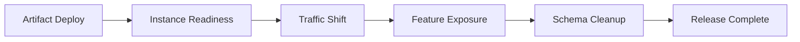



## The problem: A healthy new instance does not make a deployment safe

Zero-downtime deployment is not simply a feature that gradually shifts traffic at the load balancer.

At least two versions coexist during a deployment.

Databases, caches, queues, and clients also coexist at different versions.

Ignoring this reality leads to the following problems.

- New code fails by reading a migration field before it has been added.
- Old code cannot parse messages from new code.
- A rollback occurs after the schema and data have already changed irreversibly.
- Latency spikes because of a cold cache after readiness passes.
- A low canary percentage fails to catch errors on rare paths.
- A feature flag becomes a permanent branch, causing test combinations to explode.
- Health metrics look normal while a critical user conversion rate declines.

## Mental model: A release is the sum of multiple independent transitions

Each stage must be independently stoppable and reversible.

### Separate deployment from release

- **Deploy**: Install a code artifact in the runtime.
- **Release**: Expose a feature to users.

Feature flags allow code to be deployed first and exposure to be controlled later.

However, flag-system failures and stale configuration also become new dependencies.

### Distinguish rollback from roll-forward

Rollback is fast for an error that requires only reverting an artifact.

If a data migration or external side effect has occurred, deploying a corrective version forward may be safer.

Decide before deployment which strategy to use under which conditions.

## Workflow: Making compatible changes

### Step 1. Make the deployment unit immutable

Assign a content digest and build provenance to the artifact.

Do not allow the same version label to refer to different bytes.

Track the configuration version, feature flag version, and migration version together.

### Step 2. Make APIs compatible in both directions

During rollout, test both old-client/new-server and new-client/old-server combinations.

Start added fields as optional.

Ignore unknown fields safely.

Do not change the meaning of an existing field.

If new behavior is necessary, consider explicit versioning or capability negotiation.

### Step 3. Apply expand-and-contract to the database

1. Deploy the additive schema first.
2. Confirm that old code still works with the new schema.
3. Deploy new code that handles both old and new fields.
4. Dual-write and reconcile if necessary.
5. Rate-limit the backfill.
6. Switch the read path to the new field.
7. Remove the old field after every old version is gone.

Test the possibility of DDL locks and table rewrites with a production-like data volume.

### Step 4. Make readiness a condition for safe traffic

A process is not ready merely because it has started.

- Configuration loaded
- Required local initialization complete
- Listener ready
- Required dependencies reachable
- Schema version compatible
- Warm-up status

Do not turn a transient external dependency failure into a liveness restart.

### Step 5. Select a representative canary cohort

A random request percentage alone may be insufficient.

Consider tenants, regions, devices, endpoints, and data shapes.

You can begin with an internal or low-risk cohort.

For sticky sessions and stateful workflows, assess the problem of the same user moving between versions.

### Step 6. Fix automated abort metrics in advance

Selecting the metrics to examine during the deployment creates confirmation bias.

At minimum, compare the following.

- Request error rate
- Latency percentiles
- Saturation
- Dependency errors
- Retry rate
- Queue age
- Critical business success rate
- Data-quality invariants

Compare the canary and baseline during the same time period and with the same traffic characteristics.

### Step 7. Design the feature flag lifecycle

Flag metadata should include the following.

- Owner
- Purpose and risk
- Creation and expiration dates
- Default value
- Fail-open or fail-closed behavior
- Target cohort
- Removal issue
- Audit history

Do not entrust security decisions such as authorization or payments solely to client-side flags.

The server must enforce the final policy.

### Step 8. Practice rollback for real

Verify that the previous artifact starts against the current schema.

Verify cache and queue-message compatibility.

Create a runbook for the order of traffic shifting, flag deactivation, artifact rollback, and configuration rollback.

Include rollback time in the RTO.

### Step 9. Allow a sufficient observation window

A short canary misses rare workflows, batch boundaries, and memory leaks.

Set the duration of each stage according to traffic volume and failure-detection power.

Supplement long-cycle features such as daily batches or renewals with shadow or replay tests.

### Step 10. Declare the release complete

Reaching 100% traffic is not the end.

- Error budget normal
- Migration and reconciliation complete
- Old instances removed
- Old schema usage at zero
- Temporary flag removal plan finalized
- Runbooks and documentation updated
- Results and decision rationale recorded

The release is complete only when these conditions are met.

## Practical example: Switching reads to a new column

### Phase A: Expand

Add a new nullable column.

The old application ignores the new column.

### Phase B: Dual write

The new application writes both the old and new columns.

Compare write results through metrics and sample queries.

### Phase C: Backfill

Update historical rows in small batches.

Observe replica lag, lock waits, the transaction log, and user latency.

Provide a cursor for stopping and restarting.

### Phase D: Read switch

Use a feature flag to make part of the cohort read the new column.

Compare differences in results and business success.

### Phase E: Contract

Remove the old column after every reader has switched and the rollback window has passed.

Perform the deletion migration as a separate change.

## Deployment strategy comparison

### Rolling

The cost of an additional environment is low.

Because version coexistence is the default, compatibility is essential.

### Blue/Green

Environment-level transitions and rapid traffic rollback are easy.

If the data store is shared, the risk of database changes remains.

### Canary

Measures real-environment risk with limited exposure.

It requires representative traffic and a sufficient sample.

### Shadow

Duplicates real requests without returning the response to the user.

Write side effects must be eliminated or isolated.

### Feature flag

Separates feature exposure from deployment.

Flag debt and combinatorial complexity must be actively managed.

## Validation checklist

### Compatibility

- [ ] Tested old and new client/server combinations.
- [ ] Schema changes begin with an additive stage.
- [ ] Verified old/new consumer compatibility for queue messages.
- [ ] The previous artifact runs against the current schema.
- [ ] Irreversible changes require separate approval.

### Rollout

- [ ] The canary cohort is representative.
- [ ] Traffic percentages and observation times are defined for each stage.
- [ ] Abort thresholds are defined before deployment.
- [ ] Both business and technical SLIs are monitored.
- [ ] A manual abort path exists if automation fails.

### Feature flags

- [ ] Every flag has an owner and an expiration date.
- [ ] Defaults and failure behavior are safe.
- [ ] Server-side authorization checks remain in place.
- [ ] Flag-combination tests include high-risk paths.
- [ ] Removal work is tracked after rollout.

### Recovery

- [ ] Traffic rollback has been rehearsed.
- [ ] Configuration and secret versions can be restored.
- [ ] Migrations can be stopped and restarted.
- [ ] Data correction and compensation procedures exist.
- [ ] User-facing functionality is verified after recovery.

## Common failures and limitations

### Making an absolute promise of 100% uptime

Forcing every change to be zero-downtime can add dangerous complexity.

When the business permits it, a short planned outage may be safer.

### Judging a canary by error rate alone

Latency, data correctness, and degraded business outcomes are separate signals.

### Treating rollback as a cure-all

External emails, payments, and irreversible data mutations are not undone by rolling back an artifact.

Compensation and roll-forward are required.

### Misusing flags as a substitute for configuration management

Distinguish permanent settings from temporary release controls.

### Bundling migration and application deployment together

This expands the failure surface and makes it hard to isolate which stage caused the problem.

## Official references

- [Kubernetes Deployment Rolling Update](https://kubernetes.io/docs/concepts/workloads/controllers/deployment/#rolling-update-deployment)
- [Argo Rollouts Documentation](https://argo-rollouts.readthedocs.io/)
- [OpenFeature Specification](https://openfeature.dev/specification/)
- [AWS Builders' Library: Ensuring Rollback Safety](https://aws.amazon.com/builders-library/ensuring-rollback-safety-during-deployments/)
- [Google SRE Workbook: Canarying Releases](https://sre.google/workbook/canarying-releases/)

## Conclusion

Zero-downtime deployment is more like a contract for version coexistence than a traffic switch.

Make artifacts, APIs, schemas, messages, flags, and user exposure independent stages, and validate the abort conditions for each stage.

A safe release requires not only the ability to deploy quickly, but also the ability to detect a bad change early and recover within a limited scope.
