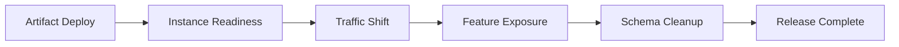



## El problema: una nueva instancia en buen estado no hace que una implementación sea segura

La implementación sin tiempo de inactividad no es simplemente una característica que desvía gradualmente el tráfico en el balanceador de carga.

Al menos dos versiones coexisten durante una implementación.

Las bases de datos, cachés, colas y clientes también coexisten en diferentes versiones.

Ignorar esta realidad conduce a los siguientes problemas.

- El nuevo código falla al leer un campo de migración antes de agregarlo.
- El código antiguo no puede analizar mensajes del código nuevo.
- Se produce una reversión después de que el esquema y los datos ya hayan cambiado irreversiblemente.
- La latencia aumenta debido a un caché frío una vez que pasa la preparación.
- Un porcentaje bajo de canarios no logra detectar errores en rutas raras.
- Una bandera de característica se convierte en una rama permanente, lo que hace que las combinaciones de prueba exploten.
- Las métricas de salud parecen normales, mientras que la tasa de conversión de usuarios crítica disminuye.

## Modelo mental: una liberación es la suma de múltiples transiciones independientes

Cada etapa debe poder detenerse y ser reversible de forma independiente.

### Separar la implementación del lanzamiento

- **Implementar**: instala un artefacto de código en el tiempo de ejecución.
- **Lanzamiento**: exponer una característica a los usuarios.

Los indicadores de funciones permiten implementar el código primero y controlar la exposición más adelante.

Sin embargo, las fallas del sistema de banderas y la configuración obsoleta también se convierten en nuevas dependencias.

### Distinguir la reversión del avance

La reversión es rápida para un error que solo requiere revertir un artefacto.

Si se ha producido una migración de datos o un efecto secundario externo, implementar una versión correctiva en el futuro puede ser más seguro.

Decida antes del despliegue qué estrategia utilizar y en qué condiciones.

## Flujo de trabajo: realizar cambios compatibles

### Paso 1. Hacer que la unidad de implementación sea inmutable

Asigne un resumen de contenido y cree la procedencia del artefacto.

No permita que la misma etiqueta de versión haga referencia a diferentes bytes.

Realice un seguimiento conjunto de la versión de configuración, la versión del indicador de funciones y la versión de migración.

### Paso 2. Hacer que las API sean compatibles en ambas direcciones

Durante la implementación, pruebe las combinaciones de cliente antiguo/servidor nuevo y de cliente nuevo/servidor antiguo.

Inicie los campos agregados como opcional.

Ignora los campos desconocidos de forma segura.

No cambie el significado de un campo existente.

Si es necesario un nuevo comportamiento, considere la posibilidad de realizar versiones explícitas o negociar capacidades.

### Paso 3. Aplicar expansión y contracción a la base de datos

1. Primero implemente el esquema aditivo.
2. Confirme que el código antiguo todavía funciona con el nuevo esquema.
3. Implemente código nuevo que maneje campos nuevos y antiguos.
4. Escritura dual y conciliación si es necesario.
5. Limite la tasa de reabastecimiento.
6. Cambie la ruta de lectura al nuevo campo.
7. Elimine el campo antiguo después de que desaparezcan todas las versiones antiguas.

Pruebe la posibilidad de bloqueos DDL y reescritura de tablas con un volumen de datos similar al de producción.

### Paso 4. Haga de la preparación una condición para un tráfico seguro

Un proceso no está listo simplemente porque ha comenzado.

- Configuración cargada
- Inicialización local requerida completa
- Oyente listo
- Dependencias requeridas accesibles
- Versión de esquema compatible
- Estado de calentamiento

No convierta una falla transitoria de dependencia externa en un reinicio de actividad.

### Paso 5. Seleccione una cohorte canaria representativa

Un porcentaje de solicitudes aleatorias por sí solo puede resultar insuficiente.

Considere inquilinos, regiones, dispositivos, puntos finales y formas de datos.

Puede comenzar con una cohorte interna o de bajo riesgo.

Para sesiones fijas y flujos de trabajo con estado, evalúe el problema del mismo usuario que se mueve entre versiones.

### Paso 6. Corregir las métricas de aborto automatizado por adelantado

La selección de las métricas para examinar durante la implementación crea un sesgo de confirmación.

Como mínimo, compare lo siguiente.

- Tasa de error de solicitud
- percentiles de latencia
- Saturación
- Errores de dependencia
- Tasa de reintento
- Edad de la cola
- Tasa de éxito empresarial crítica
- Invariantes de calidad de datos

Compare el canario y la línea de base durante el mismo período de tiempo y con las mismas características de tráfico.

### Paso 7. Diseñar el ciclo de vida del indicador de función

Los metadatos de la bandera deben incluir lo siguiente.

- Propietario
- Finalidad y riesgo
- Fechas de creación y caducidad.
- Valor predeterminado
- Comportamiento de fallo de apertura o cierre de fallo
- Cohorte objetivo
- Problema de eliminación
- Historial de auditoría

No confíe decisiones de seguridad, como autorizaciones o pagos, únicamente a indicadores del lado del cliente.

El servidor debe hacer cumplir la política final.

### Paso 8. Practica la reversión de verdad

Verifique que el artefacto anterior comience con el esquema actual.

Verifique la compatibilidad de la memoria caché y la cola de mensajes.

Cree un runbook para el orden de cambio de tráfico, desactivación de indicadores, reversión de artefactos y reversión de configuración.

Incluya el tiempo de reversión en RTO.

### Paso 9. Permitir una ventana de observación suficiente

Un canario corto pasa por alto flujos de trabajo raros, límites de lotes y pérdidas de memoria.

Establezca la duración de cada etapa según el volumen de tráfico y el poder de detección de fallas.

Complemente las funciones de ciclo largo, como lotes diarios o renovaciones, con pruebas de repetición o sombra.

### Paso 10. Declarar el lanzamiento completo

Alcanzar el 100% de tráfico no es el final.

- Error de presupuesto normal
- Migración y reconciliación completadas.
- Se eliminaron instancias antiguas.
- Uso del esquema antiguo en cero.
- Finalizado el plan de retirada temporal de banderas.
- Runbooks y documentación actualizados.
- Se registran los resultados y la justificación de la decisión.

La liberación se completa sólo cuando se cumplen estas condiciones.

## Ejemplo práctico: cambiar lecturas a una nueva columna

### Fase A: Ampliar

Agregue una nueva columna que acepte valores NULL.

La aplicación anterior ignora la nueva columna.

### Fase B: escritura dual

La nueva aplicación escribe tanto la columna antigua como la nueva.

Compare resultados de escritura a través de métricas y consultas de muestra.

### Fase C: Relleno

Actualice las filas históricas en pequeños lotes.

Observe el retraso de la réplica, las esperas de bloqueo, el registro de transacciones y la latencia del usuario.

Proporcione un cursor para detener y reiniciar.

### Fase D: interruptor de lectura

Utilice una marca de función para que parte de la cohorte lea la nueva columna.

Comparar diferencias en resultados y éxito empresarial.

### Fase E: Contrato

Elimine la columna anterior después de que cada lector haya cambiado y haya pasado la ventana de reversión.

Realice la migración de eliminación como un cambio independiente.

## Comparación de estrategias de implementación

### Rodando

El coste de un entorno adicional es bajo.

Dado que la coexistencia de versiones es la opción predeterminada, la compatibilidad es esencial.

### Azul/Verde

Las transiciones a nivel de entorno y la rápida reversión del tráfico son fáciles.

Si se comparte el almacén de datos, persiste el riesgo de cambios en la base de datos.

### canario

Mide el riesgo del entorno real con exposición limitada.

Requiere tráfico representativo y una muestra suficiente.

### Sombra

Duplica solicitudes reales sin devolver la respuesta al usuario.

Los efectos secundarios de la escritura deben eliminarse o aislarse.

### Bandera de característica

Separa la exposición de funciones de la implementación.

La deuda de bandera y la complejidad combinatoria deben gestionarse activamente.

## Lista de verificación de validación

### Compatibilidad

- [] Combinaciones cliente/servidor nuevas y antiguas probadas.
- [ ] Los cambios de esquema comienzan con una etapa aditiva.
- [] Compatibilidad verificada de consumidores antiguos/nuevos para mensajes en cola.
- [] El artefacto anterior se ejecuta con el esquema actual.
- [ ] Los cambios irreversibles requieren aprobación por separado.

### Lanzamiento

- [ ] La cohorte canaria es representativa.
- [ ] Para cada etapa se definen porcentajes de tránsito y tiempos de observación.
- [] Los umbrales de cancelación se definen antes de la implementación.
- [ ] Se monitorean los SLI tanto comerciales como técnicos.
- [ ] Existe una ruta de cancelación manual si falla la automatización.

### Indicadores de funciones

- [ ] Cada bandera tiene un dueño y una fecha de vencimiento.
- [] Los valores predeterminados y el comportamiento de falla son seguros.
- [] Las comprobaciones de autorización del lado del servidor permanecen vigentes.
- [] Las pruebas de combinación de banderas incluyen rutas de alto riesgo.
- [] Se realiza un seguimiento del trabajo de eliminación después del lanzamiento.

### Recuperación

- [ ] Se ha ensayado la reversión del tráfico.
- [ ] Se pueden restaurar la configuración y las versiones secretas.
- [ ] Las migraciones se pueden detener y reiniciar.
- [ ] Existen procedimientos de corrección y compensación de datos.
- [] La funcionalidad de cara al usuario se verifica después de la recuperación.

## Fallos y limitaciones comunes

### Hacer una promesa absoluta de 100 % de tiempo de actividad

Obligar a que cada cambio tenga un tiempo de inactividad cero puede agregar una complejidad peligrosa.

Cuando el negocio lo permite, una interrupción planificada breve puede ser más segura.

### Juzgar un canario solo por la tasa de error

La latencia, la exactitud de los datos y la degradación de los resultados empresariales son señales distintas.

### Tratar la reversión como una panacea

Los correos electrónicos externos, los pagos y las mutaciones de datos irreversibles no se deshacen al revertir un artefacto.

Se requiere compensación y avance.

### Uso indebido de banderas como sustituto de la gestión de configuración

Distinga las configuraciones permanentes de los controles de liberación temporales.

### Combinar la migración y la implementación de aplicaciones

Esto expande la superficie de falla y dificulta aislar qué etapa causó el problema.

## Referencias oficiales

- [Kubernetes Actualización continua de implementación](https://kubernetes.io/docs/concepts/workloads/controllers/deployment/#rolling-update-deployment)
- [Documentación de implementaciones de Argo](https://argo-rollouts.readthedocs.io/)
- [Especificación de función abierta](https://openfeature.dev/specification/)
- [AWS Biblioteca de constructores: garantizar la seguridad de la reversión](https://aws.amazon.com/builders-library/ensuring-rollback-safety-during-deployments/)
- [Libro de trabajo de Google SRE: versiones Canarying](https://sre.google/workbook/canarying-releases/)

## Conclusión

La implementación sin tiempo de inactividad se parece más a un contrato de coexistencia de versiones que a un cambio de tráfico.

Cree artefactos, API, esquemas, mensajes, indicadores y etapas independientes de exposición del usuario, y valide las condiciones de cancelación para cada etapa.

Una versión segura requiere no sólo la capacidad de implementarse rápidamente, sino también la capacidad de detectar un cambio incorrecto en forma temprana y recuperarse dentro de un alcance limitado.
