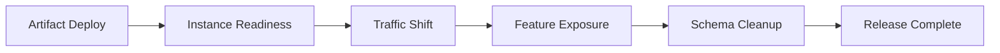



## 問題：新しいinstanceがhealthyでもデプロイが安全とは限らない

無停止デプロイは、load balancerでtrafficを徐々に移すだけの機能ではない。

デプロイ中は少なくとも二つのversionが同時に存在する。

database、cache、queue、clientも互いに異なるversionで共存する。

この現実を無視すると、次の問題が発生する。

- 新しいcodeが追加前のmigration fieldを読み取って失敗する。
- 古いcodeが新しいcodeのmessageをparseできない。
- rollbackしたものの、schemaとdataがすでに不可逆的に変わっている。
- readiness通過後、cold cacheによってlatencyが急増する。
- canary比率が低く、rare pathのエラーを検出できない。
- feature flagが恒久的な分岐となり、testの組み合わせが急増する。
- health metricは正常でも、主要なユーザー転換率が低下する。

## Mental model：releaseは複数の独立した切り替えの総和である

各段階を個別に停止し、元に戻せなければならない。

### deployとreleaseを分離する

- **deploy**：code artifactをruntimeにインストールする。
- **release**：ユーザーに機能を公開する。

feature flagを使えば、codeを先にデプロイし、公開を後から制御できる。

ただし、flag systemの障害とstale configurationも新たなdependencyになる。

### rollbackとroll-forwardを区別する

artifactだけを戻せばよいエラーではrollbackが速い。

data migrationや外部への副作用が発生した場合は、修正版versionを前進デプロイするほうが安全なことがある。

デプロイ前に、どの条件でどちらの戦略を使うか決めておく。

## Workflow：互換性のある変更を作る

### Step 1. デプロイ単位をimmutableにする

artifactにcontent digestとbuild provenanceを付与する。

同じversion labelが異なるbytesを指さないようにする。

config version、feature flag version、migration versionを併せて追跡する。

### Step 2. APIを双方向互換にする

rollout中に、旧clientと新server、新clientと旧serverの組み合わせを試験する。

fieldの追加はoptionalとして始める。

unknown fieldを安全に無視する。

既存fieldの意味を変えない。

新しい挙動が必要なら、explicit versionまたはcapability negotiationを検討する。

### Step 3. databaseにexpand-and-contractを適用する

1. additive schemaを先にデプロイする。
2. 旧codeが新schemaでも動作することを確認する。
3. 新codeがold/new fieldの両方を処理できるようデプロイする。
4. 必要ならdual writeし、reconciliationする。
5. backfillをrate limitしながら実行する。
6. read pathを新fieldへ切り替える。
7. すべての旧versionがなくなった後、old fieldを削除する。

DDL lockとtable rewriteの可能性を、productionに近いdata volumeで試験する。

### Step 4. readinessをtrafficの安全条件にする

processが起動しただけではreadyではない。

- configの読み込み完了
- 必須のlocal initialization完了
- listener準備完了
- 必須dependencyへ接続可能
- schema version互換
- warm-up完了の有無

外部dependencyの一時的な障害をliveness restartへ変換しない。

### Step 5. canary cohortを代表性のある形で選ぶ

random request比率だけでは不十分なことがある。

tenant、region、device、endpoint、data shapeを考慮する。

internalまたはlow-risk cohortから始めることもできる。

sticky sessionとstateful workflowでは、同じユーザーがversion間を行き来する問題を検討する。

### Step 6. 自動中断指標を事前に固定する

デプロイ中に確認したいmetricをその場で選ぶと、confirmation biasが生じる。

少なくとも次を比較する。

- request error rate
- latency percentile
- saturation
- dependency error
- retry rate
- queue age
- 主要業務のsuccess rate
- data quality invariant

canaryとbaselineを同じ時間帯、同じtraffic特性で比較する。

### Step 7. feature flag lifecycleを設計する

flag metadataには次を含める。

- owner
- 目的とリスク
- 作成日と有効期限
- default value
- fail-openまたはfail-closed
- 対象cohort
- 削除issue
- audit history

authorizationや決済のようなセキュリティ判断をclient-side flagだけに委ねない。

serverが最終的なポリシーを実施する。

### Step 8. rollbackを実際に練習する

以前のartifactが現在のschemaで起動するか確認する。

cacheとqueue messageに互換性があるか確認する。

traffic切り替え、flag off、artifact rollback、config rollbackの順序をrunbookにまとめる。

rollback時間もRTOに含める。

### Step 9. 十分な観察windowを設ける

短いcanaryではrare workflow、batch boundary、memory leakを見逃す。

traffic volumeとfailure detection powerに基づいて各段階の継続時間を決める。

日次batchやrenewalのような長周期機能にはshadowまたはreplay testを補完する。

### Step 10. release完了を宣言する

trafficが100%になっても終わりではない。

- error budgetが正常
- migrationとreconciliationが完了
- old instanceを削除
- old schemaの使用量が0
- 一時的なflagの削除計画が確定
- runbookとドキュメントを更新
- 結果と判断根拠を記録

これらの条件を満たして初めてreleaseが完了する。

## 実践例：新しいcolumnへの読み取り切り替え

### Phase A: expand

nullableな新columnを追加する。

旧applicationは新columnを無視する。

### Phase B: dual write

新applicationがold/new columnの両方に書き込む。

write結果をmetricとサンプルqueryで照合する。

### Phase C: backfill

小さなbatchでhistorical rowを更新する。

replica lag、lock wait、transaction log、user latencyを観察する。

中断と再開のためのcursorを用意する。

### Phase D: read switch

feature flagにより一部のcohortが新columnを読み取るようにする。

結果の差と業務successを比較する。

### Phase E: contract

すべてのreaderが切り替わり、rollback windowが過ぎた後にold columnを削除する。

削除migrationは別のchangeとして実行する。

## デプロイ戦略の比較

### Rolling

追加環境のコストが低い。

versionの共存が前提なので、互換性が必須である。

### Blue/Green

環境単位の切り替えと迅速なtraffic rollbackが容易である。

data storeを共有する場合、database変更のリスクはそのまま残る。

### Canary

小規模な公開によって実環境のリスクを測定する。

代表的なtrafficと十分な標本が必要である。

### Shadow

実際のrequestを複製するが、responseはユーザーに返さない。

writeの副作用を除去または隔離しなければならない。

### Feature flag

機能公開とdeployを分離する。

flag debtと組み合わせの複雑さを積極的に管理しなければならない。

## 検証Checklist

### 互換性

- [ ] 旧・新client/serverの組み合わせをtestした。
- [ ] schema変更はadditiveな段階から始まる。
- [ ] queue messageのold/new consumer互換性を確認した。
- [ ] 以前のartifactが現在のschemaで実行できる。
- [ ] 不可逆な変更は別途承認される。

### rollout

- [ ] canary cohortに代表性がある。
- [ ] 段階ごとのtraffic比率と観察時間が決まっている。
- [ ] abort thresholdがデプロイ前に定義されている。
- [ ] 業務SLIと技術SLIを併せて確認する。
- [ ] 自動化の失敗時に手動中断経路がある。

### feature flag

- [ ] ownerと有効期限がある。
- [ ] defaultとfailure behaviorが安全である。
- [ ] server-sideの権限検査が維持されている。
- [ ] flagの組み合わせtestがリスク経路を含む。
- [ ] rollout後の削除作業が追跡されている。

### 復旧

- [ ] traffic rollbackをrehearsalした。
- [ ] configとsecret versionを復元できる。
- [ ] migrationの中断と再開が可能である。
- [ ] data correctionと補償手順がある。
- [ ] 復旧後にユーザー機能を検証する。

## よくある失敗と限界

### 100%の無停止を絶対に約束する

すべての変更に無停止を強制すると、危険な複雑さが増えることがある。

業務上許容されるなら、短い計画停止のほうが安全な場合もある。

### error rate一つでcanaryを判定する

latency、data correctness、business outcomeの低下は別のシグナルである。

### rollbackを万能とみなす

外部email、payment、irreversible data mutationはartifact rollbackでは取り消せない。

補償とroll-forwardが必要である。

### flagをconfig managementの代用として乱用する

恒久的な設定と一時的なrelease controlを区別する。

### migrationとapplicationデプロイを一度にまとめる

failure surfaceが広がり、どの段階に問題があるか切り分けにくくなる。

## 公式参考資料

- [Kubernetes Deployment Rolling Update](https://kubernetes.io/docs/concepts/workloads/controllers/deployment/#rolling-update-deployment)
- [Argo Rollouts Documentation](https://argo-rollouts.readthedocs.io/)
- [OpenFeature Specification](https://openfeature.dev/specification/)
- [AWS Builders' Library: Ensuring Rollback Safety](https://aws.amazon.com/builders-library/ensuring-rollback-safety-during-deployments/)
- [Google SRE Workbook: Canarying Releases](https://sre.google/workbook/canarying-releases/)

## まとめ

無停止デプロイはtraffic switchというより、version共存の契約に近い。

artifact、API、schema、message、flag、ユーザー公開を独立した段階にし、各段階の中断条件を検証しよう。

安全なreleaseとは、迅速にデプロイする能力に加え、誤った変更を早期に検出し、限定された範囲で復旧する能力である。
