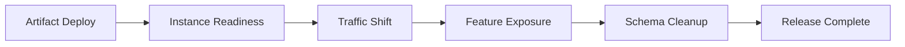



## 문제: 새 instance가 healthy라고 배포가 안전한 것은 아니다

무중단 배포는 load balancer에서 traffic을 천천히 옮기는 기능이 아니다.

배포 중에는 최소 두 version이 동시에 존재한다.

database, cache, queue, client도 서로 다른 version으로 공존한다.

이 현실을 무시하면 다음 문제가 생긴다.

- 새 code가 추가 전 migration field를 읽어 실패한다.
- 구 code가 새 code의 message를 parse하지 못한다.
- rollback했지만 이미 schema와 data가 비가역적으로 바뀌었다.
- readiness 통과 뒤 cold cache로 latency가 폭증한다.
- canary 비율이 낮아 rare path 오류를 못 잡는다.
- feature flag가 영구 분기가 되어 test 조합이 폭증한다.
- health metric은 정상인데 핵심 사용자 전환율이 떨어진다.

## Mental model: release는 여러 독립 전환의 합이다

각 단계는 별도로 멈추고 되돌릴 수 있어야 한다.

### deploy와 release를 분리한다

- **deploy**: code artifact를 runtime에 설치한다.
- **release**: 사용자에게 기능을 노출한다.

feature flag를 사용하면 code를 먼저 배포하고 노출을 나중에 제어할 수 있다.

그러나 flag system 장애와 stale configuration도 새 dependency가 된다.

### rollback과 roll-forward를 구분한다

artifact만 되돌리면 되는 오류는 rollback이 빠르다.

data migration이나 외부 부작용이 발생했다면 수정 version을 전진 배포하는 편이 안전할 수 있다.

배포 전에 어떤 조건에서 어느 전략을 사용할지 정한다.

## Workflow: 호환 가능한 변경 만들기

### Step 1. 배포 단위를 immutable하게 만든다

artifact에 content digest와 build provenance를 부여한다.

같은 version label이 다른 bytes를 가리키지 않게 한다.

config version, feature flag version, migration version을 함께 추적한다.

### Step 2. API를 양방향 호환으로 만든다

rollout 동안 구 client와 신 server, 신 client와 구 server 조합을 시험한다.

field 추가는 optional로 시작한다.

unknown field를 안전하게 무시한다.

기존 field 의미를 바꾸지 않는다.

새 행동이 필요하면 explicit version 또는 capability negotiation을 검토한다.

### Step 3. database에 expand-and-contract를 적용한다

1. additive schema를 먼저 배포한다.
2. 구 code가 새 schema에서도 동작하는지 확인한다.
3. 새 code가 old/new field를 모두 처리하게 배포한다.
4. 필요하면 dual write하고 reconciliation한다.
5. backfill을 rate limit하며 수행한다.
6. read path를 새 field로 전환한다.
7. 모든 구 version이 사라진 뒤 old field를 제거한다.

DDL lock과 table rewrite 가능성을 production과 유사한 data volume에서 시험한다.

### Step 4. readiness를 traffic 안전 조건으로 만든다

process 시작만으로 ready가 아니다.

- config 로드 완료
- 필수 local initialization 완료
- listener 준비
- 필수 dependency 연결 가능
- schema version 호환
- warm-up 완료 여부

외부 dependency의 일시 장애를 liveness restart로 바꾸지 않는다.

### Step 5. canary cohort를 대표성 있게 선택한다

random request 비율만으로는 부족할 수 있다.

tenant, region, device, endpoint, data shape를 고려한다.

internal 또는 low-risk cohort로 시작할 수 있다.

sticky session과 stateful workflow에서는 같은 사용자가 version을 오가는 문제를 검토한다.

### Step 6. 자동 중단 지표를 사전에 고정한다

배포 중 보고 싶은 metric을 그때 선택하면 confirmation bias가 생긴다.

최소한 다음을 비교한다.

- request error rate
- latency percentile
- saturation
- dependency error
- retry rate
- queue age
- 핵심 업무 success rate
- data quality invariant

canary와 baseline을 같은 시간대, 같은 traffic 특성으로 비교한다.

### Step 7. feature flag lifecycle을 설계한다

flag metadata에는 다음을 둔다.

- owner
- 목적과 위험
- 생성일과 만료일
- default value
- fail-open 또는 fail-closed
- 대상 cohort
- 제거 issue
- audit history

authorization이나 결제 같은 보안 결정을 client-side flag에만 맡기지 않는다.

server가 최종 정책을 집행한다.

### Step 8. rollback을 실제로 연습한다

이전 artifact가 현재 schema에서 시작되는지 확인한다.

cache와 queue message가 호환되는지 확인한다.

traffic 전환, flag off, artifact rollback, config rollback 순서를 runbook으로 만든다.

rollback 시간도 RTO에 포함한다.

### Step 9. 관찰 window를 충분히 둔다

짧은 canary는 rare workflow, batch boundary, memory leak을 놓친다.

traffic volume과 failure detection power를 기준으로 단계 지속 시간을 정한다.

일간 batch나 renewal 같은 긴 주기 기능은 shadow 또는 replay test를 보완한다.

### Step 10. release 완료를 선언한다

100% traffic이 끝이 아니다.

- error budget 정상
- migration과 reconciliation 완료
- old instance 제거
- old schema 사용량 0
- 임시 flag 제거 계획 확정
- runbook과 문서 갱신
- 결과와 판단 근거 기록

이 조건을 충족해야 release가 끝난다.

## 실전 예제: 새 column으로 읽기 전환

### Phase A: expand

nullable 새 column을 추가한다.

구 application은 새 column을 무시한다.

### Phase B: dual write

신 application이 old/new column을 함께 쓴다.

write 결과를 metric과 표본 query로 대조한다.

### Phase C: backfill

작은 batch로 historical row를 갱신한다.

replica lag, lock wait, transaction log, user latency를 관찰한다.

중단과 재시작 cursor를 둔다.

### Phase D: read switch

feature flag로 일부 cohort가 새 column을 읽게 한다.

결과 차이와 업무 success를 비교한다.

### Phase E: contract

모든 reader가 전환되고 rollback window가 지난 뒤 old column을 제거한다.

삭제 migration은 별도 change로 수행한다.

## 배포 전략 비교

### Rolling

추가 환경 비용이 낮다.

version 공존이 기본이므로 호환성이 필수다.

### Blue/Green

환경 단위 전환과 빠른 traffic rollback이 쉽다.

data store를 공유하면 database 변경 위험은 그대로다.

### Canary

작은 노출로 실제 환경 위험을 측정한다.

대표 traffic과 충분한 표본이 필요하다.

### Shadow

실제 요청을 복제해 응답을 사용자에게 반환하지 않는다.

write 부작용을 제거하거나 격리해야 한다.

### Feature flag

기능 노출과 deploy를 분리한다.

flag debt와 조합 복잡성을 적극 관리해야 한다.

## 검증 Checklist

### 호환성

- [ ] 구·신 client/server 조합을 test했다.
- [ ] schema 변경이 additive 단계로 시작한다.
- [ ] queue message의 old/new consumer 호환성을 확인했다.
- [ ] 이전 artifact가 현재 schema에서 실행된다.
- [ ] 비가역 변경은 별도 승인된다.

### rollout

- [ ] canary cohort가 대표성을 가진다.
- [ ] 단계별 traffic 비율과 관찰 시간이 정해져 있다.
- [ ] abort threshold가 배포 전에 정의되어 있다.
- [ ] 업무 SLI와 기술 SLI를 함께 본다.
- [ ] 자동화 실패 때 수동 중단 경로가 있다.

### feature flag

- [ ] owner와 만료일이 있다.
- [ ] default와 failure behavior가 안전하다.
- [ ] server-side 권한 검사가 유지된다.
- [ ] flag 조합 test가 위험 경로를 포함한다.
- [ ] rollout 뒤 제거 작업이 추적된다.

### 복구

- [ ] traffic rollback을 rehearsal했다.
- [ ] config와 secret version을 복원할 수 있다.
- [ ] migration 중단과 재시작이 가능하다.
- [ ] data correction과 보상 절차가 있다.
- [ ] 복구 뒤 사용자 기능을 검증한다.

## 자주 겪는 실패와 한계

### 100% 무중단을 절대 약속한다

모든 변경에 무중단을 강제하면 위험한 복잡성이 늘 수 있다.

업무가 허용하면 짧은 계획 정지가 더 안전한 경우도 있다.

### error rate 하나로 canary를 판정한다

latency, data correctness, business outcome 저하는 별도 신호다.

### rollback을 만능으로 본다

외부 email, payment, irreversible data mutation은 artifact rollback으로 취소되지 않는다.

보상과 roll-forward가 필요하다.

### flag를 config management 대용으로 남용한다

영구 설정과 임시 release control을 구분한다.

### migration과 application 배포를 한 번에 묶는다

failure surface가 커지고 어느 단계가 문제인지 분리하기 어렵다.

## 공식 참고자료

- [Kubernetes Deployment Rolling Update](https://kubernetes.io/docs/concepts/workloads/controllers/deployment/#rolling-update-deployment)
- [Argo Rollouts Documentation](https://argo-rollouts.readthedocs.io/)
- [OpenFeature Specification](https://openfeature.dev/specification/)
- [AWS Builders' Library: Ensuring Rollback Safety](https://aws.amazon.com/builders-library/ensuring-rollback-safety-during-deployments/)
- [Google SRE Workbook: Canarying Releases](https://sre.google/workbook/canarying-releases/)

## 마무리

무중단 배포는 traffic switch보다 version 공존 계약에 가깝다.

artifact, API, schema, message, flag, 사용자 노출을 독립 단계로 만들고 각 단계의 중단 조건을 검증하자.

안전한 release는 빠르게 배포하는 능력과 더불어 잘못된 변화를 일찍 감지하고 제한된 범위에서 회복하는 능력이다.
